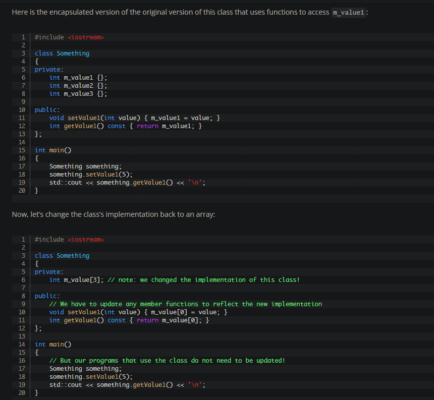
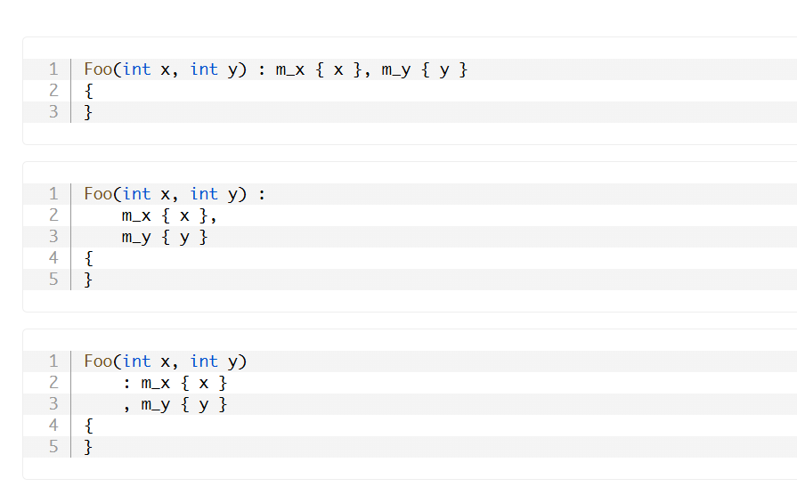
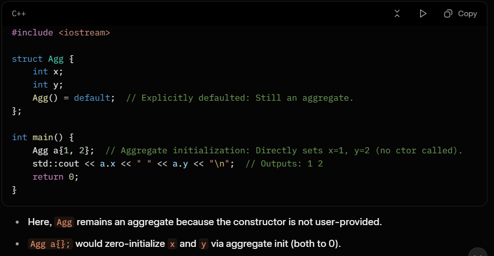

# Chapter 14: Classes and Objects

---

## What is object-oriented programming?

> 🧠 **In one sentence:** Object-Oriented Programming (OOP) is a design paradigm centered around creating program-defined types (classes) that combine both state (data properties) and behavior (functions).

In object-oriented programming (often abbreviated as OOP), the focus is on creating program-defined data types. These types contain both properties (state) and a set of well-defined behaviors. Unlike procedural programming which separates data from functions, OOP groups them together into unified objects.

// Added example: Basic OOP structure representing a class with state and behavior
#include <iostream>

class Dog
{
private:
    std::string m_name;
    int m_age{};

public:
    Dog(std::string name, int age) : m_name{ name }, m_age{ age } {}
    
    void bark() const
    {
        std::cout << m_name << " (age " << m_age << ") says Woof!\n";
    }
};

int main()
{
    Dog buddy{ "Buddy", 3 };
    buddy.bark(); // Output: Buddy (age 3) says Woof!
    return 0;
}

---
#### ❓ Interview Q&A

**Q1 [🌐 All | 🟢 Any]: What is object-oriented programming (OOP) and how does it differ from procedural programming?**

A: OOP is a programming paradigm that organizes software design around data, or objects, rather than functions and logic. In procedural programming, write-ups focus on step-by-step procedures (functions) acting on separate data structures. In OOP, you bundle both data (properties) and functions (behaviors) together inside class types, promoting encapsulation and code reuse.

**Q2 [🌐 All | 🟡 2yr]: When would you prefer OOP over procedural programming, and what is the primary design tradeoff?**

A: OOP is preferred in large-scale applications with complex domain entities that share relationships and maintain internal state invariants. The primary tradeoff is architectural overhead. OOP designs can require more planning, lead to deeper class hierarchies, and potentially introduce small performance penalties due to indirection (like virtual dispatch), whereas procedural code can be simpler and more cache-friendly.

**Q3 [🌐 All | 🟢 Any]: [🖥️ Output?] What does this program print?**

```cpp
#include <iostream>
#include <string_view>

struct Greeter
{
    std::string_view name{};
    void greet()
    {
        std::cout << "Hello, " << name << '\n';
    }
};

int main()
{
    Greeter g{ "Alice" };
    g.greet();
}
```

A: Output is `Hello, Alice`. The program defines a struct `Greeter` containing a member variable `name` and a member function `greet()`. In `main()`, `g` is initialized with `"Alice"`, and calling `g.greet()` prints the greeting by accessing its member variable.

**Q4 [🔧 Product Co | 🟡 2yr]: What is the biggest drawback of using OOP in performance-critical systems programming?**

A: The biggest drawback is poor cache locality and memory fragmentation. Classic OOP encourages creating heap-allocated objects connected via pointers (e.g., node-based trees or graphs). This design causes CPU cache misses as memory is traversed. In contrast, procedural or data-oriented designs store objects contiguously in arrays, matching CPU cache line patterns.

#### 🖥️ Snippet Drill — All Patterns

> ✅ Q3 covers the only testable snippet pattern for this section.

---
> 💡 **Interview tip:** Be ready to explain that OOP in C++ does not force heap allocation; unlike Java or C#, C++ objects are value-types by default and can live directly on the stack or contiguously in arrays.

---

## objects

> 🧠 **In one sentence:** An object is a concrete instance of a class or struct that occupies a specific region of memory and holds distinct state.

An object is an instance of a class. It is a concrete entity that has a state (represented by its properties/member variables) and behavior (represented by its member functions). Objects are created from classes, which serve as blueprints defining their layout and behavior.

// Added example: Creating multiple distinct objects from the same blueprint
#include <iostream>

struct Point
{
    int x{};
    int y{};
};

int main()
{
    Point p1{ 1, 2 }; // Distinct object p1
    Point p2{ 5, 10 }; // Distinct object p2
    
    std::cout << "p1: (" << p1.x << ", " << p1.y << ")\n";
    std::cout << "p2: (" << p2.x << ", " << p2.y << ")\n";
    return 0;
}

---
#### ❓ Interview Q&A

**Q1 [🌐 All | 🟢 Any]: What is an object in C++?**

A: An object is a region of data storage in memory that has a type, size, and lifetime. In the context of OOP, an object is a concrete instance of a class or struct. It occupies a specific memory address, holds a state, and can be manipulated via the interface defined by its type.

**Q2 [🌐 All | 🟡 2yr]: What is the relationship between a class and an object in terms of compilation and runtime memory layout?**

A: At compile-time, a class is merely a compiler metadata blueprint; it occupies zero memory. At runtime, when an object is instantiated, the OS allocates memory on the stack or heap to store its non-static member variables. Static variables and member function code are stored separately in global/code segments.

**Q3 [🌐 All | 🟢 Any]: [🖥️ Output?] What does this program print?**

```cpp
#include <iostream>

struct Counter
{
    int val{ 0 };
};

int main()
{
    Counter c1;
    Counter c2;
    c1.val = 5;
    std::cout << c1.val << ' ' << c2.val << '\n';
}
```

A: Output is `5 0`. `c1` and `c2` are two distinct objects in memory. Modifying the state of `c1.val` has no effect on `c2.val`, which retains its default-initialized value of `0`.

**Q4 [🔧 Product Co | 🟡 2yr]: Can an object exist without a type? What does the C++ standard say about the size of an empty class object?**

A: No, every object in C++ must have a well-defined type. The C++ standard mandates that any complete object must have a size of at least 1 byte, even if the class has no member variables. This ensures that different objects of the same empty type always have unique memory addresses.

#### 🖥️ Snippet Drill — All Patterns

> Every testable snippet pattern for this topic.
> Cover the Answer, predict the result, then reveal.

---

**Snippet 1 [🔧 Product Co | 🟡 2yr]: [🖥️ Output?] What is the output of this size comparison?**

```cpp
#include <iostream>

struct Empty {};

int main() {
    Empty e1;
    Empty e2;
    std::cout << (sizeof(Empty) >= 1) << ' ' << (&e1 == &e2) << '\n';
}
```

A: Output is `1 0`. The size of an empty class `Empty` is at least `1` byte. Because `e1` and `e2` are distinct objects, they are assigned unique memory addresses, meaning `&e1 == &e2` is `false` (`0`).

---
> 💡 **Interview tip:** If asked about empty objects, mention "Empty Base Optimization" (EBO). If an empty class is used as a base class, the compiler can optimize its size to 0 bytes inside the derived class object layout.

---

## Member functions

> 🧠 **In one sentence:** A member function is a function defined inside a class that operates directly on the class's data members using an implicit parameter pointing to the caller object.

Member functions are functions defined within a class. They operate on the data members of that class. They can access and modify properties, defining the behavior of objects. Member functions are called on objects using the member selection operator (`.`).

```cpp
// Member function version
#include <iostream>

struct Date
{
    int year {};
    int month {};
    int day {};

    void print() // defines a member function named print
    {
        std::cout << year << '/' << month << '/' << day;
    }
};

int main()
{
    Date today { 2020, 10, 14 }; // aggregate initialize our struct

    today.day = 16; // member variables accessed using member selection operator (.)
    today.print();  // member functions also accessed using member selection operator (.)

    return 0;
}
```

> **Note:** Member functions defined inside the class type definition are implicitly inline. This means they will not cause violations of the one-definition rule (ODR) if the class definition is included in multiple translation units.

> **Note:** Non-static data members are always initialized in declaration order (top-to-bottom in the class/struct). Initializers can reference later-declared members or functions due to name lookup rules. However, reading or accessing uninitialized values during initialization causes undefined behavior (UB).

```cpp
struct Foo {
    int z() { return m_data; }  // Function body runs later, not during init
    int x() { return y(); }     // Calls later function
    int m_data { y() };         // Uses y(), which returns constant (no UB)
    int y() { return 5; }       // Safe, no data access during init
};
```

> ⚠️ **DANGER:** Uninitialized member access during class instantiation:

```cpp
struct Bad {
    int m_bad1 { m_data };      // UB: m_data not initialized yet
    int m_bad2 { fcn() };       // UB: fcn() reads uninitialized m_data
    int m_data { 5 };           // Declared last, initializes last
    int fcn() { return m_data; }// Function reads uninit data during init
};
```

> 🗣️ **Say it out loud:**
> "When an interviewer asks how member functions work under the hood, I'd say:
> The compiler transforms member functions into standard non-member functions by rewriting their signature. It inserts an implicit first parameter, which is a pointer to the calling object, named `this`. When you call `object.func()`, the compiler translates it to `func(&object)`. Inside the function, any member variable accesses are implicitly dereferenced through the `this` pointer."

---
#### ❓ Interview Q&A

**Q1 [🌐 All | 🟢 Any]: What are member functions, and how do they differ from regular non-member functions?**

A: Member functions are declared inside a class scope and have direct access to private and protected class members. They differ from regular functions because they are invoked on a specific object instance. Under the hood, member functions receive an implicit pointer named `this` that points to the calling object.

**Q2 [🔧 Product Co | 🟡 2yr]: What is the performance and link-time implication of defining member functions directly inside a class definition?**

A: Member functions defined inside a class definition are implicitly inline. The compiler tries to expand the function body at call sites to eliminate call overhead. Because they are inline, the linker permits these functions to be defined in multiple translation units (via header inclusion) without causing ODR (One Definition Rule) violations.

**Q3 [🔧 Product Co | 🟡 2yr]: [💀 UB?] What is the undefined behavior in this struct instantiation?**

```cpp
struct Test {
    int a{ b + 1 };
    int b{ 10 };
};
int main() {
    Test t;
}
```

A: The undefined behavior is that `a` is initialized using `b` before `b` is initialized. In C++, non-static member variables are always initialized in their declaration order (`a` then `b`), regardless of their position in the initializer list. When `a` is initialized, `b` contains garbage or uninitialized data, causing UB.

**Q4 [🔧 Product Co | 🟡 2yr]: Why does C++ initialize member variables in declaration order rather than constructor list order?**

A: C++ enforces declaration order initialization to guarantee a unique, deterministic destruction sequence. Objects are always destructed in the exact reverse order of their initialization. If initialization order depended on the constructor's list order, the compiler would need to track runtime construction paths to determine the destruction order, adding runtime overhead.

#### 🖥️ Snippet Drill — All Patterns

> Every testable snippet pattern for this topic.
> Cover the Answer, predict the result, then reveal.

---

**Snippet 1 [🔧 Product Co | 🟡 2yr]: [🖥️ Output?] What is printed when this struct is initialized?**

```cpp
#include <iostream>

struct Tracker {
    int x;
    int y;
    Tracker(int val) : y{ val }, x{ y * 2 } {} // MIL order differs from declaration
};

int main() {
    Tracker t(5);
    std::cout << t.x << ' ' << t.y << '\n';
}
```

A: Output is undefined/garbage for `t.x`, followed by `5` for `t.y`. Even though `y` is written first in the initializer list, `x` is declared first in the struct, so `x` initializes first. It attempts to read `y`, which is not yet initialized, causing undefined behavior.

---

**Snippet 2 [🔧 Product Co | 🟡 2yr]: [❌ Won't compile?] Will defining this function inside multiple headers cause ODR errors?**

```cpp
// in header.h
struct Printer {
    void print() {
        // Trivial inline member function
    }
};
```

A: **No compile error.** Member functions defined inside the class definition are implicitly `inline`. Multiple translation units can include `header.h` and compile their own copies without triggering multiply-defined symbol errors at link time.

---
> 💡 **Interview tip:** Always write member initializer lists in the exact order members are declared in the class. Enable compiler warnings like `-Wreorder` to catch order mismatches before runtime.

---

## Const class objects and const member functions

> 🧠 **In one sentence:** A const member function guarantees it will not modify the state of the object, which is mandatory for calling member functions on const object instances.

Const class objects are declared with the `const` qualifier. The state of a const object cannot be modified after it has been initialized. Modifying a const object results in a compile-time error.

```cpp
struct Date
{
    int year {};
    int month {};
    int day {};

    void incrementDay()
    {
        ++day;
    }
};

int main()
{
    const Date today { 2020, 10, 14 }; // const

    today.day += 1;        // compile error: can't modify member of const object
    today.incrementDay();  // compile error: can't call member function that modifies member of const object

    return 0;
}
```

> **Note:** A const class object cannot call non-const member functions because the compiler cannot guarantee they won't alter the object's state. To allow const objects to call member functions, we declare those member functions as const.

A const member function is a member function that guarantees it will not modify the object or call any non-const member functions. It is declared by adding the `const` qualifier after the parameter list.

```cpp
#include <iostream>

struct Date
{
    int year {};
    int month {};
    int day {};

    void print() const // now a const member function
    {
        std::cout << year << '/' << month << '/' << day;
    }
};

int main()
{
    const Date today { 2020, 10, 14 }; // const

    today.print();  // ok: const object can call const member function

    return 0;
}
```

> **Note:** Const member functions can be called on both const and non-const objects. If a member function does not modify the state of the object, it should always be made const.

> ⚠️ **GOTCHA — Member mutation in const functions:**
> Attempting to modify non-mutable member variables or calling non-const member functions from within a const member function will trigger a compiler error.
> **What to say in an interview:** "Inside a const member function, the type of the `this` pointer is `const ClassName* const`, preventing modification of any non-static data members unless they are explicitly marked `mutable`."

📊 **Quick comparison:**

| Feature | **Const Member Function** | **Non-Const Member Function** |
|----------------------|---------------------------|-------------------------------|
| **Can modify members?** | No (unless marked `mutable`) | Yes |
| **Can call on const objects?** | Yes | No (compiler error) |
| **Can call on non-const objects?** | Yes | Yes |
| **Underlying `this` type** | `const Class* const` | `Class* const` |
| **Usage** | Read-only operations, getters | Modifying operations, setters |

> 🗣️ **Say it out loud:**
> "When explaining const correctness to an interviewer, I'd emphasize:
> Const correctness is a contract. Marking a member function `const` assures callers that calling it on a const object is safe. Under the hood, this changes the implicit `this` pointer type from `T* const` to `const T* const`, preventing any direct member assignments and enforcing read-only behavior at compile time."

---
#### ❓ Interview Q&A

**Q1 [🌐 All | 🟢 Any]: What is a const member function, and how do you declare one?**

A: A const member function is a member function that guarantees it will not modify the calling object's state. It is declared by placing the `const` keyword after the function signature's parameter list, both in the declaration and implementation.

**Q2 [🔧 Product Co | 🟡 2yr]: How does the compiler enforce constness inside a const member function?**

A: The compiler modifies the type of the implicit `this` pointer. In a non-const member function of class `X`, the `this` pointer is of type `X* const` (a constant pointer to non-const data). In a const member function, the `this` pointer type becomes `const X* const` (a constant pointer to constant data), making any assignment to member variables a compile-time error.

**Q3 [🔧 Product Co | 🟡 2yr]: [❌ Won't compile?] Will this code compile? If not, identify the error.**

```cpp
class Widget {
    int m_value{ 0 };
public:
    void update() { m_value = 42; }
    void inspect() const {
        update();
    }
};
```

A: **Compile error.** Inside the const member function `inspect() const`, the implicit `this` pointer is of type `const Widget* const`. The function attempts to call `update()`, which is a non-const member function requiring a `this` pointer of type `Widget* const`. A const pointer cannot be implicitly cast to a non-const pointer, blocking the call.

**Q4 [🔧 Product Co | 🟡 2yr]: Can you overload a member function such that one version is const and the other is non-const? When is this useful?**

A: Yes, C++ allows overloading member functions on constness. The compiler selects the const version for const objects and the non-const version for non-const objects. This is useful for container classes (like `std::vector`), where the subscript operator `operator[]` returns a mutable reference for non-const containers and a const reference/value for const containers.

#### 🖥️ Snippet Drill — All Patterns

> Every testable snippet pattern for this topic.
> Cover the Answer, predict the result, then reveal.

---

**Snippet 1 [🌐 All | 🟢 Any]: [❌ Won't compile?] What is the compilation error in this snippet?**

```cpp
struct Data {
    int value{ 10 };
    void reset() { value = 0; }
};

int main() {
    const Data d;
    d.reset();
}
```

A: **Compile error.** The object `d` is declared as `const Data`. Therefore, it can only invoke const member functions. Since `reset()` is a non-const member function, calling it on `d` is prohibited by the compiler.

---

**Snippet 2 [🔧 Product Co | 🟡 2yr]: [❌ Won't compile?] Will this const member function compile successfully?**

```cpp
struct Counter {
    int m_count{ 0 };
    void increment() const {
        m_count++;
    }
};
```

A: **Compile error.** The const member function `increment() const` attempts to modify `m_count`. Because the function is marked `const`, members cannot be modified. To fix this, either remove `const` from the function or declare `m_count` as `mutable int m_count;`.

---
> 💡 **Interview tip:** Remember the `mutable` keyword. It allows member variables to be modified even inside const member functions, which is useful for internal thread mutexes, caching, or debug counters.

---

## Public and private members and access specifiers

> 🧠 **In one sentence:** Access specifiers define where class members can be accessed: `public` members are accessible anywhere, while `private` members are restricted to code within the class itself.

Public members of a class are accessible from outside the class. Private members are only accessible from within the class. Access specifiers specify the access level of class members. The three access specifiers in C++ are `public`, `private`, and `protected`.

// Added example: Basic access control demonstration
#include <iostream>

class Vault
{
private:
    int m_secretCode{ 1234 }; // accessible only inside Vault

public:
    int safetyLevel{ 5 };     // accessible anywhere
    
    void revealCode() const
    {
        std::cout << "The secret code is: " << m_secretCode << '\n'; // OK: access inside class
    }
};

int main()
{
    Vault v;
    std::cout << v.safetyLevel << '\n'; // OK: safetyLevel is public
    // std::cout << v.m_secretCode << '\n'; // Compile error: m_secretCode is private
    v.revealCode(); // OK: revealCode is public
    return 0;
}

> ⚠️ **GOTCHA — Struct vs Class default access:**
> Classes and Structs are almost identical in C++, but they differ in their default access specifier.
> **What to say in an interview:** "In C++, a `struct` defaults to `public` access for members and inheritance, whereas a `class` defaults to `private` access."

---
#### ❓ Interview Q&A

**Q1 [🌐 All | 🟢 Any]: What is the difference between `public` and `private` members in C++?**

A: `public` members are accessible from any part of the program where the class object is in scope. `private` members can only be accessed by member functions of the same class (and by friend functions/classes), hiding implementation details from the outside world.

**Q2 [🌐 All | 🟢 Any]: What are the two differences between a `class` and a `struct` in C++?**

A: First, a `class` defaults to `private` access for its members, whereas a `struct` defaults to `public`. Second, class inheritance defaults to `private`, while struct inheritance defaults to `public`. Otherwise, they are functionally identical and compiled in the same way.

**Q3 [🌐 All | 🟢 Any]: [❌ Won't compile?] Will this code compile? If not, why?**

```cpp
class Secret {
    int data{ 42 };
};

int main() {
    Secret s;
    s.data = 100;
}
```

A: **Compile error.** In a `class`, members default to `private` access. Since `data` is declared before any access specifier, it is private, and attempting to modify it from `main()` causes a compilation failure.

**Q4 [🔧 Product Co | 🟡 2yr]: Does C++ enforce access specifier boundaries at runtime? Do they protect memory against malicious access?**

A: No. Access specifiers are strictly compile-time constraints checked by the compiler. Once compiled, access tags are discarded. They do not prevent runtime memory access violations; anyone with the raw pointer address of a private member can cast it and modify the memory directly.

#### 🖥️ Snippet Drill — All Patterns

> Every testable snippet pattern for this topic.
> Cover the Answer, predict the result, then reveal.

---

**Snippet 1 [🌐 All | 🟢 Any]: [❌ Won't compile?] Will this struct initialization compile successfully?**

```cpp
struct Point {
private:
    int x;
    int y;
};

int main() {
    Point p{ 10, 20 };
}
```

A: **Compile error.** Even though it is a `struct`, the members `x` and `y` are explicitly marked `private`. Aggregate initialization (using `{ 10, 20 }`) requires all members to be public, so the compiler rejects this code.

---
> 💡 **Interview tip:** Use `struct` for pure passive data structures (Plain Old Data / POD) without invariants. Use `class` when your objects must maintain internal logical rules and invariants.

---

## Access functions

> 🧠 **In one sentence:** An access function is a public member function designed to safely retrieve or modify a private member variable.

An access function is a trivial public member function whose job is to retrieve or change the value of a private member variable.

// Added example: Basic access functions
#include <iostream>

class Temperature
{
private:
    int m_celsius{ 20 };

public:
    int getCelsius() const { return m_celsius; } // access function (getter)
    void setCelsius(int temp) { m_celsius = temp; } // access function (setter)
};

int main()
{
    Temperature t;
    t.setCelsius(25);
    std::cout << t.getCelsius() << " C\n";
    return 0;
}

---
#### ❓ Interview Q&A

**Q1 [🌐 All | 🟢 Any]: What is an access function?**

A: An access function is a public member function whose role is to expose or modify a private member variable. They allow external code to interact with private data safely and indirectly.

**Q2 [🔧 Product Co | 🟡 2yr]: Why should we use access functions instead of making member variables public?**

A: Access functions preserve encapsulation. They let you change the internal data representation without updating the public API, enforce validation rules (like checking bounds), and make member variables read-only by omitting write access functions.

**Q3 [🌐 All | 🟢 Any]: [🖥️ Output?] What does this program print?**

```cpp
#include <iostream>

class Identity {
    int m_id{ 99 };
public:
    int getId() const { return m_id; }
};

int main() {
    Identity id;
    std::cout << id.getId() << '\n';
}
```

A: Output is `99`. The public access function `getId()` retrieves the value of the private member variable `m_id` and prints it.

**Q4 [🔧 Product Co | 🟡 2yr]: Is there any performance overhead when calling trivial access functions?**

A: No. When access functions are defined inside the class definition, they are implicitly `inline`. Modern compilers optimize away the function call overhead completely, replacing it with direct memory access in the generated assembly.

#### 🖥️ Snippet Drill — All Patterns

> ✅ Q3 covers the only testable snippet pattern for this section.

---
> 💡 **Interview tip:** Keep access functions brief and inline. If you find yourself writing complex logic inside them, consider if that behavior should belong to a dedicated helper function instead.

---

## Getter and setter functions

> 🧠 **In one sentence:** Getters are read-only public functions returning member values, while setters are non-const functions that validate and update member values.

Getters (also called accessors) are public member functions that return the value of a private member variable. Setters (also called mutators) are public member functions that update the value of a private member variable.

// Added example: Getter and Setter with state validation
#include <iostream>

class Account
{
private:
    double m_balance{ 0.0 };

public:
    double getBalance() const { return m_balance; } // Getter (const)
    
    void deposit(double amount)                     // Setter (non-const) with validation
    {
        if (amount > 0.0)
        {
            m_balance += amount;
        }
    }
};

int main()
{
    Account acc;
    acc.deposit(150.50);
    std::cout << "Balance: $" << acc.getBalance() << '\n';
    return 0;
}

> **Note:** Getters are usually marked `const` so they can be called on both const and non-const objects. Setters must be non-const to modify data members.

📊 **Quick comparison:**

| Feature | **Public Member Variables** | **Getters and Setters** |
|----------------------|-----------------------------|-------------------------|
| **Encapsulation** | Broken (direct access) | Preserved (indirect access) |
| **Validation** | Impossible | Possible inside setters |
| **Read-only members** | Impossible | Possible (omit setter) |
| **Refactoring impact** | High (breaks callers) | Low (hidden behind API) |

---
#### ❓ Interview Q&A

**Q1 [🌐 All | 🟢 Any]: What are getter and setter functions in C++?**

A: Getters are public const member functions that return the value of a private member variable. Setters are public non-const member functions that accept a parameter to update a private member variable, often validating the input.

**Q2 [🔧 Product Co | 🟡 2yr]: Why should getters be marked const while setters are non-const?**

A: Getters only read state, so marking them `const` allows them to be called on const objects. Setters modify the object's internal state, which requires write access, so they must be non-const.

**Q3 [🌐 All | 🟢 Any]: [🖥️ Output?] What does this program print?**

```cpp
#include <iostream>

class Speed {
    int m_mps{ 0 };
public:
    int getMps() const { return m_mps; }
    void setMps(int val) {
        if (val >= 0) m_mps = val;
    }
};

int main() {
    Speed s;
    s.setMps(-50);
    std::cout << s.getMps() << '\n';
}
```

A: Output is `0`. The setter `setMps` includes a validation check (`val >= 0`). Because `-50` is negative, the update is ignored, and the speed remains at its initial value of `0`.

**Q4 [🔧 Product Co | 🟡 2yr]: What is the architectural design risk of generating getters and setters for every private member variable?**

A: Blindly generating getters and setters for all members violates the "Tell, Don't Ask" principle. It exposes internal implementation details and makes the class a passive data holder. Instead, objects should expose high-level behaviors that manipulate internal state, keeping data hiding intact.

#### 🖥️ Snippet Drill — All Patterns

> Every testable snippet pattern for this topic.
> Cover the Answer, predict the result, then reveal.

---

**Snippet 1 [🔧 Product Co | 🟡 2yr]: [🖥️ Output?] What is printed when calling this setter?**

```cpp
#include <iostream>

class Weight {
    int m_grams{ 100 };
public:
    int getGrams() const { return m_grams; }
    void setGrams(int m_grams) {
        m_grams = m_grams; // Name collision error
    }
};

int main() {
    Weight w;
    w.setGrams(500);
    std::cout << w.getGrams() << '\n';
}
```

A: Output is `100`. Inside `setGrams(int m_grams)`, the parameter name shadows the member variable. Writing `m_grams = m_grams` assigns the parameter to itself, leaving the member variable unchanged. To fix this, use `this->m_grams = m_grams;` or prefix member variables (e.g., `m_grams`).

---
> 💡 **Interview tip:** When implementing setters, return a reference to the object (`*this`) to enable method chaining, e.g., `object.setX(5).setY(10);`.

---

## Returning data members by lvalue reference

> 🧠 **In one sentence:** Returning member variables by const reference avoids copying overhead while ensuring callers cannot mutate the object's internal state.

Member functions can return data members by (const) lvalue reference. Data members share the lifetime of their parent object. Since member functions are called on an object, and that object must exist in the caller's scope, it is safe to return a data member by const reference. The returned reference remains valid as long as the parent object exists.

```cpp
#include <iostream>
#include <string>

class Employee
{
	std::string m_name{};

public:
	void setName(std::string_view name) { m_name = name; }
	const std::string& getName() const { return m_name; } // getter returns by const reference
};

int main()
{
	Employee joe{}; // joe exists until end of function
	joe.setName("Joe");

	std::cout << joe.getName(); // returns joe.m_name by reference

	return 0;
}
```

> **Note:** A member function returning a reference should return the same type as the data member to avoid implicit conversions. Using `auto` return type deduction is a best practice.

```cpp
#include <iostream>
#include <string>

class Employee
{
	std::string m_name{};

public:
	void setName(std::string_view name) { m_name = name; }
	const auto& getName() const { return m_name; } // uses `auto` to deduce return type from m_name
};

int main()
{
	Employee joe{}; // joe exists until end of function
	joe.setName("Joe");

	std::cout << joe.getName(); // returns joe.m_name by reference

	return 0;
}
```

> ⚠️ **GOTCHA — Reference to converting temporary:**
> If a getter returns by reference but its return type doesn't match the member's type, the compiler creates a temporary object to perform the conversion. The getter then returns a reference to this temporary, which is destroyed immediately, leaving a dangling reference.
> **What to say in an interview:** "Always use `auto&` or match the return type exactly to prevent the compiler from generating a temporary converting object, which causes dangling references."

---
#### ❓ Interview Q&A

**Q1 [🌐 All | 🟢 Any]: What are the benefits of returning a member variable by const lvalue reference?**

A: It avoids the overhead of copying the object (which is important for expensive types like `std::string` or `std::vector`), while the `const` qualifier prevents callers from modifying the private member variable directly.

**Q2 [🔧 Product Co | 🟡 2yr]: Why is it safe for a member function to return a member variable by reference, but unsafe to return a local variable by reference?**

A: Local variables are allocated on the stack and destroyed when the function exits, so returning them by reference returns a dangling reference. Member variables live inside the class object on the stack or heap. Since member functions are called on an active object, the member variable's lifetime matches the object's lifetime, making it safe to return by reference.

**Q3 [🔧 Product Co | 🟡 2yr]: [❌ Won't compile?] Will this code compile? If not, identify the error.**

```cpp
class Tester {
    int m_val{ 10 };
public:
    int& getVal() const { return m_val; }
};
```

A: **Compile error.** In the const member function `getVal() const`, the calling object is const, meaning `m_val` is treated as `const int`. The function attempts to return a non-const `int&` referencing `m_val`. This would allow modifying a const object's state, which the compiler blocks. The return type must be `const int&` or `int` (by value).

**Q4 [🔧 Product Co | 🟡 2yr]: How does `const auto&` deduction prevent silent copy overhead in getters?**

A: If you return a member variable by explicit type reference (e.g., `const std::string&`), but later refactor the member to a different type (e.g., `std::wstring`), the compiler will silently create a temporary converting object and return a reference to it. Using `const auto&` deduces the return type directly from the member variable's current type, preventing runtime conversions.

#### 🖥️ Snippet Drill — All Patterns

> Every testable snippet pattern for this topic.
> Cover the Answer, predict the result, then reveal.

---

**Snippet 1 [🔧 Product Co | 🟡 2yr]: [🐛 Bug?] Why does this code cause undefined behavior?**

```cpp
#include <iostream>
#include <string>

struct BadHolder {
    std::string m_str{ "Hello World" };
    const std::string& getStr() const { return m_str; }
};

int main() {
    auto ref = BadHolder{}.getStr(); // BadHolder is temporary
    std::cout << ref << '\n';
}
```

A: **Undefined behavior.** `BadHolder{}` creates a temporary object that is destroyed at the end of the statement. The variable `ref` deduces its type as `std::string` (making a copy of the returned reference). However, if written as `const auto& ref = BadHolder{}.getStr();`, `ref` would bind to a member of a temporary object that has been destroyed, resulting in a dangling reference. Here, `auto ref` copies the string, making it safe, but using `const auto& ref` would trigger UB.

---
> 💡 **Interview tip:** For cheap-to-copy types (like `int`, `double`, `std::string_view`), return by value rather than reference. Reference indirection has a small cost, so returning by value is often faster for small types.

---

## Rvalue implicit objects and return by reference

> 🧠 **In one sentence:** Temporary objects (rvalues) are destroyed at the end of their expression, meaning any stored references to their members will immediately dangle.

An rvalue object is destroyed at the end of the full expression in which it is created. Any references to members of the rvalue object become dangling at that point. A reference to a member of an rvalue object can only be safely used within the expression where the rvalue object is created.

```cpp
#include <iostream>
#include <string>
#include <string_view>

class Employee
{
	std::string m_name{};

public:
	void setName(std::string_view name) { m_name = name; }
	const std::string& getName() const { return m_name; } // getter returns by const reference
};

// createEmployee() returns an Employee by value (which means the returned value is an rvalue)
Employee createEmployee(std::string_view name)
{
	Employee e;
	e.setName(name);
	return e;
}

int main()
{
	// Case 1: okay: use returned reference to member of rvalue class object in same expression
	std::cout << createEmployee("Frank").getName();

	// Case 2: bad: save returned reference to member of rvalue class object for use later
	const std::string& ref { createEmployee("Garbo").getName() }; // reference becomes dangling when return value of createEmployee() is destroyed
	std::cout << ref; // undefined behavior

	// Case 3: okay: copy referenced value to local variable for use later
	std::string val { createEmployee("Hans").getName() }; // makes copy of referenced member
	std::cout << val; // okay: val is independent of referenced member

	return 0;
}
```

When `createEmployee()` is called, it returns an `Employee` object by value. This returned object is a temporary rvalue that is destroyed at the end of the expression. Any reference to its members (like `ref` in Case 2) becomes a dangling reference, and reading it results in undefined behavior (UB).

> **Note:** Never return non-const references to private data members. Since a reference acts like the object itself, returning a non-const reference exposes direct access to that member, breaking encapsulation.

```cpp
#include <iostream>

class Foo
{
private:
    int m_value{ 4 }; // private member

public:
    int& value() { return m_value; } // returns a non-const reference (don't do this)
};

int main()
{
    Foo f{};                // f.m_value is initialized to default value 4
    f.value() = 5;          // The equivalent of m_value = 5
    std::cout << f.value(); // prints 5

    return 0;
}
```

> **Note:** Const member functions cannot return non-const references to data members. If they did, callers could modify a const object's state, violating the object's constness contract.

---
#### ❓ Interview Q&A

**Q1 [🔧 Product Co | 🟡 2yr]: What is an rvalue object, and what is its lifetime in C++?**

A: An rvalue object is a temporary, unnamed object created during expression evaluation (such as a value returned from a function). Its lifetime is restricted to the end of the full expression in which it is created.

**Q2 [🔧 Product Co | 🟡 2yr]: Why is it dangerous to return a non-const reference to a private data member from a class interface?**

A: Returning a non-const reference breaks encapsulation. It grants callers direct read and write access to the private member variable, bypassing the class's public interface and validation logic.

**Q3 [🔧 Product Co | 🟡 2yr]: [💀 UB?] What is the runtime issue with this code?**

```cpp
#include <iostream>
#include <string>

struct DB {
    std::string getQuery() { return "SELECT * FROM users"; }
};

int main() {
    const char* ptr = DB{}.getQuery().c_str();
    std::cout << ptr << '\n';
}
```

A: **Undefined behavior.** `DB{}` and the returned string from `getQuery()` are temporary objects. The pointer `ptr` stores the address of the temporary string's character buffer. At the end of the line, the temporary string is destroyed, leaving `ptr` dangling. Accessing it in the next line is UB.

**Q4 [🔧 Product Co | 🟡 2yr]: Why does the compiler prevent a const member function from returning a non-const reference to a member variable?**

A: Const member functions promise not to modify the object's state. If a const member function returned a non-const reference, it would allow modifying the object's members, violating the const contract.

#### 🖥️ Snippet Drill — All Patterns

> Every testable snippet pattern for this topic.
> Cover the Answer, predict the result, then reveal.

---

**Snippet 1 [🔧 Product Co | 🟡 2yr]: [❌ Won't compile?] Will this code compile successfully?**

```cpp
class ConstRefTest {
    int m_x{ 10 };
public:
    int& get() const {
        return m_x;
    }
};
```

A: **Compile error.** Inside `get() const`, the implicit `this` pointer is of type `const ConstRefTest* const`, making `m_x` read-only. Returning a mutable reference `int&` to it is prohibited by the compiler. To fix this, change the return type to `int` or `const int&`.

---

**Snippet 2 [🔧 Product Co | 🟡 2yr]: [🖥️ Output?] What does this program print?**

```cpp
#include <iostream>

class Accessor {
    int m_val{ 5 };
public:
    int& val() { return m_val; }
};

int main() {
    Accessor a;
    a.val() = 100;
    std::cout << a.val() << '\n';
}
```

A: Output is `100`. The function `val()` returns a mutable reference to `m_val`. Assigning `100` to this reference modifies `m_val` directly. While this compiles and works, it bypasses encapsulation and is considered an anti-pattern.

---
> 💡 **Interview tip:** If you must return a reference to a member variable, provide two overloads of the getter: `const T& get() const` for read-only access, and `T& get()` for mutable access.

---

## The benefits of data hiding (encapsulation)

> 🧠 **In one sentence:** Data hiding separates a class's public interface from its internal implementation, protecting invariants and allowing refactoring without breaking external code.

* **Interface:** The public interface of a class defines how users interact with its objects. It is formed by the class's public members.
* **Implementation:** The implementation consists of the code that makes the class behave as intended. This includes private member variables and member function bodies.
* **Data hiding:** A technique that enforces the separation of interface and implementation by making the internal data layout private and inaccessible to users.

To implement data hiding in C++, make data members private and member functions public.

### Advantages of data hiding:

**1. Data hiding allows us to maintain invariants.**
An invariant is a condition that must always remain true for an object to be in a valid state.

```cpp
#include <iostream>
#include <string>

struct Employee // members are public by default
{
    std::string name{ "John" };
    char firstInitial{ 'J' }; // should match first initial of name

    void print() const
    {
        std::cout << "Employee " << name << " has first initial " << firstInitial << '\n';
    }
};

int main()
{
    Employee e{}; // defaults to "John" and 'J'
    e.print();

    e.name = "Mark"; // change employee's name to "Mark"
    e.print(); // prints wrong initial

    return 0;
}
```

Because `name` is public, code in `main()` can set `e.name = "Mark"` directly without updating `firstInitial`. The invariant is broken, and the second call to `print()` displays incorrect data.

```cpp
#include <iostream>
#include <string>
#include <string_view>

class Employee // members are private by default
{
    std::string m_name{};
    char m_firstInitial{};

public:
    void setName(std::string_view name)
    {
        m_name = name;
        m_firstInitial = name.front(); // use std::string::front() to get first letter of `name`
    }

    void print() const
    {
        std::cout << "Employee " << m_name << " has first initial " << m_firstInitial << '\n';
    }
};

int main()
{
    Employee e{};
    e.setName("John");
    e.print();

    e.setName("Mark");
    e.print();

    return 0;
}
```

Making variables private ensures the invariant is maintained because state changes can only occur through `setName()`, which updates both members together.

**2. Data hiding lets us change implementation details without breaking existing programs.**

```cpp
#include <iostream>

struct Something
{
    int value1 {};
    int value2 {};
    int value3 {};
};

int main()
{
    Something something;
    something.value1 = 5;
    std::cout << something.value1 << '\n';
}
```

If we change the class to store these variables inside an array, code that accesses `value1` directly will no longer compile:

```cpp
#include <iostream>

struct Something
{
    int value[3] {}; // uses an array of 3 values
};

int main()
{
    Something something;
    something.value1 = 5; // compile error: value1 does not exist
    std::cout << something.value1 << '\n';
}
```

Encapsulating the data behind public access functions lets us change the internal layout without breaking client code:



**3. Data hiding allows us to perform better error detection and handling.**

```cpp
#include <iostream>
#include <string>

class Employee
{
    std::string m_name{ "John" };

public:
    void setName(std::string_view name)
    {
        if (!name.empty()) // validation check
            m_name = name;
    }

    char firstInitial() const { return m_name.front(); }

    void print() const
    {
        std::cout << "Employee " << m_name << " has first initial " << firstInitial() << '\n';
    }
};

int main()
{
    Employee e{}; // defaults to "John"
    e.setName("Mark");
    e.print();

    return 0;
}
```

📊 **Quick comparison:**

| Feature | **Naked Struct (Public Members)** | **Encapsulated Class (Data Hiding)** |
|----------------------|-----------------------------------|--------------------------------------|
| **Access Control** | Anyone can read/write | Restricted to class interface |
| **Invariant Safety** | None (can be broken easily) | Strong (controlled via functions) |
| **API Stability** | Fragile (exposes implementation) | Stable (hides implementation) |
| **Validation** | Impossible | Enforced in setters/constructors |

🔗 **See also:** Chapter 12 — Compound Types: References and Pointers (covers reference semantics and dangling pointer issues)

---
#### ❓ Interview Q&A

**Q1 [🌐 All | 🟢 Any]: What is encapsulation in OOP, and what are its benefits?**

A: Encapsulation is the bundling of data and the functions that manipulate that data into a single unit, while restricting direct access to internal state. It helps maintain class invariants, prevents unauthorized modification, and allows internal code refactoring without breaking client programs.

**Q2 [🔧 Product Co | 🟡 2yr]: How does encapsulation enforce class invariants? Provide a concrete example.**

A: An invariant is a rule governing an object's state that must remain true (e.g., a fraction's denominator must never be zero). By making the denominator private, you prevent direct modifications like `f.denominator = 0`. Instead, changes occur through a setter that validates the input and rejects zero, ensuring the object is always in a valid state.

**Q3 [🔧 Product Co | 🟡 2yr]: [❌ Won't compile?] Will this client code compile if the class implementation is updated?**

```cpp
// Library header
class Point {
public:
    int x;
    int y;
};

// Client code in main
int main() {
    Point p;
    p.x = 5;
}
```

A: Yes, it compiles. However, if the library author changes the implementation to store coordinates in a `std::pair` or an array, client code accessing `p.x` will break. To avoid this, coordinate access should be encapsulated using getters and setters.

**Q4 [🔧 Product Co | 🟡 2yr]: If encapsulation is a best practice, why does C++ still use simple `struct`s with public members?**

A: Simple `struct`s are used for passive data structures (Plain Old Data / POD) that have no behavior or invariants, such as a coordinate point or a configurations struct. Encapsulation adds boilerplate, so for simple data packages, public access is cleaner and more direct.

#### 🖥️ Snippet Drill — All Patterns

> Every testable snippet pattern for this topic.
> Cover the Answer, predict the result, then reveal.

---

**Snippet 1 [🌐 All | 🟢 Any]: [🐛 Bug?] What invariant error occurs in this code?**

```cpp
#include <iostream>

struct Time {
    int hours{ 12 };
    int minutes{ 0 };
};

int main() {
    Time t;
    t.minutes = 75; // invalid value for minutes
    std::cout << t.hours << ":" << t.minutes << '\n';
}
```

A: **Logical bug / Broken invariant.** Minutes must be in the range `[0, 59]`. Because `Time` is a struct with public members, client code can assign an invalid value (`75`), breaking the logical state of the object. Encapsulating `Time` in a class with a setter would prevent this.

---
> 💡 **Interview tip:** In interviews, highlight that data hiding is not about security or hiding secrets; it is about managing complexity and decoupling components to make code easier to maintain.

---

## Constructor

> 🧠 **In one sentence:** A constructor is a special, non-const member function called automatically during object creation to initialize member variables and acquire resources.

A constructor is a special member function that is automatically called when an object of the class is created. Its purpose is to initialize data members and set up any necessary resources. A constructor has the exact same name as the class and has no return type (not even `void`).

### Working of constructor:
* They perform member variable initialization (via a member initialization list).
* They can execute setup logic in the constructor body (such as validation, opening files, or database connections).

> **Note:** A constructor must not be declared `const` because its job is to modify the object's state during initialization.

### Difference between constructor and setter function:
Constructors initialize the entire object at its point of instantiation. Setters assign values to individual members of an existing object.

### Constructor member initializer lists
Initialize members using a member initialization list:

```cpp
#include <iostream>

class Foo
{
private:
    int m_x {};
    int m_y {};

public:
    Foo(int x, int y)
        : m_x { x }, m_y { y } // here's our member initialization list
    {
        std::cout << "Foo(" << x << ", " << y << ") constructed\n";
    }

    void print() const
    {
        std::cout << "Foo(" << m_x << ", " << m_y << ")\n";
    }
};

int main()
{
    Foo foo{ 6, 7 };
    foo.print();

    return 0;
}
```

> **Note:** The member initializer list is placed after the constructor's parameters. It begins with a colon (`:`), followed by comma-separated initializers for each member. Direct initialization (braces `{}`) is preferred; copy initialization (using `=`) cannot be used here.

### Member initializer list formatting
Align the colon and commas to make list initializers readable:



### Member initialization order
Member variables are initialized in the order they are declared in the class, regardless of their order in the member initializer list:


> **Note:** To prevent errors, list members in the initializer list in their declaration order. Most compilers will warn you if they are initialized out of order.

> **Note:** Const and reference data members must be initialized using the member initialization list. Assigning values to them in the constructor body will cause a compiler error:


### Default Constructor and default arguments
A default constructor is a constructor that can be called with no arguments.

```cpp
Foo()                          // explicitly no parameters
Foo(int x=1, int y=2)          // default arguments allow it to be called with no arguments
```

### Value initialization vs default initialization for class types
Both value initialization (`{}`) and default initialization (no braces) call the default constructor for class types.

```cpp
Foo foo{}; // value initialization, calls Foo() default constructor
Foo foo2;  // default initialization, calls Foo() default constructor
```

### Overloaded constructors
Classes can have multiple constructors as long as they have different parameter lists:

```cpp
#include <iostream>

class Foo
{
private:
    int m_x { };
    int m_y { };

public:
    Foo(int x=0, int y=0) // has default arguments
        : m_x { x }
        , m_y { y }
    {
        std::cout << "Foo(" << m_x << ", " << m_y << ") constructed\n";
    }
};

int main()
{
    Foo foo1{};     // calls Foo(int, int) constructor using default arguments
    Foo foo2{6, 7}; // calls Foo(int, int) constructor

    return 0;
}
```

### Using = default to generate an explicitly defaulted default constructor
The `= default` syntax tells the compiler to generate a default constructor automatically.

The compiler will not generate a default constructor implicitly if any user-declared constructor exists in the class:

```cpp
class Foo {
public:
    int m_x;

    Foo(int x) : m_x(x) {}  // Parameterized constructor declared → no implicit default ctor.

    // Foo() {}  // This would be user-provided (non-trivial).
    Foo() = default;  // Explicitly defaulted: Compiler generates it

    void print() const {
        std::cout << "Foo(" << m_x << ")\n";
    }
};

int main() {
    Foo f1;      // OK: Calls the defaulted default ctor
    Foo f2(42);  // OK: Calls the parameterized ctor.
    return 0;
}
```

> **Note:** A trivial default constructor is one that performs no action and is generated by the compiler.

### Explicitly defaulted default constructor vs empty user-defined constructor
An explicitly defaulted constructor behaves differently than an empty user-defined constructor in two main cases:

```cpp
#include <iostream>

class User
{
private:
    int m_a; // note: no default initialization value
    int m_b {};

public:
    User() {} // user-defined empty constructor

    int a() const { return m_a; }
    int b() const { return m_b; }
};

class Default
{
private:
    int m_a; // note: no default initialization value
    int m_b {};

public:
    Default() = default; // explicitly defaulted default constructor

    int a() const { return m_a; }
    int b() const { return m_b; }
};

class Implicit
{
private:
    int m_a; // note: no default initialization value
    int m_b {};

public:
    // implicit default constructor

    int a() const { return m_a; }
    int b() const { return m_b; }
};

int main()
{
    User user{}; // default initialized
    std::cout << user.a() << ' ' << user.b() << '\n';

    Default def{}; // zero initialized, then default initialized
    std::cout << def.a() << ' ' << def.b() << '\n';

    Implicit imp{}; // zero initialized, then default initialized
    std::cout << imp.a() << ' ' << imp.b() << '\n';

    return 0;
}
```

* **User Class:** Uses an empty user-provided constructor. Value initialization calls this constructor. Because the constructor body is empty, `m_a` is default-initialized to an indeterminate garbage value. Reading it causes UB.
* **Default and Implicit Classes:** Neither has a user-provided constructor. Value initialization zero-initializes the entire object first (setting `m_a` and `m_b` to 0), and then calls the compiler-generated constructor. Reading `m_a` returns `0`, which is safe and predictable.

### Aggregate vs Non-aggregate Issues and learning to use constructors
Before C++20, a class could be an aggregate if its user-declared constructors were explicitly defaulted (`= default`). An empty user-provided constructor (`{}`) disqualified it.

* **Aggregate Class:** Supports aggregate initialization (`{}`) which initializes members directly in declaration order without calling a constructor.
* **Non-Aggregate Class:** List initialization attempts to match a constructor. If no matching constructor is found, compiling fails.




In C++20, any user-declared constructor (including `= default`) disqualifies a class from being an aggregate, resolving these inconsistencies:


📊 **Quick comparison:**

| Category | **Member Initializer List** | **Assignment inside Constructor Body** |
|----------------------|-----------------------------------------|-----------------------------------------|
| **Const members** | Allowed (required) | Compile error |
| **Reference members**| Allowed (required) | Compile error |
| **Efficiency** | Direct initialization (no copies) | Default initialization followed by assignment copy |
| **Syntax** | `: member{val}` before body | `member = val;` inside body |

---
#### ❓ Interview Q&A

**Q1 [🌐 All | 🟢 Any]: What is a default constructor and what are the two ways to initialize objects using it?**

A: A default constructor is a constructor that can be called with no arguments. You can instantiate an object with default initialization (e.g., `Widget w;`) or value initialization (e.g., `Widget w{};`). Value initialization is preferred because it zero-initializes members before calling the constructor if the constructor is compiler-generated.

**Q2 [🔧 Product Co | 🟡 2yr]: Why should you prefer a member initializer list over assignment inside the constructor body?**

A: Member initializer list initializes variables directly when they are created, which is more efficient. Assignment inside the constructor body default-initializes the members first, and then overwrites them with a copy assignment operation, causing double initialization overhead for complex types. It is also required for const and reference members.

**Q3 [🔧 Product Co | 🟡 2yr]: [❌ Won't compile?] Will this class compile? If not, identify the error and fix it.**

```cpp
class Config {
    const int maxItems;
public:
    Config(int limit) {
        maxItems = limit;
    }
};
```

A: **Compile error.** Member variable `maxItems` is declared `const`. In C++, const members must be initialized when they are created. The constructor body is executed after member initialization, so assigning `maxItems = limit` inside the body is an illegal assignment to a const variable. Fix: Use a member initializer list: `Config(int limit) : maxItems{ limit } {}`.

**Q4 [🔧 Product Co | 🟡 2yr]: What is the difference between an empty user-defined constructor `Foo() {}` and a defaulted constructor `Foo() = default`?**

A: `Foo() {}` is user-provided. During value initialization (`Foo f{};`), it does not trigger zero-initialization, leaving raw member variables with indeterminate garbage values. `Foo() = default` is compiler-generated; during value initialization, it zero-initializes the object before running, preventing uninitialized data bugs.

#### 🖥️ Snippet Drill — All Patterns

> Every testable snippet pattern for this topic.
> Cover the Answer, predict the result, then reveal.

---

**Snippet 1 [🔧 Product Co | 🟡 2yr]: [💀 UB?] What runtime error occurs in this constructor?**

```cpp
#include <iostream>

struct BadOrder {
    int m_total;
    int m_count;
    BadOrder(int count) : m_count{ count }, m_total{ m_count * 10 } {}
};

int main() {
    BadOrder bo(5);
    std::cout << bo.m_total << '\n';
}
```

A: **Undefined behavior / Garbage output.** Member variables are initialized in their declaration order (`m_total` then `m_count`). When `m_total` is initialized, it reads from `m_count`, which is not yet initialized. The list order in the constructor does not change this execution order.

---

**Snippet 2 [🔧 Product Co | 🟡 2yr]: [❌ Won't compile?] Will this code compile in C++20?**

```cpp
struct Point {
    int x;
    int y;
    Point() = default;
};

int main() {
    Point p{ 10, 20 };
}
```

A: **Compile error in C++20.** In C++20, declaring any constructor (including `= default`) disqualifies a class from being an aggregate. Because `Point` is no longer an aggregate, it cannot use aggregate initialization (`Point p{ 10, 20 }`). Fix: Remove `= default` or add a matching parameterized constructor.

---

**Snippet 3 [🔧 Product Co | 🟡 2yr]: [🖥️ Output?] What does this program print?**

```cpp
#include <iostream>

struct User {
    int val;
    User() {}
};

struct Default {
    int val;
    Default() = default;
};

int main() {
    User u{};
    Default d{};
    std::cout << (d.val == 0) << ' ' << (u.val == 0) << '\n'; // may vary, but logically:
}
```

A: Output is `1 0` (or `1` followed by random behavior). Value initialization zero-initializes `d` because it uses `= default`, guaranteeing `d.val == 0` is `true` (`1`). The user-provided empty constructor in `User` skips zero-initialization, leaving `u.val` uninitialized, so evaluating `u.val == 0` is undefined behavior.

---
> 💡 **Interview tip:** Always mark single-parameter constructors as `explicit` to prevent the compiler from performing implicit conversions, which are a common source of bugs in C++.

---

## Delegating constructors

> 🧠 **In one sentence:** Constructor delegation allows a constructor to call another constructor from the same class in its member initializer list to reduce duplicate initialization code.

Constructors can delegate initialization to another constructor from the same class. This process is called constructor chaining, and constructors that use it are delegating constructors.

Calling a constructor inside the body of another constructor does not work. This is because member variables are initialized in the member initializer list before the constructor body runs.

```cpp
#include <iostream>
#include <string>
#include <string_view>

using namespace std;
class Employee
{
private:
    std::string m_name { "???" };
    int m_id { 0 };

public:
    Employee(std::string_view name)
        : Employee{ name, 0 } // delegate initialization to Employee(std::string_view, int) constructor
    {
        cout<<"------2---------"<<endl;
    }

    Employee(std::string_view name, int id)
        : m_name{ name }, m_id { id } // actually initializes the members
    {
        cout<<"------1---------"<<endl;
        std::cout << "Employee " << m_name << " created\n";
    }
};

int main()
{
    Employee e1{ "James" };
}
```

When `e1{ "James" }` is created:
1. `Employee(std::string_view)` is called.
2. Its initializer list delegates to `Employee(std::string_view, int)`.
3. The delegated constructor initializes the members and executes its body (printing `------1---------` and `Employee James created`).
4. Control returns to the delegating constructor, which runs its body (printing `------2---------`).

---
#### ❓ Interview Q&A

**Q1 [🌐 All | 🟢 Any]: What is a delegating constructor?**

A: A delegating constructor is a constructor that calls another constructor of the same class in its member initializer list to reuse initialization logic and avoid duplicate code.

**Q2 [🔧 Product Co | 🟡 2yr]: Why can't you delegate to another constructor by calling it inside the constructor body?**

A: Calling a constructor inside the body (e.g., `Employee(name, 0);`) creates a temporary object of that class type and immediately destroys it. It does not initialize the members of the current object (`this`), which have already been initialized by the time the constructor body runs.

**Q3 [🔧 Product Co | 🟡 2yr]: [🖥️ Output?] What is printed by this program?**

```cpp
#include <iostream>

struct Chain {
    Chain() : Chain(42) { std::cout << "A"; }
    Chain(int x) { std::cout << "B" << x; }
};

int main() {
    Chain c;
}
```

A: Output is `B42A`. The default constructor delegates to the parameterized constructor first. The parameterized constructor executes and prints `B42`, and then control returns to the default constructor body, which prints `A`.

**Q4 [🔧 Product Co | 🟡 2yr]: Can a delegating constructor initialize other member variables in its member initializer list alongside the delegation call?**

A: No. A constructor can either delegate initialization or initialize members, but it cannot do both in the same initializer list. The delegation call must be the only entry in the member initializer list.

#### 🖥️ Snippet Drill — All Patterns

> Every testable snippet pattern for this topic.
> Cover the Answer, predict the result, then reveal.

---

**Snippet 1 [🔧 Product Co | 🟡 2yr]: [❌ Won't compile?] Will this class compile?**

```cpp
struct Widget {
    int m_x;
    int m_y;
    Widget(int x, int y) : m_x{ x }, m_y{ y } {}
    Widget(int x) : Widget(x, 0), m_y{ 10 } {} // Attempting to initialize and delegate
};
```

A: **Compile error.** The delegating constructor `Widget(int x)` attempts to call `Widget(x, 0)` and initialize `m_y` in the same initializer list. C++ prohibits mixing delegation and member initialization. To fix this, set `m_y` inside the constructor body or delegate to `Widget(x, 10)`.

---
> 💡 **Interview tip:** Be careful to avoid circular delegation loops (e.g., constructor A delegates to B, and B delegates to A). This will cause infinite recursion and crash the program with a stack overflow.

---

## Temporary class objects

> 🧠 **In one sentence:** A temporary object is an unnamed, short-lived value created during expression evaluation that is destroyed at the end of the full expression.

Passing a temporary object to a function that expects a non-const reference will cause a compiler error:

```cpp
#include <iostream>

void addOne(int& value) // pass by non-const reference requires an lvalue
{
    ++value;
}

int main()
{
    int sum { 5 + 3 };
    addOne(sum);   // okay, sum is an lvalue

    addOne(5 + 3); // compile error: not an lvalue

    return 0;
}
```

Evaluating `5 + 3` creates a temporary object to hold the result. This temporary is an rvalue, which does not have a persistent memory address and cannot be modified. Passing it to `addOne(int&)` fails because non-const lvalue references cannot bind to rvalues (temporaries).

You can pass temporary class objects to functions by value or by const reference:

```cpp
#include <iostream>

class IntPair
{
private:
    int m_x{};
    int m_y{};

public:
    IntPair(int x, int y)
        : m_x { x }, m_y { y }
    {}

    int x() const { return m_x; }
    int y() const { return m_y; }
};

void print(IntPair p)
{
    std::cout << "(" << p.x() << ", " << p.y() << ")\n";
}

int main()
{
    // Case 1: Pass variable
    IntPair p { 3, 4 };
    print(p); // prints (3, 4)

    // Case 2: Pass temporary object directly
    print(IntPair{ 5, 6 }); // prints (5, 6)

    return 0;
}
```

---
#### ❓ Interview Q&A

**Q1 [🌐 All | 🟢 Any]: What is a temporary class object in C++?**

A: A temporary object is an unnamed object created by the compiler to store intermediate values during expression evaluation. They are destroyed at the end of the full expression in which they are created.

**Q2 [🔧 Product Co | 🟡 2yr]: Why does C++ prohibit binding a non-const lvalue reference to a temporary object?**

A: A non-const reference implies that the function intends to modify the passed object. Modifying a temporary object is usually a logical error because the temporary is destroyed immediately after the statement, discarding any modifications. C++ blocks this at compile-time to prevent bugs.

**Q3 [🔧 Product Co | 🟡 2yr]: [❌ Won't compile?] Will this code compile successfully?**

```cpp
#include <iostream>
struct Number {
    int val;
};
void printNumber(Number& n) {
    std::cout << n.val << '\n';
}
int main() {
    printNumber(Number{ 42 });
}
```

A: **Compile error.** `Number{ 42 }` creates a temporary object (an rvalue). The function `printNumber` accepts a non-const `Number&` reference. Non-const lvalue references cannot bind to rvalues, so compilation fails. Fix: Change the parameter to `const Number& n`.

**Q4 [🔧 Product Co | 🟡 2yr]: What is lifetime extension of temporary objects in C++?**

A: When a temporary object is bound to a const lvalue reference (or an rvalue reference) on the stack, its lifetime is extended to match the lifetime of the reference. The temporary will not be destroyed at the end of the expression, but rather when the reference variable goes out of scope.

#### 🖥️ Snippet Drill — All Patterns

> Every testable snippet pattern for this topic.
> Cover the Answer, predict the result, then reveal.

---

**Snippet 1 [🔧 Product Co | 🟡 2yr]: [🖥️ Output?] What is printed by this program?**

```cpp
#include <iostream>

struct Item {
    Item() { std::cout << "C"; }
    ~Item() { std::cout << "D"; }
};

int main() {
    const Item& ref = Item{}; // Lifetime extension
    std::cout << "M";
}
```

A: Output is `CMD`. `Item{}` creates a temporary object. Binding it to `const Item& ref` extends its lifetime. The constructor runs first (`C`), then the `main()` function prints `M`. Finally, when `ref` goes out of scope at the end of `main()`, the destructor runs and prints `D`.

---
> 💡 **Interview tip:** Standard functions that do not need to modify their arguments should accept them by `const T&` rather than `T&`. This allows the function to accept both variables and temporary values seamlessly.

---

## copy constructor

> 🧠 **In one sentence:** A copy constructor initializes an object using an existing object of the same type, and must accept its parameter by const reference to avoid infinite recursion.

A copy constructor is a constructor used to initialize an object with an existing object of the same type.

By default, the implicit copy constructor performs memberwise initialization, where each member is initialized using the corresponding member of the passed object.

```cpp
#include <iostream>

class Fraction
{
private:
    int m_numerator{ 0 };
    int m_denominator{ 1 };

public:
    // Default constructor
    Fraction(int numerator=0, int denominator=1)
        : m_numerator{numerator}, m_denominator{denominator}
    {
    }

    // Copy constructor
    Fraction(const Fraction& fraction)
        // Initialize our members using the corresponding member of the parameter
        : m_numerator{ fraction.m_numerator }
        , m_denominator{ fraction.m_denominator }
    {
        std::cout << "Copy constructor called\n"; // just to prove it works
    }

    void print() const
    {
        std::cout << "Fraction(" << m_numerator << ", " << m_denominator << ")\n";
    }
};

int main()
{
    Fraction f { 5, 3 };  // Calls Fraction(int, int) constructor
    Fraction fCopy { f }; // Calls Fraction(const Fraction&) copy constructor

    f.print();
    fCopy.print();

    return 0;
}
```

### Why do we require const Fraction& as parameter for copy constructor?
The copy constructor takes its parameter as a const reference (`const Fraction&`) to accept both const and non-const objects. If the parameter were a non-const reference (`Fraction&`), it could not accept const objects.

The reference is required to avoid infinite recursion. If the parameter were passed by value, the compiler would need to invoke the copy constructor to copy the argument into the parameter, which would require another copy, leading to infinite recursion until stack overflow.

### Cases when copy constructor is called:
**1. When initializing an object from another object of the same type:**

```cpp
Fraction fCopy { f };
```

**2. When passing an object to a function by value:**

```cpp
#include <iostream>

class Fraction
{
private:
    int m_numerator{ 0 };
    int m_denominator{ 1 };

public:
    Fraction(int numerator = 0, int denominator = 1)
        : m_numerator{ numerator }, m_denominator{ denominator } {}

    Fraction(const Fraction& fraction)
        : m_numerator{ fraction.m_numerator }, m_denominator{ fraction.m_denominator }
    {
        std::cout << "Copy constructor called\n";
    }

    void print() const
    {
        std::cout << "Fraction(" << m_numerator << ", " << m_denominator << ")\n";
    }
};

void printFraction(Fraction f) // f is passed by value
{
    f.print();
}

int main()
{
    Fraction f{ 5, 3 };
    printFraction(f); // copy constructor is called to copy f into the parameter
    return 0;
}
```

**3. When returning an object from a function by value:**
Returning by value creates a temporary object holding a copy of the return value. If the return type matches the returned object's type, the copy constructor is called to initialize the temporary.

```cpp
#include <iostream>

class Fraction
{
private:
    int m_numerator{ 0 };
    int m_denominator{ 1 };

public:
    Fraction(int numerator = 0, int denominator = 1)
        : m_numerator{ numerator }, m_denominator{ denominator } {}

    Fraction(const Fraction& fraction)
        : m_numerator{ fraction.m_numerator }, m_denominator{ fraction.m_denominator }
    {
        std::cout << "Copy constructor called\n";
    }

    void print() const
    {
        std::cout << "Fraction(" << m_numerator << ", " << m_denominator << ")\n";
    }
};

void printFraction(Fraction f)
{
    f.print();
}

Fraction generateFraction(int n, int d)
{
    Fraction f{ n, d };
    return f; // invokes copy constructor to copy f into temporary (if not elided)
}

int main()
{
    Fraction f2 { generateFraction(1, 2) }; // copy constructor is called to copy temporary into f2
    printFraction(f2); // copy constructor is called to pass f2 by value
    return 0;
}
```

If compile optimizations (copy elision) are disabled, this example prints:
```text
Copy constructor called
Copy constructor called
Copy constructor called
Fraction(1, 2)
```

### Using = delete to prevent copies
Mark the copy constructor as deleted to make objects of a class non-copyable:

```cpp
#include <iostream>

class Fraction
{
private:
    int m_numerator{ 0 };
    int m_denominator{ 1 };

public:
    Fraction(int numerator=0, int denominator=1)
        : m_numerator{numerator}, m_denominator{denominator} {}

    // Delete the copy constructor so no copies can be made
    Fraction(const Fraction& fraction) = delete;

    void print() const
    {
        std::cout << "Fraction(" << m_numerator << ", " << m_denominator << ")\n";
    }
};

int main()
{
    Fraction f { 5, 3 };
    // Fraction fCopy { f }; // compile error: copy constructor has been deleted
    return 0;
}
```

> 🗣️ **Say it out loud:**
> "When explaining the copy constructor signature, I'd say:
> A copy constructor must take its parameter by reference, specifically `const T&`. If we passed by value, the compiler would need to copy the argument to pass it, which would call the copy constructor again, resulting in an infinite recursion compile error. Marking it `const` ensures it can accept both const and non-const objects."

---
#### ❓ Interview Q&A

**Q1 [🌐 All | 🟢 Any]: What is a copy constructor, and when does the compiler generate a default one?**

A: A copy constructor is a special constructor used to initialize an object as a copy of an existing object of the same type. The compiler generates an implicit default copy constructor (which performs memberwise copy) if no user-defined copy constructor is declared.

**Q2 [🔧 Product Co | 🟡 2yr]: Why does the copy constructor accept its parameter by reference rather than by value?**

A: If the parameter were passed by value, calling the copy constructor would require copying the argument. This copy operation would call the copy constructor again, causing infinite recursion. A reference parameter passes the object's address directly, avoiding this issue.

**Q3 [🔧 Product Co | 🟡 2yr]: [❌ Won't compile?] Will this code compile? If not, identify the error.**

```cpp
class Unique {
public:
    Unique() = default;
    Unique(const Unique&) = delete;
};

void process(Unique u) {}

int main() {
    Unique u;
    process(u);
}
```

A: **Compile error.** The copy constructor of `Unique` is marked `= delete`. The function `process` accepts a `Unique` object by value, which requires invoking the copy constructor to copy the argument `u`. Since the copy constructor is deleted, compilation fails.

**Q4 [🔧 Product Co | 🟡 2yr]: What is the difference between copy initialization and copy assignment?**

A: Copy initialization occurs when a new object is created and initialized using an existing object (e.g., `Fraction f2 = f1;`), which invokes the copy constructor. Copy assignment occurs when an existing object is reassigned a new value from another existing object (e.g., `f2 = f1;`), which invokes `operator=`.

#### 🖥️ Snippet Drill — All Patterns

> Every testable snippet pattern for this topic.
> Cover the Answer, predict the result, then reveal.

---

**Snippet 1 [🔧 Product Co | 🟡 2yr]: [❌ Won't compile?] What compilation error occurs in this signature?**

```cpp
struct Widget {
    Widget() = default;
    Widget(Widget w) {} // Pass by value
};
```

A: **Compile error.** The copy constructor parameter is passed by value (`Widget w`). The compiler rejects this because calling the constructor would require copying the argument, leading to infinite recursion. The parameter must be `const Widget&` or `Widget&`.

---

**Snippet 2 [🔧 Product Co | 🟡 2yr]: [🖥️ Output?] Counting copy constructor calls (assuming optimizations are disabled):**

```cpp
#include <iostream>

struct Counter {
    Counter() = default;
    Counter(const Counter&) { std::cout << "C"; }
};

Counter pass(Counter c) {
    return c;
}

int main() {
    Counter c1;
    Counter c2 = pass(c1);
}
```

A: Output is `CC`. The first copy constructor call occurs when copying `c1` by value into the parameter `c` of `pass()`. The second call occurs when returning `c` by value to initialize `c2` in `main()`.

---
> 💡 **Interview tip:** If your class manages raw resources (like raw pointers), write a custom copy constructor to perform a "deep copy." Otherwise, the default copy constructor will perform a "shallow copy," copy the pointer address, and cause double-free bugs.

---

## Class initialization and copy elision

> 🧠 **In one sentence:** Copy elision is a compiler optimization that removes unnecessary copy constructor calls, made mandatory in C++17 for temporary return values.

There are several ways to initialize an object in C++:

```cpp
#include <iostream>

class Foo
{
public:
    Foo() { std::cout << "Foo()\n"; }
    Foo(int x) { std::cout << "Foo(int) " << x << '\n'; }
    Foo(const Foo&) { std::cout << "Foo(const Foo&)\n"; }
};

int main()
{
    // Default and value initialization (Calls Foo())
    Foo f1;           // default initialization
    Foo f2{};         // value initialization (preferred)

    // Direct and copy initialization (Calls Foo(int))
    Foo f3 = 3;       // copy initialization
    Foo f4(4);        // direct initialization
    Foo f5{ 5 };      // direct list initialization (preferred)
    Foo f6 = { 6 };   // copy list initialization

    // Copy initialization from object (Calls Foo(const Foo&))
    Foo f7 = f3;      // copy initialization
    Foo f8(f3);       // direct initialization
    Foo f9{ f3 };     // direct list initialization (preferred)
    Foo f10 = { f3 }; // copy list initialization

    return 0;
}
```

### Copy elision
Copy elision is a compiler optimization technique that avoids copying objects when initializing them. The compiler rewrites the code to construct the object directly in the target memory location, skipping the copy constructor call.

> **Note:** Copy elision is mandatory in C++17 when initializing an object from a temporary (prvalue) of the same type.

---
#### ❓ Interview Q&A

**Q1 [🌐 All | 🟢 Any]: What is copy elision in C++?**

A: Copy elision is a compiler optimization that eliminates unnecessary copying of objects. It constructs the object directly in the target memory location, bypassing copy or move constructor calls.

**Q2 [🔧 Product Co | 🟡 2yr]: What is the difference between direct initialization and copy initialization?**

A: Direct initialization (e.g., `Widget w(5);` or `Widget w{5};`) searches for matching constructors directly. Copy initialization (e.g., `Widget w = 5;`) performs an implicit conversion, converting the right-hand side to a temporary object before copying it (though the copy is usually optimized away).

**Q3 [🔧 Product Co | 🟡 2yr]: [🖥️ Output?] What does this program print in C++17?**

```cpp
#include <iostream>

struct Tracker {
    Tracker() = default;
    Tracker(const Tracker&) { std::cout << "C"; }
};

Tracker create() {
    return Tracker{};
}

int main() {
    Tracker t = create();
}
```

A: Output is empty (nothing is printed). In C++17, copy elision is mandatory when returning a temporary object by value. The compiler constructs the `Tracker` object directly in the memory of variable `t`, skipping the copy constructor call entirely.

**Q4 [🔧 Product Co | 🟡 2yr]: Does copy elision occur even if the copy constructor has side effects (such as printing output)?**

A: Yes. Copy elision is one of the few optimizations in C++ where the compiler is allowed to break the "as-if" rule. Even if the copy constructor has side effects (like logging or updating a count), the compiler can skip calling it, and those side effects will not execute.

#### 🖥️ Snippet Drill — All Patterns

> Every testable snippet pattern for this topic.
> Cover the Answer, predict the result, then reveal.

---

**Snippet 1 [⚡ HFT | 🔴 Senior]: [🖥️ Output?] Will this named local object copy be elided?**

```cpp
#include <iostream>

struct Object {
    Object() = default;
    Object(const Object&) { std::cout << "C"; }
};

Object getObject() {
    Object obj;
    return obj; // Named Return Value Optimization (NRVO)
}

int main() {
    Object o = getObject();
}
```

A: Output is empty under optimization (`-O2` or `-O3`), but may print `C` if optimizations are disabled. Returning a named local object (`obj`) triggers Named Return Value Optimization (NRVO). Unlike temporary elision, NRVO is optional, and compilers are not mandated to optimize it away when optimizations are turned off.

---
> 💡 **Interview tip:** Do not write copy constructors with important side effects. Because copy elision is common, code that relies on copy constructor side effects will behave unpredictably across different compilers and optimization levels.

---

## Converting constructors and the explicit keyword

> 🧠 **In one sentence:** A converting constructor allows implicit type conversions, which can be disabled using the `explicit` keyword to prevent unexpected bugs.

### User Defined Conversion
By default, any constructor that can be called with a single argument acts as a converting constructor. The compiler can use it to implicitly convert a value of the parameter's type to an object of the class type.

```cpp
#include <iostream>

class Foo
{
private:
    int m_x{};
public:
    Foo(int x)
        : m_x{ x }
    {
    }

    int getX() const { return m_x; }
};

void printFoo(Foo f) // has a Foo parameter
{
    std::cout << f.getX();
}

int main()
{
    printFoo(5); // we're supplying an int argument, implicitly converted to Foo
    return 0;
}
```

Here, the `int` argument `5` is implicitly converted to a `Foo` object by calling the converting constructor `Foo(int)`.

> **Note:** The compiler can only apply one user-defined implicit conversion to perform a conversion.

For example, this code fails to compile because it requires two implicit conversions:

```cpp
#include <iostream>
#include <string>
#include <string_view>

class Employee
{
private:
    std::string m_name{};

public:
    Employee(std::string_view name)
        : m_name{ name }
    {
    }

    const std::string& getName() const { return m_name; }
};

void printEmployee(Employee e) // has an Employee parameter
{
    std::cout << e.getName();
}

int main()
{
    // printEmployee("Joe"); // compile error: requires 2 conversions (C-style string -> std::string_view -> Employee)
    return 0;
}
```

### The explicit keyword
Mark constructors as `explicit` to prevent the compiler from using them as converting constructors for implicit conversions.

Making a constructor explicit has two main consequences:
* It cannot be used for copy initialization or copy list initialization.
* It cannot be used for implicit conversions.

```cpp
#include <iostream>

class Dollars
{
private:
    int m_dollars{};

public:
    explicit Dollars(int d) // now explicit
        : m_dollars{ d }
    {
    }

    int getDollars() const { return m_dollars; }
};

void print(Dollars d)
{
    std::cout << "$" << d.getDollars();
}

int main()
{
    // print(5); // compile error: Dollars(int) is explicit, no implicit conversion allowed
    return 0;
}
```

> **Note:** To construct an object with an explicit constructor, use direct initialization or static casts:

```cpp
int main()
{
    Dollars d1(5); // ok: direct initialization
    Dollars d2{5}; // ok: direct list initialization
    
    print(Dollars{5}); // ok: direct list initialization of a temporary
    print(static_cast<Dollars>(5)); // ok: static_cast performs an explicit conversion
}
```

📊 **Quick comparison:**

| Feature | **Converting Constructor (Implicit)** | **Explicit Constructor (`explicit`)** |
|----------------------|---------------------------------------|---------------------------------------|
| **Syntax** | `Class(Type val)` | `explicit Class(Type val)` |
| **Implicit conversion**| Allowed | Blocked (compile error) |
| **Copy initialization**| `Class c = val;` (Allowed) | `Class c = val;` (Blocked) |
| **Direct initialization**| `Class c(val);` (Allowed) | `Class c(val);` (Allowed) |

---
#### ❓ Interview Q&A

**Q1 [🌐 All | 🟢 Any]: What is a converting constructor and how do you disable implicit conversions for it?**

A: A converting constructor is a constructor that can be called with a single argument, allowing the compiler to implicitly convert a value of the parameter's type to a class object. You can disable this behavior by marking the constructor with the `explicit` keyword.

**Q2 [🔧 Product Co | 🟡 2yr]: Why does C++ limit implicit conversions to only one user-defined conversion?**

A: Limiting implicit conversions to a single user-defined conversion prevents the compiler from chaining conversions indefinitely. Allowing multiple conversions would make resolving function overloads difficult and lead to unpredictable implicit conversions.

**Q3 [🔧 Product Co | 🟡 2yr]: [❌ Won't compile?] Will this code compile successfully?**

```cpp
class Buffer {
public:
    explicit Buffer(int size) {}
};

void allocate(Buffer b) {}

int main() {
    allocate(1024);
}
```

A: **Compile error.** The constructor `Buffer(int)` is marked `explicit`. The function call `allocate(1024)` attempts to implicitly convert the `int` argument `1024` to a `Buffer` object, which is blocked by the compiler. Fix: Call it using direct initialization: `allocate(Buffer{1024})`.

**Q4 [🔧 Product Co | 🟡 2yr]: When should you make a constructor `explicit`? Are there exceptions?**

A: As a rule of thumb, any constructor that can be called with a single argument should be marked `explicit` to prevent accidental implicit conversions. The main exceptions are constructors designed to perform natural conversions, such as copy/move constructors, or collection initializers (like `std::initializer_list` constructors).

#### 🖥️ Snippet Drill — All Patterns

> Every testable snippet pattern for this topic.
> Cover the Answer, predict the result, then reveal.

---

**Snippet 1 [🔧 Product Co | 🟡 2yr]: [❌ Won't compile?] Will this double conversion compile?**

```cpp
#include <iostream>
#include <string_view>

struct Name {
    std::string_view value;
    Name(std::string_view sv) : value{ sv } {}
};

void show(Name n) {}

int main() {
    show("Alice");
}
```

A: **Compile error.** The argument `"Alice"` is a C-style string literal (`const char[6]`). To call `show`, it must be converted to `Name`. This requires two user-defined conversions: `const char*` to `std::string_view` (using a standard library constructor) and then `std::string_view` to `Name`. The compiler only allows one user-defined conversion, so compilation fails. Fix: Pass `Name{ "Alice" }` or `std::string_view{ "Alice" }`.

---

**Snippet 2 [🔧 Product Co | 🟡 2yr]: [❌ Won't compile?] Will this copy initialization compile?**

```cpp
class Weight {
public:
    explicit Weight(double w) {}
};

int main() {
    Weight w = 72.5;
}
```

A: **Compile error.** The syntax `Weight w = 72.5;` is copy initialization, which requires an implicit conversion from `double` to `Weight`. Because the constructor is marked `explicit`, implicit conversions are blocked, and compiling fails. Fix: Use direct list initialization: `Weight w{ 72.5 };`.

---
> 💡 **Interview tip:** Marking constructors as `explicit` is a standard best practice in modern C++. When writing classes, make all single-argument constructors explicit by default, and only omit it if you have a clear reason to allow implicit conversions.

---

## 📖 Chapter Vocabulary

| Term | One-line definition |
|------|---------------------|
| **Class** | A user-defined blueprint defining the layout of member variables and member functions. |
| **Object** | A concrete instance of a class that occupies memory and maintains its own state. |
| **Member Function** | A function defined within a class that operates on the object's instance data using `this`. |
| **Const Member Function** | A member function that cannot modify the object's state or call non-const member functions. |
| **Encapsulation** | Bundling data and functions while restricting direct access to safeguard object invariants. |
| **Invariant** | A logical rule or condition that must always remain true for an object to be valid. |
| **Access Specifiers** | Keywords (`public`, `private`, `protected`) that control access to class members. |
| **Access Function** | A public member function (getter or setter) that exposes private members. |
| **Member Initializer List** | Constructor syntax using a colon to initialize member variables directly during creation. |
| **Default Constructor** | A constructor that can be called with no arguments to initialize an object. |
| **Trivial Default Constructor** | A compiler-generated default constructor that performs no initialization action. |
| **Delegating Constructor** | A constructor that delegates initialization to another constructor of the exact same class. |
| **Temporary Object** | An unnamed, short-lived rvalue object destroyed at the end of the full expression. |
| **Copy Constructor** | A constructor used to initialize a new object as a copy of an existing object of the same type. |
| **Copy Elision** | A compiler optimization that constructs objects directly in place, skipping copy operations. |
| **Converting Constructor** | A single-argument constructor that allows implicit conversion from other types. |
| **Explicit Constructor** | A constructor marked with `explicit` that disables implicit conversions and copy initialization. |

---

## 🖥️ Snippet Patterns — Full Coverage

> Complete snippet coverage for this chapter — includes Q3 from every section AND every additional pattern from the Snippet Drill blocks.

| # | Section | Snippet summary | Type | Tag | Answer |
|---|---------|-----------------|------|-----|--------|
| 1 | What is OOP? | Basic OOP struct with member print | 🖥️ | 🌐 | Output is `Hello, Alice` — accesses member directly |
| 2 | objects | Value initialization of multiple distinct objects | 🖥️ | 🌐 | Output is `5 0` — state is distinct for each object |
| 3 | objects | Size and address comparisons of empty class objects | 🖥️ | 🔧 | Output is `1 0` — empty class size is 1, addresses are unique |
| 4 | Member functions | Member lookup versus initialization order UB | 💀 | 🔧 | Output is undefined — members initialize in declaration order |
| 5 | Member functions | Out-of-order member list initialization UB | 🖥️ | 🔧 | Output is undefined — `x` initializes before `y` using garbage `y` |
| 6 | Member functions | Inline member function definition in multiple headers | ❌ | 🔧 | Compiles successfully — implicitly inline member functions bypass ODR |
| 7 | Const member functions | Calling non-const function on const object | ❌ | 🔧 | Compile error — const object cannot call non-const `update` |
| 8 | Const member functions | Modifying member variables in const function | ❌ | 🔧 | Compile error — const function cannot modify non-mutable members |
| 9 | Const member functions | Accessing member from const object | ❌ | 🌐 | Compile error — const object cannot call non-const `reset` |
| 10 | Public/Private | Accessing default private members in class | ❌ | 🌐 | Compile error — members default to private in class |
| 11 | Public/Private | Aggregate initialization of private struct members | ❌ | 🌐 | Compile error — aggregate init requires public members |
| 12 | Access functions | Accessing private members via getters | 🖥️ | 🌐 | Output is `99` — getter returns private member value |
| 13 | Getters/Setters | Validation rules in setters | 🖥️ | 🌐 | Output is `0` — negative inputs are rejected by setter |
| 14 | Getters/Setters | Parameter name shadowing member variables in setter | 🖥️ | 🔧 | Output is `100` — shadows member variable, update fails |
| 15 | Returning by reference | Getter returning reference to converting temporary | ❌ | 🔧 | Compile error — const getter cannot return non-const reference |
| 16 | Returning by reference | Dangling reference to temporary member variable | 🐛 | 🔧 | Output is copy, but using `const auto&` would cause UB |
| 17 | Rvalue objects | Storing references to temporary member variables | 💀 | 🔧 | Undefined behavior — string temporary is destroyed immediately |
| 18 | Rvalue objects | Modifying private members via non-const reference getter | 🖥️ | 🔧 | Output is `100` — direct modification bypasses encapsulation |
| 19 | Rvalue objects | Returning non-const reference from const getter | ❌ | 🔧 | Compile error — const function cannot return mutable references |
| 20 | Encapsulation | Modifying public members directly, breaking invariants | 🐛 | 🌐 | Broken invariant — minutes can be set to invalid values |
| 21 | Encapsulation | Refactoring struct members without breaking clients | ❌ | 🔧 | Compile error — changes to public member layouts break clients |
| 22 | Constructor | Initializing const members inside constructor body | ❌ | 🔧 | Compile error — const members must use initializer list |
| 23 | Constructor | Reading uninitialized members in initializer list | 💀 | 🔧 | Undefined behavior — member reads uninitialized neighbor |
| 24 | Constructor | Aggregate initialization in C++20 with default constructor | ❌ | 🔧 | Compile error — user-declared ctor disables aggregate in C++20 |
| 25 | Constructor | Value initialization difference (empty ctor vs `= default`) | 🖥️ | 🔧 | Output is `1 0` — empty user ctor skips zero-initialization |
| 26 | Delegating constructors | Constructor delegation execution order trace | 🖥️ | 🔧 | Output is `B42A` — delegated constructor executes first |
| 27 | Delegating constructors | Mixing member initialization and delegation in list | ❌ | 🔧 | Compile error — cannot mix member initialization and delegation |
| 28 | Temporary objects | Binding temporary objects to non-const references | ❌ | 🔧 | Compile error — non-const references cannot bind to temporaries |
| 29 | Temporary objects | Lifetime extension of temporary bound to const reference | 🖥️ | 🔧 | Output is `CMD` — temporary survives until reference scope ends |
| 30 | copy constructor | Deleting copy constructors to prevent object copies | ❌ | 🔧 | Compile error — cannot copy object with deleted copy constructor |
| 31 | copy constructor | Invalid copy constructor signature passing by value | ❌ | 🔧 | Compile error — pass by value causes infinite recursion |
| 32 | copy constructor | Counting copy constructor calls in value parameters | 🖥️ | 🔧 | Output is `CC` — copy constructor called for parameters and returns |
| 33 | Copy elision | Side effects in copy constructors with elision | 🖥️ | 🔧 | Output is empty — copy constructor call is optimized away |
| 34 | Copy elision | Named Return Value Optimization (NRVO) behavior | 🖥️ | ⚡ | Output is empty under optimizations (NRVO) |
| 35 | Converting constructors | Converting constructor implicit conversion behavior | 🖥️ | 🌐 | Output is `5` — implicitly converts int to class object |
| 36 | Converting constructors | Implicit conversions using double user conversions | ❌ | 🔧 | Compile error — compiler only allows one user-defined conversion |

**Top 3 fail points for 2-year engineers in this chapter:**
1. **Out-of-Order Initialization:** Assuming member variables initialize in the order they are listed in the member initializer list, rather than their class declaration order. This leads to silent bugs where members are initialized using uninitialized neighbors.
2. **Dangling References to Temporary Members:** Storing a reference to a member of a temporary object (rvalue). The temporary is destroyed at the end of the statement, leaving a dangling reference and causing undefined behavior when accessed later.
3. **Double Implicit Conversions:** Expecting the compiler to chain multiple user-defined conversions (e.g., converting a C-style string literal to `std::string_view` and then to a class object). The compiler will only apply a single user-defined conversion, causing compilation errors.

**Sections with only one testable snippet pattern:**
- **What is object-oriented programming?** — Q3 is complete coverage; confirmed by Snippet Drill block.
- **Access functions** — Q3 is complete coverage; confirmed by Snippet Drill block.
