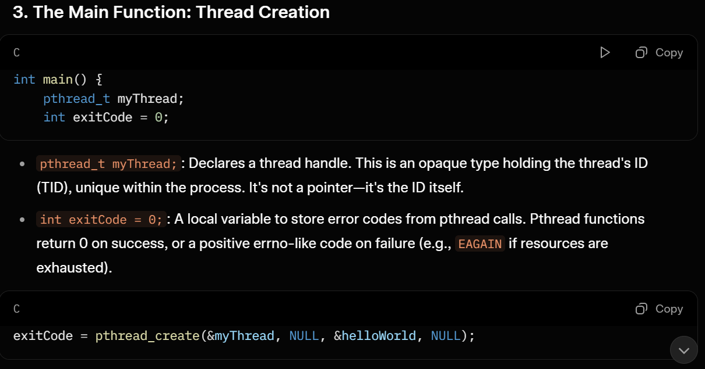
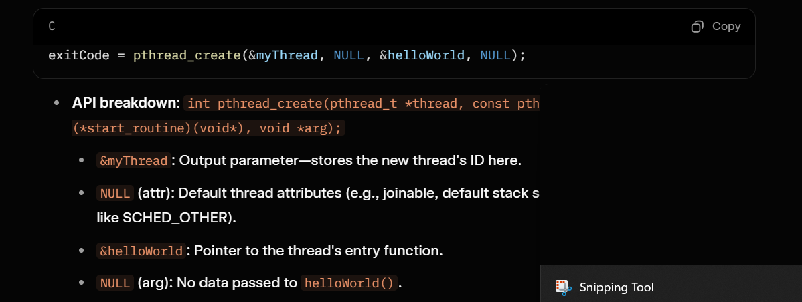
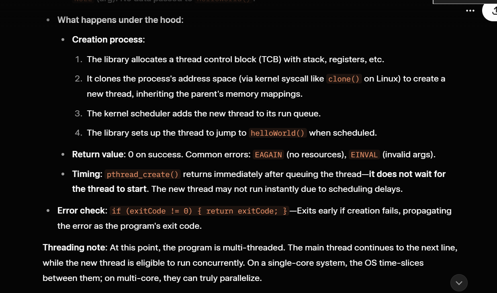
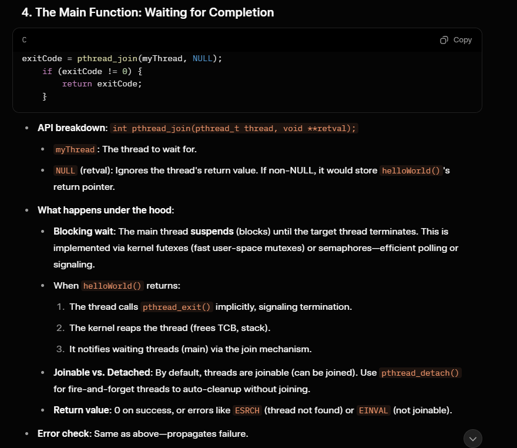

# Introduction to Multithreading in C++

Before C++11, developers have to write C-style code using platform-specific C APIs to enable multithreading in their code.

Mentioning multithread C APIs, there are supports for multithreading in C. But they are not a part of the C Standard Library. I can name two here: Win32 API and POSIX.

We have two options to write multithreaded code in C++. 

1. Use C-style multithreading APIs (Win32 API or POSIX).
2. Use C++11's built-in multithreading support.

1. Pthreads
The support for multithreading of a POSIX system consists of 3 components:

* The header file pthread.h is the declaration of the API.
* The implementation of the API.
* A C compiler and linker.

The implementation is the Native POSIX Threads Library (NPTL), which is a part of The GNU C Library (glibc). By obtaining GCC, you have an implementation, the header file, the compiler and the linker. Most Linux distros have the package gcc. Follow your package manager manual to install it. 

```cpp
#include <pthread.h>
#include <stdio.h>

void *helloWorld(void *arg) {
  (void)(arg);
  printf("Hello Multithreading World\n");
  return (void *)0;
}

int main() {
  pthread_t myThread;
  int exitCode = 0;

  exitCode = pthread_create(&myThread, NULL, &helloWorld, NULL);
  if (exitCode != 0) {
    return exitCode;
  }

  exitCode = pthread_join(myThread, NULL);
  if (exitCode != 0) {
    return exitCode;
  }

  return exitCode;
}
```

here,

helloWorld(): The function which shall be executed in the new thread.
pthread_t: Thread identifier type, needed by most Pthreads APIs.
pthread_create(): Creates and launches a new thread of execution. It also gives us an identifier and then returns an exit code.
pthread_join(): The calling thread waits for the thread (specified by an identifier) to terminate.

* Threads are lightweight units of execution within a process.
* Unlike processes, threads share the same memory space, file descriptors, and other resources, making communication between them efficient but requiring careful synchronization to avoid issues like race conditions.

This program uses one main thread (implicitly created by the OS when main() starts) and one user-created thread via pthreads.

* threading mechanics:
    When this function starts executing, it's running in a new thread of control. The thread has its own stack (default 8MB on many systems, configurable via PTHREAD_STACK_MIN), but shares the process's heap, global variables, and file descriptors with the main thread.
* Concurrency: The OS kernel schedules this thread independently. It may run on the same CPU core as main (via context switches) or a different core if the system is multi-core. Context switches happen every ~10-100ms or on I/O blocks/yields.
* Lifetime: The thread runs until the function returns or calls pthread_exit(). Resources are cleaned up automatically on exit (e.g., stack deallocation), but "detached" threads (not joined) may leave "zombie" states if not handled.









Debugging: Tools like gdb with thread apply all bt show stack traces per thread. Valgrind detects leaks/races.

# C++ Thread

 These supports include the classes for managing threads, protecting shared data, synchronizing between threads, and low-level atomic operations, which makes coding multithread easier and safer.

 