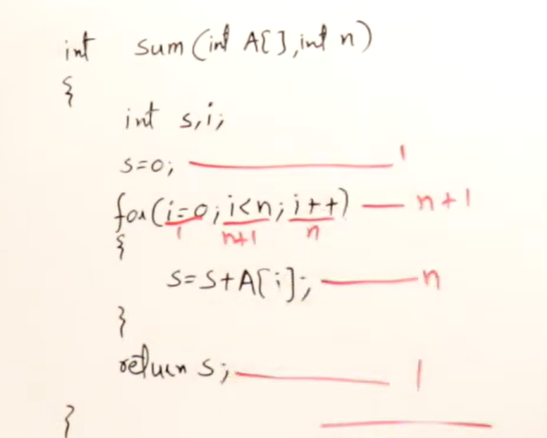
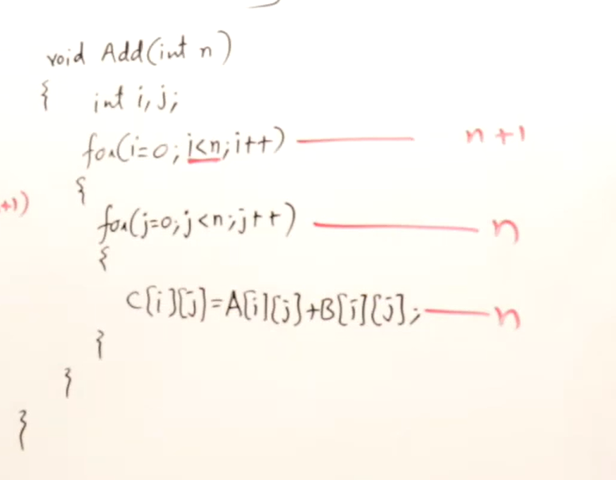
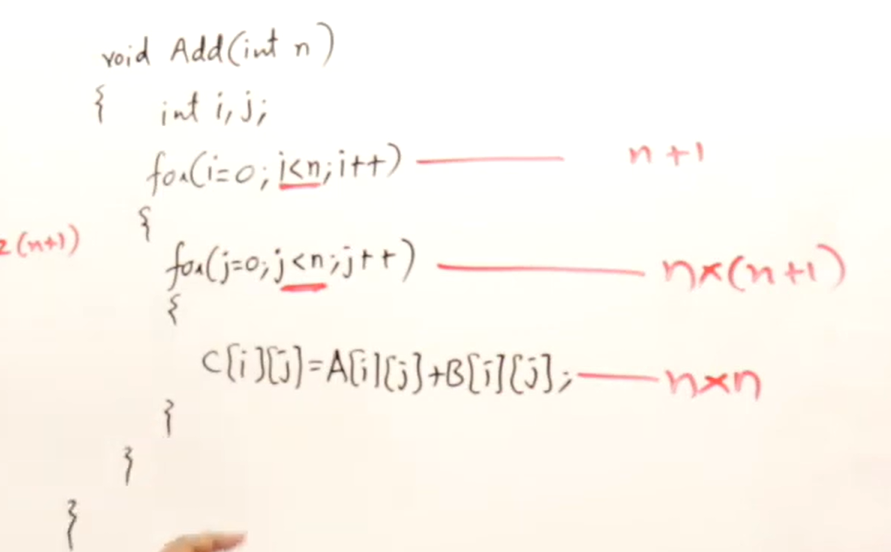
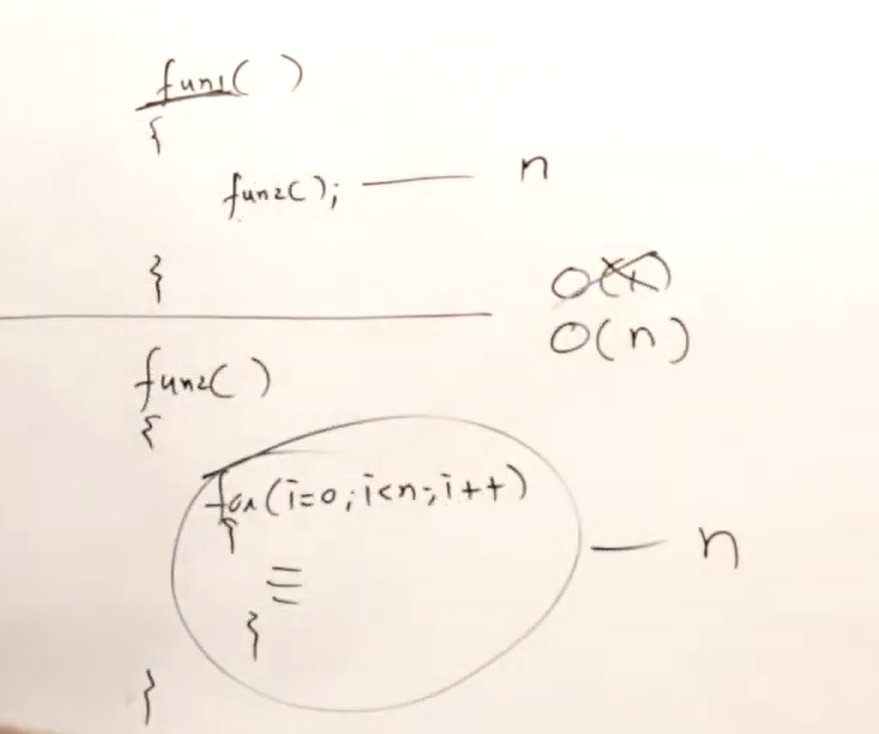

# Basics

## What is Data Structure?

A data structure is a way of arrangement and operation of data in a computer's main memory so that it can be effeciently used by the program during execution.

Why do we need Data Structure?

We had main memory where our application and data stored , now our application needs to access the data and perform some operations on it, so we need to arrange the data in such a way that it can be easily accessed and manipulated by the application. This is where data structures come into play.

Physical Data Structure: It defines how data is arranged in memory or on disk. It includes the actual layout of data, such as how records are stored in a file or how nodes are linked in a linked list. ex. Array, Matrics, Linked list. Actually, physical data structure are actually meant to storing data in main memory.

Logical Data Structure: These defines how data can be utilised and manipulated. It includes the operations that can be performed on the data, such as searching, sorting, and inserting. ex. Stack, Queue, Tree, Graph.

## Static vs Dynamic Memory Allocation

* Static Memory Allocation: In static memory allocation, the memory for data structures is allocated at compile time. The size of the data structure is fixed and cannot be changed during runtime. ex. Array. 

* Dynamic Memory Allocation: In dynamic memory allocation, the memory for data structures is allocated at runtime. The size of the data structure can be changed during runtime. ex. Linked list, Stack, Queue.

## ADT (Abstract Data Type)

* Datatype : 1. Represents the type of data that can be stored in a variable. 2. It defines the operations that can be performed on the data. ex. int, float, char.

* Abstract Data Type: It defines the operations that can be performed on the data, but does not specify how the data is stored or implemented. ex. Stack, Queue, Tree, Graph.

## Time and Space Complexity :-

For finding time complexity, either we need to know procedure or from code we can find it out. Time complexity is the measure of the amount of time an algorithm takes to complete as a function of the size of the input. It is usually expressed using Big O notation, which describes the upper bound of the growth rate of the algorithm.

1. divide by half : O(log n) 

```cpp
for (int i = n; i > 0; i /= 2) {
    // some constant time operations
}
```

* Space Complexity: It is the measure of the amount of memory an algorithm uses as a function of the size of the input. It is also expressed using Big O notation.



See , img 11 and img 12 for more understanding of time complexity.



Note: Anything inside the loop is exected n times, so we can ignore the constant time operations and focus on the growth rate of the algorithm.



for function:

