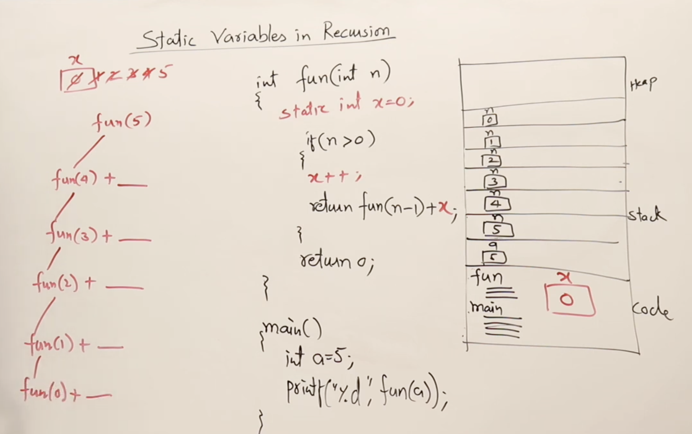
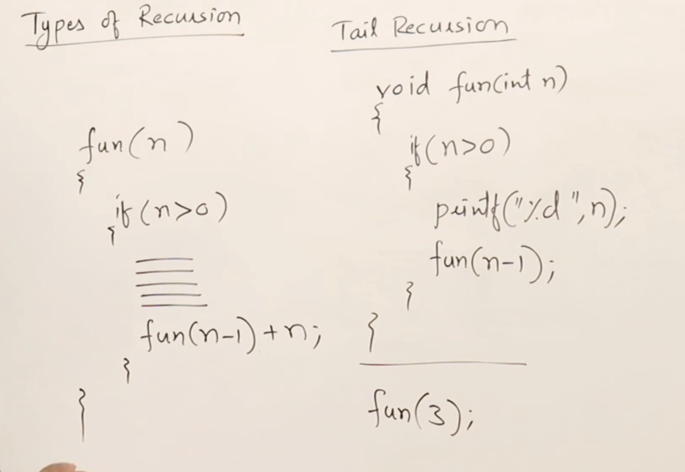
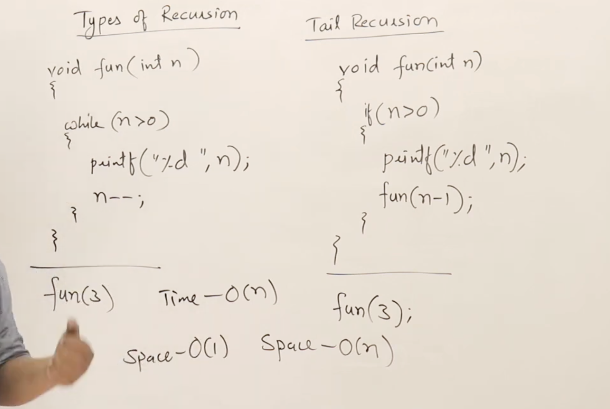
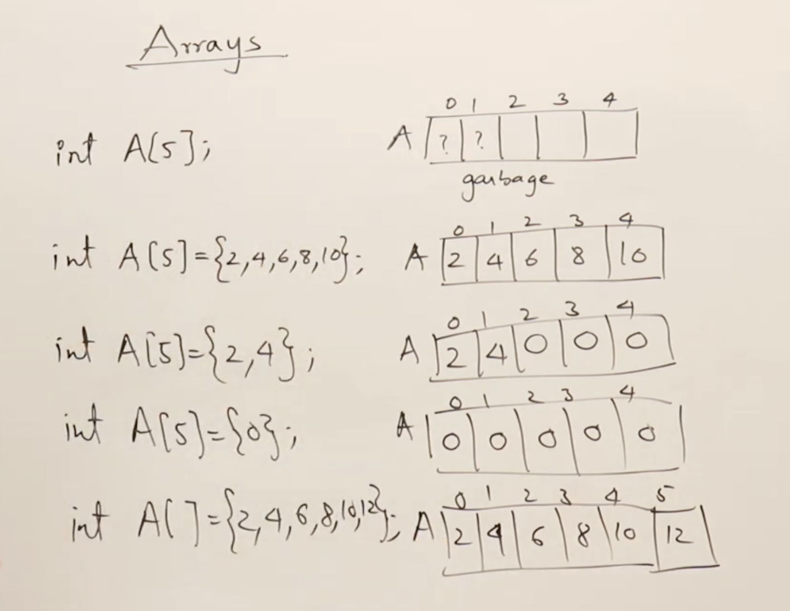

# Basics

## What is Data Structure?

A data structure is a way of arrangement and operation of data in a computer's main memory so that it can be effeciently used by the program during execution.

Why do we need Data Structure?

We had main memory where our application and data stored , now our application needs to access the data and perform some operations on it, so we need to arrange the data in such a way that it can be easily accessed and manipulated by the application. This is where data structures come into play.

Physical Data Structure: It defines how data is arranged in memory or on disk. It includes the actual layout of data, such as how records are stored in a file or how nodes are linked in a linked list. ex. Array, Matrics, Linked list. Actually, physical data structure are actually meant to storing data in main memory.

Logical Data Structure: These defines how data can be utilised and manipulated. It includes the operations that can be performed on the data, such as searching, sorting, and inserting. ex. Stack, Queue, Tree, Graph.

## Static vs Dynamic Memory Allocation

* Static Memory Allocation: In static memory allocation, the memory for data structures is allocated at compile time. The size of the data structure is fixed and cannot be changed during runtime. ex. Array. 

* Dynamic Memory Allocation: In dynamic memory allocation, the memory for data structures is allocated at runtime. The size of the data structure can be changed during runtime. ex. Linked list, Stack, Queue.

## ADT (Abstract Data Type)

* Datatype : 1. Represents the type of data that can be stored in a variable. 2. It defines the operations that can be performed on the data. ex. int, float, char.

* Abstract Data Type: It defines the operations that can be performed on the data, but does not specify how the data is stored or implemented. ex. Stack, Queue, Tree, Graph.

## Time and Space Complexity :-

For finding time complexity, either we need to know procedure or from code we can find it out. Time complexity is the measure of the amount of time an algorithm takes to complete as a function of the size of the input. It is usually expressed using Big O notation, which describes the upper bound of the growth rate of the algorithm.

1. divide by half : O(log n) 

```cpp
for (int i = n; i > 0; i /= 2) {
    // some constant time operations
}
```

* Space Complexity: It is the measure of the amount of memory an algorithm uses as a function of the size of the input. It is also expressed using Big O notation.


See , img 11 and img 12 for more understanding of time complexity.


Note: Anything inside the loop is exected n times, so we can ignore the constant time operations and focus on the growth rate of the algorithm.


for function:


# Recursion

## Static variable

A static variable is a variable that retains its value between function calls. It is initialized only once and its value persists throughout the program's execution. Static variables are typically used to maintain state information across multiple function calls. Initilised static variable are stored in data segment of memory and uninitialized static variable are stored in bss segment of memory.

### Example of static variable in Recursion:



1. Tail Recursion: A tail recursion is a special case of recursion where the recursive call is the last operation performed in the function. In tail recursion, there are no further computations or operations after the recursive call. Tail recursion can be optimized by the compiler into iterative code, which can improve performance and reduce memory usage.

Left side is non-tail recursion and right side is tail recursion. ex.



Note: Tail recursion can be optimized by the compiler into iterative code, which can improve performance and reduce memory usage. See space complexity of tail recursion and loop in img 29.



2. Head Recursion: A head recursion is a special case of recursion where the recursive call is the first operation performed in the function. In head recursion, there are further computations or operations after the recursive call. Head recursion cannot be optimized by the compiler into iterative code, and it may lead to increased memory usage due to multiple function calls.


# Array

## Method of Initialization



## Array ADT

An array is a data structure that stores a fixed number of values of the same type. It is a collection of elements that are stored in contiguous memory locations. The elements in an array can be accessed using an index, which starts from 0.

Data:
1. Array Space
2. Array Size
3. Array length

Operations:
1. Display(): It is the operation of displaying the elements of an array.
2. Add(x): It is the operation of adding an element to the end of the array.
3. Insert(x, index): It is the operation of inserting an element at a specific index in the array.
4. Delete(index): It is the operation of deleting an element from a specific index in the array.
5. Search(x): It is the operation of searching for an element in the array and returning its index if found, or -1 if not found.
6. Update(x, index): It is the operation of updating an element at a specific index in the array with a new value.
7. Get(index): It is the operation of retrieving the value of an element at a specific index in the array.
8. Set(x, index): It is the operation of setting the value of an element at a specific index in the array to a new value.
9. Max(): It is the operation of finding the maximum element in the array.
10. Min(): It is the operation of finding the minimum element in the array.
11. Reverse(): It is the operation of reversing the order of elements in the array.
12. Shift(): It is the operation of shifting all elements in the array to the left or right by a specified number of positions.
