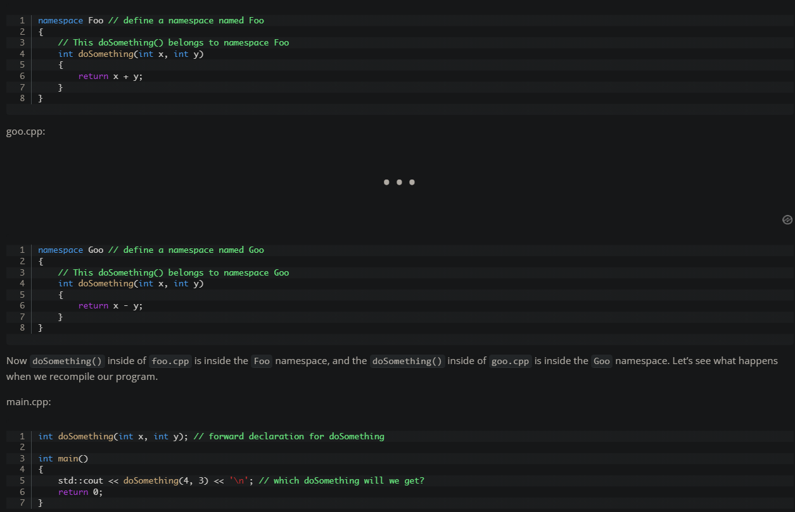
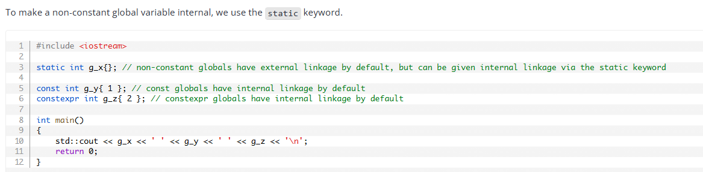
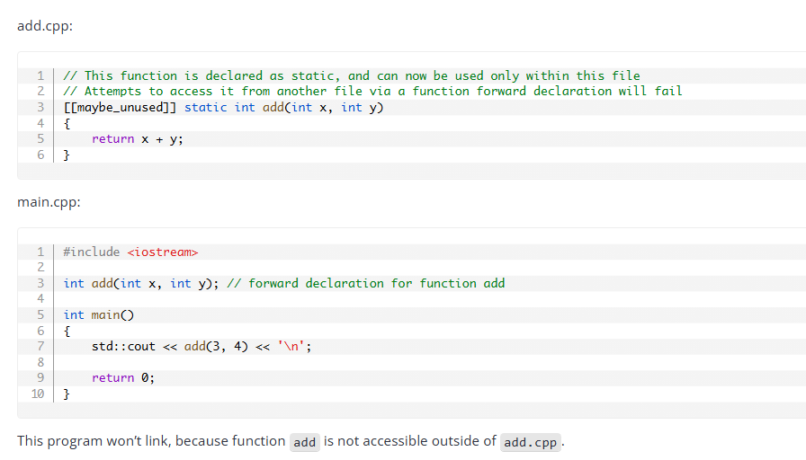
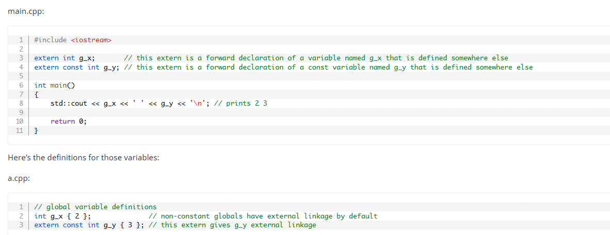
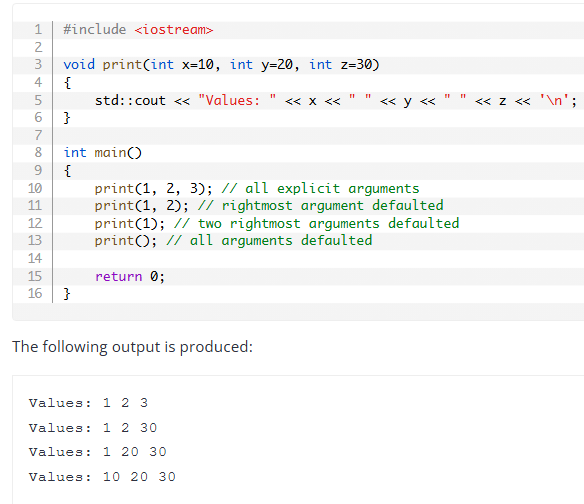
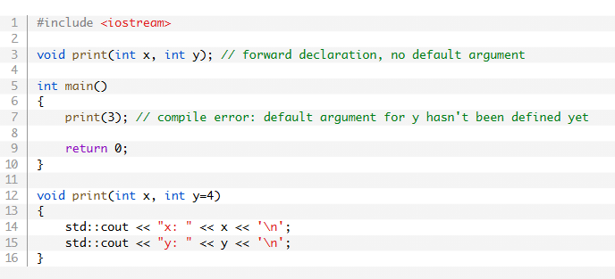
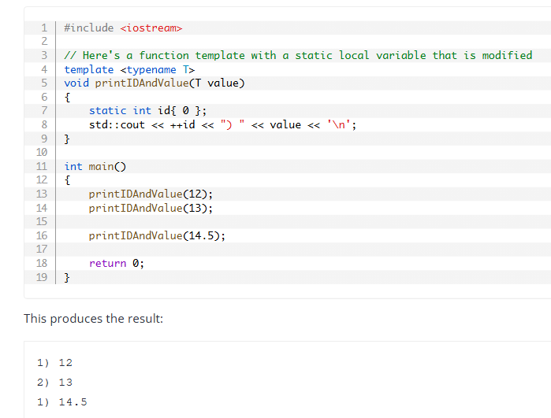
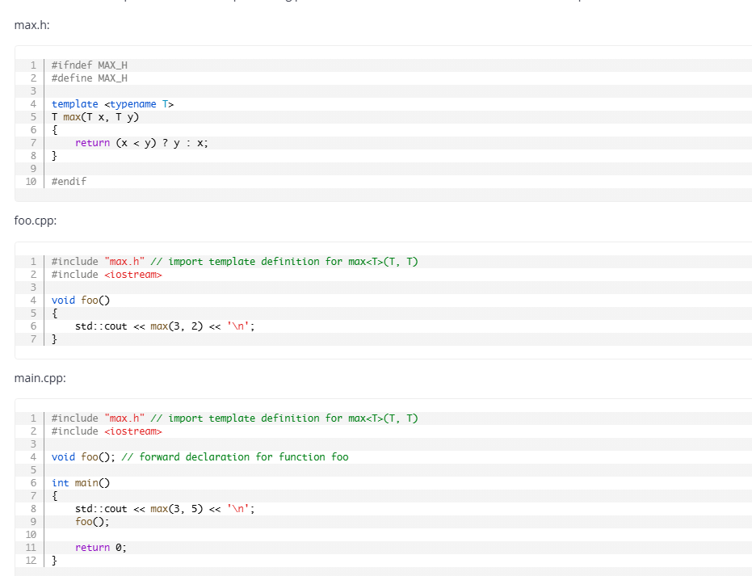

Source : learncpp.com

# Chapter 7 

7.2:  User-defined namespaces and the scope resolution operator

*The syntax for a namespace is as follows:
    namespace NamespaceIdentifier
    {
        // content of namespace here
    }

*Guidlines for naming namespaces:
-It is convention to name program-defined types starting with a capital letter.

* Error : 
ConsoleApplication1.obj : error LNK2019: unresolved external symbol "int __cdecl doSomething(int,int)" (?doSomething@@YAHHH@Z) referenced in function _main
- In this case, the compiler was satisfied (by our forward declaration), but the linker could not find a definition for doSomething in the global namespace. This is because both of our versions of doSomething are no longer in the global namespace! They are now in the scope of their respective namespaces!

7.3 : Local variables :- scope determines where an identifier can be accessed within the source code. When an identifier can not be accessed, we say it is out of scope. Scope is a compile-time property, and trying to use an identifier when it is out of scope will result in a compile error.

* Linkage : An identifier’s linkage determines whether a declaration of that same identifier in a different scope refers to the same object (or function). Local variables have no linkage. Each declaration of an identifier with no linkage refers to a unique object or function.

    int main()
    {
        int x { 2 }; // local variable, no linkage

        {
            int x { 3 }; // this declaration of x refers to a different object than the previous x
        }

        return 0;
    }

* Global variables have static duration : Global variables are created when the program starts (before main() begins execution), and destroyed when it ends. This is called static duration. Variables with static duration are sometimes called static variables.

* Global variables have external linkage by default. This means that a declaration of the same identifier in a different scope refers to the same object.

7.6 : Internal linkage :
An identifier with internal linkage can be seen and used within a single translation unit, but it is not accessible from other translation units. This means that if two source files have identically named identifiers with internal linkage, those identifiers will be treated as independent (and do not result in an ODR violation for having duplicate definitions).

* Gloabal variables can be given internal linkage by using the static keyword : Global variables with internal linkage are sometimes called internal variables.

    

* Functions can also have internal linkage by using the static keyword : Functions with internal linkage are sometimes called internal functions.

    

7.7 : External linkage and variable forward declarations

An identifier with external linkage can be seen and used both from the file in which it is defined, and from other code files (via a forward declaration).

* Global variables with external linkage are sometimes called external variables.

    int g_x { 2 }; // non-constant globals are external by default (no need to use extern)

    extern const int g_y { 3 }; // const globals can be defined as extern, making them external
    extern constexpr int g_z { 3 }; // constexpr globals can be defined as extern, making them external (but this is pretty useless, see the warning in the next section)

    int main()
    {
        return 0;
    }

    Note : const global variables have internal linkage by default. Therefore, to make a const global variable accessible from other translation units, you must explicitly declare it as extern.

    Note: Variable forward declarations via the extern keyword, To use a global variable defined in another translation unit, you must provide a forward declaration for it using the extern keyword. A variable forward declaration tells the compiler about the variable's type and name, but does not create a new instance of the variable.

    example :
    

7.9 — Inline functions and variables:

 Inline expansion is a process where a function call is replaced by the code from the called function’s definition. This can improve performance by eliminating the overhead of a function call, especially for small functions that are called frequently.

 Note: inline expansion has its own potential cost: if the body of the function being expanded takes more instructions than the function call being replaced, then each inline expansion will cause the executable to grow larger. Larger executables tend to be slower (due to not fitting as well in memory caches).

* Modern inline functions and variables :

 In modern C++, the term inline has evolved to mean “multiple definitions are allowed”. Thus, an inline function is one that is allowed to be defined in multiple translation units (without violating the ODR). This is particularly useful for functions defined in header files, which are typically included in multiple source files.

 Inline functions have two primary requirements:
 - The compiler needs to be able to see the full definition of an inline function in each translation unit where the function is used.

 * inline variables : Similar to inline functions, inline variables are allowed to be defined in multiple translation units without violating the ODR. This is useful for defining global variables in header files.

* Qualified and unqualified names :

A qualified name is a name that includes an associated scope. Most often, names are qualified with a namespace using the scope resolution operator (::). For example:
    std::cout // identifier cout is qualified by namespace std
    ::foo // identifier foo is qualified by the global namespace

* Using-directives : A using-directive brings all the names from a namespace into the current scope. For example:
    using namespace MyNamespace;

    Problems with using-directives : Using-directives can lead to name conflicts if two namespaces contain identically named identifiers. For example:

    #include <iostream>

    namespace A
    {
        int x { 10 };
    }

    namespace B
    {
        int x{ 20 };
    }

    int main()
    {
        using namespace A;
        using namespace B;

        std::cout << x << '\n';

        return 0;
    }

  * Unnamed namespaces : An unnamed namespace is a namespace that does not have a name. Identifiers declared in an unnamed namespace have internal linkage by default. This means that they can only be accessed within the same translation unit. 

  Difference between unnamed namespaces and static variables/functions : Both unnamed namespaces and static variables/functions provide internal linkage, but they do so in different ways. Unnamed namespaces group related identifiers together, while static variables/functions are declared individually.

# Chapter 10 : Type Conversion, Type Aliases, and Type Deduction :

What is type conversion?
Type conversion is the process of converting a value from one data type to another. This can happen either implicitly (automatically by the compiler) or explicitly (manually by the programmer).

Why conversions are needed?

The value of an object is stored as a sequence of bits, and the data type of the object tells the compiler how to interpret those bits into meaningful values.

## 10.4 -  Narrowing conversions :

In C++, a narrowing conversion is a potentially unsafe numeric conversion where the destination type may not be able to hold all the values of the source type.
For example, converting a floating-point number to an integer can result in loss of the fractional part, and converting a larger integer type to a smaller integer type can result in overflow.

## 10.6 — Explicit type conversion (casting) and static_cast

Type Casting operators in C++:
1. static_cast
2. dynamic_cast
3. const_cast
4. reinterpret_cast
5. C-style cast

First four are known as named casts or C++ style casts, while the last one is known as C-style cast.

Note: Avoid const_cast and reinterpret_cast unless you have a very good reason to use them.

* C-style caste : The syntax for a C-style cast is as follows:
    (NewType)expression

    ex: int x { 5 };
         double y = (double)x; // C-style cast from int to double

    Note: C++ also provied an alternative form of c style cast:
        NewType(expression)

        ex: double y = double(x); // C-style cast from int to double

Note: C-style casts are generally considered less safe than C++ style casts because they can perform multiple types of conversions (static, dynamic, const, and reinterpret) without any explicit indication of which type of conversion is being performed. This can lead to unintended consequences and make the code harder to read and maintain.

* static_cast : The syntax for a static_cast is as follows:
    static_cast<NewType>(expression)

    ex: int x { 5 };
         double y = static_cast<double>(x); // static_cast from int to double
    
    Important properties of static_cast:
    1. static_cast provides compile-time type checking. If we try to convert a value to a type and the compiler doesn’t know how to perform that conversion, we will get a compilation error.
    2. static_cast is (intentionally) less powerful than a C-style cast, as it will prevent certain kinds of dangerous conversions (such as those that require reinterpretation or discarding const).

    Note : static_cast used direct intilization.

    Use : to make narrowing conversions explicit :-

        If we used list initialization, the compiler would yield an error. Workarround :- 
        int i { 48 };
        // explicit conversion from int to char, so that a char is assigned to variable ch
        char ch { static_cast<char>(i) };

## 10.8 :- Type deduction for objects using the auto keyword

Type deduction is the process by which the compiler automatically deduces the type of a variable from its initializer. The auto keyword is used to declare a variable with an automatically deduced type.

    auto d { 5.0 }; // 5.0 is a double literal, so d will be deduced as a double

    Note : Prior to C++17, auto d{ 5.0 }; would deduce d to be of type std::initializer_list<double> rather than double
        For C++ 14 or before use copy initialization to avoid this issue:
        auto d = 5.0; // d will be deduced as a double
    Note:  
        auto b {5u}; // u suffix causes b to be deduced to unsigned int 

    Note: Type deduction drops const from the deduced type

        const int a { 5 }; // a has type const int
        auto b { a };      // b has type int (const dropped)

## 10.9 : Type deduction for functions 

For C++ 14 : 
    auto add(int a, int b)
    {
        return a + b;
    }
Note: for Type deduction to work with function parameters types , we required c++ 20.
    
## Downsides of using auto for function return types :

   1. Functions that use an auto return type must be fully defined before they can be used (a forward declaration is not sufficient).

* Trailing return type syntax : 

    The auto keyword can also be used to declare functions using a trailing return syntax, where the return type is specified after the rest of the function prototype.

1. For functions with complex return types, a trailing return type can make the function easier to read: 
    #include <type_traits> // for std::common_type

    std::common_type_t<int, double> compare(int, double);         // harder to read (where is the name of the function in this mess?)
    auto compare(int, double) -> std::common_type_t<int, double>; // easier to read (we don't have to read the return type unless we care)

# Chapter 11 : Introduction to function overloading:
 
## How overloaded functions are differentiated :

Functions property : 1. No of parameters 2. Types of parameters 3. Functional-level qualifiers (const, volatile)

Note: 
    void print(int);
    void print(const int); // not differentiated from print(int)

For parameters passed by value, the const qualifier is also not considered. 

## Function overload resolution and ambiguous calls :

*No matching functions were found. The compiler moves to the next step in the sequence.
*A single matching function was found. This function is considered to be the best match. The matching process is now complete, and subsequent steps are not executed.
*More than one matching function was found. The compiler will issue an ambiguous match compile error.

## Deleting functions

A function can be deleted by using the delete specifier in its declaration. This prevents the function from being called, and any attempt to call a deleted function will result in a compile error.

    void doSomething() = delete; // delete the function doSomething

    We can also delete not required overloads of a function using function templates. For example, if we want to delete the overload of a function that takes a double parameter, we can do the following:

    #include <iostream>

    // This function will take precedence for arguments of type int
    void printInt(int x)
    {
        std::cout << x << '\n';
    }

    // This function template will take precedence for arguments of other types
    // Since this function template is deleted, calls to it will halt compilation
    template <typename T>
    void printInt(T x) = delete;

    int main()
    {
        printInt(97);   // okay
        printInt('a');  // compile error
        printInt(true); // compile error

        return 0;
    }

## 11.5 — Default arguments

note: Default arguments can not be redeclared, and must be declared before use

   #include <iostream>

    void print(int x, int y=4); // forward declaration

    void print(int x, int y=4) // compile error: redefinition of default argument
    {
        std::cout << "x: " << x << '\n';
        std::cout << "y: " << y << '\n';
    }

Note : The default argument must also be declared in the translation unit before it can be used:

    

Note: Best practice is to place default arguments in function declarations (e.g., in header files), rather than in function definitions (e.g., in source files). This helps ensure that the default arguments are visible to all translation units that include the header file.

## 11.6 — Function templates

A function template is a function-like definition that is used to generate one or more overloaded functions, each with a different set of actual types. This is what will allow us to create functions that can work with many different types. 

C++ supports three types of templates parameters:

* Type template parameters (where the template parameter represents a type).
* Non-type template parameters (where the template parameter represents a constexpr value).
* Template template parameters (where the template parameter represents a template).

ex. #include <iostream>

    template <typename T>
    T max(T x, T y)
    {
        return (x < y) ? y : x;
    }

    int main()
    {
        std::cout << max<int>(1, 2) << '\n'; // instantiates and calls function max<int>(int, int)

        return 0;
    }

    Case : 

    #include <iostream>
    template <typename T>
    T max(T x, T y)
    {
        std::cout << "called max<int>(int, int)\n";
        return (x < y) ? y : x;
    }

    int max(int x, int y)
    {
        std::cout << "called max(int, int)\n";
        return (x < y) ? y : x;
    }

    int main()
    {
        std::cout << max<int>(1, 2) << '\n'; // calls max<int>(int, int)
        std::cout << max<>(1, 2) << '\n';    // deduces max<int>(int, int) (non-template functions not considered) (Important note: the empty angle brackets are required to indicate that we want to use template argument deduction for this call)
        std::cout << max(1, 2) << '\n';      // calls max(int, int)

        return 0;
    }
    
* Functions templates with non-type template parameters : Functions containing template parameters and non template parameters.
* Note : Beaware function templates with modifiable static local variables can lead to unexpected behavior, as all instantiations of the function template will share the same static variable. This can cause unintended side effects if the function is called with different template arguments.

## 11.8 - Function templates with multiple template types

ex: #include <iostream>

template <typename T>
T max(T x, T y)
{
    return (x < y) ? y : x;
}

int main()
{
    std::cout << max(2, 3.5) << '\n';  // compile error

    return 0;
}

To handle such cases, we can define a function template with multiple template parameters:
#include <iostream>

template <typename T1, typename T2>

## Abbreviated function templates (C++20): C++20 introduces a new use of the auto keyword: When the auto keyword is used as a parameter type in a normal function, the compiler will automatically convert the function into a function template with each auto parameter becoming an independent template type parameter. This method for creating a function template is called an abbreviated function template.

    auto max(auto x, auto y)
    {
        return (x < y) ? y : x;
    }

    is shorthand for :

    template <typename T, typename U>
    auto max(T x, U y)
    {
        return (x < y) ? y : x;
    }

## 11.9 - Non-type template parameters: A non-type template parameter is a template parameter with a fixed type that serves as a placeholder for a constexpr value passed in as a template argument.

A non-type template parameter can be any of the following types:

* An integral type
* An enumeration type
* std::nullptr_t
* A floating point type (since C++20)
* A pointer or reference to an object
* A pointer or reference to a function
* A pointer or reference to a member function
* A literal class type (since C++20)

ex. 
#include <bitset>

int main()
{
    std::bitset<8> bits{ 0b0000'0101 }; // The <8> is a non-type template parameter

    return 0;
}

Defining our own non-type template parameters :-

#include <iostream>

template <int N> // declare a non-type template parameter of type int named N
void print()
{
    std::cout << N << '\n'; // use value of N here
}

int main()
{
    print<5>(); // 5 is our non-type template argument

    return 0;
}

11.10 — Using function templates in multiple files

main.cpp:

    #include <iostream>

    template <typename T>
    T addOne(T x); // function template forward declaration

    int main()
    {
        std::cout << addOne(1) << '\n';
        std::cout << addOne(2.3) << '\n';

        return 0;
    }

add.cpp:

    template <typename T>
    T addOne(T x) // function template definition
    {
        return x + 1;
    }

    Note : If addOne were a non-template function, this program would work fine: In main.cpp, the compiler would be satisfied with the forward declaration of addOne, and the linker would connect the call to addOne() in main.cpp to the function definition in add.cpp.

    We can fix it by adding function definition in the header file and including it in both source files. 

# Chapter 12 : Compound Types : References and pointers:
    
* Lvalue and rvalue expressions :-

    
