Source : learncpp.com

# Chapter 7 : Scope, Duration, and Linkage

## Local variables 

* Scope : Scope is the region of the program where an identifier can be used. An identifier is said to be in scope from its point of declaration to the end of the block in which it is declared.
Scope is a compile-time property, and trying to use an identifier when it is out of scope will result in a compile error.

* Linkage : Linkage determines if multiple declarations of an identifier refer to the same identifier or not. Local variables have no linkage, meaning each declaration refers to a unique object.

```cpp
    int main()
    {
        int x { 2 }; // local variable, no linkage

        {
            int x { 3 }; // this declaration of x refers to a different object than the previous x
        }

        return 0;
    }
```

* Global variables have static duration : Global variables are created when the program starts (before main() begins execution), and destroyed when it ends. This is called static duration. Variables with static duration are sometimes called static variables.

* Global variables have external linkage by default. This means that a declaration of the same identifier in a different scope refers to the same object.

## Internal linkage :
An identifier with internal linkage can be seen and used within a single translation unit, but it is not accessible from other translation units. This means that if two source files have identically named identifiers with internal linkage, those identifiers will be treated as independent (and do not result in an ODR violation for having duplicate definitions).

* Gloabal variables can be given internal linkage by using the static keyword : Global variables with internal linkage are sometimes called internal variables.

    

* Functions can also have internal linkage by using the static keyword : Functions with internal linkage are sometimes called internal functions.

    

## External linkage and variable forward declarations

An identifier with external linkage can be seen and used both from the file in which it is defined, and from other code files (via a forward declaration).

* Global variables with external linkage are sometimes called external variables.
```cpp
    int g_x { 2 }; // non-constant globals are external by default (no need to use extern)

    extern const int g_y { 3 }; // const globals can be defined as extern, making them external
    extern constexpr int g_z { 3 }; // constexpr globals can be defined as extern, making them external (but this is pretty useless, see the warning in the next section)

    int main()
    {
        return 0;
    }
```
Note : const global variables have internal linkage by default. Therefore, to make a const global variable accessible from other translation units, we must explicitly declare it as extern.

Note: Variable forward declarations via the extern keyword, To use a global variable defined in another translation unit, we must provide a forward declaration for it using the extern keyword. A variable forward declaration tells the compiler about the variable's type and name, but does not create a new instance of the variable.

example :


## Inline functions and variables:

 Inline expansion is a process where a function call is replaced by the code from the called function’s definition. This can improve performance by eliminating the overhead of a function call, especially for small functions that are called frequently.

 Note: inline expansion has its own potential cost: if the body of the function being expanded takes more instructions than the function call being replaced, then each inline expansion will cause the executable to grow larger. Larger executables tend to be slower (due to not fitting as well in memory caches).

### Modern inline functions and variables :

 In modern C++, the term inline has evolved to mean “multiple definitions are allowed”. Thus, an inline function is one that is allowed to be defined in multiple translation units (without violating the ODR). This is particularly useful for functions defined in header files, which are typically included in multiple source files.

 Inline functions have two primary requirements:
 - The compiler needs to be able to see the full definition of an inline function in each translation unit where the function is used.

### inline variables : 
Similar to inline functions, inline variables are allowed to be defined in multiple translation units without violating the ODR. This is useful for defining global variables in header files.


## Qualified and unqualified names :

A qualified name is a name that includes an associated scope. Most often, names are qualified with a namespace using the scope resolution operator (::). For example:
    std::cout // identifier cout is qualified by namespace std
    ::foo // identifier foo is qualified by the global namespace

### Using-directives 
A using-directive brings all the names from a namespace into the current scope. For example:
    using namespace MyNamespace;

    Problems with using-directives : Using-directives can lead to name conflicts if two namespaces contain identically named identifiers. For example:
    ex:
```cpp
    #include <iostream>

    namespace A
    {
        int x { 10 };
    }

    namespace B
    {
        int x{ 20 };
    }

    int main()
    {
        using namespace A;
        using namespace B;

        std::cout << x << '\n';

        return 0;
    }
```


## Unnamed namespaces : 
An unnamed namespace is a namespace that does not have a name. Identifiers declared in an unnamed namespace have internal linkage by default. This means that they can only be accessed within the same translation unit. 

Difference between unnamed namespaces and static variables/functions : Both unnamed namespaces and static variables/functions provide internal linkage, but they do so in different ways. Unnamed namespaces group related identifiers together, while static variables/functions are declared individually.


# Chapter 10 : Type Conversion, Type Aliases, and Type Deduction 

## What is type conversion?
Type conversion is the process of converting a value from one data type to another. This can happen either implicitly (automatically by the compiler) or explicitly (manually by the programmer).

### Why conversions are needed?

The value of an object is stored as a sequence of bits, and the data type of the object tells the compiler how to interpret those bits into meaningful values.

## Narrowing conversions :

In C++, a narrowing conversion is a potentially unsafe numeric conversion where the destination type may not be able to hold all the values of the source type.
For example, converting a floating-point number to an integer can result in loss of the fractional part, and converting a larger integer type to a smaller integer type can result in overflow.

## Explicit type conversion (casting) and static_cast

Type Casting operators in C++:
1. static_cast
2. dynamic_cast
3. const_cast
4. reinterpret_cast
5. C-style cast

First four are known as named casts or C++ style casts, while the last one is known as C-style cast.

Note: Avoid const_cast and reinterpret_cast unless we have a very good reason to use them.

* C-style caste : The syntax for a C-style cast is as follows:
    (NewType)expression

    ex: int x { 5 };
         double y = (double)x; // C-style cast from int to double

    Note: C++ also provied an alternative form of c style cast:
        NewType(expression)

        ex: double y = double(x); // C-style cast from int to double

Note: C-style casts are generally considered less safe than C++ style casts because they can perform multiple types of conversions (static, dynamic, const, and reinterpret) without any explicit indication of which type of conversion is being performed. This can lead to unintended consequences and make the code harder to read and maintain.

* static_cast : The syntax for a static_cast is as follows:
    static_cast<NewType>(expression)

    ex: int x { 5 };
         double y = static_cast<double>(x); // static_cast from int to double
    
    Important properties of static_cast:
    1. static_cast provides compile-time type checking. If we try to convert a value to a type and the compiler doesn’t know how to perform that conversion, we will get a compilation error.
    2. static_cast is (intentionally) less powerful than a C-style cast, as it will prevent certain kinds of dangerous conversions (such as those that require reinterpretation or discarding const).

    Note : static_cast used direct intilization.

    Use : to make narrowing conversions explicit :-

    If we used list initialization, the compiler would yield an error. Workarround :- 
    int i { 48 };
    // explicit conversion from int to char, so that a char is assigned to variable ch
    char ch { static_cast<char>(i) };

## Type deduction for objects using the auto keyword

Type deduction is the process by which the compiler automatically deduces the type of a variable from its initializer. The auto keyword is used to declare a variable with an automatically deduced type.

auto d { 5.0 }; // 5.0 is a double literal, so d will be deduced as a double

Note : Prior to C++17, auto d{ 5.0 }; would deduce d to be of type std::initializer_list<double> rather than double
    For C++ 14 or before use copy initialization to avoid this issue:
    auto d = 5.0; // d will be deduced as a double
Note:  
    auto b {5u}; // u suffix causes b to be deduced to unsigned int 

Note: Type deduction drops const from the deduced type

    const int a { 5 }; // a has type const int
    auto b { a };      // b has type int (const dropped)

## Type deduction for functions 

For C++ 14 : 
```cpp
    auto add(int a, int b)
    {
        return a + b;
    }
```
Note: for Type deduction to work with function parameters types , we required c++ 20.
    
## Downsides of using auto for function return types :

   1. Functions that use an auto return type must be fully defined before they can be used (a forward declaration is not sufficient).

* Trailing return type syntax : 

    The auto keyword can also be used to declare functions using a trailing return syntax, where the return type is specified after the rest of the function prototype.

1. For functions with complex return types, a trailing return type can make the function easier to read: 
    #include <type_traits> // for std::common_type

    std::common_type_t<int, double> compare(int, double);         // harder to read (where is the name of the function in this mess?)
    auto compare(int, double) -> std::common_type_t<int, double>; // easier to read (we don't have to read the return type unless we care)


# Chapter 11 : Introduction to function overloading
 
## How overloaded functions are differentiated :

Functions property : 1. No of parameters 2. Types of parameters 3. Functional-level qualifiers (const, volatile)

Note: 
    void print(int);
    void print(const int); // not differentiated from print(int)

For parameters passed by value, the const qualifier is also not considered. 

## Function overload resolution and ambiguous calls :

*No matching functions were found. The compiler moves to the next step in the sequence.
*A single matching function was found. This function is considered to be the best match. The matching process is now complete, and subsequent steps are not executed.
*More than one matching function was found. The compiler will issue an ambiguous match compile error.

## Deleting functions

A function can be deleted by using the delete specifier in its declaration. This prevents the function from being called, and any attempt to call a deleted function will result in a compile error.
```cpp
    void doSomething() = delete; // delete the function doSomething

    We can also delete not required overloads of a function using function templates. For example, if we want to delete the overload of a function that takes a double parameter, we can do the following:

    #include <iostream>

    // This function will take precedence for arguments of type int
    void printInt(int x)
    {
        std::cout << x << '\n';
    }

    // This function template will take precedence for arguments of other types
    // Since this function template is deleted, calls to it will halt compilation
    template <typename T>
    void printInt(T x) = delete;

    int main()
    {
        printInt(97);   // okay
        printInt('a');  // compile error
        printInt(true); // compile error

        return 0;
    }
```
## Default arguments


note: Default arguments can not be redeclared, and must be declared before use
```cpp
   #include <iostream>

    void print(int x, int y=4); // forward declaration

    void print(int x, int y=4) // compile error: redefinition of default argument
    {
        std::cout << "x: " << x << '\n';
        std::cout << "y: " << y << '\n';
    }
```

Note : The default argument must also be declared in the translation unit before it can be used:


Note: Best practice is to place default arguments in function declarations (e.g., in header files), rather than in function definitions (e.g., in source files). This helps ensure that the default arguments are visible to all translation units that include the header file.

## Function templates

A function template is a function-like definition that is used to generate one or more overloaded functions, each with a different set of actual types. This is what will allow us to create functions that can work with many different types. 

C++ supports three types of templates parameters:

* Type template parameters (where the template parameter represents a type).
* Non-type template parameters (where the template parameter represents a constexpr value).
* Template template parameters (where the template parameter represents a template).

```cpp
ex. 

#include <iostream>

    template <typename T>
    T max(T x, T y)
    {
        return (x < y) ? y : x;
    }

    int main()
    {
        std::cout << max<int>(1, 2) << '\n'; // instantiates and calls function max<int>(int, int)

        return 0;
    }

    Case : 

    #include <iostream>
    template <typename T>
    T max(T x, T y)
    {
        std::cout << "called max<int>(int, int)\n";
        return (x < y) ? y : x;
    }

    int max(int x, int y)
    {
        std::cout << "called max(int, int)\n";
        return (x < y) ? y : x;
    }

    int main()
    {
        std::cout << max<int>(1, 2) << '\n'; // calls max<int>(int, int)
        std::cout << max<>(1, 2) << '\n';    // deduces max<int>(int, int) (non-template functions not considered) (Important note: the empty angle brackets are required to indicate that we want to use template argument deduction for this call)
        std::cout << max(1, 2) << '\n';      // calls max(int, int)

        return 0;
    }
```
    
* Functions templates with non-type template parameters : Functions containing template parameters and non template parameters.
* Note : Beaware function templates with modifiable static local variables can lead to unexpected behavior, as all instantiations of the function template will share the same static variable. This can cause unintended side effects if the function is called with different template arguments.


## Function templates with multiple template types

ex: 
```cpp
#include <iostream>

template <typename T>
T max(T x, T y)
{
    return (x < y) ? y : x;
}

int main()
{
    std::cout << max(2, 3.5) << '\n';  // compile error

    return 0;
}
```
To handle such cases, we can define a function template with multiple template parameters:
#include <iostream>

template <typename T1, typename T2>

## Function templates with multiple template types and template argument deduction

```cpp
Before C++ 14
template <typename T1, typename T2>
auto max(T1 x, T2 y) -> decltype((x < y) ? y : x)
{
    return (x < y) ? y : x;
}
```

int main(){
    std::cout << max(2, 3.5) << '\n';  // okay: max<int, double>(int, double) is instantiated

    return 0;
}
``` 
After C++ 11
```cpp
template <typename T1, typename T2>
auto max(T1 x, T2 y)
{
    return (x < y) ? y : x;
}

int main()
{
    std::cout << max(2, 3.5) << '\n';  // okay: max<int, double>(int, double) is instantiated

    return 0;
}
```

* decltype and decltype(auto)

decltype is used to query the exact type of an expression.

```cpp
#include <iostream>

int main()
{
    int x = 10;
    decltype(x) y = 20;   // y has same type as x (int)

    std::cout << y << std::endl;
}
```

Note: The result depends on how the expression is written.
```cpp
int x = 10;

decltype(x) a = x;   // int
decltype((x)) b = x; // int&
```

decltype(auto)

decltype(auto) lets the compiler deduce the type using decltype rules automatically.

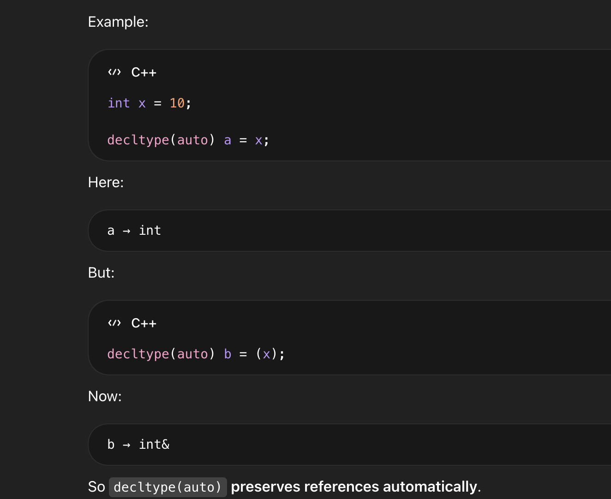

Note: 
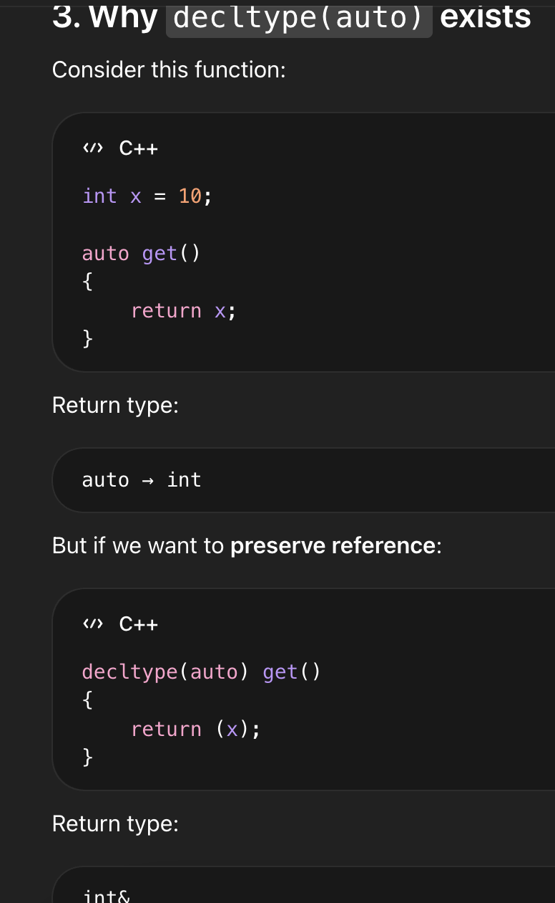


## Abbreviated function templates (C++20): 
C++20 introduces a new use of the auto keyword: When the auto keyword is used as a parameter type in a normal function, the compiler will automatically convert the function into a function template with each auto parameter becoming an independent template type parameter. This method for creating a function template is called an abbreviated function template.
```cpp
    auto max(auto x, auto y)
    {
        return (x < y) ? y : x;
    }

    is shorthand for :

    template <typename T, typename U>
    auto max(T x, U y)
    {
        return (x < y) ? y : x;
    }
```
## Non-type template parameters
A non-type template parameter is a template parameter with a fixed type that serves as a placeholder for a constexpr value passed in as a template argument.

A non-type template parameter can be any of the following types:

* An integral type
* An enumeration type
* std::nullptr_t
* A floating point type (since C++20)
* A pointer or reference to an object
* A pointer or reference to a function
* A pointer or reference to a member function
* A literal class type (since C++20)

ex. 
```cpp
#include <bitset>

int main()
{
    std::bitset<8> bits{ 0b0000'0101 }; // The <8> is a non-type template parameter

    return 0;
}
```
Defining our own non-type template parameters :-
```cpp
#include <iostream>

template <int N> // declare a non-type template parameter of type int named N
void print()
{
    std::cout << N << '\n'; // use value of N here
}

int main()
{
    print<5>(); // 5 is our non-type template argument

    return 0;
}
```
11.10 — Using function templates in multiple files
```cpp
main.cpp:

    #include <iostream>

    template <typename T>
    T addOne(T x); // function template forward declaration

    int main()
    {
        std::cout << addOne(1) << '\n';
        std::cout << addOne(2.3) << '\n';

        return 0;
    }

add.cpp:

    template <typename T>
    T addOne(T x) // function template definition
    {
        return x + 1;
    }
```
    Note : If addOne were a non-template function, this program would work fine: In main.cpp, the compiler would be satisfied with the forward declaration of addOne, and the linker would connect the call to addOne() in main.cpp to the function definition in add.cpp.

    We can fix it by adding function definition in the header file and including it in both source files. 


# Chapter 12 : Compound Types : References and pointers
    
## Lvalue and rvalue expressions
 An lvalue is an expression that refers to a memory location and allows us to take the address of that location using the address-of operator (&). An rvalue is an expression that does not refer to a memory location and cannot have its address taken.Commonly seen rvalues include literals (except C-style string literals, which are lvalues) and the return value of functions and operators that return by value. Rvalues aren’t identifiable (meaning they have to be used immediately), and only exist within the scope of the expression in which they are used.

ex: 
```cpp
int return5()
{
    return 5;
}

int main()
{
    int x{ 5 }; // 5 is an rvalue expression
    const double d{ 1.2 }; // 1.2 is an rvalue expression

    int y { x }; // x is a modifiable lvalue expression
    const double e { d }; // d is a non-modifiable lvalue expression
    int z { return5() }; // return5() is an rvalue expression (since the result is returned by value)

    int w { x + 1 }; // x + 1 is an rvalue expression
    int q { static_cast<int>(d) }; // the result of static casting d to an int is an rvalue expression

    return 0;
}
```

### Lvalue references 
 
An lvalue reference is a reference that can only bind to lvalues. It is declared using the & symbol. For example:
```cpp
int x { 5 }; // x is an lvalue
int& ref { x }; // ref is an lvalue reference to x
```
Note : Any change made to ref will also change x, since ref is just another name for x.

Note : Once initialized, a reference in C++ cannot be reseated, meaning it cannot be changed to reference another object. If we try to assign a new value to a reference, we are actually assigning a new value to the object that the reference is bound to, not changing the reference itself.

ex:
```cpp
int x { 5 };
int& ref { x }; // ref is an lvalue reference to x
ref = 10; // this changes the value of x to 10, but ref still references x
cout << x << '\n'; // outputs 10
```

Note: references aren't objects themselves, but rather aliases for other objects. They don't have their own memory address, and they can't be null. This is why references must be initialized when they are declared, and why they can't be reseated to refer to a different object later on.

##  Lvalue references to const:

```cpp
const int x { 5 }; // x is a non-modifiable (const) lvalue
int& ref { x }; // error: ref can not bind to non-modifiable lvalue
// This is not allowed because ref is a modifiable lvalue reference, and it cannot bind to a non-modifiable (const) lvalue like x. To fix this, we can declare ref as a reference to const:
const int& ref { x }; // ref is a reference to const, and can bind to x
```

Also,

```cpp
int x { 5 }; // x is a modifiable lvalue
const int& ref { x }; // ref is a reference to const, and can bind to

// This is allowed because ref is a reference to const, which can bind to a modifiable lvalue like x. However, since ref is a reference to const, we cannot use it to modify the value of x through ref. Any attempt to do so will result in a compile error.
 ```

Note: Unlike a reference to non-const (which can only bind to modifiable lvalues), a reference to const can bind to modifiable lvalues, non-modifiable lvalues, and rvalues. Therefore, if we make a reference parameter const, then it will be able to bind to any type of argument passed to the function, which can be useful for writing more flexible and reusable code.


## Pointers

A pointer is an object that holds a memory address (typically of another variable) as its value. This allows us to store the address of some other object to use later.

Note : The address-of operator returns a pointer

```cpp
#include <iostream>
#include <typeinfo>

int main()
{
	int x{ 4 };
	std::cout << typeid(x).name() << '\n';  // print the type of x
	std::cout << typeid(&x).name() << '\n'; // print the type of &x

	return 0;
}
```

output:
```
int
int *
```

### Dangling pointers

a dangling pointer is a pointer that is holding the address of an object that is no longer valid (e.g. because it has been destroyed).

### Pointers and const

```cpp
int main()
{
    const int x { 5 }; // x is now const
    int* ptr { &x };   // compile error: cannot convert from const int* to int* or error: cannot initialize a variable of type 'int *' with an rvalue of type 'const int *'

    return 0;
}
```
* Pointer to const : A pointer to const is a pointer that points to a const object. This means that we cannot use the pointer to modify the value of the object it points to, but we can change the pointer itself to point to a different object.

```cpp
int main()
{
    const int x { 5 }; // x is a const int
    const int* ptr { &x }; // ptr is a pointer to const int, and can point to x
    *ptr = 10; // compile error: cannot modify the value of x through ptr
    return 0;
}
```

Note: ptr points to a const int. Because the data type being pointed to is const, the value being pointed to can’t be changed. However, because a pointer to const is not const itself (it just points to a const value), we can change what the pointer is pointing at by assigning the pointer a new address:

```cpp
int main()
{
    const int x{ 5 };
    const int* ptr { &x }; // ptr points to const int x

    const int y{ 6 };
    ptr = &y; // okay: ptr now points at const int y

    return 0;
}
```
Note: Just like with references, we can also have pointers to const that point to modifiable objects. This is allowed because the pointer itself is not const, but rather it points to a const value. However, since the pointer points to a const value, we cannot use it to modify the value of the object through the pointer.

```cpp
int main()
{
    int x{ 5 }; // x is a modifiable int
    const int* ptr { &x }; // ptr is a pointer to const int, and can point to x
    *ptr = 10; // compile error: cannot modify the value of x through ptr  
    return 0;
}
```

* Const pointer :  A const pointer is a pointer that is itself const, meaning that we cannot change the pointer to point to a different object after it has been initialized. However, we can still modify the value of the object that the const pointer points to (unless the object itself is also const).

```cpp
int main()
{
    int x{ 5 }; // x is a modifiable int
    int* const ptr { &x }; // ptr is a const pointer to int, and can point to x
    *ptr = 10; // okay: we can modify the value of x through ptr
    int y{ 6 };
    ptr = &y; // compile error: cannot change where ptr points (ptr is const)

    return 0;
}
```

## Pass by address

Why we required pass by address? : Pass by value and pass by reference are the two most common ways to pass arguments to functions in C++. However, there are some cases where neither of these methods is suitable. For example, if we want to pass a large object to a function, passing by value can be inefficient because it involves making a copy of the object. On the other hand, if we want to allow the function to modify the argument, passing by reference may not be appropriate because it can lead to unintended side effects. In such cases, pass by address can be a useful alternative.

c++ provides a way to pass values to functions by address using pointers. With pass by address, instead of providing an object as an argument, the caller provides an object’s address (via a pointer). 

```cpp
void printByValue(std::string val) // The function parameter is a copy of str
{
    std::cout << val << '\n'; // print the value via the copy
}

void printByReference(const std::string& ref) // The function parameter is a reference that binds to str
{
    std::cout << ref << '\n'; // print the value via the reference
}

void printByAddress(const std::string* ptr) // The function parameter is a pointer that holds the address of str
{
    std::cout << *ptr << '\n'; // print the value via the dereferenced pointer
}

int main()
{
    std::string str { "Hello, world!" };

    printByValue(str); // pass by value
    printByReference(str); // pass by reference
    printByAddress(&str); // pass by address (pass the address of str)

    return 0;
}
```

* Pass by address… by reference?

we can also pass pointers by reference, which allows us to modify the pointer itself (i.e., change where it points) within the function. This can be useful when we want to allow a function to modify the pointer argument to point to a different object.

```cpp
void modifyPointer(int*& ptr) // ptr is a reference to a pointer to int
{
    static int y { 10 }; // create a static int to point to (static so that it remains valid after the function returns)
    ptr = &y; // modify the pointer to point to y
}

int main()
{
    int x { 5 };
    int* ptr { &x }; // ptr initially points to x

    modifyPointer(ptr); // pass the pointer by reference to the function
    std::cout << *ptr << '\n'; // outputs 10, since ptr now points to y
}
```

## Return by reference and return by address

* Return by reference : A function can return a reference to an object, which allows the caller to access and modify the object directly through the reference. This can be useful for returning large objects without incurring the overhead of copying, or for allowing the caller to modify an object that is owned by the function.

```cpp
#include <iostream>
#include <string>

const std::string& getProgramName() // returns a const reference
{
    static const std::string s_programName { "Calculator" }; // has static duration, destroyed at end of program

    return s_programName;
}

int main()
{
    std::cout << "This program is named " << getProgramName();

    return 0;
}
```

Note: The object being returned by reference must exist after the function returns, otherwise we would be returning a reference to an object that has been destroyed, which would lead to undefined behavior if we try to access it.

Note: Don’t return non-const static local variables by reference
```cpp

#include <iostream>
#include <string>

const int& getNextId()
{
    static int s_x{ 0 }; // note: variable is non-const
    ++s_x; // generate the next id
    return s_x; // and return a reference to it
}

int main()
{
    const int& id1 { getNextId() }; // id1 is a reference
    const int& id2 { getNextId() }; // id2 is a reference

    std::cout << id1 << id2 << '\n';

    return 0;
}
```

Note: It’s okay to return reference parameters by reference
```cpp
#include <iostream>
#include <string>

// Takes two std::string objects, returns the one that comes first alphabetically
const std::string& firstAlphabetical(const std::string& a, const std::string& b)
{
	return (a < b) ? a : b; // We can use operator< on std::string to determine which comes first alphabetically
}

int main()
{
	std::string hello { "Hello" };
	std::string world { "World" };

	std::cout << firstAlphabetical(hello, world) << '\n';

	return 0;
}
```

## In and Out parameters

* In parameters

In most cases, a function parameter is used only to receive an input from the caller. Parameters that are used only for receiving input from the caller are sometimes called in parameters.

* Out parameters

In some cases, a function parameter is used only to send an output back to the caller. Parameters that are used only for sending output back to the caller are sometimes called out parameters.

# Chapter 14: Classes and Objects

## What is object-oriented programming?

In object-oriented programming (often abbreviated as OOP), the focus is on creating program-defined data types that contain both properties and a set of well-defined behaviors

## objects 

An object is an instance of a class. It is a concrete entity that has a state (represented by its properties) and behavior (represented by its member functions). Objects are created from classes, which serve as blueprints for defining the structure and behavior of the objects.

## Member functions

Member functions are functions that are defined within a class and operate on the data members of that class. They can access and modify the properties of the class, and they define the behavior of the objects created from that class. Member functions can be called on objects of the class to perform specific actions or to retrieve information about the object's state.

ex:  

```cpp
// Member function version
#include <iostream>

struct Date
{
    int year {};
    int month {};
    int day {};

    void print() // defines a member function named print
    {
        std::cout << year << '/' << month << '/' << day;
    }
};

int main()
{
    Date today { 2020, 10, 14 }; // aggregate initialize our struct

    today.day = 16; // member variables accessed using member selection operator (.)
    today.print();  // member functions also accessed using member selection operator (.)

    return 0;
}
```
Note: Member functions defined inside the class type definition are implicitly inline, so they will not cause violations of the one-definition rule if the class type definition is included into multiple code files.

Note: Non-static data members are always initialized in declaration order (top-to-bottom in the class/struct). Initializers can reference later-declared members/functions (name lookup allows it), but accessing their uninitialized values causes undefined behavior (UB).

ex: 

```cpp
struct Foo {
    int z() { return m_data; }  // Function body runs later, not during init
    int x() { return y(); }     // Calls later function
    int m_data { y() };         // Uses y(), which returns constant (no UB)
    int y() { return 5; }       // Safe, no data access during init
};
```

Bad Case:

```cpp
struct Bad {
    int m_bad1 { m_data };      // UB: m_data not initialized yet
    int m_bad2 { fcn() };       // UB: fcn() reads uninitialized m_data
    int m_data { 5 };           // Declared last, initializes last
    int fcn() { return m_data; }// Function reads uninit data during init
};
```

## Const class objects and const member functions

Const class objects are objects that are declared with the const qualifier. This means that the state of a const object cannot be modified after it has been initialized. Modifying a const object will result in a compile-time error.

ex:

```cpp
struct Date
{
    int year {};
    int month {};
    int day {};

    void incrementDay()
    {
        ++day;
    }
};

int main()
{
    const Date today { 2020, 10, 14 }; // const

    today.day += 1;        // compile error: can't modify member of const object
    today.incrementDay();  // compile error: can't call member function that modifies member of const object

    return 0;
}
```
Note: const class object cannot call any member function member function is not modifying state of the object or not. To allow const objects to call member functions, we can declare those member functions as const member functions but still they can not modify the state of the object.

To address above notes use :-  A const member function is a member function that guarantees it will not modify the object or call any non-const member functions (as they may modify the object). A const member function is declared by adding the const qualifier after the parameter list in the function declaration and definition.

```cpp

#include <iostream>

struct Date
{
    int year {};
    int month {};
    int day {};

    void print() const // now a const member function
    {
        std::cout << year << '/' << month << '/' << day;
    }
};

int main()
{
    const Date today { 2020, 10, 14 }; // const

    today.print();  // ok: const object can call const member function

    return 0;
}
```
Note: Const member functions may be called on non-const objects, Because const member functions can be called on both const and non-const objects, if a member function does not modify the state of the object, it should be made const.

## Public and private members and access specifiers

Public members of a class are accessible from outside the class, while private members are only accessible from within the class. Access specifiers are used to specify the access level of class members. The three access specifiers in C++ are public, private, and protected.

## Access functions

An access function is a trivial public member function whose job is to retrieve or change the value of a private member variable.

## Getter and setter functions
Getters (also sometimes called accessors) are public member functions that return the value of a private member variable. Setters (also sometimes called mutators) are public member functions that set the value of a private member variable.

Note: Getters are usually made const, so they can be called on both const and non-const objects. Setters should be non-const, so they can modify the data members.  

## Returning data members by lvalue reference

Member functions can also return data members by (const) lvalue reference. Data members have the same lifetime as the object containing them. Since member functions are always called on an object, and that object must exist in the scope of the caller, it is generally safe for a member function to return a data member by (const) lvalue reference (as the member being returned by reference will still exist in the scope of the caller when the function returns).

```cpp
#include <iostream>
#include <string>

class Employee
{
	std::string m_name{};

public:
	void setName(std::string_view name) { m_name = name; }
	const std::string& getName() const { return m_name; } //  getter returns by const reference
};

int main()
{
	Employee joe{}; // joe exists until end of function
	joe.setName("Joe");

	std::cout << joe.getName(); // returns joe.m_name by reference

	return 0;
}
```

Note: A member function returning a reference should return a reference of the same type as the data member being returned, to avoid unnecessary conversions. Best practice use auto deduction.

ex:

```cpp

#include <iostream>
#include <string>

class Employee
{
	std::string m_name{};

public:
	void setName(std::string_view name) { m_name = name; }
	const auto& getName() const { return m_name; } // uses `auto` to deduce return type from m_name
};

int main()
{
	Employee joe{}; // joe exists until end of function
	joe.setName("Joe");

	std::cout << joe.getName(); // returns joe.m_name by reference

	return 0;
}
```

## Rvalue implicit objects and return by reference

An rvalue object is destroyed at the end of the full expression in which it is created. Any references to members of the rvalue object are left dangling at that point.

A reference to a member of an rvalue object can only be safely used within the full expression where the rvalue object is created.

ex :

```cpp
#include <iostream>
#include <string>
#include <string_view>

class Employee
{
	std::string m_name{};

public:
	void setName(std::string_view name) { m_name = name; }
	const std::string& getName() const { return m_name; } //  getter returns by const reference
};

// createEmployee() returns an Employee by value (which means the returned value is an rvalue)
Employee createEmployee(std::string_view name)
{
	Employee e;
	e.setName(name);
	return e;
}

int main()
{
	// Case 1: okay: use returned reference to member of rvalue class object in same expression
	std::cout << createEmployee("Frank").getName();

	// Case 2: bad: save returned reference to member of rvalue class object for use later
	const std::string& ref { createEmployee("Garbo").getName() }; // reference becomes dangling when return value of createEmployee() is destroyed
	std::cout << ref; // undefined behavior

	// Case 3: okay: copy referenced value to local variable for use later
	std::string val { createEmployee("Hans").getName() }; // makes copy of referenced member
	std::cout << val; // okay: val is independent of referenced member

	return 0;
}
```
When createEmployee() is called, it will return an Employee object by value. This returned Employee object is an rvalue that will exist until the end of the full expression containing the call to createEmployee(). When that rvalue object is destroyed, any references to members of that object will become dangling.

Note: Do not return non-const references to private data members , Because a reference acts just like the object being referenced, a member function that returns a non-const reference provides direct access to that member (even if the member is private).

ex: 
```cpp
#include <iostream>

class Foo
{
private:
    int m_value{ 4 }; // private member

public:
    int& value() { return m_value; } // returns a non-const reference (don't do this)
};

int main()
{
    Foo f{};                // f.m_value is initialized to default value 4
    f.value() = 5;          // The equivalent of m_value = 5
    std::cout << f.value(); // prints 5

    return 0;
}
```

Note : Const member functions can’t return non-const references to data members, Because a const member function can be called on a const object, if a const member function were allowed to return a non-const reference to a data member, then it would be possible to modify the state of a const object through that reference, which would violate the constness of the object.

## The benefits of data hiding (encapsulation)

Interface : The interface of a class type (also called a class interface) defines how a user of the class type will interact with objects of the class type. The interface of a class type is defined by the public members of the class type. By making data members private and providing public member functions to access and modify those data members, we can control how users interact with the data and ensure that it is used in a way that is consistent with the intended design of the class. This can help prevent misuse of the class and make it easier to maintain and update the class in the future.

An interface that is well-designed and easy to use can make it easier for users to understand how to use the class and can help prevent errors and bugs in their code. By hiding the implementation details of the class and providing a clear and concise interface, we can make it easier for users to work with the class and can help ensure that they use it correctly.

Implementation : The implementation of a class type consists of the code that actually makes the class behave as intended. This includes both the member variables that store data, and the bodies of the member functions that contain the program logic and manipulate the member variables.

Data hiding: In programming, data hiding (also called information hiding or data abstraction) is a technique used to enforce the separation of interface and implementation by hiding (making inaccessible) the implementation of a program-defined data type from users.

Implementing data hiding in a C++ class type is simple. First, we ensure the data members of the class type are private (so that the user can not directly access them). Next, we ensure the member functions are public, so that the user can call them.

Advantages of data hiding:
1. Data hiding allows us to maintain invariants.

```cpp
#include <iostream>
#include <string>

struct Employee // members are public by default
{
    std::string name{ "John" };
    char firstInitial{ 'J' }; // should match first initial of name

    void print() const
    {
        std::cout << "Employee " << name << " has first initial " << firstInitial << '\n';
    }
};

int main()
{
    Employee e{}; // defaults to "John" and 'J'
    e.print();

    e.name = "Mark"; // change employee's name to "Mark"
    e.print(); // prints wrong initial

    return 0;
}
```
```cpp
#include <iostream>
#include <string>
#include <string_view>

class Employee // members are private by default
{
    std::string m_name{};
    char m_firstInitial{};

public:
    void setName(std::string_view name)
    {
        m_name = name;
        m_firstInitial = name.front(); // use std::string::front() to get first letter of `name`
    }

    void print() const
    {
        std::cout << "Employee " << m_name << " has first initial " << m_firstInitial << '\n';
    }
};

int main()
{
    Employee e{};
    e.setName("John");
    e.print();

    e.setName("Mark");
    e.print();

    return 0;
}
```

Because the name member is public, the code in main() is able to set e.name to "Mark", and the firstInitial member is not updated. Our invariant is broken, and our second call to print() doesn’t work as expected.


2. Data hiding makes it possible to change implementation details without breaking existing programs

```cpp
#include <iostream>

struct Something
{
    int value1 {};
    int value2 {};
    int value3 {};
};

int main()
{
    Something something;
    something.value1 = 5;
    std::cout << something.value1 << '\n';
}
```

While this program works fine, what would happen if we decided to change the implementation details of the class, like this?

```cpp
#include <iostream>

struct Something
{
    int value[3] {}; // uses an array of 3 values
};

int main()
{
    Something something;
    something.value1 = 5;
    std::cout << something.value1 << '\n';
}
```

Now, it will no longer compile, because the implementation details of the class have changed, and the code in main() is directly accessing the data members of the class. If we had used data hiding and provided public member functions to access and modify the data, we could have changed the implementation details without breaking existing programs that use the class.

best solution :


3. Data hiding allows us to do better error detection (and handling)

```cpp

#include <iostream>
#include <string>

class Employee
{
    std::string m_name{ "John" };

public:
    void setName(std::string_view name)
    {
        m_name = name;
    }

    // use std::string::front() to get first letter of `m_name`
    char firstInitial() const { return m_name.front(); }

    void print() const
    {
        std::cout << "Employee " << m_name << " has first initial " << firstInitial() << '\n';
    }
};

int main()
{
    Employee e{}; // defaults to "John"
    e.setName("Mark");
    e.print();

    return 0;
}
```

## Constructor

A constructor is a special member function of a class that is automatically called when an object of the class is created. The purpose of a constructor is to initialize the data members of the class and to set up any necessary resources for the object. A constructor has the same name as the class and does not have a return type (not even void).

### Working of constructor:

* They typically perform initialization of any member variables (via a member initialization list)
* They may perform other setup functions (via statements in the body of the constructor). This might include things such as error checking the initialization values, opening a file or database, etc…

Note: A constructor needs to be able to initialize the object being constructed -- therefore, a constructor must not be const.

### Difference between constructor and setter function:

Constructors are designed to initialize an entire object at the point of instantiation. Setters are designed to assign a value to a single member of an existing object.

### Constructor member initializer lists

Use Member initialization via a member initialization list

```cpp
#include <iostream>

class Foo
{
private:
    int m_x {};
    int m_y {};

public:
    Foo(int x, int y)
        : m_x { x }, m_y { y } // here's our member initialization list
    {
        std::cout << "Foo(" << x << ", " << y << ") constructed\n";
    }

    void print() const
    {
        std::cout << "Foo(" << m_x << ", " << m_y << ")\n";
    }
};

int main()
{
    Foo foo{ 6, 7 };
    foo.print();

    return 0;
}
```
Note: The member initializer list is defined after the constructor parameters. It begins with a colon (:), and then lists each member to initialize along with the initialization value for that variable, separated by a comma. we must use a direct form of initialization here (preferably using braces, but parentheses works as well) -- using copy initialization (with an equals) does not work here.

### Member initializer list formatting


### Member initialization order


Note: To help prevent such errors, members in the member initializer list should be listed in the order in which they are defined in the class. Some compilers will issue a warning if members are initialized out of order

Note: constant or reference data members can only be initialsed using list initlization else if we use assignment for intilizing members variable result into compile time error

ex: 


### Default Constuctor and default arguments

A default constructor in C++ is a constructor that can be called with no arguments. Typically, this is a constructor that has been defined with no parameters.

ex.
```cpp
Foo()                          // explicitly no parameters
Foo(int x=1, int y=2)          // has defaults → can be called as Foo() for this foo f{} object should be like this
```

### Value initialization vs default initialization for class types

If a class type has a default constructor, both value initialization and default initialization will call the default constructor. 

ex. 

```cpp
Foo foo{}; // value initialization, calls Foo() default constructor
Foo foo2;  // default initialization, calls Foo() default constructor
```

### Overloaded constructors

```cpp

#include <iostream>

class Foo
{
private:
    int m_x { };
    int m_y { };

public:
    Foo(int x=0, int y=0) // has default arguments
        : m_x { x }
        , m_y { y }
    {
        std::cout << "Foo(" << m_x << ", " << m_y << ") constructed\n";
    }
};

int main()
{
    Foo foo1{};     // calls Foo(int, int) constructor using default arguments
    Foo foo2{6, 7}; // calls Foo(int, int) constructor

    return 0;
}
```

### Using = default to generate an explicitly defaulted default constructor

the = default syntax allows we to explicitly request that the compiler generate a special member function (like the default constructor) with its default implementation.

Under certain circumstances, the compiler will not generate a default constructor for a class type :

* If no constructors are user-declared in the class.
* The class isn't a union or doesn't have certain features that prevent implicit generation (e.g., virtual bases, but that's rare for simple cases).

ex:

```cpp
class Foo {
public:
    int m_x;

    Foo(int x) : m_x(x) {}  // Parameterized constructor declared → no implicit default ctor.

    // Foo() {}  // This would be user-provided (non-trivial).
    Foo() = default;  // Explicitly defaulted: Compiler generates it (trivial if possible).

    void print() const {
        std::cout << "Foo(" << m_x << ")\n";
    }
};

int main() {
    Foo f1;      // OK: Calls the defaulted default ctor (m_x default-initialized to indeterminate value).
    Foo f2(42);  // OK: Calls the parameterized ctor.
    return 0;
}
```

Note: Trival default constructor is a default constructor that performs no action and can be generated by the compiler. 

### Explicitly defaulted default constructor vs empty user-defined constructor

There are at least two cases where the explicitly defaulted default constructor behaves differently than an empty user-defined constructor.

ex1:

```cpp
#include <iostream>

class User
{
private:
    int m_a; // note: no default initialization value
    int m_b {};

public:
    User() {} // user-defined empty constructor

    int a() const { return m_a; }
    int b() const { return m_b; }
};

class Default
{
private:
    int m_a; // note: no default initialization value
    int m_b {};

public:
    Default() = default; // explicitly defaulted default constructor

    int a() const { return m_a; }
    int b() const { return m_b; }
};

class Implicit
{
private:
    int m_a; // note: no default initialization value
    int m_b {};

public:
    // implicit default constructor

    int a() const { return m_a; }
    int b() const { return m_b; }
};

int main()
{
    User user{}; // default initialized
    std::cout << user.a() << ' ' << user.b() << '\n';

    Default def{}; // zero initialized, then default initialized
    std::cout << def.a() << ' ' << def.b() << '\n';

    Implicit imp{}; // zero initialized, then default initialized
    std::cout << imp.a() << ' ' << imp.b() << '\n';

    return 0;
}

```
Here, we have three classes: User, Default, and Implicit. 

User Class: Has a user-provided default constructor (User() {} — even empty, it's user-provided). Value-initialization simply calls this constructor. The constructor body is empty with no member initializer list, so:
m_a undergoes default-initialization (uninitialized for built-ins like int, leaving it indeterminate/undefined — reading it is UB, but might print garbage or 0 in practice).
m_b uses its in-class initializer ({} → 0).

Default and Implicit Classes: Neither has a user-provided constructor (= default and implicit are compiler-generated, not user-provided). Value-initialization first zero-initializes the entire object (sets all bits to 0, so m_a and m_b start at 0), then calls the default constructor if non-trivial (here, they are trivial, so effectively a no-op). In-class initializers (like for m_b) are applied during the constructor call, but since zero-init already set everything to 0, the result is the same.

## Aggregate vs Non-aggregate Issues and learning to use constructors:-

Prior to C++20, the definition of an aggregate class allowed user-declared constructors as long as they were not "user-provided" (i.e., explicitly defined with a body, even if empty). An explicitly defaulted constructor (= default) was allowed and did not disqualify the class from being an aggregate. However, a user-provided default constructor (e.g., Foo() {}) made the class a non-aggregate.

Aggregate Class: Supports aggregate initialization, where braced-init {} directly initializes members in declaration order, applying default or zero-initialization as needed (no constructor is called).
Non-Aggregate Class: Uses list initialization for {}, which attempts to call a matching constructor (e.g., the default constructor for {}) or an std::initializer_list constructor if available. If no suitable constructor exists for the provided arguments, it's a compile error.

This led to inconsistencies: Adding an empty-bodied default constructor could break aggregate status, changing initialization semantics unexpectedly.

Example: Aggregate with = default (Compiles in C++17)


Example: Non-Aggregate with User-Provided Default Constructor (Compiles in C++17)


C++20 and Later Behavior
C++20 adopted P1008R1 ("Prohibiting aggregates with user-declared constructors") to address the inconsistency. Now, any user-declared constructor (including explicitly defaulted ones like = default) disqualifies the class from being an aggregate. This simplifies the rules and prevents surprises (e.g., moving a = default definition out-of-line no longer risks changing aggregate status).


## Delegating constructors

Constructors are allowed to delegate (transfer responsibility for) initialization to another constructor from the same class type. This process is sometimes called constructor chaining and such constructors are called delegating constructors.

Why it required? If we try to call another constructor inside body of another constructor it will not work because the object is already being initialized by the first constructor as members initializer list are initialized before the body of the constructor is executed. So, if we try to call another constructor inside the body of a constructor, it will not work because the object is already being initialized by the first constructor.

Delgation process ex:

```cpp
#include <iostream>
#include <string>
#include <string_view>

using namespace std;
class Employee
{
private:
    std::string m_name { "???" };
    int m_id { 0 };

public:
    Employee(std::string_view name)
        : Employee{ name, 0 } // delegate initialization to Employee(std::string_view, int) constructor
    {
        cout<<"------2---------"<<endl;
       
        
    }

    Employee(std::string_view name, int id)
        : m_name{ name }, m_id { id } // actually initializes the members
    {
        cout<<"------1---------"<<endl;
        std::cout << "Employee " << m_name << " created\n";
    }

};

int main()
{
    Employee e1{ "James" };
}
```

Here, When e1 { "James" } is initialized, matching constructor Employee(std::string_view) is called with parameter name set to "James". The member initializer list of this constructor delegates initialization to other constructor, so Employee(std::string_view, int) is then called. The value of name ("James") is passed as the first argument, and literal 0 is passed as the second argument. The member initializer list of the delegated constructor then initializes the members. The body of the delegated constructor then runs. Then control returns to the initial constructor, whose (empty) body runs. Finally, control returns to the caller.


## Temporary class objects

* This will throw compile error : -

```cpp
#include <iostream>

void addOne(int& value) // pass by non-const references requires lvalue
{
    ++value;
}

int main()
{
    int sum { 5 + 3 };
    addOne(sum);   // okay, sum is an lvalue

    addOne(5 + 3); // compile error: not an lvalue

    return 0;
}
```
Reason: The expression 5 + 3 creates a temporary object that holds the result of the addition. This temporary object is an rvalue, which means it does not have a persistent memory address and cannot be modified. When we try to pass this temporary object to the addOne function, which expects a non-const reference (int&), it results in a compile error because non-const references cannot bind to rvalues (temporary objects).

* Temporary class objects example:

```cpp

#include <iostream>

class IntPair
{
private:
    int m_x{};
    int m_y{};

public:
    IntPair(int x, int y)
        : m_x { x }, m_y { y }
    {}

    int x() const { return m_x; }
    int y() const { return m_y; }
};

void print(IntPair p)
{
    std::cout << "(" << p.x() << ", " << p.y() << ")\n";
}

int main()
{
    // Case 1: Pass variable
    IntPair p { 3, 4 };
    print(p); // prints (3, 4)

    return 0;
}
```

##  copy constructor

A copy constructor is a constructor that is used to initialize an object with an existing object of the same type.

By default, the implicit copy constructor will do memberwise initialization. This means each member will be initialized using the corresponding member of the class passed in as the initializer.

ex:

```cpp
#include <iostream>

class Fraction
{
private:
    int m_numerator{ 0 };
    int m_denominator{ 1 };

public:
    // Default constructor
    Fraction(int numerator=0, int denominator=1)
        : m_numerator{numerator}, m_denominator{denominator}
    {
    }

    // Copy constructor
    Fraction(const Fraction& fraction)
        // Initialize our members using the corresponding member of the parameter
        : m_numerator{ fraction.m_numerator }
        , m_denominator{ fraction.m_denominator }
    {
        std::cout << "Copy constructor called\n"; // just to prove it works
    }

    void print() const
    {
        std::cout << "Fraction(" << m_numerator << ", " << m_denominator << ")\n";
    }
};

int main()
{
    Fraction f { 5, 3 };  // Calls Fraction(int, int) constructor
    Fraction fCopy { f }; // Calls Fraction(const Fraction&) copy constructor

    f.print();
    fCopy.print();

    return 0;
}
```

Why do we require const Fraction& as parameter for copy constructor?
Ans: The copy constructor takes its parameter as a const reference (const Fraction&) to allow it to accept both const and non-const objects. If the parameter were a non-const reference (Fraction&), it would not be able to accept const objects, which would limit the usability of the copy constructor. By using a const reference, we can ensure that the copy constructor can be called with any object of the class type, regardless of whether it is const or not. Additionally, why reference is used instead of passing by value is because passing by value would require the copy constructor to be called to create a copy of the object being passed in, which would lead to infinite recursion. By using a reference, we can avoid this issue and allow the copy constructor to function properly.

* Cases when copy constructor is called:
1. When an object is initialized from another object of the same type (e.g., Fraction fCopy { f };).
2. Pass by value and the copy constructor:
```cpp
#include <iostream>

class Fraction
{
private:
    int m_numerator{ 0 };
    int m_denominator{ 1 };

public:
    // Default constructor
    Fraction(int numerator = 0, int denominator = 1)
        : m_numerator{ numerator }, m_denominator{ denominator }
    {
    }

    // Copy constructor
    Fraction(const Fraction& fraction)
        : m_numerator{ fraction.m_numerator }
        , m_denominator{ fraction.m_denominator }
    {
        std::cout << "Copy constructor called\n";
    }

    void print() const
    {
        std::cout << "Fraction(" << m_numerator << ", " << m_denominator << ")\n";
    }
};

void printFraction(Fraction f) // f is pass by value
{
    f.print();
}

int main()
{
    Fraction f{ 5, 3 };

    printFraction(f); // f is copied into the function parameter using copy constructor

    return 0;
}
```

3. Return by value and the copy constructor

return by value creates a temporary object (holding a copy of the return value) that is passed back to the caller. When the return type and the return value are the same class type, the temporary object is initialized by implicitly invoking the copy constructor.

```cpp
#include <iostream>

class Fraction
{
private:
    int m_numerator{ 0 };
    int m_denominator{ 1 };

public:
    // Default constructor
    Fraction(int numerator = 0, int denominator = 1)
        : m_numerator{ numerator }, m_denominator{ denominator }
    {
    }

    // Copy constructor
    Fraction(const Fraction& fraction)
        : m_numerator{ fraction.m_numerator }
        , m_denominator{ fraction.m_denominator }
    {
        std::cout << "Copy constructor called\n";
    }

    void print() const
    {
        std::cout << "Fraction(" << m_numerator << ", " << m_denominator << ")\n";
    }
};

void printFraction(Fraction f) // f is pass by value
{
    f.print();
}

Fraction generateFraction(int n, int d)
{
    Fraction f{ n, d };
    return f;
}

int main()
{
    Fraction f2 { generateFraction(1, 2) }; // Fraction is returned using copy constructor

    printFraction(f2); // f2 is copied into the function parameter using copy constructor

    return 0;
}
```

When generateFraction returns a Fraction back to main, a temporary Fraction object is created and initialized using the copy constructor.

Because this temporary is used to initialize Fraction f2, this invokes the copy constructor again to copy the temporary into f2.

And when f2 is passed to printFraction(), the copy constructor is called a third time.

Thus, on the author’s machine, this example prints:

Copy constructor called
Copy constructor called
Copy constructor called
Fraction(1, 2)

### Using = delete to prevent copies

Occasionally we run into cases where we do not want objects of a certain class to be copyable. We can prevent this by marking the copy constructor function as deleted, using the = delete syntax:

```cpp
#include <iostream>

class Fraction
{
private:
    int m_numerator{ 0 };
    int m_denominator{ 1 };

public:
    // Default constructor
    Fraction(int numerator=0, int denominator=1)
        : m_numerator{numerator}, m_denominator{denominator}
    {
    }

    // Delete the copy constructor so no copies can be made
    Fraction(const Fraction& fraction) = delete;

    void print() const
    {
        std::cout << "Fraction(" << m_numerator << ", " << m_denominator << ")\n";
    }
};

int main()
{
    Fraction f { 5, 3 };
    Fraction fCopy { f }; // compile error: copy constructor has been deleted

    return 0;
}
```

##  Class initialization and copy elision

```cpp
#include <iostream>

class Foo
{
public:

    // Default constructor
    Foo()
    {
        std::cout << "Foo()\n";
    }

    // Normal constructor
    Foo(int x)
    {
        std::cout << "Foo(int) " << x << '\n';
    }

    // Copy constructor
    Foo(const Foo&)
    {
        std::cout << "Foo(const Foo&)\n";
    }
};

int main()
{
    // Calls Foo() default constructor
    Foo f1;           // default initialization
    Foo f2{};         // value initialization (preferred)

    // Calls foo(int) normal constructor
    Foo f3 = 3;       // copy initialization (non-explicit constructors only)
    Foo f4(4);        // direct initialization
    Foo f5{ 5 };      // direct list initialization (preferred)
    Foo f6 = { 6 };   // copy list initialization (non-explicit constructors only)

    // Calls foo(const Foo&) copy constructor
    Foo f7 = f3;      // copy initialization
    Foo f8(f3);       // direct initialization
    Foo f9{ f3 };     // direct list initialization (preferred)
    Foo f10 = { f3 }; // copy list initialization

    return 0;
}
```

## Copy elision

Copy elision is a compiler optimization technique that allows the compiler to remove unnecessary copying of objects. In other words, in cases where the compiler would normally call a copy constructor, the compiler is free to rewrite the code to avoid the call to the copy constructor altogether. When the compiler optimizes away a call to the copy constructor, we say the constructor has been elided. 

Note: Mandatory copy elision in C++17 .

## Converting constructors and the explicit keyword

### User Defined Conversion

ex. 

```cpp

#include <iostream>

class Foo
{
private:
    int m_x{};
public:
    Foo(int x)
        : m_x{ x }
    {
    }

    int getX() const { return m_x; }
};

void printFoo(Foo f) // has a Foo parameter
{
    std::cout << f.getX();
}

int main()
{
    printFoo(5); // we're supplying an int argument

    return 0;
}
```

Here, we are able to pass an int (5) to printFoo(), which expects a Foo object. This is because the compiler implicitly converts the int argument (5) to a Foo object by calling the Foo(int) constructor. This process is known as user-defined conversion, and the constructor that allows this conversion is called a converting constructor.

Note: Only one user-defined conversion may be applied

```cpp
#include <iostream>
#include <string>
#include <string_view>

class Employee
{
private:
    std::string m_name{};

public:
    Employee(std::string_view name)
        : m_name{ name }
    {
    }

    const std::string& getName() const { return m_name; }
};

void printEmployee(Employee e) // has an Employee parameter
{
    std::cout << e.getName();
}

int main()
{
    printEmployee("Joe"); // we're supplying an string literal argument

    return 0;
}
```

Above, won't be compiling because only one user-defined conversion may be applied to perform an implicit conversion, and this example requires two. First, our C-style string literal has to be converted to a std::string_view (using a std::string_view converting constructor), and then our std::string_view has to be converted into an Employee (using the Employee(std::string_view) converting constructor).

### The explicit keyword

explicit keyword to tell the compiler that a constructor should not be used as a converting constructor.

Making a constructor explicit has two notable consequences:

* An explicit constructor cannot be used to do copy initialization or copy list initialization.
* An explicit constructor cannot be used to do implicit conversions (since this uses copy initialization or copy list initialization).

ex.

```cpp

#include <iostream>

class Dollars
{
private:
    int m_dollars{};

public:
    explicit Dollars(int d) // now explicit
        : m_dollars{ d }
    {
    }

    int getDollars() const { return m_dollars; }
};

void print(Dollars d)
{
    std::cout << "$" << d.getDollars();
}

int main()
{
    print(5); // compilation error because Dollars(int) is explicit

    return 0;
}
```

Note: If we want to use an explicit constructor to perform a conversion, we use direct and direct list initialization:

```cpp

// Assume Dollars(int) is explicit
int main()
{
    Dollars d1(5); // ok
    Dollars d2{5}; // ok
}

i.e for above code :

print(Dollars{5}); // ok: direct list initialization of a temporary Dollars object, which is then passed to print()

Also, using static_cast can also be used to perform an explicit conversion:

print(static_cast<Dollars>(5)); // ok: static_cast performs an explicit conversion to Dollars, which is then passed to print()

```

# Chapter 15: More on Classes

## The hidden “this” pointer and member function chaining

this is a const pointer that holds the address of the current implicit object.

### How is this set?


When we call simple.setID(2), the compiler actually calls Simple::setID(&simple, 2), and simple is passed by address to the function.
The function has a hidden parameter named this which receives the address of simple.
Member variables inside setID() are prefixed with this->, which points to simple. So when the compiler evaluates this->m_id, it’s actually resolving to simple.m_id.

### Returning *this

Second, it can sometimes be useful to have a member function return the implicit object as a return value. The primary reason to do this is to allow member functions to be “chained” together, so several member functions can be called on the same object in a single expression! This is called function chaining (or method chaining).


## Resetting a class back to default state


## Separating class declarations and definitions into header and source files


Note: Member function defined inside the class definition are implicitly inline, so they can be defined in a header file without violating the One Definition Rule (ODR). However, if we define member functions outside the class definition, we should put their definitions in a source file (.cpp) to avoid multiple definitions when including the header in multiple translation units. Also, if we are defining a member function in a header file, we should mark it as inline to avoid multiple definition errors.


### why not put everything in a header file?

First, as mentioned above, defining members inside the class definition clutters up our class definition.

Second, if we change any of the code in the header, then you’ll need to recompile every file that includes that header. This can have a ripple effect, where one minor change causes the entire program to need to recompile. The cost of recompilation can vary significantly: a small project may only take a minute or less to build, whereas a large commercial project can take hours.

Conversely, if we change the code in a .cpp file, only that .cpp file needs to be recompiled. Therefore, given the choice, it’s generally better to put non-trivial code in a .cpp file when we can.

## Nested types (member types)

we’ve seen class types with two different kinds of members: data members and member functions. Class types support another kind of member: nested types (also called member types). To create a nested type, we simply define the type inside the class, under the appropriate access specifier.

```cpp
#include <iostream>

class Fruit{
public: 
    enum class Type{
        apple,
        banana,
        cherry,
    };

private:
    Type m_type{};
    int percentageEaten{};
public:
    explicit Fruit(Type type) : m_type{type} 
    {
    }

    Type getType() {return m_type; }
    int getPercentageEaten() { return percentageEaten; }

    bool isCherry() { return m_type == Type::cherry; }
};

int main(){
    Fruit apple {Fruit::Type::apple};
    if(apple.getType() == Fruit::Type::apple){
        std::cout<<"I am apple"<<std::endl;   
        } else{
            std::cout<<"I am not apple"<<std::endl;   
            
        }
    return 0;
}
```
Note: To access a nested type from outside the class, we need to use the scope resolution operator (::) to specify the class name followed by the nested type name. For example, if we have a nested enum called Type inside a class called Fruit, we would access it as Fruit::Type.

## Nested classes and access to outer class members

In C++, a nested class does not have access to the this pointer of the outer (containing) class, so nested classes can not directly access the members of the outer class. This is because a nested class can be instantiated independently of the outer class (and in such a case, there would be no outer class members to access!)

However, because nested classes are members of the outer class, they can access any private members of the outer class that are in scope.

ex:

```cpp
#include <iostream>
#include <string>
#include <string_view>

class Employee
{
public:
    using ID = int; // type alias for employee ID

    class Printer
    {
    public:
        void printEmployee(const Employee& e) const
        {
            // Printer can't access Employee's `this` pointer
            // so we can't print m_name and m_id directly
            // Instead, we have to pass in an Employee object to use
            // Because Printer is a member of Employee,
            // we can access private members e.m_name and e.m_id directly
            std::cout << "Employee " << e.m_name << " has ID " << e.m_id << '\n';
        }
    };
private:
    std::string m_name{};
    ID m_id{};
public:
    Employee(std::string_view name, ID id)
        : m_name{ name }
        , m_id{ id }
    {
    }
};

int main()
{
    Employee e{ "John", 123 };
    Employee::Printer printer;
    printer.printEmployee(e);

    return 0;
}
```

Note: Nested types and forward declarations 


However, a nested type cannot be forward declared prior to the definition of the enclosing class. This is because the nested type is not in scope until the definition of the enclosing class is complete. Therefore, if we try to forward declare a nested type before the enclosing class is defined, we will get a compile error.

## Introduction to Destructors

Classes have another type of special member function that is called automatically when an object of a non-aggregate class type is destroyed. Destructors are designed to allow a class to do any necessary clean up before an object of the class is destroyed.

## Class templates with member functions

Type template parameters defined as part of a class template parameter declaration can be used both as the type of data members and as the type of member function parameters.

```cpp

#include <ios>       // for std::boolalpha
#include <iostream>

template <typename T>
class Pair
{
private:
    T m_first{};
    T m_second{};
public:
    Pair(const T& first, const T& second)
     : m_first{first}
     , m_second{second}
     {
     }

    bool isEqual(const Pair<T>& pair);
};

// When we define a member function outside the class definition,
// we need to resupply a template parameter declaration
template <typename T>
bool Pair<T>::isEqual(const Pair<T>& pair)
{
    return (m_first == pair.m_first) && (m_second == pair.m_second);
}

int main()
{
    Pair p1{ 5, 6 }; // uses CTAD to infer type Pair<int>
    std::cout << std::boolalpha << "isEqual(5, 6): " << p1.isEqual( Pair{5, 6} ) << '\n';
    std::cout << std::boolalpha << "isEqual(5, 7): " << p1.isEqual( Pair{5, 7} ) << '\n';

    return 0;
}
```


Note: 

## Static member variables

Static member variables are shared by all objects of the class. This means that there is only one instance of the static member variable, and all objects of the class share that instance. Static member variables are useful for storing data that is common to all objects of the class, such as a count of how many objects have been created.
ex.

```cpp
#include <iostream>

struct Something
{
    static int s_value; // declare s_value as static (initializer moved below)
};

int Something::s_value{ 1 }; // define and initialize s_value to 1 (we'll discuss this section below)

int main()
{
    Something first{};
    Something second{};

    std::cout << first.s_value << '\n'; // prints 1
    std::cout << second.s_value << '\n'; // also prints 1, because s_value is shared by all objects of the class
    std::cout << Something::s_value << '\n'; // also prints 1, without needing an object of the class
    return 0;
}
```

Note: Static members variables are global variables that live inside the scope region of the class.

Note: For non-template classes, if the class is defined in a header (.h) file, the static member definition is usually placed in the associated code file for the class (e.g. Something.cpp). Alternatively, the member can also be defined as inline and placed below the class definition in the header (this is useful for header-only libraries). If the class is defined in a source (.cpp) file, the static member definition is usually placed directly underneath the class. Do not put the static member definition in a header file (much like a global variable, if that header file gets included more than once, you’ll end up with multiple definitions, which will cause a linker error).


### Initialization of static member variables inside the class definition


* Why Can't Non-Const Static Be Initialized Inside?
Because before C++17:
    * Only const static integral members were allowed inline initialization.
    * Non-const static members must be defined outside to avoid multiple definitions.

* C++ 17 features: inline static data members

* why we need to define static members inside the class definition?
    * To allow inline initialization of static members, which can simplify code and avoid linker errors from multiple definitions.
    

Note: Why non static members cannot be initialized inside the class definition?


## Static member functions


Note: Static member functions can only access static member variables and other static member functions. They cannot access non-static members because they do not have a this pointer to refer to a specific instance of the class. 

Note: As of now on cpp, there is no static constructors , so  in order to initialize static member variables, One way that works with all variables, static or not, is to use a function to create an object, fill it with data, and return it to the caller. This returned value can be copied into the object being initialized.


## Friend non-member functions

Inside the body of a class, a friend declaration (using the friend keyword) can be used to tell the compiler that some other class or function is now a friend. In C++, a friend is a class or function (member or non-member) that has been granted full access to the private and protected members of another class. In this way, a class can selectively give other classes or functions full access to their members without impacting anything else.

Note: The friend declaration is not affected by access controls, so it does not matter where within the class body it is placed.

### Friend non-member functions

A friend function is a function (member or non-member) that can access the private and protected members of a class as though it were a member of that class. In all other regards, the friend function is a normal function.

ex. 

```cpp
#include <iostream>

class Accumulator
{
private:
    int m_value { 0 };

public:
    void add(int value) { m_value += value; }

    // Here is the friend declaration that makes non-member function void print(const Accumulator& accumulator) a friend of Accumulator
    friend void print(const Accumulator& accumulator);
};

void print(const Accumulator& accumulator)
{
    // Because print() is a friend of Accumulator
    // it can access the private members of Accumulator
    std::cout << accumulator.m_value;
}

int main()
{
    Accumulator acc{};
    acc.add(5); // add 5 to the accumulator

    print(acc); // call the print() non-member function

    return 0;
}
```

Here, In this example, we’ve declared a non-member function named print() that takes an object of class Accumulator. Because print() is not a member of the Accumulator class, it would normally not be able to access private member m_value. However, the Accumulator class has a friend declaration making print(const Accumulator& accumulator) a friend, this is now allowed.

Note: print() is a non-member function (and thus does not have an implicit object), we must explicitly pass an Accumulator object to print() to work with.

Note: 


Above, is one of reason to use friend functions, another we will cover while studing operator overloading here we will get to know passing objects expclitely to a non-member function can be more intuitive than using member functions for certain operations, especially when the operation involves multiple objects of the same class. For example, when we want to compare two objects for equality, it can be more natural to write a non-member function that takes two objects as parameters rather than a member function that compares the current object with another object passed as an argument. This can lead to clearer and more readable code.

## Friend classes and friend member functions

A friend class is a class that can access the private and protected members of another class.

ex.

```cpp
#include <iostream>

class Storage
{
private:
    int m_nValue {};
    double m_dValue {};
public:
    Storage(int nValue, double dValue)
       : m_nValue { nValue }, m_dValue { dValue }
    { }

    // Make the Display class a friend of Storage
    friend class Display;
};

class Display
{
private:
    bool m_displayIntFirst {};

public:
    Display(bool displayIntFirst)
         : m_displayIntFirst { displayIntFirst }
    {
    }

    // Because Display is a friend of Storage, Display members can access the private members of Storage
    void displayStorage(const Storage& storage)
    {
        if (m_displayIntFirst)
            std::cout << storage.m_nValue << ' ' << storage.m_dValue << '\n';
        else // display double first
            std::cout << storage.m_dValue << ' ' << storage.m_nValue << '\n';
    }

    void setDisplayIntFirst(bool b)
    {
         m_displayIntFirst = b;
    }
};

int main()
{
    Storage storage { 5, 6.7 };
    Display display { false };

    display.displayStorage(storage);

    display.setDisplayIntFirst(true);
    display.displayStorage(storage);

    return 0;
}
```

Note:

1. First, even though Display is a friend of Storage, Display has no access to the *this pointer of Storage objects (because *this is actually a function parameter).

2. Second, friendship is not reciprocal. Just because Display is a friend of Storage does not mean Storage is also a friend of Display. If we want two classes to be friends of each other, both must declare the other as a friend.

## Friend member functions

This is done similarly to making a non-member function a friend, except the name of the member function is used instead.


However, it turns out this won’t work. In order to make a single member function a friend, the compiler has to have seen the full definition for the class of the friend member function (not just a forward declaration). Since class Storage hasn’t seen the full definition for class Display yet, the compiler will error at the point where we try to make the member function a friend.


## Ref-qualifiers (C++11 and later)

 

 To help address such issues, C++11 introduced a little known feature called a ref-qualifier that allows us to overload a member function based on whether it is being called on an lvalue or an rvalue implicit object. Using this feature, we can create two versions of getName() -- one for the case where our implicit object is an lvalue, and one for the case where our implicit object is an rvalue.

 

1. Recap: What is the "implicit object" (*this)?
    Every member function has a hidden parameter: *this.

    When we write joe.getName(), *this is lvalue (named object joe).
    When we write createEmployee("Frank").getName(), the temporary Employee returned by createEmployee is an rvalue (unnamed temporary that will die at the end of the full expression).

    Ref-qualifiers (& vs &&) let us write different versions of the same function depending on whether *this is an lvalue or rvalue.

2. Why lvalue version is const std::string& getName() const &

We return a reference (const std::string&) → zero copy, very fast.
The function is const-qualified → *this is treated as const Employee inside the function. This is safe and necessary because:
We want to be able to call getName() on const Employee objects.
We do not want the getter to allow modification of the object (joe.getName() = "bad"; should not compile).

3. Why rvalue version must return by value (never a reference)
The rvalue version must return by value (std::string getName() &&) because the implicit object is a temporary that will be destroyed at the end of the full expression. If we were to return a reference to a member of that temporary, we would be returning a reference to an object that no longer exists after the function returns, which would lead to undefined behavior if the caller tries to use that reference.

# Chapter 16: Dynamic arrays: std::vector

## Container

A Container is an object used to store other objects and taking care of the management of the memory used by the objects it contains.

Note: The elements of a container are unnamed.

## Introduction to arrays

An array is a collection of objects of the same type that are stored in contiguous memory locations. 

C++ contains three primary array types: (C-style) arrays, the std::vector container class, and the std::array container class.

the std::array container class was introduced in C++11 as a direct replacement for C-style arrays. It is more limited than std::vector, but can also be more efficient, especially for smaller arrays.

## Introduction to std::vector and list constructors

std::vector is one of the container classes in the C++ standard containers library that implements an array. std::vector is defined in the <vector> header as a class template, with a template type parameter that defines the type of the elements. Thus, std::vector<int> declares a std::vector whose elements are of type int.

* Initializing a std::vector with a list of values

```cpp
#include <vector>

int main()
{
	// List construction (uses list constructor)
	std::vector<int> primes{ 2, 3, 5, 7 };          // vector containing 4 int elements with values 2, 3, 5, and 7
	std::vector vowels { 'a', 'e', 'i', 'o', 'u' }; // vector containing 5 char elements with values 'a', 'e', 'i', 'o', and 'u'.  Uses CTAD (C++17) to deduce element type char (preferred).

	return 0;
}
```

### Subscript out of bounds

When indexing an array, the index provided must select a valid element of the array. That is, for an array of length N, the subscript must be a value between 0 and N-1 (inclusive).

operator[] does not do any kind of bounds checking, meaning it does not check to see whether the index is within the bounds of 0 to N-1 (inclusive). Passing an invalid index to operator[] will return in undefined behavior.

### Constructing a std::vector of a specific length

std::vector has a constructor explicit std::vector<T>(std::size_t) that constructs a std::vector of a specific length. It initializes the elements of the vector using value initialization, which means that for built-in types, the elements will be initialized to zero.

```cpp
std::vector<int> data( 10 ); // vector containing 10 int elements, value-initialized to 0
```

## Passing std::vector

std::vector by value, an expensive copy will be made. Therefore, we typically pass std::vector by (const) reference to avoid such copies.

```cpp
#include <iostream>
#include <vector>

void passByRef(const std::vector<int>& arr) // we must explicitly specify <int> here
{
    std::cout << arr[0] << '\n';
}

int main()
{
    std::vector primes{ 2, 3, 5, 7, 11 };
    passByRef(primes);

    return 0;
}
```

Passing a std::vector using a generic template or abbreviated function template


## Introduction to move semantics

Move semantics is a feature introduced in C++11 that allows the resources owned by an rvalue (a temporary object) to be moved rather than copied. This can lead to significant performance improvements, especially when working with large objects or containers like std::vector.


std::string and std::vector are examples of classes that have move constructors and move assignment operators, which allow them to take advantage of move semantics. 

ex.

```cpp
#include <iostream>
#include <vector>

std::vector<int> createVector()
{
    std::vector<int> vec{ 1, 2, 3, 4, 5 };
    return vec; // move semantics will be used to avoid copying the vector
}

int main()
{
    std::vector<int> myVector = createVector(); // move semantics will be used to avoid copying the vector
    for (int num : myVector)
        std::cout << num << ' ';
    std::cout << '\n';

    return 0;
}
```

## Range-based for loops (for-each)

The range-based for statement has a syntax that looks like this:

for (element_declaration : array_object)
   statement;

Note: 

### Range-based for loops in reverse  (C++20 and later)

```cpp
#include <iostream>
#include <vector>
#include <ranges>
#include <string>

int main()
{
    std::vector<std::string> words{ "Hello", "World", "C++", "20" };

    // Iterate over the vector in reverse using std::ranges::reverse_view
    for (const auto& word : std::views::reverse(words))
    {
        std::cout << word << ' ';
    }
    std::cout << '\n';

    return 0;
}
```

Note: 

## Array indexing and length using enumerators

One of the bigger documentation problems with arrays is that integer indices do not provide any information to the programmer about the meaning of the index.


## std::vector resizing and capacity


### The length vs capacity of a std::vector

capacity is how many elements the std::vector has allocated storage for, and length is how many elements are currently being used. A std::vector with a capacity of 5 has allocated space for 5 elements. If the vector contains 2 elements in active use, the length (size) of the vector is 2. The 3 remaining elements have memory allocated for them, but they are not considered to be in active use. They can be used later without overflowing the vector.

Note: After using resize if we are reducing number of elements. However, the capacity of the vector remains unchanged. This means that if we later add new elements to the vector, it can reuse the existing memory without needing to allocate new memory until we exceed the current capacity. It is used to avoid repeatedly allocating and deallocating memory as the vector grows and shrinks in size. 


Note: if we want to reduce the capacity of the vector to match its new size after resizing, we can use the shrink_to_fit() member function. This function is a non-binding request to reduce the capacity of the vector to fit its size. However, it is important to note that shrink_to_fit() does not guarantee that the capacity will be reduced, and it may not have any effect on some implementations.

## Std::vector stack behavior


Note:  , observe capacity here.

### push_back() vs emplace_back() 

Both push_back() and emplace_back() push an element onto the stack. If the object to be pushed already exists, push_back() and emplace_back() are equivalent, and push_back() should be preferred.

However, in cases where we are creating a temporary object (of the same type as the vector’s element) for the purpose of pushing it onto the vector, emplace_back() can be more efficient:

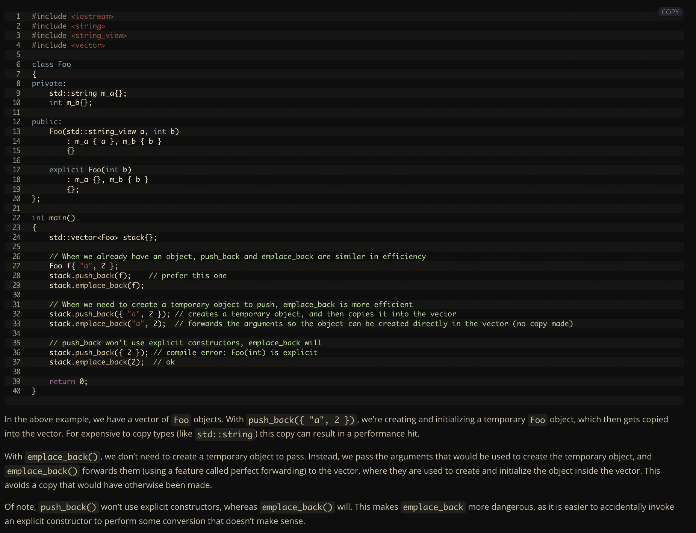

### reserve() 

The reserve() member function can be used to reallocate a std::vector without changing the current length.

## std::vector<bool>

std::vector<bool> is a specialization of std::vector that is optimized for space efficiency. Instead of storing each boolean value as a separate byte, std::vector<bool> uses a bitset-like structure to pack multiple boolean values into a single byte. This allows std::vector<bool> to use significantly less memory than a regular std::vector<bool> would.

However, this optimization comes with some trade-offs. Because std::vector<bool> does not store each boolean value as a separate byte, it cannot provide direct access to individual boolean values. Instead, it provides a proxy object that allows we to read and write boolean values as if they were stored in a regular std::vector<bool>, but under the hood, it is actually manipulating bits within a byte.

```cpp

#include <iostream>
#include <vector>

int main()
{
    std::vector<bool> v { true, false, false, true, true };

    for (int i : v)
        std::cout << i << ' ';
    std::cout << '\n';

    // Change the Boolean value with index 4 to false
    v[4] = false;

    for (int i : v)
        std::cout << i << ' ';
    std::cout << '\n';

    return 0;
}
```

# Chapter 17: Fixed-size arrays: std::array and C-style arrays

Fixed-size arrays (also called fixed-length arrays) require that the length of the array be known at the point of instantiation, and that length cannot be changed afterward. C-style arrays and std::array are both fixed-size arrays.

Why we require fixed-size arrays?
1. Fixed-size arrays can be more efficient than dynamic arrays (like std::vector) because they do not require dynamic memory allocation, which can be expensive in terms of performance. The size of a fixed-size array is determined at compile time, which allows for better optimization by the compiler.
2. Use std::array for constexpr arrays, and std::vector for non-constexpr arrays.

## Defining a std::array

```cpp
#include <array>  // for std::array
#include <vector> // for std::vector

int main()
{
    std::array<int, 5> a {};  // a std::array of 5 ints

    std::vector<int> b(5);    // a std::vector of 5 ints (for comparison)

    return 0;
}
```

Note: The length of a std::array must be a constant expression.

```cpp
#include <array>

int main()
{
    std::array<int, 7> a {}; // Using a literal constant

    constexpr int len { 8 };
    std::array<int, len> b {}; // Using a constexpr variable

    enum Colors
    {
         red,
         green,
         blue,
         max_colors
    };

    std::array<int, max_colors> c {}; // Using an enumerator

#define DAYS_PER_WEEK 7
    std::array<int, DAYS_PER_WEEK> d {}; // Using a macro (don't do this, use a constexpr variable instead)

    return 0;
}
```

## Class template argument deduction (CTAD) for std::array C++17

```cpp
#include <array>
#include <iostream>

int main()
{
    constexpr std::array a1 { 9, 7, 5, 3, 1 }; // The type is deduced to std::array<int, 5>
    constexpr std::array a2 { 9.7, 7.31 };     // The type is deduced to std::array<double, 2>

    return 0;
}
```
Note:
std::get() does compile-time bounds checking for constexpr indices.

```cpp
#include <array>
#include <iostream>

int main()
{
    constexpr std::array prime{ 2, 3, 5, 7, 11 };

    std::cout << std::get<3>(prime); // print the value of element with index 3
    std::cout << std::get<9>(prime); // invalid index (compile error)

    return 0;
}
```

## Using function templates to pass std::array of different element types or lengths

```cpp
#include <array>
#include <iostream>

template <typename T, std::size_t N> // note that this template parameter declaration matches the one for std::array
void passByRef(const std::array<T, N>& arr)
{
    static_assert(N != 0); // fail if this is a zero-length std::array

    std::cout << arr[0] << '\n';
}

int main()
{
    std::array arr{ 9, 7, 5, 3, 1 }; // use CTAD to infer std::array<int, 5>
    passByRef(arr);  // ok: compiler will instantiate passByRef(const std::array<int, 5>& arr)

    std::array arr2{ 1, 2, 3, 4, 5, 6 }; // use CTAD to infer std::array<int, 6>
    passByRef(arr2); // ok: compiler will instantiate passByRef(const std::array<int, 6>& arr)

    std::array arr3{ 1.2, 3.4, 5.6, 7.8, 9.9 }; // use CTAD to infer std::array<double, 5>
    passByRef(arr3); // ok: compiler will instantiate passByRef(const std::array<double, 5>& arr)

    return 0;
}
```

## Auto non-type template parameters C++20

```cpp
#include <array>
#include <iostream>

template <typename T, auto N> // now using auto to deduce type of N
void passByRef(const std::array<T, N>& arr)
{
    static_assert(N != 0); // fail if this is a zero-length std::array

    std::cout << std::get<3>(arr) << '\n'; // checks that index 3 is valid at compile-time
}


int main()
{
    std::array arr{ 9, 7, 5, 3, 1 }; // use CTAD to infer std::array<int, 5>
    passByRef(arr);  // ok: compiler will instantiate passByRef(const std::array<int, 5>& arr)

    std::array arr2{ 1, 2, 3, 4, 5, 6 }; // use CTAD to infer std::array<int, 6>
    passByRef(arr2); // ok: compiler will instantiate passByRef(const std::array<int, 6>& arr)

    std::array arr3{ 1.2, 3.4, 5.6, 7.8, 9.9 }; // use CTAD to infer std::array<double, 5>
    passByRef(arr3); // ok: compiler will instantiate passByRef(const std::array<double, 5>& arr)

    return 0;
}
```

## Returning a std::array via an out parameter

In cases where return by value is too expensive, we can use an out-parameter instead. In this case, the caller is responsible for passing in the std::array by non-const reference (or by address), and the function can then modify this array.

```cpp
#include <array>
#include <limits>
#include <iostream>

template <typename T, std::size_t N>
void inputArray(std::array<T, N>& arr) // pass by non-const reference
{
	std::size_t index { 0 };
	while (index < N)
	{
		std::cout << "Enter value #" << index << ": ";
		std::cin >> arr[index];

		if (!std::cin) // handle bad input
		{
			std::cin.clear();
			std::cin.ignore(std::numeric_limits<std::streamsize>::max(), '\n');
			continue;
		}
		++index;
	}

}

int main()
{
	std::array<int, 5> arr {};
	inputArray(arr);

	std::cout << "The value of element 2 is " << arr[2] << '\n';

	return 0;
}
```
Note: // Doesn't work
constexpr std::array<House, 3> houses { // initializer for houses
    { 13, 1, 7 }, // initializer for C-style array member with implementation_defined_name
    { 14, 2, 5 }, // ?
    { 15, 2, 4 }  // ?
};

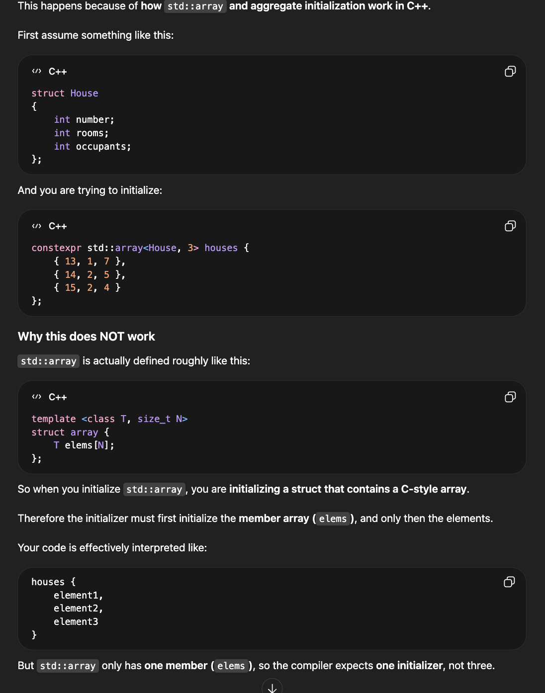

Correct way:

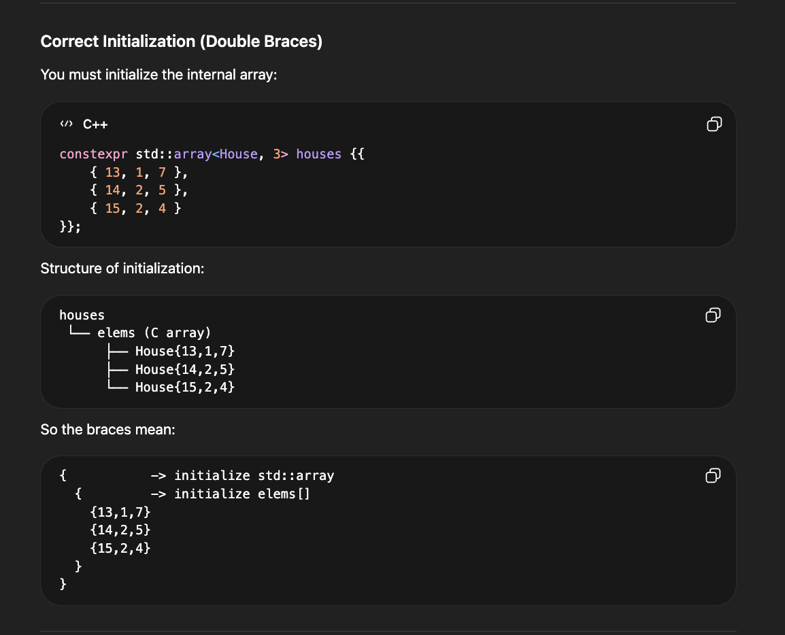

## Arrays of references via std::reference_wrapper

Arrays can have elements of any object type. This includes objects with fundamental types (e.g. int) and objects with compound types (e.g. pointer to int).

However, because references are not objects, we cannot make an array of references. The elements of an array must also be assignable, and references can’t be reseated.

```cpp
#include <array>
#include <iostream>

int main()
{
    int x { 1 };
    int y { 2 };

    [[maybe_unused]] std::array<int&, 2> refarr { x, y }; // compile error: cannot define array of references

    int& ref1 { x };
    int& ref2 { y };
    [[maybe_unused]] std::array valarr { ref1, ref2 }; // ok: this is actually a std::array<int, 2>, not an array of references

    return 0;
}
```

std::reference_wrapper is a standard library class template that lives in the <functional> header. It takes a type template argument T, and then behaves like a modifiable lvalue reference to T.

Note: 
There are a few things worth noting about std::reference_wrapper:

* Operator= will reseat a std::reference_wrapper (change which object is being referenced).
* std::reference_wrapper<T> will implicitly convert to T&.
* The get() member function can be used to get a T&. This is useful when we want to update the value of the object being referenced.

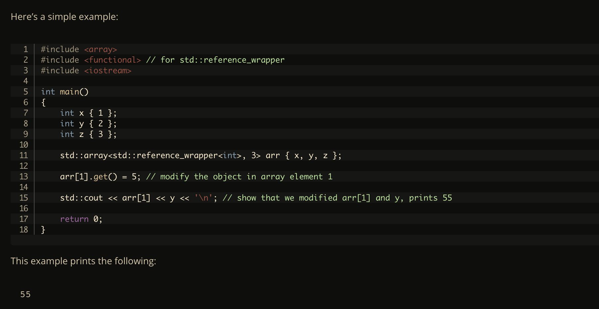

## C-style arrays

* Declaring a C-style array

```cpp
int main()
{
    int testScore[30] {};      // Defines a C-style array named testScore that contains 30 value-initialized int elements (no include required)

    //  std::array<int, 30> arr{}; // For comparison, here's a std::array of 30 value-initialized int elements (requires #including <array>)

    return 0;
}
```

Note: The length of a C-style array must be a constant expression.

Note: Zero-length C-style arrays are not allowed in standard C++. However, some compilers may allow them as an extension. If we need a zero-length array, we can use a std::array with a length of zero instead.

```cpp
int main()
{
    int bad[] {}; // error: the compiler will deduce this to be a zero-length array, which is disallowed!

    return 0;
}
```

### Getting the length of a C-style array

In C++17, we can use std::size() (defined in the <iterator> header), which returns the array length as an unsigned integral value (of type std::size_t). In C++20, we can also use std::ssize(), which returns the array length as a signed integral value (of a large signed integral type, probably std::ptrdiff_t).

```cpp
#include <iostream>
#include <iterator> // for std::size and std::ssize

int main()
{
    const int prime[] { 2, 3, 5, 7, 11 };   // the compiler will deduce prime to have length 5

    std::cout << std::size(prime) << '\n';  // C++17, returns unsigned integral value 5
    std::cout << std::ssize(prime) << '\n'; // C++20, returns signed integral value 5

    return 0;
}
```

### Copying a C-style array

```cpp
#include <algorithm> // for std::copy

int main()
{
    int arr[] { 1, 2, 3 };
    int src[] { 5, 6, 7 };

    // Copy src into arr
    std::copy(std::begin(src), std::end(src), std::begin(arr));

    return 0;
}
```

### Array decay and pointer arithmetic

When we use the name of a C-style array in an expression, it decays to a pointer to the first element of the array. This means that if we have an array int arr[5], then arr will decay to a pointer of type int* that points to the first element of the array (arr[0]).

Also, const int arr[5] will decay to const int* (not int*), which is a pointer to a const int. This means that we cannot modify the elements of the array through this pointer.


### Pointer arithmetic can be used to traverse an array

```cpp
#include <iostream>

int main()
{
	constexpr int arr[]{ 9, 7, 5, 3, 1 };

	const int* begin{ arr };                // begin points to start element
	const int* end{ arr + std::size(arr) }; // end points to one-past-the-end element

	for (; begin != end; ++begin)           // iterate from begin up to (but excluding) end
	{
		std::cout << *begin << ' ';     // dereference our loop variable to get the current element
	}

	return 0;
}
```

## C-style strings

### Defining C-style strings

```cpp
char str1[8]{};                    // an array of 8 char, indices 0 through 7

const char str2[]{ "string" };     // an array of 7 char, indices 0 through 6
constexpr char str3[] { "hello" }; // an array of 6 const char, indices 0 through 5
```
Remember that we need an extra character for the implicit null terminator.

### Outputting a C-style string

```cpp
#include <iostream>

void print(char ptr[])
{
    std::cout << ptr << '\n'; // output string
}

int main()
{
    char str[]{ "string" };
    std::cout << str << '\n'; // outputs string

    print(str);

    return 0;
}
```

## Modifying C-style strings

One important point to note is that C-style strings follow the same rules as C-style arrays. This means we can initialize the string upon creation, but we can not assign values to it using the assignment operator after that!

```cpp
char str[]{ "string" }; // ok
str = "rope";           // not ok!
```

Since C-style strings are arrays, we can use the [] operator to change individual characters in the string:

```cpp
#include <iostream>

int main()
{
    char str[]{ "string" };
    std::cout << str << '\n';
    str[1] = 'p';
    std::cout << str << '\n';

    return 0;
}
```

### Getting the length of an C-style string

Because C-style strings are C-style arrays, we can use std::size() (or in C++20, std::ssize()) to get the length of the string as an array. There are two caveats here:

* This doesn’t work on decayed st ngs.
* Returns the actual length of the C-style array, not the length of the string.

```cpp
#include <iostream>

int main()
{
    char str[255]{ "string" }; // 6 characters + null terminator
    std::cout << "length = " << std::size(str) << '\n'; // prints length = 255

    char *ptr { str };
    std::cout << "length = " << std::size(ptr) << '\n'; // compile error

    return 0;
}
```

Alternatively, we can use the std::strlen() function (defined in the <cstring> header) to get the length of a C-style string. This function returns the number of characters in the string before the null terminator.

```cpp
#include <cstring> // for std::strlen
#include <iostream>

int main()
{
    char str[255]{ "string" }; // 6 characters + null terminator
    std::cout << "length = " << std::strlen(str) << '\n'; // prints length = 6

    char *ptr { str };
    std::cout << "length = " << std::strlen(ptr) << '\n';   // prints length = 6

    return 0;
}
```

## Std:: string Implementation of C-style strings

```cpp
#include <iostream>
#include <cstring>

class MyString {
private:
    char* data;
    size_t length;

public:
    // 🔹 Default constructor
    MyString() : data(nullptr), length(0) {}

    // 🔹 Constructor from C-string
    MyString(const char* str) {
        if (str) {
            length = std::strlen(str);
            data = new char[length + 1]; // +1 for '\0'
            std::strcpy(data, str);
        } else {
            data = nullptr;
            length = 0;
        }
    }

    // 🔹 Copy constructor (deep copy)
    MyString(const MyString& other) {
        length = other.length;
        if (other.data) {
            data = new char[length + 1];
            std::strcpy(data, other.data);
        } else {
            data = nullptr;
        }
    }

    // 🔹 Copy assignment
    MyString& operator=(const MyString& other) {
        if (this == &other)
            return *this;

        delete[] data;

        length = other.length;
        if (other.data) {
            data = new char[length + 1];
            std::strcpy(data, other.data);
        } else {
            data = nullptr;
        }

        return *this;
    }

    // 🔹 Move constructor
    MyString(MyString&& other) noexcept {
        data = other.data;
        length = other.length;

        other.data = nullptr;
        other.length = 0;
    }

    // 🔹 Move assignment
    MyString& operator=(MyString&& other) noexcept {
        if (this == &other)
            return *this;

        delete[] data;

        data = other.data;
        length = other.length;

        other.data = nullptr;
        other.length = 0;

        return *this;
    }

    // 🔹 Destructor
    ~MyString() {
        delete[] data;
    }

    // 🔹 size()
    size_t size() const {
        return length;
    }

    // 🔹 operator[]
    char& operator[](size_t index) {
        return data[index];
    }

    const char& operator[](size_t index) const {
        return data[index];
    }

    // 🔹 c_str()
    const char* c_str() const {
        return data;
    }
};
```
## 2d arrays

### Iterating over a 2d array 

```cpp
#include <iostream>

int main()
{
    int arr[3][4] {
        { 1, 2, 3, 4 },
        { 5, 6, 7, 8 },
        { 9, 10, 11, 12 }};

    // double for-loop with indices
    for (std::size_t row{0}; row < std::size(arr); ++row) // std::size(arr) returns the number of rows
    {
        for (std::size_t col{0}; col < std::size(arr[0]); ++col) // std::size(arr[0]) returns the number of columns
            std::cout << arr[row][col] << ' ';

        std::cout << '\n';
    }

    // double range-based for-loop
    for (const auto& arow: arr)   // get each array row
    {
        for (const auto& e: arow) // get each element of the row
            std::cout << e << ' ';

        std::cout << '\n';
    }

    return 0;
}
```

## Multidimensional arrays ussing std::array

```cpp
std::array<std::array<int, 4>, 3> arr {{  // note double braces
    { 1, 2, 3, 4 },
    { 5, 6, 7, 8 },
    { 9, 10, 11, 12 }}};
```

Note: To avoid brace elision, we need to use double braces when initializing a multidimensional std::array. The outer braces are for the outer std::array, and the inner braces are for the inner std::array. This is necessary because of how C++ parses initializer lists.

### Passing a multidimensional std::array to a function template

```cpp
#include <array>
#include <iostream>

template <typename T, std::size_t Row, std::size_t Col>
void printArray(const std::array<std::array<T, Col>, Row> &arr)
{
    for (const auto& arow: arr)   // get each array row
    {
        for (const auto& e: arow) // get each element of the row
            std::cout << e << ' ';

        std::cout << '\n';
    }
}

int main()
{
    std::array<std::array<int, 4>, 3>  arr {{
        { 1, 2, 3, 4 },
        { 5, 6, 7, 8 },
        { 9, 10, 11, 12 }}};

    printArray(arr);

    return 0;
}
```

# Chapter 18: Iterators and Algorithms

## Iterators: An iterator is an object designed to traverse through a container (e.g. the values in an array, or the characters in a string), providing access to each element along the way.

* Pointers as an iterator:-

```cpp
#include <array>
#include <iostream>

int main()
{
    std::array arr{ 0, 1, 2, 3, 4, 5, 6 };

    auto begin{ &arr[0] };
    // note that this points to one spot beyond the last element
    auto end{ begin + std::size(arr) };

    // for-loop with pointer
    for (auto ptr{ begin }; ptr != end; ++ptr) // ++ to move to next element
    {
        std::cout << *ptr << ' '; // Indirection to get value of current element
    }
    std::cout << '\n';

    return 0;
}
```

* Standard library iterators
```cpp

Iterating is such a common operation that all standard library containers offer direct support for iteration. Instead of calculating our own begin and end points, we can simply ask the container for the begin and end points via member functions conveniently named begin() and end():

#include <array>
#include <iostream>

int main()
{
    std::array array{ 1, 2, 3 };

    // Ask our array for the begin and end points (via the begin and end member functions).
    auto begin{ array.begin() };
    auto end{ array.end() };

    for (auto p{ begin }; p != end; ++p) // ++ to move to next element.
    {
        std::cout << *p << ' '; // Indirection to get value of current element.
    }
    std::cout << '\n';

    return 0;
}
```

## Introduction to standard library algorithms

### std::find() to find an element by value

std::find searches for the first occurrence of a value in a container. std::find takes 3 parameters: an iterator to the starting element in the sequence, an iterator to the ending element in the sequence, and a value to search for. It returns an iterator pointing to the element (if it is found) or the end of the container (if the element is not found).

```cpp
#include <algorithm>
#include <array>
#include <iostream>

int main()
{
    std::array arr{ 13, 90, 99, 5, 40, 80 };

    std::cout << "Enter a value to search for and replace with: ";
    int search{};
    int replace{};
    std::cin >> search >> replace;

    // Input validation omitted

    // std::find returns an iterator pointing to the found element (or the end of the container)
    // we'll store it in a variable, using type inference to deduce the type of
    // the iterator (since we don't care)
    auto found{ std::find(arr.begin(), arr.end(), search) };

    // Algorithms that don't find what they were looking for return the end iterator.
    // We can access it by using the end() member function.
    if (found == arr.end())
    {
        std::cout << "Could not find " << search << '\n';
    }
    else
    {
        // Override the found element.
        *found = replace;
    }

    for (int i : arr)
    {
        std::cout << i << ' ';
    }

    std::cout << '\n';

    return 0;
}
```

### Using std::find_if to find an element that matches some condition

The std::find_if function works similarly to std::find, but instead of passing in a specific value to search for, we pass in a callable object, such as a function pointer (or a lambda, which we’ll cover later). For each element being iterated over, std::find_if will call this function (passing the element as an argument to the function), and the function can return true if a match is found, or false otherwise.

```cpp
#include <algorithm>
#include <array>
#include <iostream>
#include <string_view>

// Our function will return true if the element matches
bool containsNut(std::string_view str)
{
    // std::string_view::find returns std::string_view::npos if it doesn't find
    // the substring. Otherwise it returns the index where the substring occurs
    // in str.
    return str.find("nut") != std::string_view::npos;
}

int main()
{
    std::array<std::string_view, 4> arr{ "apple", "banana", "walnut", "lemon" };

    // Scan our array to see if any elements contain the "nut" substring
    auto found{ std::find_if(arr.begin(), arr.end(), containsNut) };

    if (found == arr.end())
    {
        std::cout << "No nuts\n";
    }
    else
    {
        std::cout << "Found " << *found << '\n';
    }

    return 0;
}
```

### Using std::count and std::count_if to count how many occurrences there are

std::count and std::count_if search for all occurrences of an element or an element fulfilling a condition.

```cpp
#include <algorithm>
#include <array>
#include <iostream>
#include <string_view>

bool containsNut(std::string_view str)
{
	return str.find("nut") != std::string_view::npos;
}

int main()
{
	std::array<std::string_view, 5> arr{ "apple", "banana", "walnut", "lemon", "peanut" };

	auto nuts{ std::count_if(arr.begin(), arr.end(), containsNut) };

	std::cout << "Counted " << nuts << " nut(s)\n";

	return 0;
}
```

### Using std::sort to custom sort

We previously used std::sort to sort an array in ascending order, but std::sort can do more than that. There’s a version of std::sort that takes a function as its third parameter that allows us to sort however we like. The function takes two parameters to compare, and returns true if the first argument should be ordered before the second. By default, std::sort sorts the elements in ascending order.

```cpp
#include <algorithm>
#include <array>
#include <iostream>

bool greater(int a, int b)
{
    // Order @a before @b if @a is greater than @b.
    return (a > b);
}

int main()
{
    std::array arr{ 13, 90, 99, 5, 40, 80 };

    // Pass greater to std::sort
    std::sort(arr.begin(), arr.end(), greater);

    for (int i : arr)
    {
        std::cout << i << ' ';
    }

    std::cout << '\n';

    return 0;
}
```

Note:

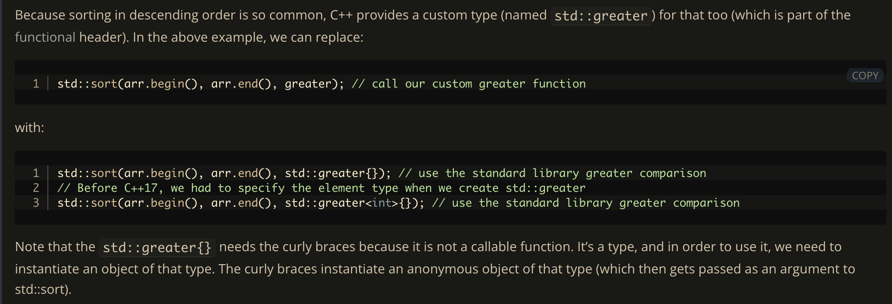

### Ranges in C++20

Having to explicitly pass arr.begin() and arr.end() to every algorithm is a bit annoying. But fear not -- C++20 adds ranges, which allow us to simply pass arr. This will make our code even shorter and more readable.

```cpp
#include <algorithm>
#include <array>
#include <iostream>

int main()
{
    std::array arr{ 13, 90, 99, 5, 40, 80 };

    // Pass arr to std::sort
    std::sort(arr);

    for (int i : arr)
    {
        std::cout << i << ' ';
    }

    std::cout << '\n';

    return 0;
}
```

Note: Not all algorithms support ranges yet, but more and more are being added with each new C++ standard.

## Timing our code

sometimes you’ll run across cases where you’re not sure whether one method or another will be more performant. So how do we tell?

One easy way is to time our code to see how long it takes to run. C++11 comes with some functionality in the chrono library to do just that. However, using the chrono library is a bit arcane. The good news is that we can easily encapsulate all the timing functionality we need into a class that we can then use in our own programs.

```cpp
#include <chrono> // for std::chrono functions

class Timer
{
private:
	// Type aliases to make accessing nested type easier
	using Clock = std::chrono::steady_clock;
	using Second = std::chrono::duration<double, std::ratio<1> >;

	std::chrono::time_point<Clock> m_beg { Clock::now() };

public:
	void reset()
	{
		m_beg = Clock::now();
	}

	double elapsed() const
	{
		return std::chrono::duration_cast<Second>(Clock::now() - m_beg).count();
	}
};

Usage:

#include <array>
#include <chrono> // for std::chrono functions
#include <cstddef> // for std::size_t
#include <iostream>
#include <numeric> // for std::iota

const int g_arrayElements { 10000 };

class Timer
{
private:
    // Type aliases to make accessing nested type easier
    using Clock = std::chrono::steady_clock;
    using Second = std::chrono::duration<double, std::ratio<1> >;

    std::chrono::time_point<Clock> m_beg{ Clock::now() };

public:

    void reset()
    {
        m_beg = Clock::now();
    }

    double elapsed() const
    {
        return std::chrono::duration_cast<Second>(Clock::now() - m_beg).count();
    }
};

void sortArray(std::array<int, g_arrayElements>& array)
{

    // Step through each element of the array
    // (except the last one, which will already be sorted by the time we get there)
    for (std::size_t startIndex{ 0 }; startIndex < (g_arrayElements - 1); ++startIndex)
    {
        // smallestIndex is the index of the smallest element we’ve encountered this iteration
        // Start by assuming the smallest element is the first element of this iteration
        std::size_t smallestIndex{ startIndex };

        // Then look for a smaller element in the rest of the array
        for (std::size_t currentIndex{ startIndex + 1 }; currentIndex < g_arrayElements; ++currentIndex)
        {
            // If we've found an element that is smaller than our previously found smallest
            if (array[currentIndex] < array[smallestIndex])
            {
                // then keep track of it
                smallestIndex = currentIndex;
            }
        }

        // smallestIndex is now the smallest element in the remaining array
        // swap our start element with our smallest element (this sorts it into the correct place)
        std::swap(array[startIndex], array[smallestIndex]);
    }
}

int main()
{
    std::array<int, g_arrayElements> array;
    std::iota(array.rbegin(), array.rend(), 1); // fill the array with values 10000 to 1

    Timer t;

    sortArray(array);

    std::cout << "Time taken: " << t.elapsed() << " seconds\n";

    return 0;
}
```

# Chapter 19: Dynamic memory allocation with new and delete

## Dynamically allocating single variables

```cpp
new int; // dynamically allocate an integer (and discard the result)
int* ptr{ new int }; // dynamically allocate an integer and assign the address to ptr so we can access it later
```
In the above case, we’re requesting an integer’s worth of memory from the operating system. The new operator creates the object using that memory, and then returns a pointer containing the address of the memory that has been allocated.

### How does dynamic memory allocation work?

When we dynamically allocate memory, you’re asking the operating system to reserve some of that memory for our program’s use. If it can fulfill this request, it will return the address of that memory to our application. From that point forward, our application can use this memory as it wishes. When our application is done with the memory, it can return the memory back to the operating system to be given to another program.

### Initializing a dynamically allocated variable

```cpp
int* ptr1{ new int (5) }; // use direct initialization
int* ptr2{ new int { 6 } }; // use uniform initialization`
```

### Deleting a single variable

```cpp
// assume ptr has previously been allocated with operator new
delete ptr; // return the memory pointed to by ptr to the operating system
ptr = nullptr; // set ptr to be a null pointer
```

Note: After we delete a pointer, it becomes a dangling pointer, which is a pointer that points to memory that has been deallocated. Accessing a dangling pointer results in undefined behavior. To avoid this, we can set the pointer to nullptr after deleting it.

### What does it mean to delete memory?

The delete operator does not actually delete anything. It simply returns the memory being pointed to back to the operating system. The operating system is then free to reassign that memory to another application (or to this application again later).

### Dangling pointers

C++ does not make any guarantees about what will happen to the contents of deallocated memory, or to the value of the pointer being deleted. In most cases, the memory returned to the operating system will contain the same values it had before it was returned, and the pointer will be left pointing to the now deallocated memory.

A pointer that is pointing to deallocated memory is called a dangling pointer. Dereferencing or deleting a dangling pointer will lead to undefined behavior. Consider the following program:

```cpp
#include <iostream>

int main()
{
    int* ptr{ new int }; // dynamically allocate an integer
    *ptr = 7; // put a value in that memory location

    delete ptr; // return the memory to the operating system.  ptr is now a dangling pointer.

    std::cout << *ptr; // Dereferencing a dangling pointer will cause undefined behavior
    delete ptr; // trying to deallocate the memory again will also lead to undefined behavior.

    return 0;
}
```

Note: Operator new can fail to allocate memory, in which case it will throw a std::bad_alloc exception. If this exception isn’t properly handled (and it won’t be, since we haven’t covered exceptions or exception handling yet), the program will simply terminate (crash) with an unhandled exception error. 

In many cases, having new throw an exception (or having our program crash) is undesirable, so there’s an alternate form of new that can be used instead to tell new to return a null pointer if memory can’t be allocated. This is done by adding the constant std::nothrow between the new keyword and the allocation type:

```cpp
#include <new> // for std::nothrow

int main()
{
    int* ptr{ new (std::nothrow) int }; // dynamically allocate an integer, but return nullptr if allocation fails

    if (ptr == nullptr)
    {
        std::cout << "Memory allocation failed\n";
    }
    else
    {
        *ptr = 7; // put a value in that memory location
        std::cout << *ptr << '\n';
        delete ptr; // return the memory to the operating system
    }

    return 0;
}
```

### Memory leaks

Memory leaks happen when our program loses the address of some bit of dynamically allocated memory before giving it back to the operating system. When this happens, our program can’t delete the dynamically allocated memory, because it no longer knows where it is. The operating system also can’t use this memory, because that memory is considered to be still in use by our program.

## Dynamically allocating arrays

```cpp
#include <cstddef>
#include <iostream>

int main()
{
    std::cout << "Enter a positive integer: ";
    std::size_t length{};
    std::cin >> length;

    int* array{ new int[length]{} }; // use array new.  Note that length does not need to be constant!

    std::cout << "I just allocated an array of integers of length " << length << '\n';

    array[0] = 5; // set element 0 to value 5

    delete[] array; // use array delete to deallocate array

    // we don't need to set array to nullptr/0 here because it's going out of scope immediately after this anyway

    return 0;
}
```

We are allocating an array, C++ knows that it should use the array version of new instead of the scalar version of new. Essentially, the new[] operator is called, even though the [] isn’t placed next to the new keyword.

Note: The length of dynamically allocated arrays has type std::size_t. If we are using a non-constexpr int, you’ll need to static_cast to std::size_t since that is considered a narrowing conversion and our compiler will warn otherwise.

### Dynamically deleting arrays

When deleting a dynamically allocated array, we have to use the array version of delete, which is delete[].

How does array delete know how much memory to delete?

When we use new[] to allocate an array, the implementation typically allocates a little extra memory to store the size of the array. This allows delete[] to know how many elements to destroy and how much memory to deallocate when we call it.

### Initializing dynamically allocated arrays

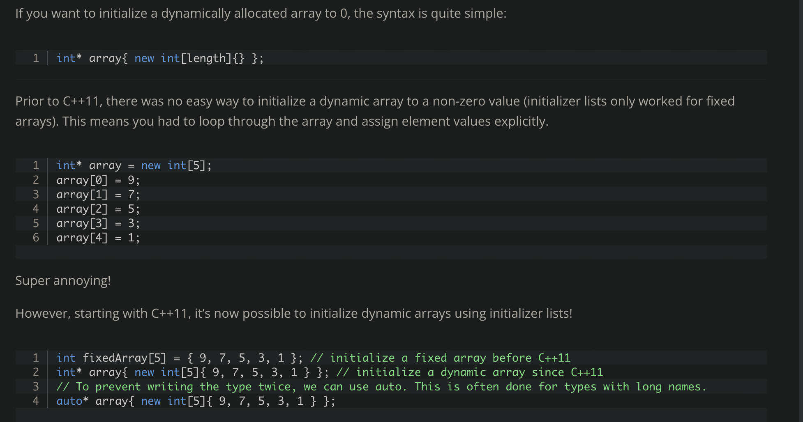


##  Destructors

A destructor is another special kind of class member function that is executed when an object of that class is destroyed. Whereas constructors are designed to initialize a class, destructors are designed to help clean up.

When an object goes out of scope normally, or a dynamically allocated object is explicitly deleted using the delete keyword, the class destructor is automatically called (if it exists) to do any necessary clean up before the object is removed from memory.

### Destructor naming

    The destructor must have the same name as the class, preceded by a tilde (~).
    The destructor can not take arguments.
    The destructor has no return type.

```cpp

#include <iostream>

class MyIntArray{
private:
    int *m_Array{};
    std::size_t m_length{};

public:
    MyIntArray(int length){
        assert(length > 0); // make sure length is valid
        m_Array = new int[static_cast<std::size_t>(length)]{}; // allocate an array of ints
        m_length = static_cast<std::size_t>(length);
       std:: cout << "Constructor called for array of length " << length << '\n';
    }

    ~MyIntArray() // destructor
    {
        std::cout << "Destructor called for array of length " << m_length << '\n';
        delete[] m_Array; // deallocate the array
    }

    // other member functions omitted for brevity
    void setValue(std::size_t index, int value)
    {
        assert(index < m_length); // make sure index is valid
        m_Array[index] = value;
    }

    int getValue(std::size_t index) const
    {
        assert(index < m_length); // make sure index is valid
        return m_Array[index];
    }

    int getLength() const
    {
        return static_cast<int>(m_length);
    }
}

int main(){
    // MyIntArray arr variable created on stack, but it dynamically allocates an array of integers on the heap
    MyIntArray arr{5}; // create an array of 5 integers

    for( int i = 0; i < arr.getLength(); ++i){
        arr.setValue(i, i + 1); // set values to 1, 2, 3, 4, 5
    }

    for( int i = 0; i < arr.getLength(); ++i){
        std::cout << arr.getValue(i) << ' '; // print the values
    }

    // To create a MyIntArray on the heap, we can use new:
    MyIntArray* ptrArr{ new MyIntArray{10} }; // create an array of 10 integers on the heap
    std::cout << ptrArr->getLength() << '\n'; // print the length of the array>

    delete ptrArr; // delete the array on the heap (this will call the destructor to clean up the dynamically allocated array)
}
```
## RAII : Resource Acquisition Is Initialization

RAII is a programming technique that binds the lifecycle of a resource (e.g. dynamically allocated memory, file handles, network connections) to the lifetime of an object. This means that when an object is created, it acquires the resource, and when the object is destroyed (e.g. goes out of scope or is deleted), it releases the resource.

A resource (such as memory, a file or database handle, etc…) is typically acquired in the object’s constructor (though it can be acquired after the object is created if that makes sense). That resource can then be used while the object is alive. The resource is released in the destructor, when the object is destroyed. The primary advantage of RAII is that it helps prevent resource leaks (e.g. memory not being deallocated) as all resource-holding objects are cleaned up automatically.

## Pointers to pointers and dynamic multidimensional arrays

A pointer to a pointer to an int is declared using two asterisks:

```cpp
int** ptr;
```

```cpp
int value { 5 };

int* ptr { &value };
std::cout << *ptr << '\n'; // Dereference pointer to int to get int value

int** ptrptr { &ptr };
std::cout << **ptrptr << '\n'; // dereference to get pointer to int, dereference again to get int value
```

### Arrays of pointers

Pointers to pointers have a few uses. The most common use is to dynamically allocate an array of pointers:

```cpp
int** array { new int*[10] }; // allocate an array of 10 int pointers
```

* Two-dimensional dynamically allocated arrays

```cpp
int** array { new int[10][5] }; // won’t work!
```

❌ What’s Wrong?
👉 new int[10][5] does NOT return int** it will return 
```cpp
int (*)[5]   // pointer to an array of 5 ints
```

We shoudld do : 

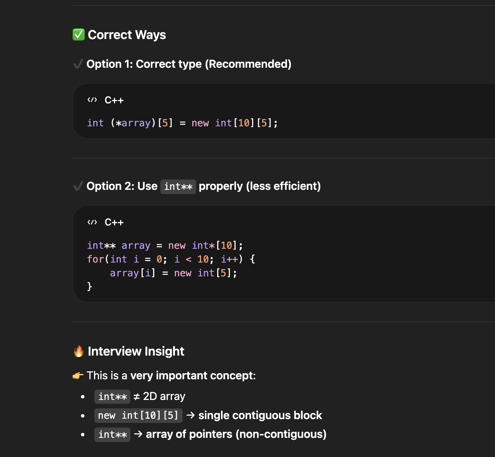

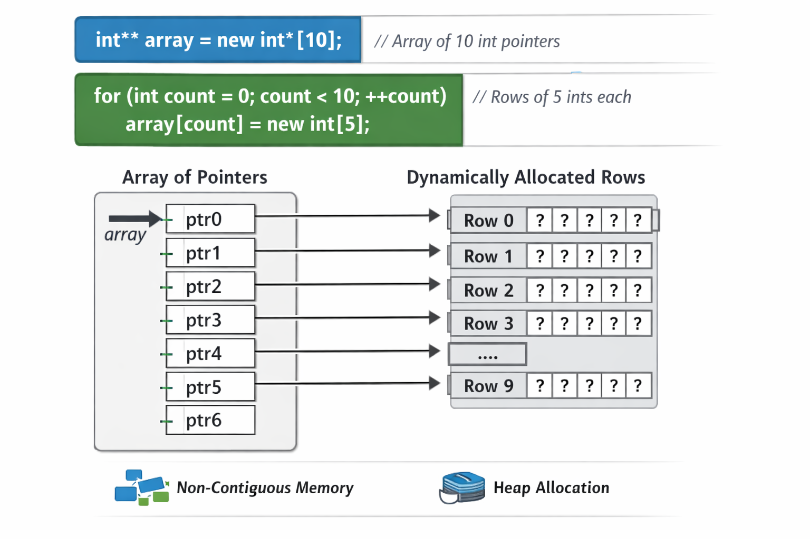

* Deleting a dynamically allocated 2d array

```cpp
for (int count { 0 }; count < 10; ++count)
    delete[] array[count];
delete[] array; // this needs to be done last
```

Or modern C++ way:

```cpp
vector<vector<int>> arr(10, vector<int>(5));
```

## Void pointers

The void pointer, also known as the generic pointer, is a special type of pointer that can be pointed at objects of any data type! A void pointer is declared like a normal pointer, using the void keyword as the pointer’s type:

```cpp

int nValue {};
float fValue {};

struct Something
{
    int n;
    float f;
};

Something sValue {};

void* ptr {};
ptr = &nValue; // valid
ptr = &fValue; // valid
ptr = &sValue; // valid

```

However, because the void pointer does not know what type of object it is pointing to, dereferencing a void pointer is illegal. Instead, the void pointer must first be cast to another pointer type before the dereference can be performed.

```cpp
int value{ 5 };
void* voidPtr{ &value };

// std::cout << *voidPtr << '\n'; // illegal: dereference of void pointer

int* intPtr{ static_cast<int*>(voidPtr) }; // however, if we cast our void pointer to an int pointer... why static_cast? Because we know that voidPtr is actually pointing to an int, so we can safely use static_cast to cast it to an int pointer. If we were unsure of the type of object being pointed to, we would need to use dynamic_cast instead, which performs a runtime check to ensure that the cast is valid.

std::cout << *intPtr << '\n'; // then we can dereference the result
```

# Chapter 20: Functions

## Function Pointers

Function pointers are similar, except that instead of pointing to variables, they point to functions!

```cpp
int foo() // code for foo starts at memory address 0x002717f0
{
    return 5;
}

int main()
{
    foo(); // jump to address 0x002717f0
    cout<< foo << '\n'; // it will print true
    return 0;
}
```

Note: When a function is referred to by name (without parenthesis), C++ converts the function into a function pointer (holding the address of the function). Then operator<< tries to print the function pointer, which it fails at because operator<< does not know how to print function pointers. The standard says that in this case, foo should be converted to a bool (which operator<< does know how to print). And since the function pointer for foo is a non-null pointer, it should always evaluate to Boolean true. Thus, this should print:

### Pointers to functions

```cpp
// fcnPtr is a pointer to a function that takes no arguments and returns an integer
int (*fcnPtr)();
```

to make it const,
```cpp
int (*const fcnPtr)();
```

### Assigning a function to a function pointer

```cpp
int foo()
{
    return 5;
}

int goo()
{
    return 6;
}

int main()
{
    int (*fcnPtr)(){ &foo }; // fcnPtr points to function foo
    fcnPtr = &goo; // fcnPtr now points to function goo

    return 0;
}
```

Note:
```cpp
// function prototypes
int foo();
double goo();
int hoo(int x);

// function pointer initializers
int (*fcnPtr1)(){ &foo };    // okay
int (*fcnPtr2)(){ &goo };    // wrong -- return types don't match!
double (*fcnPtr4)(){ &goo }; // okay
fcnPtr1 = &hoo;              // wrong -- fcnPtr1 has no parameters, but hoo() does
int (*fcnPtr3)(int){ &hoo }; // okay
```

### Calling a function using a function pointer

```cpp

int foo(int x)
{
    return x;
}

int main()
{
    int (*fcnPtr)(int){ &foo }; // Initialize fcnPtr with function foo
    (*fcnPtr)(5); // call function foo(5) through fcnPtr.
    // or  fcnPtr(5); // call function foo(5) through fcnPtr

    return 0;
}
```

### Passing functions as arguments to other functions

One of the most useful things to do with function pointers is pass a function as an argument to another function. Functions used as arguments to another function are sometimes called callback functions.

Consider a case where we are writing a function to perform a task (such as sorting an array), but we want the user to be able to define how a particular part of that task will be performed (such as whether the array is sorted in ascending or descending order). Let’s take a closer look at this problem as applied specifically to sorting, as an example that can be generalized to other similar problems.

```cpp

void selectionSort(int *array, int size){
    for( int startIndex = 0; startIndex < size - 1; ++startIndex){
        int smallestIndex = startIndex;
        // 5 4 3 2 1
        for( int currentIndex = startIndex + 1; currentIndex < size; ++currentIndex){
            if( array[currentIndex] < array[smallestIndex] ){
                smallestIndex = currentIndex;
            }
        }
        std::swap(array[startIndex], array[smallestIndex]);
    }
}
```

Now we want to allow the user to specify whether the array is sorted in ascending or descending order. We can do this by passing a function pointer to selectionSort that points to a function that compares two integers and returns true if the first integer should be ordered before the second integer, and false otherwise.

```cpp
#include <utility> // for std::swap
#include <iostream>

// Note our user-defined comparison is the third parameter
void selectionSort(int* array, int size, bool (*comparisonFcn)(int, int))
{
    if (!array || !comparisonFcn)
        return;

    // Step through each element of the array
    for (int startIndex{ 0 }; startIndex < (size - 1); ++startIndex)
    {
        // bestIndex is the index of the smallest/largest element we've encountered so far.
        int bestIndex{ startIndex };

        // Look for smallest/largest element remaining in the array (starting at startIndex+1)
        for (int currentIndex{ startIndex + 1 }; currentIndex < size; ++currentIndex)
        {
            // If the current element is smaller/larger than our previously found smallest
            if (comparisonFcn(array[bestIndex], array[currentIndex])) // COMPARISON DONE HERE
            {
                // This is the new smallest/largest number for this iteration
                bestIndex = currentIndex;
            }
        }

        // Swap our start element with our smallest/largest element
        std::swap(array[startIndex], array[bestIndex]);
    }
}

// Here is a comparison function that sorts in ascending order
// (Note: it's exactly the same as the previous ascending() function)
bool ascending(int x, int y)
{
    return x > y; // swap if the first element is greater than the second
}

// Here is a comparison function that sorts in descending order
bool descending(int x, int y)
{
    return x < y; // swap if the second element is greater than the first
}

// This function prints out the values in the array
void printArray(int* array, int size)
{
    if (!array)
        return;

    for (int index{ 0 }; index < size; ++index)
    {
        std::cout << array[index] << ' ';
    }

    std::cout << '\n';
}

int main()
{
    int array[9]{ 3, 7, 9, 5, 6, 1, 8, 2, 4 };

    // Sort the array in descending order using the descending() function
    selectionSort(array, 9, descending);
    printArray(array, 9);

    // Sort the array in ascending order using the ascending() function
    selectionSort(array, 9, ascending);
    printArray(array, 9);

    return 0;
}

```

Note: Providing default function :-

```cpp
// Default the sort to ascending sort
void selectionSort(int* array, int size, bool (*comparisonFcn)(int, int) = ascending);
```

### Using std::function instead of function pointers


An alternate method of defining and storing function pointers is to use std::function, which is part of the standard library <functional> header. To define a function pointer using this method, declare a std::function object like so:

```cpp

#include <functional>
bool validate(int x, int y, std::function<bool(int, int)> fcn); // std::function method that returns a bool and takes two int parameters
```

```cpp
#include <functional>
#include <iostream>

int foo()
{
    return 5;
}

int goo()
{
    return 6;
}

int main(){
    std::function<int()> fcnPtr{ foo }; // fcnPtr points to function foo
    fcnPtr = goo; // fcnPtr now points to function goo

    std::cout << fcnPtr() << '\n'; // call the function pointed to by fcnPtr and print the result , output will be 6 since fcnPtr now points to goo

    return 0;
}
```
## Command line arguments

When a C++ program is executed, the operating system passes some information to the program, including any command line arguments that were provided when the program was launched. Command line arguments are additional pieces of information that can be passed to a program when it is executed, and they can be used to modify the behavior of the program or provide input data.

```cpp

int main(int argc, char* argv[])

// or equivalently
int main(int argc, char** argv)
```

suppose our program is called myprogram, and we run it from the command line like this:

```
    myprogram arg1 arg2 arg3
```

In this case, argc will be equal to 4 (the number of command line arguments, including the program name), and argv will be an array of C-style strings (character arrays) that contains the following values:

```cpp

#include <iostream>

int main(int argc, char* argv[])
{
    std::cout << "Number of command line arguments: " << argc << '\n';

    for (int i = 0; i < argc; ++i)
    {
        std::cout << "Argument " << i << ": " << argv[i] << '\n';
    }

    return 0;
}
```

When we run this program with the command line arguments shown above, the output will be:

```
Number of command line arguments: 4
Argument 0: myprogram
Argument 1: arg1
Argument 2: arg2
Argument 3: arg3
```

## Lambda functions

### Lambdas are anonymous functions

A lambda expression (also called a lambda or closure) allows us to define an anonymous function inside another function.

* Syntax of a lambda expression

```cpp
[capatureclause](parameters) -> returntype { body }
```

Note:
* The capture clause can be empty if no captures are needed.
* The parameter list can be empty if no parameters are required. It can also be omitted * entirely unless a return type is specified.
* The return type is optional, and if omitted, auto will be assumed (thus using type * deduction used to determine the return type).


```cpp
#include <iostream>
#include <array>
#include <string_view>
#include <algorithm>

int main(){
    std::array<std::string_view, 4> arr{ "apple", "banana", "walnut", "apricot" };

    // Lambda to find if string contains "nut"
    auto found{
        std::find_if(arr.begin(), arr.end(), [](std::string_view str){
            // std::string_view::npos is returned by find if the substring is not found. Otherwise, it returns the index of the substring in str.
            return str.find("nut") != std::string_view::npos;
        })
    };

    if (found == arr.end())
    {
        std::cout << "No nuts\n";
    }
    else
    {
        std::cout << "Found " << *found << '\n';
    }

}
```

### Type of a lambda

1. Named lambdas: If we assign a lambda to a variable, the lambda will have the type of that variable. For example:

```cpp

auto isEven = [](int x) { return x % 2 == 0; }; // isEven has the type of the lambda, which is a unique, unnamed type generated by the compiler

std::all_of(arr.begin(), arr.end(), isEven); // we can pass isEven to algorithms that expect a function pointer or callable object

all_of : Returns true if the predicate returns true for all elements in the range [first, last), and false otherwise.
```

* Return Type

If the lambda has an empty capture clause (nothing between the hard brackets []), we can use a regular function pointer. std::function or type deduction via the auto keyword will also work (even if the lambda has a non-empty capture clause).

```cpp
#include <functional>

int main()
{
  // A regular function pointer. Only works with an empty capture clause (empty []).
  double (*addNumbers1)(double, double){
    [](double a, double b) {
      return a + b;
    }
  };

  addNumbers1(1, 2);

  // Using std::function. The lambda could have a non-empty capture clause (discussed next lesson).
  std::function addNumbers2{ // note: pre-C++17, use std::function<double(double, double)> instead
    [](double a, double b) {
      return a + b;
    }
  };

  addNumbers2(3, 4);

  // Using auto. Stores the lambda with its real type.
  auto addNumbers3{
    [](double a, double b) {
      return a + b;
    }
  };

  addNumbers3(5, 6);

  return 0;
}
```

### Generic lambdas

One notable exception is that since C++14 we’re allowed to use auto for parameters (note: in C++20, regular functions are able to use auto for parameters too). When a lambda has one or more auto parameter, the compiler will infer what parameter types are needed from the calls to the lambda.

```cpp
#include <iostream>
#include <functional>

int main()
{
    // A generic lambda that adds two values of any type that supports the + operator.
    auto add = [](auto a, auto b) {
        return a + b;
    };

    std::cout << add(1, 2) << '\n'; // adds two ints
    std::cout << add(1.5, 2.5) << '\n'; // adds two doubles
    std::cout << add(std::string("Hello, "), std::string("world!")) << '\n'; // adds two strings

    return 0;
}
```

## Lambda captures

### Capture clauses and capture by value

```cpp
#include <algorithm>
#include <array>
#include <iostream>
#include <string_view>
#include <string>

int main()
{
  std::array<std::string_view, 4> arr{ "apple", "banana", "walnut", "lemon" };

  // Ask the user what to search for.
  std::cout << "search for: ";

  std::string search{};
  std::cin >> search;

  auto found{ std::find_if(arr.begin(), arr.end(), [](std::string_view str) {
    // Search for @search rather than "nut".
    return str.find(search) != std::string_view::npos; // Error: search not accessible in this scope
  }) };

  if (found == arr.end())
  {
    std::cout << "Not found\n";
  }
  else
  {
    std::cout << "Found " << *found << '\n';
  }

  return 0;
}
```

In the above code, we have a lambda that is trying to search for a string that the user inputs. However, since the lambda does not have access to the search variable (which is defined outside of the lambda), this code will not compile. To give the lambda access to the search variable, we can use a capture clause. A capture clause is defined by placing a list of variables to capture between the hard brackets [] at the beginning of the lambda. To capture a variable, simply write the variable name in the capture clause:

```cpp
#include <algorithm>
#include <array>
#include <iostream>
#include <string_view>
#include <string>

int main()
{
  std::array<std::string_view, 4> arr{ "apple", "banana", "walnut", "lemon" };

  std::cout << "search for: ";

  std::string search{};
  std::cin >> search;

  // Capture @search                                vvvvvv
  auto found{ std::find_if(arr.begin(), arr.end(), [search](std::string_view str) {
    return str.find(search) != std::string_view::npos;
  }) };

  if (found == arr.end())
  {
    std::cout << "Not found\n";
  }
  else
  {
    std::cout << "Found " << *found << '\n';
  }

  return 0;
}
```

So how do captures actually work?

When a lambda definition is executed, for each variable that the lambda captures, a clone of that variable is made (with an identical name) inside the lambda. These cloned variables are initialized from the outer scope variables of the same name at this point.

Thus, in the above example, when the lambda object is created, the lambda gets its own cloned variable named search. This cloned search has the same value as main‘s search, so it behaves like we’re accessing main‘s search, but we’re not.

Note: Captures are treated as const by default, so if we want to modify a captured variable inside the lambda, we need to make the lambda mutable:

```cpp
#include <iostream>

int main()
{
  int ammo{ 10 };

  auto shoot{
    [ammo]() mutable { // now mutable
      // We're allowed to modify ammo now
      --ammo;

      std::cout << "Pew! " << ammo << " shot(s) left.\n";
    }
  };

  shoot();
  shoot();

  std::cout << ammo << " shot(s) left\n";

  return 0;
}
```

Capture by reference:

Much like functions can change the value of arguments passed by reference, we can also capture variables by reference to allow our lambda to affect the value of the argument. Here, mutable is not needed since we are not modifying the lambda’s copy of the variable, but rather the original variable itself.

```cpp
#include <iostream>

int main()
{
  int ammo{ 10 };

  auto shoot{
    // We don't need mutable anymore
    [&ammo]() { // &ammo means ammo is captured by reference
      // Changes to ammo will affect main's ammo
      --ammo;

      std::cout << "Pew! " << ammo << " shot(s) left.\n";
    }
  };

  shoot();

  std::cout << ammo << " shot(s) left\n";

  return 0;
} 
```

### Default captures

A default capture (also called a capture-default) captures all variables that are mentioned in the lambda. Variables not mentioned in the lambda are not captured if a default capture is used.

To capture all used variables by value, use a capture value of =.
To capture all used variables by reference, use a capture value of &.

```cpp

#include <algorithm>
#include <array>
#include <iostream>

int main()
{
  std::array areas{ 100, 25, 121, 40, 56 };

  int width{};
  int height{};

  std::cout << "Enter width and height: ";
  std::cin >> width >> height;

  auto found{ std::find_if(areas.begin(), areas.end(),
                           [=](int knownArea) { // will default capture width and height by value
                             return width * height == knownArea; // because they're mentioned here
                           }) };

  if (found == areas.end())
  {
    std::cout << "I don't know this area :(\n";
  }
  else
  {
    std::cout << "Area found :)\n";
  }

  return 0;
}
```

### Defining new variables in the lambda-capture

In C++14 and later, we can also define new variables in the capture clause. These variables are initialized when the lambda is created, and they are captured by value.

```cpp
#include <iostream>

int main()
{
  int width{};
  int height{};

  std::cout << "Enter width and height: ";
  std::cin >> width >> height;

  auto area{ [w = width, h = height]() { // define new variables w and h in the capture clause, initialized from width and height
    return w * h; // use w and h in the lambda body
  }() }; // immediately invoke the lambda to calculate the area

  std::cout << "Area is: " << area << '\n';

  return 0;
}
```

# Chapter 21: Operator Overloading

In C++, operators are implemented as functions. By using function overloading on the operator functions, we can define our own versions of the operators that work with different data types (including classes that you’ve written). Using function overloading to overload operators is called operator overloading.

## Operators as functions

```cpp
int x { 2 };
int y { 3 };
std::cout << x + y << '\n';
```
When we see the expression x + y, we can translate this in our head to the function call operator+(x, y) (where operator+ is the name of the function).

### Resolving overloaded operators

* If all of the operands are fundamental data types, the compiler will call a built-in routine if one exists. If one does not exist, the compiler will produce a compiler error.

* If any of the operands are program-defined types (e.g. one of our classes, or an enum type), the compiler will use the function overload resolution algorithm to see if there is an overloaded operator function that matches the operands. If there is a match, the compiler will call that function. This may involve implicitly converting one or more operands to match the parameter types of an overloaded operator. It may also involve implicitly converting program-defined types into fundamental types (via an overloaded typecast, which we’ll cover later in this chapter) so that it can match a built-in operator. If no match can be found (or an ambiguous match is found), the compiler will error.

### Note: 

* Operators that do not modify their operands (e.g. arithmetic operators) should generally return results by value.
* Operators that modify their leftmost operand (e.g. pre-increment, any of the assignment operators) should generally return the leftmost operand by reference.

##  Overloading the arithmetic operators using friend functions

there are three different ways to overload operators: the member function way, the friend function way, and the normal function way

```cpp
class Cents{
private:
    int m_cents;
public:
    Cents(int cents) : m_cents{ cents } {}

    // Overload + operator using a friend function
    friend Cents operator+(const Cents& c1, const Cents& c2);

    int getCents() const { return m_cents; }
}

Cents operator+(const Cents& c1, const Cents& c2){
    return Cents{c1.m_cents + c2.m_cents};
}

int main(){
    Cents c1{ 6 };
    Cents c2{ 8 };

    Cents c3 = c1 + c2; // calls operator+ to add c1 and c2

    std::cout << "I have " << c3.getCents() << " cents.\n";

    return 0;
}
```

## Overloading operators for operands of different types

```cpp
class Cents{
private:
    int m_cents;
public:
    Cents(int cents) : m_cents{ cents } {}

    // Overload + operator to add Cents and int
    friend Cents operator+(const Cents& c, int value);

    int getCents() const { return m_cents; }
}

Cents operator+(const Cents& c, int value){
    return Cents{c.m_cents + value};
}

int main(){
    Cents c1{ 6 };

    Cents c2 = c1 + 8; // calls operator+ to add c1 and 8

    std::cout << "I have " << c2.getCents() << " cents.\n";

    return 0;
}   
```

## Overloading operators using normal functions

Suppose, we don't want access to the private members of the class, we can also overload operators using normal functions instead of friend functions. In this case, we would need to use the public getter function to access the private member variable.

```cpp

class Cents{
private:
    int m_cents;
public:
    Cents(int cents) : m_cents{ cents } {}

    int getCents() const { return m_cents; }
}

Cents operator+(const Cents& c1, const Cents& c2){
    return Cents{c1.getCents() + c2.getCents()};
}

```

## Overloading IO operators

For classes that have multiple member variables, printing each of the individual variables on the screen can get tiresome fast. 
So, use operator overloading to overload the stream insertion operator (<<) to print out the contents of the class in a nice format.

```cpp
#include <iostream>

class Point{
private:
    int m_x{};
    int m_y{};
public:
    Point(int x, int y) : m_x{ x }, m_y{ y } {}

    // Overload the stream insertion operator to print out the contents of the class
    friend std::ostream& operator<<(std::ostream& out, const Point& p);
};

std::ostream& operator<<(std::ostream& out, const Point& p){
    out << '(' << p.m_x << ", " << p.m_y << ')';
    return out; // return the stream to allow chaining of stream operations
}

int main(){
    Point p{ 3, 4 };

    std::cout << "The point is: " << p << '\n'; // calls the overloaded operator<< to print the point

    return 0;
}
```

### Overloading operator>>

It is also possible to overload the input operator. This is done in a manner analogous to overloading the output operator. The key thing we need to know is that std::cin is an object of type std::istream. Here’s our Point class with an overloaded operator>> added:

```cpp
#include <iostream>

class Point{
private:
    int m_x{};
    int m_y{};
public:
    Point(int x, int y) : m_x{ x }, m_y{ y } {}

    // Overload the stream insertion operator to print out the contents of the class
    friend std::ostream& operator<<(std::ostream& out, const Point& p);

    // Overload the stream extraction operator to read in the contents of the class
    friend std::istream& operator>>(std::istream& in, Point& p);
};

std::ostream& operator<<(std::ostream& out, const Point& p){
    out << '(' << p.m_x << ", " << p.m_y << ')';
    return out; // return the stream to allow chaining of stream operations
}

std::istream& operator>>(std::istream& in, Point& p){
    std::cout << "Enter x and y values: ";
    // This version subject to partial extraction issues (see below)
    // in >> p.m_x >> p.m_y; // read in the x and y values into the point 
    // return in; // return the stream to allow chaining of stream operations

    // Guarding against partial extraction
    if(in >> p.m_x >> p.m_y) // if both extractions succeeded
    {
        return in; // return the stream to allow chaining of stream operations
    }
    else // if either extraction failed
    {
        p = Point{}; // reset point to default state (0, 0)
        return in; // return the stream to allow chaining of stream operations
    }
}
```

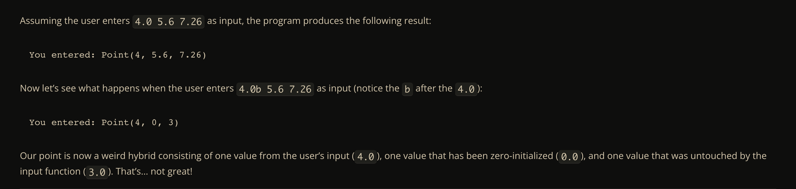


## Overloading operators using member functions

Overloading operators using a member function is very similar to overloading operators using a friend function. When overloading an operator using a member function:

* The overloaded operator must be added as a member function of the left operand.
* The left operand becomes the implicit *this object
* All other operands become function parameters.


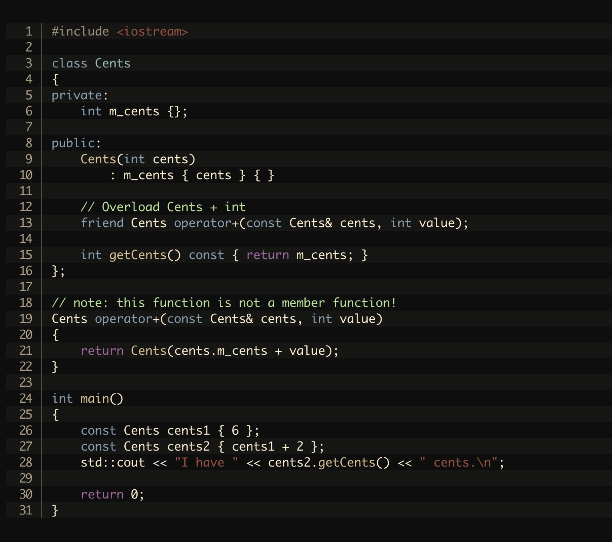

Converting friend functions to member functions is usually straightforward:-

* The overloaded operator is defined as a member instead of a friend (Cents::operator+ instead of friend operator+)
* The left parameter is removed, because that parameter now becomes the implicit *this object.
* Inside the function body, all references to the left parameter can be removed (e.g. cents.m_cents becomes m_cents, which implicitly references the *this object).

```cpp
class Cents{
private:
    int m_cents;
public:
    Cents(int cents) : m_cents{ cents } {}

    // Overload + operator using a member function
    Cents operator+(int value);

    int getCents() const { return m_cents; }
};

Cents Cents::operator+(int value){
    return Cents{m_cents + value};
}

int main(){
    Cents c1{ 6 };
    Cents c2 = c1 + 8; // calls operator+ to add c1 and 8
    std::cout << "I have " << c2.getCents() << " cents.\n";
    return 0;
}   
```

Note: However, we are not able to overload operator<< as a member function. Why not? Because the overloaded operator must be added as a member of the left operand. In this case, the left operand is an object of type std::ostream. std::ostream is fixed as part of the standard library. We can’t modify the class declaration to add the overload as a member function of std::ostream.

When to use a normal, friend, or member function overload?

* When dealing with binary operators that don’t modify the left operand (e.g. operator+), the normal or friend function version is typically preferred.
* Unary operators are usually overloaded as member functions as well, since the member version has no parameters.

## Overloading unary operators +, -, and !
```cpp
#include <iostream>

class Cents{
private:
    int m_cents;
public:
    Cents(int cents) : m_cents{ cents } {}

    // Overload unary - operator to negate the value of Cents
    Cents operator-() const;
    
    int getCents() const { return m_cents; }
};

Cents Cents::operator-() const{
    return Cents{-m_cents};
}

int main()
{
    const Cents nickle{ 5 };
    std::cout << "A nickle of debt is worth " << (-nickle).getCents() << " cents\n";

    return 0;
}  
```

## Overloading the increment and decrement operators

* Overloading prefix increment and decrement

Prefix increment and decrement are overloaded exactly the same as any normal unary operator. We’ll do this one by example:

```cpp
#include <iostream>

class Digit{
private:
    int m_value;
public:
    Digit(int value) : m_value{ value } {}

    // Overload prefix increment operator to increment the value of Digit
    Digit& operator++(); // prefix increment // why we are returning a reference? Because we want to allow chaining of increment operations (e.g. ++(++d)), and returning a reference allows us to modify the original object rather than a copy.

    int getValue() const { return m_value; }
};

Digit& Digit::operator++(){
    if(m_value < 9){
        ++m_value;
    }
    else{
        m_value = 0; // wrap around to 0 if we exceed 9
    }
    return *this; // return the current object to allow chaining of increment operations
}

int main()
{
    Digit d{ 8 };
    std::cout << "Current value: " << d.getValue() << '\n';
    ++d; // calls prefix increment operator to increment d
    std::cout << "After prefix increment: " << d.getValue() << '\n';
    ++d; // calls prefix increment operator again to increment d
    std::cout << "After another prefix increment: " << d.getValue() << '\n';

    return 0;
}  
```

* Overloading postfix increment and decrement

The C++ language specification has a special case that provides the answer: the compiler looks to see if the overloaded operator has an int parameter. If the overloaded operator has an int parameter, the operator is a postfix overload. If the overloaded operator has no parameter, the operator is a prefix overload.

```cpp
class Digit{
private:
    int m_value;
public: 
    Digit(int value) : m_value{ value } {}

    // Overload postfix increment operator to increment the value of Digit
    Digit operator++(int); // postfix increment

    int getValue() const { return m_value; }
};

Digit Digit::operator++(int){
    Digit temp{ *this }; // create a copy of the current object to return later // why we are returning a copy? Because the postfix increment operator returns the value of the object before it was incremented, so we need to create a copy of the original object before we modify it.
    if(m_value < 9){
        ++m_value; // increment the current object's value
    }
    else{
        m_value = 0; // wrap around to 0 if we exceed 9
    }
    return temp; // return the copy of the original object (before incrementing)
}

int main(){
    Digit d{ 8 };
    std::cout << "Current value: " << d.getValue() << '\n';
    d++; // calls postfix increment operator to increment d
    std::cout << "After postfix increment: " << d.getValue() << '\n';
    d++; // calls postfix increment operator again to increment d
    std::cout << "After another postfix increment: " << d.getValue() << '\n';

    return 0;
}
// output will be:
Current value: 8
After postfix increment: 9
After another postfix increment: 0
```

## Overloading subscript operator []

The subscript operator [] is a binary operator that takes one operand on the left (the object being indexed) and one operand on the right (the index). When overloading the subscript operator, the left operand becomes the implicit *this object, and the right operand becomes a function parameter.

```cpp
#include <iostream>

class IntArray{
private:
    int m_array[5]{};
public:
    int& operator[](int index); // subscript operator overload that returns a reference to the element at the given index

};

int& IntArray::operator[](int index){
    if(index < 0 || index >= 5){
        std::cerr << "Index out of bounds\n";
        exit(1); // exit the program with an error code
    }
    return m_array[index]; // return a reference to the element at the given index
}
int main()
{
    IntList list{};
    list[2] = 3; // set a value
    std::cout << list[2] << '\n'; // get a value

    return 0;
}
```

Why operator[] returns a reference?

Let’s take a closer look at how list[2] = 3 evaluates. Because the subscript operator has a higher precedence than the assignment operator, list[2] evaluates first. list[2] calls operator[], which we’ve defined to return a reference to list.m_list[2]. Because operator[] is returning a reference, it returns the actual list.m_list[2] array element. Our partially evaluated expression becomes list.m_list[2] = 3, which is a straightforward integer assignment.

In lesson 12.2 -- Value categories (lvalues and rvalues), we learned that any value on the left hand side of an assignment statement must be an l-value (which is a variable that has an actual memory address). Because the result of operator[] can be used on the left hand side of an assignment (e.g. list[2] = 3), the return value of operator[] must be an l-value. As it turns out, references are always l-values, because we can only take a reference of variables that have memory addresses. So by returning a reference, the compiler is satisfied that we are returning an l-value. If we were to return by value instead, we would be returning a temporary value that does not have a memory address, which is an r-value. This would cause a compiler error when we try to use list[2] on the left hand side of an assignment, because we cannot assign to an r-value.

Note:
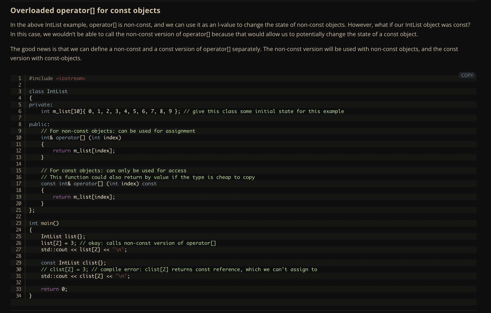

## Overloading the assignment operator

### Copy assignment vs Copy constructor

The purpose of the copy constructor and the copy assignment operator are almost equivalent -- both copy one object to another. However, the copy constructor initializes new objects, whereas the assignment operator replaces the contents of existing objects.

### Overloading the assignment operator

```cpp
#include <iostream>

class Fraction{
private:
    int m_numerator;
    int m_denominator;
public:
    // Default constructor
    Fraction(int numerator = 0, int denominator =1) : m_numerator{ numerator }, m_denominator{ denominator } {}

    // Copy constructor
    Fraction(const Fraction& other) : m_numerator{ other.m_numerator }, m_denominator{ other.m_denominator } {
        std::cout << "Copy constructor called\n";
    }

    // Copy assignment operator
    Fraction& operator=(const Fraction& other);

   friend std::ostream& operator<<(std::ostream& out, const Fraction& f);
};
std::ostream& operator<<(std::ostream& out, const Fraction& f){
    out << f.m_numerator << '/' << f.m_denominator;
    return out;
}

Fraction& Fraction::operator=(const Fraction& other){
    std::cout << "Copy assignment operator called\n";
    if(this == &other){ // check for self-assignment
        return *this; // return the current object to allow chaining of assignment operations
    }
    m_numerator = other.m_numerator; // copy the numerator from the other object
    m_denominator = other.m_denominator; // copy the denominator from the other object
    return *this; // return the current object to allow chaining of assignment operations
}

int main()
{
    Fraction f1 { 5, 3 };
    Fraction f2 { 7, 2 };
    Fraction f3 { 9, 5 };

    f1 = f2 = f3; // chained assignment

    return 0;
}
```

// output will be: 
// output: 
// copy assignment operator called
// copy assignment operator called


## Shallow vs Deep Copy

C++ does not know much about our class, the default copy constructor and default assignment operators it provides use a copying method known as a memberwise copy (also known as a shallow copy). This means that C++ copies each member of the class individually (using the assignment operator for overloaded operator=, and direct initialization for the copy constructor). When classes are simple (e.g. do not contain any dynamically allocated memory), this works very well.

ex:

```cpp
#include <iostream>

class Mystring{
private:
    char* m_string; // pointer to a dynamically allocated C-style string
    size_t m_length; // length of the string (not including null terminator)
public:
    Mystring(const char *string = "") {
        int length = std::strlen(string) +1; // calculate the length of the input string (including null terminator)
        m_string = new char[length]; // allocate memory for the string
        std::strcpy(m_string, string); // copy the input string into the allocated memory
        m_length = length - 1; // set the length member variable (excluding null terminator)
    }

    // Default copy assignment
    Mystring& operator=(const Mystring& other) = default; // memberwise copy (shallow copy)

    ~Mystring() {
        delete[] m_string; // deallocate the memory for the string
    }

    char* getString() const { return m_string; }
    int getLength() const { return m_length; }
};

int main()
{
    Mystring s1{ "Hello" };
    {
        Mystring s2{ s1 }; // calls the default copy constructor (shallow copy)
        std::cout << "s2: " << s2.getString() << '\n'; // prints "Hello"
    }
    std::cout << "s1: " << s1.getString() << '\n'; // undefined behavior (s1's string has been deallocated by s2's destructor)
    return 0;
}
```

### Deep copying

A deep copy is a copying method that creates a new copy of any dynamically allocated memory (or other resources) that the class manages. This is typically done by writing our own copy constructor and copy assignment operator that perform a deep copy of the class’s resources.

```cpp

#include <iostream>
#include <cstring>

class Mystring{
private:
    char* m_string; // pointer to a dynamically allocated C-style string
    size_t m_length; // length of the string (not including null terminator)
public:
    Mystring(const char *string = "") {
        int length = std::strlen(string) +1; // calculate the length of the input string (including null terminator)
        m_string = new char[length]; // allocate memory for the string
        std::strcpy(m_string, string); // copy the input string into the allocated memory
        m_length = length - 1; // set the length member variable (excluding null terminator)
    }

    void deepCopy(const Mystring& other);

    // step 2: use the deep copy function in the copy constructor and copy assignment operator
    Mystring(const Mystring& other) {
        deepCopy(other); // call the deep copy function to perform a deep copy of the other object
    }   

    Mystring& operator=(const Mystring& other) {
        deepCopy(other); // call the deep copy function to perform a deep copy of the other object
        return *this; // return the current object to allow chaining of assignment operations
    }

};

// step 1: write a deep copy function that performs a deep copy of the class's resources
void Mystring::deepCopy(const Mystring& other){
    if(this == &other){ // check for self-assignment
        return; // do nothing if we're trying to copy the same object
    }
    
    // first, we need to deallocate the existing string to avoid memory leaks
    delete[] m_string;

    // as m_length is just a size_t, we can copy it directly
    m_length = other.m_length + 1;

    // now we need to allocate new memory for the string and copy the contents of the other string
    m_string = new char[m_length]; // allocate new memory for the string
    if(other.m_string){ // check if the other string is not null
        std::strcpy(m_string, other.m_string); // copy the string from the other
    else{
       m_string = nullptr; // if the other string is null, set our string to null as well 
    }
}

int main()
{
    Mystring s1{ "Hello" };
    {
        Mystring s2{ s1 }; // calls the copy constructor (deep copy)
        std::cout << "s2: " << s2.getString() << '\n'; // prints "Hello"
    }
    std::cout << "s1: " << s1.getString() << '\n'; // prints "Hello" (s1's string is still valid because we performed a deep copy)
    return 0;
}
```

### The rule of three:-

If our class needs a user-defined destructor, copy constructor, or copy assignment operator, then it almost certainly needs all three. This is because if our class manages a resource (e.g. dynamically allocated memory), we need to make sure that the resource is properly copied and cleaned up in all cases (copying, assignment, and destruction). If we only define one or two of these functions, we may end up with issues such as memory leaks, double deletions, or shallow copies that lead to undefined behavior. Therefore, it’s generally recommended to follow the rule of three and define all three of these functions if our class manages a resource.

## Overloading operators and function templates

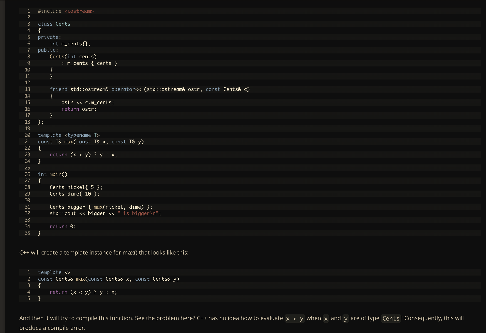

Above, code wont work as C++ has no idea how to evaluate x < y when x and y are of type Cents! Consequently, this will produce a compile error. To fix this, we can overload the < operator for the Cents class:

```cpp
#include <iostream>

class Cents{
private:
    int m_cents;
public:
    Cents(int cents) : m_cents{ cents } {}
    // Overload < operator to compare two Cents objects
    friend bool operator<(const Cents& c1, const Cents& c2){
        return c1.m_cents < c2.m_cents; // compare the cents values of the two Cents objects
    }

    friend std::ostream& operator<<(std::ostream& out, const Cents& c){
        out << c.m_cents << " cents";
        return out;
    }
};

template<typename T>
const T& max(const T& x, const T& y){
    return (x < y) ? y : x; // use the overloaded < operator to compare x and y
}

int main()
{
    Cents c1{ 6 };
    Cents c2{ 8 };

    std::cout << "The larger amount is: " << max(c1, c2) << '\n'; // calls the max function template with Cents as the template argument

    return 0;
}
```

// output will be:
The larger amount is: 8 cents

# Chapter 22 : Move Semantics and Smart Pointers

### Let's start with a simple class that manages a resource (e.g. dynamically allocated memory):

One of the best things about classes is that they contain destructors that automatically get executed when an object of the class goes out of scope. So if we allocate (or acquire) memory in our constructor, we can deallocate it in our destructor, and be guaranteed that the memory will be deallocated when the class object is destroyed.

Consider a class whose sole job was to hold and “own” a pointer passed to it, and then deallocate that pointer when the class object went out of scope. As long as objects of that class were only created as local variables, we could guarantee that the class would properly go out of scope (regardless of when or how our functions terminate) and the owned pointer would get destroyed.

```cpp
#include <iostream>

template<typename T>
class AutoPtr{
private:
    T* m_ptr; // pointer to a dynamically allocated resource
public:
    AutoPtr(T* ptr) : m_ptr{ ptr } {} // constructor that takes ownership of the pointer

    ~AutoPtr() { delete m_ptr; } // destructor that deallocates the owned pointer

    T* get() const { return m_ptr; } // getter function to access the owned pointer
};

Class Resource{
public:
    Resource() { std::cout << "Resource acquired\n"; }
    ~Resource() { std::cout << "Resource destroyed\n"; }
};

int main()
{
    AutoPtr<Resource> autoPtr{ new Resource() }; // create a AutoPtr object that owns a new Resource
    std::cout << "Doing some work with the resource...\n";
    return 0; // when main returns, autoPtr goes out of scope and its destructor is called, which deletes the owned Resource and prints "Resource destroyed"
}
```

A Smart pointer is a composition class that is designed to manage dynamically allocated memory and ensure that memory gets deleted when the smart pointer object goes out of scope.

Above, class AutoPtr has a critical flaw: it does not have a copy constructor or copy assignment operator. This means that if we try to copy an AutoPtr object, we will end up with two AutoPtr objects that both think they own the same pointer. When both AutoPtr objects go out of scope, they will both try to delete the same pointer, which will lead to undefined behavior (e.g. double deletion). To fix this, we need to define a copy constructor and copy assignment operator that properly handle ownership of the pointer (e.g. by implementing move semantics or by deleting the copy constructor and copy assignment operator to prevent copying altogether). Remember the rule of three: if our class needs a user-defined destructor, copy constructor, or copy assignment operator, then it almost certainly needs all three. In this case, since we have a user-defined destructor that deletes the owned pointer, we also need to define a copy constructor and copy assignment operator to properly manage ownership of the pointer when copying AutoPtr objects.

Before jumping there why do we need move semantics?

Well, one thing we could do would be to explicitly define and delete the copy constructor and assignment operator, thereby preventing any copies from being made in the first place. That would prevent the pass by value case (which is good, we probably shouldn’t be passing these by value anyway). But then how would we return an Auto_ptr1 from a function back to the caller?

```cpp
??? generateResource()
{
     Resource* r{ new Resource() };
     return Auto_ptr1(r);
}
```

We can’t return our Auto_ptr1 by reference, because the local Auto_ptr1 will be destroyed at the end of the function, and the caller will be left with a dangling reference. We could return pointer r as Resource*, but then we might forget to delete r later, which is the whole point of using smart pointers in the first place. So that’s out. Returning the Auto_ptr1 by value is the only option that makes sense -- but then we end up with shallow copies, duplicated pointers, and crashes.

```cpp
Resource* generateResource()
{
     Resource* r{ new Resource() };
     return r; // we can return the raw pointer, but then we have to remember to delete it later, which is error-prone
}
```

Another option would be to overload the copy constructor and assignment operator to make deep copies. In this way, we’d at least guarantee to avoid duplicate pointers to the same object. But copying can be expensive (and may not be desirable or even possible), and we don’t want to make needless copies of objects just to return an Auto_ptr1 from a function. Plus assigning or initializing a dumb pointer doesn’t copy the object being pointed to, so why would we expect smart pointers to behave differently? This is where move semantics come in. 

## Move Semantics

What if, instead of having our copy constructor and assignment operator copy the pointer (“copy semantics”), we instead transfer/move ownership of the pointer from the source to the destination object? This is the idea behind move semantics. With move semantics, instead of copying the pointer, we “move” the pointer from the source object to the destination object. This means that after the move, the source object no longer owns the pointer (it becomes a “moved-from” object), and the destination object now owns the pointer. This allows us to return smart pointers from functions without having to make expensive copies, and it also allows us to avoid issues with duplicate pointers and double deletion.

let's update our AutoPtr class to support move semantics:

```cpp
#include <iostream>

template<typename T>
class AutoPtr{
private:
    T* m_ptr; // pointer to a dynamically allocated resource
public:
    AutoPtr(T* ptr = nullptr) : m_ptr{ ptr } {} // constructor that takes ownership of the pointer

    ~AutoPtr() { delete m_ptr; } // destructor that deallocates the owned pointer

    // A copy constructor that implements move semantics
    AutoPtr(AutoPtr& other){ // note that the parameter is a non-const lvalue reference, which allows us to modify the source object (e.g. by setting its pointer to null)
        // We don't need to delete m_ptr here.  This constructor is only called when we're creating a new object, and m_ptr can't be set prior to this.
        m_ptr = other.m_ptr; // transfer our dumb pointer from the source to our local object
        other.m_ptr = nullptr; // set the source's pointer to null to indicate that it no longer owns the resource
    }


    // An assignment operator that implements move semantics
    AutoPtr& operator=(AutoPtr& other) // note that the parameter is a non-const lvalue reference, which allows us to modify the source object (e.g. by setting its pointer to null)
    {
        if(this == &other){
            return *this; // check for self-assignment and do nothing if we're trying to assign the same object to itself
        }
        delete m_ptr; // delete the current resource that we own (if any) to avoid memory leaks
        m_ptr = other.m_ptr; // transfer our dumb pointer from the source to our local object
        other.m_ptr = nullptr; // set the source's pointer to null to indicate that it no longer owns the resource
        return *this; // return the current object to allow chaining of assignment operations
    }

    bool isNull() const { return m_ptr == nullptr; } // helper function to check if the AutoPtr is null (i.e. does not own a resource)
};

class Resource{
public:
    Resource() { std::cout << "Resource acquired\n"; }
    ~Resource() { std::cout << "Resource destroyed\n"; }
};

int main()
{
    AutoPtr<Resource> autoPtr1{ new Resource() }; // create a AutoPtr object that owns a new Resource
    AutoPtr<Resource> autoPtr2; // create a default AutoPtr object that does not own any resource

    std::cout << "autoPtr1 is " << (autoPtr1.isNull() ? "null" : "not null") << '\n'; // prints "not null"
    std::cout << "autoPtr2 is " << (autoPtr2.isNull() ? "null" : "not null") << '\n'; // prints "null" 
    
    // Move ownership of the resource from autoPtr1 to autoPtr2 using the move assignment operator
    autoPtr2 = autoPtr1; // calls the move assignment operator to transfer ownership of the resource from autoPtr1 to autoPtr2

    std::cout << "After move assignment:\n";
    std::cout << "autoPtr1 is " << (autoPtr1.isNull() ? "null" : "not null") << '\n'; // prints "null" (autoPtr1 no longer owns the resource)
    std::cout << "autoPtr2 is " << (autoPtr2.isNull() ? "null" : "not null") << '\n'; // prints "not null" (autoPtr2 now owns the resource)

}

// output will be:
Resource acquired
autoPtr1 is not null
autoPtr2 is null
After move assignment:
autoPtr1 is null
autoPtr2 is not null
Resource destroyed
```

Note: std::auto_ptr is implemented like the above AutoPtr class, and it is deprecated in C++11 and removed in C++17 due to its flawed copy semantics (it implements move semantics in the copy constructor and copy assignment operator, which can lead to issues with ownership and double deletion). 

Reason why std::auto_ptr is deprecated and removed in C++11 and C++17:

1. First, because std::auto_ptr implements move semantics through the copy constructor and assignment operator, passing a std::auto_ptr by value to a function will cause our resource to get moved to the function parameter (and be destroyed at the end of the function when the function parameters go out of scope). Then when we go to access our auto_ptr argument from the caller (not realizing it was transferred and deleted), you’re suddenly dereferencing a null pointer. Crash!

2. Second,  std::auto_ptr always deletes its contents using non-array delete. This means that if we create a std::auto_ptr to an array (e.g. std::auto_ptr<int[]>), the destructor will call delete on the pointer, which is undefined behavior because we need to use delete[] to delete arrays allocated with new[]. This can lead to memory leaks and other issues. 

3. Finally, auto_ptr doesn’t play nice with a lot of the other classes in the standard library, including most of the containers and algorithms. This occurs because those standard library classes assume that when they copy an item, it actually makes a copy, not a move.

### Before moving on, let's revise R-value references

* L-value references recap

An l-value reference is a reference that can bind to an l-value (i.e. an object that has a name and a memory address). L-value references are declared using the & symbol. For example:

```cpp
int x = 5; // x is an l-value (it has a name and a memory address)
int& ref = x; // ref is an l-value reference that binds to x
```

L-value reference         | Can be initialized with	    | Can modify
--------------------------|-----------------------------|----------------
Modifiable l-values	      | Yes	                        | Yes
Non-modifiable l-values	  | Yes	                        | No
R-values	              | No	                        | No

1. Modifiable l-values are variables that can be modified (e.g. int x = 5;). L-value references can bind to modifiable l-values and can modify them through the reference.
2. Non-modifiable l-values are variables that cannot be modified (e.g. const int x = 5;). L-value references can bind to non-modifiable l-values, but they cannot modify them through the reference (e.g. int& ref = x; would be a compile error because x is const).
3. R-values are temporary values that do not have a name or a memory address (e.g. 5, x + 1). L-value references cannot bind to r-values because they require an l-value (something with a name and a memory address) to bind to. If we try to bind an l-value reference to an r-value (e.g. int& ref = 5;), we will get a compile error because 5 is an r-value and cannot be bound to an l-value reference.

* L value reference to const recap

A const l-value reference is a reference that can bind to an l-value, but cannot modify the object it binds to. Const l-value references are declared using the const keyword before the & symbol. For example:

```cpp
int x = 5; // x is an l-value (it has a name and a memory address)
const int& ref = x; // ref is a const l-value reference that binds to x
```

l-value reference to const	| Can be initialized with	    | Can modify
--------------------------|-----------------------------|----------------
Modifiable l-values	      | Yes	                        | No
Non-modifiable l-values	  | Yes	                        | No
R-values	              | No	                        | No


* R-value references recap

C++11 adds a new type of reference called an r-value reference. An r-value reference is a reference that is designed to be initialized with an r-value (only). While an l-value reference is created using a single ampersand, an r-value reference is created using a double ampersand:

```cpp
int&& rref = 5; // rref is an r-value reference that binds to the r-value 5
rref = x + 1; // rref can also bind to the r-value result of the expression x + 1
```

R-value reference	        | Can be initialized with	    | Can modify
--------------------------|-----------------------------|----------------
Modifiable l-values	      | No	                        | No
Non-modifiable l-values	  | No	                        | No
R-values	              | Yes	                        | Yes

R-value reference to const	| Can be initialized with	    | Can modify
--------------------------|-----------------------------|----------------
Modifiable l-values	      | No	                        | No     
Non-modifiable l-values	  | No	                        | No
R-values	              | Yes	                        | No

R-value references have two properties that are useful. First, r-value references extend the lifespan of the object they are initialized with to the lifespan of the r-value reference (l-value references to const objects can do this too). Second, non-const r-value references allow we to modify the r-value!
```cpp
#include <iostream>

class Fraction
{
private:
	int m_numerator { 0 };
	int m_denominator { 1 };

public:
	Fraction(int numerator = 0, int denominator = 1) :
		m_numerator{ numerator }, m_denominator{ denominator }
	{
	}

	friend std::ostream& operator<<(std::ostream& out, const Fraction& f1)
	{
		out << f1.m_numerator << '/' << f1.m_denominator;
		return out;
	}
};

int main()
{
	auto&& rref{ Fraction{ 3, 5 } }; // r-value reference to temporary Fraction

	// f1 of operator<< binds to the temporary, no copies are created.
	std::cout << rref << '\n';

	return 0;
} // rref (and the temporary Fraction) goes out of scope here
```

### R-value references as function parameters

```cpp
#include <iostream>

void fun(const int& lref) // l-value arguments will select this function
{
	std::cout << "l-value reference to const: " << lref << '\n';
}

void fun(int&& rref) // r-value arguments will select this function
{
	std::cout << "r-value reference: " << rref << '\n';
}

int main()
{
	int x{ 5 };
	fun(x); // l-value argument calls l-value version of function
	fun(5); // r-value argument calls r-value version of function

	return 0;
}
```

### Rvalue reference variables are lvalues

```cpp
int&& ref{ 5 };
fun(ref);
```

Which version of fun would we expect the above to call: fun(const int&) or fun(int&&)?
The answer might surprise we. This calls fun(const int&).
Although variable ref has type int&&, when used in an expression it is an lvalue (as are all named variables). The type of an object and its value category are independent.

## Move Constructors and Move Assignment Operators

```cpp

#include <iostream>
template<typename T>
class AutoPtr{
private:
    T* m_ptr; // pointer to a dynamically allocated resource
public:
    AutoPtr(T* ptr = nullptr) : m_ptr{ ptr } {} // constructor that takes ownership of the pointer

    ~AutoPtr() { delete m_ptr; } // destructor that deallocates the owned pointer

    // Copy constructor
    AutoPtr(const AutoPtr& other) {
        m_ptr = new T;
        *m_ptr = *(other.m_ptr); // copy the resource from the other object
    }

    // Move constructor
    // r-value reference parameter to indicate that this constructor is for move semantics, and noexcept to indicate that this constructor does not throw exceptions, why noexcept? Because move constructors and move assignment operators should not throw exceptions, as they are often used in situations where we want to avoid the overhead of copying (e.g. when returning a smart pointer from a function). If a move constructor or move assignment operator were to throw an exception, it could lead to resource leaks and other issues, as the object being moved from may have already released its resources before the exception is thrown. By marking the move constructor and move assignment operator as noexcept, we are indicating to the compiler and to other developers that these functions will not throw exceptions, which allows for better optimization and safer code.
    AutoPtr(AutoPtr&& other) noexcept 
                            : m_ptr{ other.m_ptr }
    {
        other.m_ptr = nullptr; // set the source's pointer to null to indicate that it no longer owns the resource
    }

    // Copy assignment operator
    AutoPtr& operator=(const AutoPtr& other) {
        if(this == &other){
            return *this; // check for self-assignment and do nothing if we're trying to assign the same object to itself
        }
        delete m_ptr; // delete the current resource that we own (if any) to avoid memory leaks
        m_ptr = new T;
        *m_ptr = *(other.m_ptr); // copy the resource from the other object
        return *this; // return the current object to allow chaining of assignment operations
    }

    // Move assignment operator
    // r-value reference parameter to indicate that this operator is for move semantics, and noexcept to indicate that this operator does not throw exceptions
    AutoPtr& operator=(AutoPtr&& other) noexcept {
        if(this == &other){
            return *this; // check for self-assignment and do nothing if we're trying to assign the same object to itself
        }
        delete m_ptr; // delete the current resource that we own (if any) to avoid memory leaks
        m_ptr = other.m_ptr; // transfer ownership of the resource from the source to the destination object
        other.m_ptr = nullptr; // set the source's pointer to null to indicate that it no longer owns the resource
        return *this; // return the current object to allow
    }

    bool isNull() const { return m_ptr == nullptr; } // helper function to check if the AutoPtr is null (i.e. does not own a resource)
};
class Resource
{
public:
	Resource() { std::cout << "Resource acquired\n"; }
	~Resource() { std::cout << "Resource destroyed\n"; }
};

Auto_ptr4<Resource> generateResource()
{
	Auto_ptr4<Resource> res{new Resource};
	return res; // this return value will invoke the move constructor
}

int main()
{
	Auto_ptr4<Resource> mainres;
	mainres = generateResource(); // this assignment will invoke the move assignment

	return 0;
}
```
* Output will be:
    Resource acquired
    Resource destroyed

* Flow of the above code:
1. Inside generateResource(), local variable res is created and initialized with a dynamically allocated Resource, which causes the first “Resource acquired”.
2. Res is returned back to main() by value. Res is move constructed into a temporary object, transferring the dynamically created object stored in res to the temporary object. We’ll talk about why this happens below.
3. Res goes out of scope. Because res no longer manages a pointer (it was moved to the temporary), nothing interesting happens here.
4. The temporary object is move assigned to mainres. This transfers the dynamically created object stored in the temporary to mainres.
5. The assignment expression ends, and the temporary object goes out of expression scope and is destroyed. However, because the temporary no longer manages a pointer (it was moved to mainres), nothing interesting happens here either.
6. At the end of main(), mainres goes out of scope, and our final “Resource destroyed” is displayed.

* Note:-
The rule of five says that if the copy constructor, copy assignment, move constructor, move assignment, or destructor are defined or deleted, then each of those functions should be defined or deleted. This is because if we define or delete one of these functions, we likely need to define or delete the others to properly manage the resources that our class owns. For example, if we define a destructor to clean up a resource, we should also define a copy constructor and copy assignment operator to ensure that the resource is properly copied when our class is copied. Similarly, if we define a move constructor and move assignment operator to take advantage of move semantics, we should also define a destructor to clean up the resource when our class goes out of scope. By following the rule of five, we can ensure that our class properly manages its resources and avoids issues such as memory leaks and double deletion.

* std::move

In C++11, std::move is a standard library function that casts (using static_cast) its argument into an r-value reference, so that move semantics can be invoked. Thus, we can use std::move to cast an l-value into a type that will prefer being moved over being copied. std::move is defined in the utility header.

Here’s the same program as above, but with a mySwapMove() function that uses std::move to convert our l-values into r-values so we can invoke move semantics:

```cpp
#include <iostream>
#include <string>
#include <utility> // for std::move

template <typename T>
void mySwapMove(T& a, T& b)
{
	T tmp { std::move(a) }; // invokes move constructor
	a = std::move(b); // invokes move assignment
	b = std::move(tmp); // invokes move assignment
}

int main()
{
	std::string x{ "abc" };
	std::string y{ "de" };

	std::cout << "x: " << x << '\n';
	std::cout << "y: " << y << '\n';

	mySwapMove(x, y);

	std::cout << "x: " << x << '\n';
	std::cout << "y: " << y << '\n';

	return 0;
}

output will be:
x: abc
y: de
x: de
y: abc
```
* Note:

    the defining characteristic of a smart pointer is that it manages a dynamically allocated resource provided by the user of the smart pointer, and ensures the dynamically allocated object is properly cleaned up at the appropriate time (usually when the smart pointer goes out of scope).

## std::unique_ptr

Unique_ptr is a smart pointer that owns and manages another object which is dynamically created through a pointer and disposes of that object when the unique_ptr goes out of scope. No two unique_ptr instances can manage the same object, and the object is destroyed when the unique_ptr goes out of scope. Unique_ptr is defined in the memory header.

```cpp

#include <iostream>
#include <memory> // for std::unique_ptr

class Resource
{
public:
    Resource() { std::cout << "Resource acquired\n"; }
    ~Resource() { std::cout << "Resource destroyed\n"; }
};

int main(){
    std::unique_ptr<Resource> res1{ new Resource }; // create a unique_ptr that owns a new Resource
    std::unique_ptr<Resource> res2; // create an empty unique_ptr that does not own any resource

    std::cout << "res1 is " << (res1 ? "not null" : "null") << '\n'; // prints "null" (res1 no longer owns the resource)
    std::cout << "res2 is " << (res2 ? "not null" : "null") << '\n'; // prints "not null" (res2 now owns the resource)

    // // res2 = res1; // Won't compile: copy assignment is disabled
    // Move ownership of the resource from res1 to res2 using std::move
    res2 = std::move(res1); // calls the move assignment operator to transfer ownership of the resource from res1 to res2

    std::cout << "res1 is " << (res1 ? "not null" : "null") << '\n'; // prints "null" (res1 no longer owns the resource)
    std::cout << "res2 is " << (res2 ? "not null" : "null") << '\n'; // prints "not null" (res2 now owns the resource)

    return 0;
}
```
* output will be:

    * Resource acquired
    * res1 is not null
    * res2 is null
    * res1 is null
    * res2 is not null
    * Resource destroyed

Remember that std::unique_ptr may not always be managing an object -- either because it was created empty (using the default constructor or passing in a nullptr as the parameter), or because the resource it was managing got moved to another std::unique_ptr. So before we use either of these operators, we should check whether the std::unique_ptr actually has a resource. Fortunately, this is easy: std::unique_ptr has a cast to bool that returns true if the std::unique_ptr is managing a resource.

### operator overloading with unique_ptr

```cpp
#include <iostream>
#include <memory>

using namespace std;
class Resource{
public:
    Resource(){
        cout << "Resource acquired\n";
    }
    ~Resource(){
        cout << "Resource destroyed\n";
    }
};
// Overload the << operator for the Resource class to allow us to print a message when we dereference a unique_ptr to a Resource
// Working 
ostream& operator<<(ostream& out, const Resource& r){
    out << "I am a resource";
    return out;
}


int main(){
    unique_ptr<Resource> res{ new Resource }; // create a unique_ptr that owns a new Resource
    cout<<*res<<endl; // dereference the unique_ptr to access the Resource object it manages
    // *res as unique_ptr class has an overloaded operator* that returns a reference to the object it manages, so we can use *res to access the Resource object and print a message using the overloaded << operator for the Resource class
}

```
* output will be:

    * Resource acquired
    * I am a resource
    * Resource destroyed

### std::make_unique

C++ 14 adds a new function template called std::make_unique that provides a convenient and safe way to create std::unique_ptr instances. std::make_unique takes care of creating the object and managing the memory, so we don't have to worry about manually using new and delete. std::make_unique is defined in the memory header.

```cpp
#include <iostream>
#include <memory> // for std::make_unique

class Resource
{
public:
    Resource() { std::cout << "Resource acquired\n"; }
    ~Resource() { std::cout << "Resource destroyed\n"; }
};

int main(){
    std::unique_ptr<Resource> res1 = std::make_unique<Resource>(); // create a unique_ptr that owns a new Resource using std::make_unique
    // or 
    // auto res1 = std::make_unique<Resource>(); // using auto to let the compiler deduce the type of res1
    return 0;
}
```
* output will be:
    * Resource acquired
    * Resource destroyed

### std::unique_ptr and classes (Advanced)

Using std::unique_ptr as a member variable in a class is a common way to manage dynamically allocated resources within a class. When we use std::unique_ptr as a member variable, we can take advantage of its automatic memory management to ensure that the resource is properly cleaned up when the class object goes out of scope. This can help prevent memory leaks and other issues related to manual memory management.

However, if the class object is not destroyed properly (e.g. it is dynamically allocated and not deallocated properly), then the std::unique_ptr member will not be destroyed either, and the object being managed by the std::unique_ptr will not be deallocated. To avoid this, we should ensure that any class that contains a std::unique_ptr member has a proper destructor that will clean up the resource when the class object is destroyed. Additionally, we should follow the rule of five and define a copy constructor, copy assignment operator, move constructor, and move assignment operator to properly manage ownership of the resource when copying or moving objects of the class. By doing this, we can ensure that our class properly manages its resources and avoids issues such as memory leaks and double deletion.

```cpp
#include <iostream>
#include <memory> // for std::unique_ptr

class MyClass
{
private:
    std::unique_ptr<int> m_data; // unique_ptr member variable to manage a dynamically allocated int
public:
    MyClass(int value) : m_data{ std::make_unique<int>(value) } {} // constructor that initializes the unique_ptr with a new int
    ~MyClass() = default; // default destructor will automatically clean up the unique_ptr

    // Copy constructor
    MyClass(const MyClass& other) : m_data{ std::make_unique<int>(*other.m_data) } {} // copy constructor that creates a new int with the same value as the other object's int

    // Move constructor
    MyClass(MyClass&& other) noexcept : m_data{ std::move(other.m_data) } {} // move constructor that transfers ownership of the unique_ptr from the other object to this object

    // Copy assignment operator
    MyClass& operator=(const MyClass& other) {
        if(this == &other){
            return *this; // check for self-assignment and do nothing if we're trying to assign
        }
        m_data = std::make_unique<int>(*other.m_data); // copy assignment operator that creates a new int with the same value as the other object's int and assigns it to this object's unique_ptr
        return *this; // return the current object to allow chaining of assignment operations
    }

    // Move assignment operator
    MyClass& operator=(MyClass&& other) noexcept {
        if(this == &other){
            return *this; // check for self-assignment and do nothing if we're trying to assign
        }
        m_data = std::move(other.m_data); // move assignment operator that transfers ownership of the unique_ptr from the other object to this object
        return *this; // return the current object to allow chaining of assignment operations
    }

    void print() const {
        if(m_data){
            std::cout << "Value: " << *m_data << '\n'; // print the value of the int being managed by the unique_ptr
        } else {
            std::cout << "No data\n"; // print a message if the unique_ptr is empty (i.e. does not manage any resource)
        }
    }
};

int main()
{
    MyClass obj1{ 42 };
    obj1.print(); // prints "Value: 42" (obj1 owns a unique_ptr that manages an int with value 42)
    MyClass obj2 = obj1; // copy constructor is called
    MyClass obj3 = std::move(obj1); // move constructor is called
    
    obj2.print(); // prints "Value: 42" (obj2 owns a copy of the resource)
    obj3.print(); // prints "Value: 42" (obj3 owns the resource that was moved from obj1)

}
```
* output will be:
    * Value: 42
    * Value: 42
    * Value: 42


## std::shared_ptr

std::shared_ptr is a smart pointer that retains shared ownership of an object through a pointer. Multiple std::shared_ptr instances can own the same object, and the object is destroyed when the last std::shared_ptr owning it is destroyed or reset. std::shared_ptr is defined in the memory header.

```cpp
#include <iostream>
#include <memory> // for std::shared_ptr

class Resource
{
public:
	Resource() { std::cout << "Resource acquired\n"; }
	~Resource() { std::cout << "Resource destroyed\n"; }
};

int main(){
    // allocate a Resource object and have it owned by std::shared_ptr
	Resource* res { new Resource };
    std::shared_ptr<Resource> ptr1{ res }; // create a shared_ptr that owns the Resource object
    {
        //std::shared_ptr<Resource> ptr2{ res }; // create another indpendent shared_ptr that also owns the same Resource object (this is a problem because we have two shared_ptrs that both think they own the same resource, which can lead to double deletion when both shared_ptrs go out of scope)
        std::shared_ptr<Resource> ptr2{ ptr1 }; // create another shared_ptr that shares ownership of the same Resource object (this is the correct way to create a shared_ptr that shares ownership of the same resource, as it will properly manage the reference count and ensure that the resource is only deleted when the last shared_ptr owning it is destroyed)

        std::cout << "ptr1 use count: " << ptr1.use_count() << '\n'; // prints "ptr1 use count: 2" (both ptr1 and ptr2 share ownership of the Resource object)
        std::cout << "ptr2 use count: " << ptr2.use_count() << '\n'; // prints "ptr2 use count: 2" (both ptr1 and ptr2 share ownership of the Resource object)

        std::cout << "Killing one shared pointer\n";
        // ptr2 goes out of scope here, and the Resource object is not destroyed because ptr1 still owns it
    }
    std::cout << "ptr1 use count: " << ptr1.use_count() << '\n'; // prints "ptr1 use count: 1" (only ptr1 owns the Resource object)
    std::cout << "Killing the last shared pointer\n";
    return 0; // when main returns, ptr1 goes out of scope and the Resource object is destroyed because ptr1 is the last shared_ptr owning it
}
```
* output will be:
    * Resource acquired
    * ptr1 use count: 2
    * ptr2 use count: 2
    * Killing one shared pointer
    * ptr1 use count: 1
    * Killing the last shared pointer

### std::make_shared :-

std::make_unique() can be used to create a std::unique_ptr in C++14, std::make_shared() can (and should) be used to make a std::shared_ptr. std::make_shared() is available in C++11.

```cpp
#include <iostream>
#include <memory> // for std::shared_ptr

class Resource
{
public:
	Resource() { std::cout << "Resource acquired\n"; }
	~Resource() { std::cout << "Resource destroyed\n"; }
};
int main()
{
	// allocate a Resource object and have it owned by std::shared_ptr
	auto ptr1 { std::make_shared<Resource>() };
	{
		auto ptr2 { ptr1 }; // create ptr2 using copy of ptr1
		std::cout << "Killing one shared pointer\n";
	} // ptr2 goes out of scope here, but nothing happens
	std::cout << "Killing another shared pointer\n";
	return 0;
} // ptr1 goes out of scope here, and the allocated Resource is destroyed
```

* output will be:
    * Resource acquired
    * Killing one shared pointer
    * Killing another shared pointer
    * Resource destroyed

### Digging into std::shared_ptr:-

Unlike std::unique_ptr, which uses a single pointer internally, std::shared_ptr uses two pointers internally. One pointer points at the resource being managed. The other points at a “control block”, which is a dynamically allocated object that tracks of a bunch of stuff, including how many std::shared_ptr are pointing at the resource. When a std::shared_ptr is created via a std::shared_ptr constructor, the memory for the managed object (which is usually passed in) and control block (which the constructor creates) are allocated separately. However, when using std::make_shared(), this can be optimized into a single memory allocation, which leads to better performance.

This also explains why independently creating two std::shared_ptr pointed to the same resource gets us into trouble. Each std::shared_ptr will have one pointer pointing at the resource. However, each std::shared_ptr will independently allocate its own control block, which will indicate that it is the only pointer owning that resource. Thus, when that std::shared_ptr goes out of scope, it will deallocate the resource, not realizing there are other std::shared_ptr also trying to manage that resource.

However, when a std::shared_ptr is cloned using copy assignment, the data in the control block can be appropriately updated to indicate that there are now additional std::shared_ptr co-managing the resource.

## std::weak_ptr

std::weak_ptr is a smart pointer that holds a non-owning ("weak") reference to an object that is managed by std::shared_ptr. It is used to break circular references between std::shared_ptr instances, which can lead to memory leaks. std::weak_ptr is defined in the memory header.

### What is a circular reference?

A Circular reference (also called a cyclical reference or a cycle) is a series of references where each object references the next, and the last object references back to the first, causing a referential loop. The references do not need to be actual C++ references -- they can be pointers, unique IDs, or any other means of identifying specific objects.
```cpp
#include <iostream>
#include <memory>

class Resource2; // forward declaration of Resource2

class Resource1
{
public:
    std::shared_ptr<Resource2> m_ptr2; // shared_ptr to Resource2  
    Resource1() { std::cout << "Resource1 acquired\n"; }
    ~Resource1() { std::cout << "Resource1 destroyed\n"; }
};

class Resource2
{
public:
    std::shared_ptr<Resource1> m_ptr1; // shared_ptr to Resource1
    Resource2() { std::cout << "Resource2 acquired\n"; }
    ~Resource2() { std::cout << "Resource2 destroyed\n"; }
};

int main()
{
    std::shared_ptr<Resource1> p1{ new Resource1 }; // create a shared_ptr to Resource1
    std::shared_ptr<Resource2> p2{ new Resource2 }; // create a shared_ptr to Resource2

    p1->m_ptr2 = p2; // R1 has a shared_ptr to R2
    p2->m_ptr1 = p1; // R2 has a shared_ptr to R1, creating a circular reference

    return 0;
}
```
* output will be:
    * Resource1 acquired
    * Resource2 acquired    


* explaining in depth the above code:
1. We create a std::shared_ptr p1 that points to a new Resource1 object, reference count for the Resource1 object is now 1
2. We create a std::shared_ptr p2 that points to a new Resource2 object, reference count for the Resource2 object is now 1
3. We set p1's m_ptr2 to point to p2, so now Resource1 has a shared_ptr to Resource2, reference count for the Resource2 object is now 2
4. We set p2's m_ptr1 to point to p1, so now Resource2 has a shared_ptr to Resource1, reference count for the Resource1 object is now 2
5. When main() returns, p1 & p2 go out of scope refernce count for both Resource1 and Resource2 objects is decremented by 1, but since both objects still have a reference count of 1 (due to the circular reference), neither object is destroyed, leading to a memory leak. This is where std::weak_ptr comes in to break the circular reference and allow proper cleanup of resources.

### Using std::weak_ptr to break circular references

A std::weak_ptr is an observer -- it can observe and access the same object as a std::shared_ptr (or other std::weak_ptrs) but it is not considered an owner of the object. A std::weak_ptr does not contribute to the reference count of the object it observes, so it does not prevent the object from being destroyed when the last std::shared_ptr owning it is destroyed. This makes std::weak_ptr useful for breaking circular references between std::shared_ptr instances.

### Understanding `shared_ptr` and `weak_ptr` Circular Reference Problem

* Code

```cpp
#include <iostream>
#include <memory>

class Resource2;

class Resource1
{
public:
    std::shared_ptr<Resource2> m_ptr2;

    Resource1() { std::cout << "Resource1 acquired\n"; }
    ~Resource1() { std::cout << "Resource1 destroyed\n"; }
};

class Resource2
{
public:
    std::weak_ptr<Resource1> m_ptr1;

    Resource2() { std::cout << "Resource2 acquired\n"; }
    ~Resource2() { std::cout << "Resource2 destroyed\n"; }
};

int main()
{
    std::shared_ptr<Resource1> p1{ new Resource1 };
    std::shared_ptr<Resource2> p2{ new Resource2 };

    p1->m_ptr2 = p2;
    p2->m_ptr1 = p1;

    return 0;
}
```

---

* Output

```text
Resource1 acquired
Resource2 acquired
Resource1 destroyed
Resource2 destroyed
```

---

* Step-by-Step Deep Explanation

* Step 1: Create `p1`

```cpp
std::shared_ptr<Resource1> p1{ new Resource1 };
```

- A `Resource1` object is created.
- `p1` becomes the owner of that object.

Reference count of `Resource1`:

```text
1
```

Why?

Because only `p1` owns it.

---

* Step 2: Create `p2`

```cpp
std::shared_ptr<Resource2> p2{ new Resource2 };
```

- A `Resource2` object is created.
- `p2` becomes the owner of that object.

Reference count of `Resource2`:

```text
1
```

---

* Current Situation

```text
p1 ---> Resource1

p2 ---> Resource2
```

Reference counts:

```text
Resource1 = 1
Resource2 = 1
```

---

* Step 3: Assign `p2` to `m_ptr2`

```cpp
p1->m_ptr2 = p2;
```

Now:

- `Resource1` contains a `shared_ptr` pointing to `Resource2`.

That means:

```text
p2
AND
p1->m_ptr2
```

both own `Resource2`.

So reference count of `Resource2` becomes:

```text
2
```

---

* Current Structure

```text
p1 ---> Resource1 ----> Resource2 <--- p2
```

Reference counts:

```text
Resource1 = 1
Resource2 = 2
```

---

* Step 4: Assign `p1` to `m_ptr1`

```cpp
p2->m_ptr1 = p1;
```

But `m_ptr1` is a:

```cpp
std::weak_ptr<Resource1>
```

A `weak_ptr`:

- observes an object
- does NOT own the object
- does NOT increase reference count

So reference count of `Resource1` remains:

```text
1
```

---

* Final Structure

```text
                weak_ptr
                   |
                   v
p1 ---> Resource1 ----> Resource2 <--- p2
            shared_ptr
```

Reference counts:

```text
Resource1 = 1
Resource2 = 2
```

---

* Why `weak_ptr` Solves the Problem

If `m_ptr1` had also been a `shared_ptr`:

```cpp
std::shared_ptr<Resource1> m_ptr1;
```

then:

- `Resource1` would own `Resource2`
- `Resource2` would own `Resource1`

Both objects would keep each other alive forever.

This creates a **circular reference**.

As a result:

```text
Reference count never becomes 0
```

and destructors are never called.

This causes a memory leak.

---

* What Happens When `main()` Ends

Local variables are destroyed in reverse order.

So:

* First `p2` is destroyed

Reference count of `Resource2`:

```text
2 -> 1
```

Why not zero?

Because `p1->m_ptr2` still owns `Resource2`.

So `Resource2` is NOT destroyed yet.

---

* Then `p1` is destroyed

Reference count of `Resource1`:

```text
1 -> 0
```

Now `Resource1` gets destroyed.

Output:

```text
Resource1 destroyed
```

---

* Important Internal Detail

During destruction of `Resource1`:

```cpp
m_ptr2
```

is also destroyed.

Since `m_ptr2` was owning `Resource2`:

Reference count of `Resource2` becomes:

```text
1 -> 0
```

Now `Resource2` also gets destroyed.

Output:

```text
Resource2 destroyed
```

---

* Final Destruction Flow

```text
p2 destroyed
Resource2 count: 2 -> 1

p1 destroyed
Resource1 count: 1 -> 0
Resource1 destroyed

m_ptr2 destroyed
Resource2 count: 1 -> 0
Resource2 destroyed
```

# Chapter 23 : Object Relationships

## Object composition 

Personal computer is built from a CPU, a motherboard, some memory, etc… Even you are built from smaller parts: you have a head, a body, some legs, arms, and so on. This process of building complex objects from simpler ones is called object composition.

object composition models a “has-a” relationship between two objects. A car “has-a” transmission. Your computer “has-a” CPU. You “have-a” heart. The complex object is sometimes called the whole, or the parent. The simpler object is often called the part, child, or component.

### Types of object composition

There are two basic subtypes of object composition: composition and aggregation (both of which are often just called composition). The difference between these two subtypes is whether the whole is responsible for the lifetime of the part. In composition, the whole is responsible for the lifetime of the part. In aggregation, the whole is not responsible for the lifetime of the part.

* Composition

To qualify as a composition, an object and a part must have the following relationship:

* The part (member) is part of the object (class)
* The part (member) can only belong to one object (class) at a time
* The part (member) has its existence managed by the object (class)
* The part (member) does not know about the existence of the object (class)

In a composition relationship, the object is responsible for the existence of the parts. Most often, this means the part is created when the object is created, and destroyed when the object is destroyed. But more broadly, it means the object manages the part’s lifetime in such a way that the user of the object does not need to get involved. For example, when a body is created, the heart is created too. When a person’s body is destroyed, their heart is destroyed too. Because of this, composition is sometimes called a “death relationship”.

And finally, the part doesn’t know about the existence of the whole. Your heart operates blissfully unaware that it is part of a larger structure. We call this a unidirectional relationship, because the body knows about the heart, but not the other way around.

```cpp
#include <iostream>
class Fraction
{
private:
	int m_numerator;
	int m_denominator;

public:
	Fraction(int numerator=0, int denominator=1)
		: m_numerator{ numerator }, m_denominator{ denominator }
	{
	}
};

```

This class has two data members: a numerator and a denominator. The numerator and denominator are part of the Fraction (contained within it). They can not belong to more than one Fraction at a time. The numerator and denominator don’t know they are part of a Fraction, they just hold integers. When a Fraction instance is created, the numerator and denominator are created. When the fraction instance is destroyed, the numerator and denominator are destroyed as well.

## Aggregation

To qualify as an aggregation, a whole object and its parts must have the following relationship:

* The part (member) is part of the object (class)
* The part (member) can (if desired) belong to more than one object (class) at a time
* The part (member) does not have its existence managed by the object (class)
* The part (member) does not know about the existence of the object (class)

In an aggregation relationship, the object is not responsible for the existence of the parts. The parts can exist independently of the whole. For example, consider the relationship between a person and their home address. In this example, for simplicity, we’ll say every person has an address. However, that address can belong to more than one person at a time: for example, to both you and your roommate or significant other. However, that address isn’t managed by the person -- the address probably existed before the person got there, and will exist after the person is gone. Additionally, a person knows what address they live at, but the addresses don’t know what people live there. Therefore, this is an aggregate relationship.

* Implementing aggregations

Because aggregations are similar to compositions in that they are both part-whole relationships, they are implemented almost identically, and the difference between them is mostly semantic. In a composition, we typically add our parts to the composition using normal member variables (or pointers where the allocation and deallocation process is handled by the composition class).

In an aggregation, we also add parts as member variables. However, these member variables are typically either references or pointers that are used to point at objects that have been created outside the scope of the class. Consequently, an aggregation usually either takes the objects it is going to point to as constructor parameters, or it begins empty and the subobjects are added later via access functions or operators. Because these parts exist outside of the scope of the class, when the class is destroyed, the pointer or reference member variable will be destroyed (but not deleted). Consequently, the parts themselves will still exist.

Let’s take a look at a Teacher and Department example in more detail. In this example, we’re going to make a couple of simplifications: First, the department will only hold one teacher. Second, the teacher will be unaware of what department they’re part of.

```cpp
#include <iostream>
#include <string>
#include <string_view>

class Teacher
{
private:
  std::string m_name{};

public:
  Teacher(std::string_view name)
      : m_name{ name }
  {
  }

  const std::string& getName() const { return m_name; }
};

class Department
{
private:
  const Teacher& m_teacher; // This dept holds only one teacher for simplicity, but it could hold many teachers

public:
  Department(const Teacher& teacher)
      : m_teacher{ teacher }
  {
  }
};

int main()
{
  // Create a teacher outside the scope of the Department
  Teacher bob{ "Bob" }; // create a teacher

  {
    // Create a department and use the constructor parameter to pass
    // the teacher to it.
    Department department{ bob };

  } // department goes out of scope here and is destroyed

  // bob still exists here, but the department doesn't

  std::cout << bob.getName() << " still exists!\n";

  return 0;
}
```

In this case, bob is created independently of department, and then passed into department‘s constructor. When department is destroyed, the m_teacher reference is destroyed, but the teacher itself is not destroyed, so it still exists until it is independently destroyed later in main().

* Pick the right relationship for what you’re modeling

For example, if you’re writing a body shop simulator, you may want to implement a car and engine as an aggregation, so the engine can be removed and put on a shelf somewhere for later. However, if you’re writing a racing simulation, you may want to implement a car and an engine as a composition, since the engine will never exist outside of the car in that context.

* std::reference_wrapper

In the Department/Teacher example above, we used a reference in the Department to store the Teacher. This works fine if there is only one Teacher, but what if a Department has multiple Teachers? We’d like to store those Teachers in a list of some kind (e.g. a std::vector) but fixed arrays and the various standard library lists can’t hold references (because list elements must be assignable, and references can’t be reassigned). To get around this, we can use std::reference_wrapper, which is a class template that can hold a reference to an object and can be stored in standard library containers. std::reference_wrapper is defined in the functional header.

How to use std::reference_wrapper:
1. Include the functional header
2. When you want to store a reference to an object, wrap it in a std::reference_wrapper using the std::ref function. 
3. When you want to access the object through the std::reference_wrapper, use the get() member function to retrieve the reference.

```cpp
#include <iostream>
#include <vector>
#include <functional> // for std::reference_wrapper and std::ref

class Teacher
{
private:
    std::string m_name;
public:
    Teacher(std::string name) : m_name(name) {}
    const std::string& getName() const { return m_name; }
};

int main()
{
    Teacher bob("Bob");
    Teacher alice("Alice");

    std::vector<std::reference_wrapper<Teacher>> teachers; // create a vector of reference wrappers to Teacher objects
    teachers.push_back(std::ref(bob)); // add a reference to bob to the vector
    teachers.push_back(std::ref(alice)); // add a reference to alice to the vector

    for (const auto& teacher : teachers) {
        std::cout << teacher.get().getName() << std::endl; // access the Teacher object through the reference wrapper and print its name
    }

    return 0;
}
```

## Association

Association is a relationship between two classes that is not a composition or an aggregation. In an association, the whole and the part are separate objects that know about each other, but neither one manages the lifetime of the other. For example, consider the relationship between a student and a course. A student can be enrolled in multiple courses, and a course can have multiple students enrolled in it. The student and the course are separate objects that know about each other (the student knows what courses they are enrolled in, and the course knows which students are enrolled in it), but neither one manages the lifetime of the other (the student can exist without being enrolled in any courses, and the course can exist without any students enrolled in it). Therefore, this is an association relationship.

* Implementing associations

Because associations are a broad type of relationship, they can be implemented in many different ways. However, most often, associations are implemented using pointers, where the object points at the associated object.

In this example, we’ll implement a bi-directional Doctor/Patient relationship, since it makes sense for the Doctors to know who their Patients are, and vice-versa.

```cpp
#include <functional> // reference_wrapper
#include <iostream>
#include <string>
#include <string_view>
#include <vector>

// Since Doctor and Patient have a circular dependency, we're going to forward declare Patient
class Patient;

class Doctor
{
private:
	std::string m_name{};
	std::vector<std::reference_wrapper<const Patient>> m_patient{};

public:
	Doctor(std::string_view name) :
		m_name{ name }
	{
	}

	void addPatient(Patient& patient);

	// We'll implement this function below Patient since we need Patient to be defined at that point
	friend std::ostream& operator<<(std::ostream& out, const Doctor& doctor);

	const std::string& getName() const { return m_name; }
};

class Patient
{
private:
	std::string m_name{};
	std::vector<std::reference_wrapper<const Doctor>> m_doctor{}; // so that we can use it here

	// We're going to make addDoctor private because we don't want the public to use it.
	// They should use Doctor::addPatient() instead, which is publicly exposed
	void addDoctor(const Doctor& doctor)
	{
		m_doctor.push_back(doctor);
	}

public:
	Patient(std::string_view name)
		: m_name{ name }
	{
	}

	// We'll implement this function below to parallel operator<<(std::ostream&, const Doctor&)
	friend std::ostream& operator<<(std::ostream& out, const Patient& patient);

	const std::string& getName() const { return m_name; }

	// We'll friend Doctor::addPatient() so it can access the private function Patient::addDoctor()
	friend void Doctor::addPatient(Patient& patient);
};

void Doctor::addPatient(Patient& patient)
{
	// Our doctor will add this patient
	m_patient.push_back(patient);

	// and the patient will also add this doctor
	patient.addDoctor(*this);
}

std::ostream& operator<<(std::ostream& out, const Doctor& doctor)
{
	if (doctor.m_patient.empty())
	{
		out << doctor.m_name << " has no patients right now";
		return out;
	}

	out << doctor.m_name << " is seeing patients: ";
	for (const auto& patient : doctor.m_patient)
		out << patient.get().getName() << ' ';

	return out;
}

std::ostream& operator<<(std::ostream& out, const Patient& patient)
{
	if (patient.m_doctor.empty())
	{
		out << patient.getName() << " has no doctors right now";
		return out;
	}

	out << patient.m_name << " is seeing doctors: ";
	for (const auto& doctor : patient.m_doctor)
		out << doctor.get().getName() << ' ';

	return out;
}

int main()
{
	// Create a Patient outside the scope of the Doctor
	Patient dave{ "Dave" };
	Patient frank{ "Frank" };
	Patient betsy{ "Betsy" };

	Doctor james{ "James" };
	Doctor scott{ "Scott" };

	james.addPatient(dave);

	scott.addPatient(dave);
	scott.addPatient(betsy);

	std::cout << james << '\n';
	std::cout << scott << '\n';
	std::cout << dave << '\n';
	std::cout << frank << '\n';
	std::cout << betsy << '\n';

	return 0;
}
```

# Chapter 24 : Inheritance

## Inheritance 

* Basic inheritance in C++ 

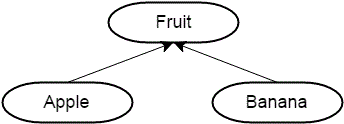

```cpp
#include <iostream>
#include <string>
#include <string_view>

class Person
{
public:
    std::string m_name{};
    int m_age{};

    Person(std::string_view name = "", int age = 0)
        : m_name{name}, m_age{age}
    {
    }

    const std::string& getName() const { return m_name; }
    int getAge() const { return m_age; }

};

// BaseballPlayer publicly inheriting Person
class BaseballPlayer : public Person
{
public:
    double m_battingAverage{};
    int m_homeRuns{};

    BaseballPlayer(double battingAverage = 0.0, int homeRuns = 0)
       : m_battingAverage{battingAverage}, m_homeRuns{homeRuns}
    {
    }
};

int main()
{
    // Create a new BaseballPlayer object
    BaseballPlayer joe{};
    // Assign it a name (we can do this directly because m_name is public)
    joe.m_name = "Joe";
    // Print out the name
    std::cout << joe.getName() << '\n'; // use the getName() function we've acquired from the Person base class

    return 0;
}
```

output will be:
```text
Joe
```
* Benfits of inheritance

Inheritance allows us to reuse classes by having other classes inherit their members.

## Order of construction of derived classes

When we create an object of a derived class, the base class constructor is called first, followed by the derived class constructor. This is because the derived class may rely on the base class being properly initialized before it can be initialized itself. The base class constructor is responsible for initializing the members of the base class, and the derived class constructor is responsible for initializing the members of the derived class. If the derived class constructor were called before the base class constructor, it would not have access to the members of the base class, which could lead to undefined behavior. Therefore, C++ ensures that the base class constructor is called first to properly initialize the base class before the derived class is initialized.

## Constructors and initialization of derived classes

When we create an object of a derived class, the constructor of the derived class is responsible for initializing the members of the derived class, while the constructor of the base class is responsible for initializing the members of the base class. The derived class constructor can call the base class constructor using an initializer list to ensure that the base class members are properly initialized before the derived class members are initialized. If the derived class constructor does not explicitly call the base class constructor, the default constructor of the base class will be called automatically. However, if the base class does not have a default constructor, or if we want to call a specific constructor of the base class, we must explicitly call it in the initializer list of the derived class constructor. This allows us to ensure that all members of both the base and derived classes are properly initialized when an object of the derived class is created.

example:
```cpp
#include <iostream>

class Base
{
private: // our member is now private
    int m_id {};

public:
    Base(int id=0)
        : m_id{ id }
    {
    }

    int getId() const { return m_id; }
};

class Derived: public Base
{
private: // our member is now private
    double m_cost;

public:
    Derived(double cost=0.0, int id=0)
        : Base{ id } // Call Base(int) constructor with value id!
        , m_cost{ cost }
    {
    }

    double getCost() const { return m_cost; }
};

int main()
{
    Derived derived{ 1.3, 5 }; // use Derived(double, int) constructor
    std::cout << "Id: " << derived.getId() << '\n';
    std::cout << "Cost: " << derived.getCost() << '\n';

    return 0;
}
```

Here :-

* Memory for derived is allocated.
* The Derived(double, int) constructor is called, where cost = 1.3, and id = 5.
* The compiler looks to see if we’ve asked for a particular Base class constructor. We have! So it calls Base(int) with id = 5.
* The base class constructor member initializer list sets m_id to 5.
* The base class constructor body executes, which does nothing.
* The base class constructor returns.
* The derived class constructor member initializer list sets m_cost to 1.3.
* The derived class constructor body executes, which does nothing.
* The derived class constructor returns.

### Inheritance chains

```cpp
#include <iostream>

class A
{
public:
    A(int a)
    {
        std::cout << "A: " << a << '\n';
    }
    ~A()
    {
        std::cout << "Destroying A\n";
    }
};

class B: public A
{
public:
    B(int a, double b)
    : A{ a }
    {
        std::cout << "B: " << b << '\n';
    }

    ~B()
    {
        std::cout << "Destroying B\n";
    }
};

class C: public B
{
public:
    C(int a, double b, char c)
    : B{ a, b }
    {
        std::cout << "C: " << c << '\n';
    }

    ~C()
    {
        std::cout << "Destroying C\n";
    }
};

int main()
{
    C c{ 5, 4.3, 'R' };

    return 0;
}
```

output 

A: 5
B: 4.3
C: R
Destroying C
Destroying B
Destroying A


### Destructors

When a derived class is destroyed, each destructor is called in the reverse order of construction. In the above example, when c is destroyed, the C destructor is called first, then the B destructor, then the A destructor.

##  Inheritance and access specifiers

### Protected Access Specifer

The protected access specifier allows the class the member belongs to, friends, and derived classes to access the member. However, protected members are not accessible from outside the class.

```cpp
class Base
{
public:
    int m_public {}; // can be accessed by anybody
protected:
    int m_protected {}; // can be accessed by Base members, friends, and derived classes
private:
    int m_private {}; // can only be accessed by Base members and friends (but not derived classes)
};

class Derived: public Base
{
public:
    Derived()
    {
        m_public = 1; // allowed: can access public base members from derived class
        m_protected = 2; // allowed: can access protected base members from derived class
        m_private = 3; // not allowed: can not access private base members from derived class
    }
};

int main()
{
    Base base;
    base.m_public = 1; // allowed: can access public members from outside class
    base.m_protected = 2; // not allowed: can not access protected members from outside class
    base.m_private = 3; // not allowed: can not access private members from outside class

    return 0;
}
```

### Different kinds of inheritance, and their impact on access

```cpp
// Inherit from Base publicly
class Pub: public Base
{
};

// Inherit from Base protectedly
class Pro: protected Base
{
};

// Inherit from Base privately
class Pri: private Base
{
};

class Def: Base // Defaults to private inheritance
{
};
```

That gives us 9 combinations: 3 member access specifiers (public, private, and protected), and 3 inheritance types (public, private, and protected).

1. Public inheritance


```cpp
class Base
{
public:
    int m_public {};
protected:
    int m_protected {};
private:
    int m_private {};
};

class Pub: public Base // note: public inheritance
{
    // Public inheritance means:
    // Public inherited members stay public (so m_public is treated as public)
    // Protected inherited members stay protected (so m_protected is treated as protected)
    // Private inherited members stay inaccessible (so m_private is inaccessible)
public:
    Pub()
    {
        m_public = 1; // okay: m_public was inherited as public
        m_protected = 2; // okay: m_protected was inherited as protected
        m_private = 3; // not okay: m_private is inaccessible from derived class
    }
};

int main()
{
    // Outside access uses the access specifiers of the class being accessed.
    Base base;
    base.m_public = 1; // okay: m_public is public in Base
    base.m_protected = 2; // not okay: m_protected is protected in Base
    base.m_private = 3; // not okay: m_private is private in Base

    Pub pub;
    pub.m_public = 1; // okay: m_public is public in Pub
    pub.m_protected = 2; // not okay: m_protected is protected in Pub
    pub.m_private = 3; // not okay: m_private is inaccessible in Pub

    return 0;
}
```

2. Protected inheritance
Protected inheritance is the least common method of inheritance. It is almost never used, except in very particular cases. With protected inheritance, the public and protected members become protected, and private members stay inaccessible.

3. Private inheritance

With private inheritance, all members from the base class are inherited as private. This means private members are inaccessible, and protected and public members become private.

```cpp
class Base
{
public:
    int m_public {};
protected:
    int m_protected {};
private:
    int m_private {};
};

class Pri: private Base // note: private inheritance
{
    // Private inheritance means:
    // Public inherited members become private (so m_public is treated as private)
    // Protected inherited members become private (so m_protected is treated as private)
    // Private inherited members stay inaccessible (so m_private is inaccessible)
public:
    Pri()
    {
        m_public = 1; // okay: m_public is now private in Pri
        m_protected = 2; // okay: m_protected is now private in Pri
        m_private = 3; // not okay: derived classes can't access private members in the base class
    }
};

int main()
{
    // Outside access uses the access specifiers of the class being accessed.
    // In this case, the access specifiers of base.
    Base base;
    base.m_public = 1; // okay: m_public is public in Base
    base.m_protected = 2; // not okay: m_protected is protected in Base
    base.m_private = 3; // not okay: m_private is private in Base

    Pri pri;
    pri.m_public = 1; // not okay: m_public is now private in Pri
    pri.m_protected = 2; // not okay: m_protected is now private in Pri
    pri.m_private = 3; // not okay: m_private is inaccessible in Pri

    return 0;
}
```

Private inheritance can be useful when the derived class has no obvious relationship to the base class, but uses the base class for implementation internally. In such a case, we probably don’t want the public interface of the base class to be exposed through objects of the derived class (as it would be if we inherited publicly). For example, if we were writing a class to represent a car, we might want to use private inheritance to inherit from a class that represents an engine, since a car has an engine, but a car is not an engine. In this case, we would want to use the functionality of the engine class internally within the car class, but we wouldn’t want the public interface of the engine class to be exposed through objects of the car class. Therefore, private inheritance would be appropriate in this case.

## Adding new functionality to a derived class (IMPORTANT)

One of the biggest benefits of using derived classes is the ability to reuse already written code. You can inherit the base class functionality and then add new functionality, modify existing functionality, or hide functionality you don’t want. 

```cpp
#include <iostream>

class Base
{
protected:
    int m_value {};

public:
    Base(int value)
        : m_value { value }
    {
    }

    void identify() const { std::cout << "I am a Base\n"; }
};
```
* Adding new functionality to the derived class

In the above example, because we have access to the source code of the Base class, we can add functionality directly to Base if we desire. There may be times when we have access to a base class but do not want to modify it. Consider the case where you have just purchased a library of code from a 3rd party vendor, but need some extra functionality. You could add to the original code, but this isn’t the best solution. What if the vendor sends you an update? Either your additions will be overwritten, or you’ll have to manually migrate them into the update, which is time-consuming and risky.

Alternatively, there may be times when it’s not even possible to modify the base class. Consider the code in the standard library. We aren’t able to modify the code that’s part of the standard library. But we are able to inherit from those classes, and then add our own functionality into our derived classes. The same goes for 3rd party libraries where you are provided with headers but the code comes precompiled.

```cpp
class Derived: public Base
{
public:
    Derived(int value)
        : Base { value }
    {
    }

    int getValue() const { return m_value; }
};
```

Now the public will be able to call getValue() on an object of type Derived to access the value of m_value.

```cpp
int main()
{
    Derived derived { 5 };
    std::cout << "derived has value " << derived.getValue() << '\n';

    return 0;
}
```

Note: We created getValue() in the Derived class as there was no any method (getValue()) in the Base class to access m_value. If there had been a getValue() method in the Base class, we could have just used that method without needing to add a new one in the Derived class.

## Calling inherited functions and overriding behavior

When a member function is called on a derived class object, the compiler first looks to see if any function with that name exists in the derived class. If so, all overloaded functions with that name are considered, and the function overload resolution process is used to determine whether there is a best match. If not, the compiler walks up the inheritance chain, checking each parent class in turn in the same way.

* Calling a base class function

First, let’s explore what happens when the derived class has no matching function, but the base class does:

```cpp
#include <iostream>

class Base
{
public:
    Base() { }

    void identify() const { std::cout << "Base::identify()\n"; }
};

class Derived: public Base
{
public:
    Derived() { }
};

int main()
{
    Base base {};
    base.identify();

    Derived derived {};
    derived.identify();

    return 0;
}
```

Output:

```text
Base::identify()
Base::identify()
```

### Redefining behaviors

However, if we had defined Derived::identify() in the Derived class, it would have been used instead.

```cpp
#include <iostream>

class Base
{
public:
    Base() { }

    void identify() const { std::cout << "Base::identify()\n"; }
};

class Derived: public Base
{
public:
    Derived() { }

    void identify() const { std::cout << "Derived::identify()\n"; }
};

int main()
{
    Base base {};
    base.identify();

    Derived derived {};
    derived.identify();

    return 0;
}
```

output:

```text
Base::identify()
Derived::identify()
```

Note: when you redefine a function in the derived class, the derived function does not inherit the access specifier of the function with the same name in the base class. It uses whatever access specifier it is defined under in the derived class. Therefore, a function that is defined as private in the base class can be redefined as public in the derived class, or vice-versa!

### Adding to existing functionality

Sometimes we don’t want to completely replace a base class function, but instead want to add additional functionality to it when called with a derived object. In the above example, note that Derived::identify() completely hides Base::identify()! This may not be what we want. It is possible to have our derived function call the base version of the function of the same name (in order to reuse code) and then add additional functionality to it.

```cpp
#include <iostream>

class Base
{
public:
    Base() { }

    void identify() const { std::cout << "Base::identify()\n"; }
};

class Derived: public Base
{
public:
    Derived() { }

    void identify() const
    {
        std::cout << "Derived::identify()\n";
        Base::identify(); // note call to Base::identify() here
    }
};

int main()
{
    Base base {};
    base.identify();

    Derived derived {};
    derived.identify();

    return 0;
}
```
Output:

```text
Base::identify()
Derived::identify()
Base::identify()
```

Why do we need to use the scope resolution operator (::)? 
Because if we just call identify() without the scope resolution operator, it will call Derived::identify() instead of Base::identify(), which would lead to infinite recursion. By using Base::identify(), we are explicitly telling the compiler to call the identify() function that is defined in the Base class, rather than the one that is defined in the Derived class. This allows us to reuse the functionality of the Base class function while still adding additional functionality in the Derived class function.

##  Hiding inherited functionality

* Changing an inherited member’s access level

Instead of redefining same function in the derived class, we can also just change the access level of the base class function in the derived class.

```cpp
#include <iostream>

class Base
{
private:
    int m_value {};

public:
    Base(int value)
        : m_value { value }
    {
    }

protected:
    void printValue() const { std::cout << m_value; }
};

class Derived: public Base
{
public:
    Derived(int value)
        : Base { value }
    {
    }

    // Base::printValue was inherited as protected, so the public has no access
    // But we're changing it to public via a using declaration
    using Base::printValue; // note: no parenthesis here
};

int main()
{
    Derived derived { 5 };
    derived.printValue(); // now we can call printValue() on an object of type Derived, even though it was protected in Base

    return 0;
}
```

* Hiding functionality

In C++, it is not possible to remove or restrict functionality from a base class other than by modifying the source code. However, in a derived class, it is possible to hide functionality that exists in the base class, so that it can not be accessed through the derived class. This can be done simply by changing the relevant access specifier.

just decrease access level of the base class function in the derived class. For example, if a function is public in the base class, we can make it private in the derived class, which will hide it from users of the derived class.

```cpp
#include <iostream>

class Base
{
public:
	int m_value{};
};

class Derived : public Base
{
private:
	using Base::m_value;

public:
	Derived(int value) : Base { value }
	{
	}
};

int main()
{
	Derived derived{ 7 };
	std::cout << derived.m_value; // error: m_value is private in Derived

	Base& base{ derived };
	std::cout << base.m_value; // okay: m_value is public in Base

	return 0;
}
```
Note:-

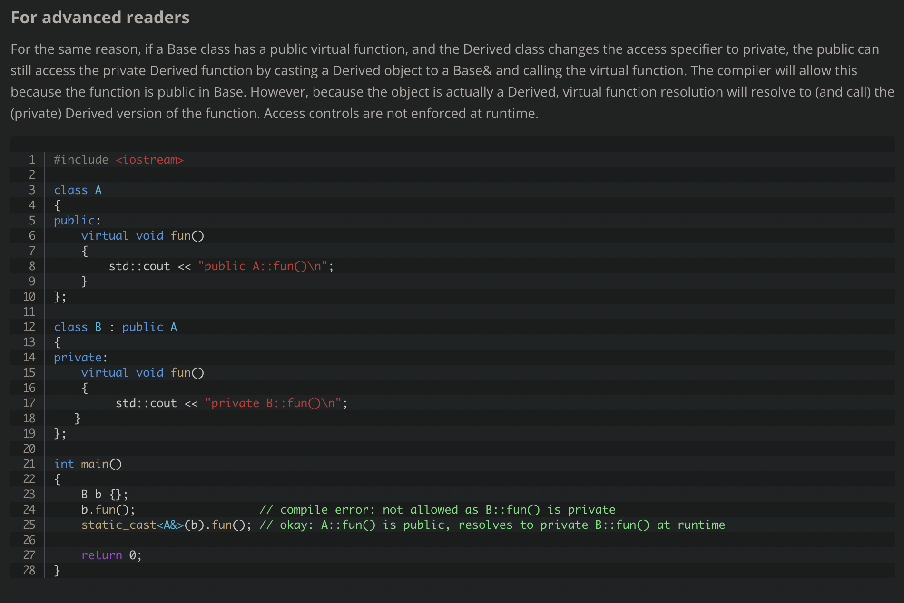

## Multiple inheritance

Multiple inheritance enables a derived class to inherit members from more than one parent.

Let’s say we wanted to write a program to keep track of a bunch of teachers. A teacher is a person. However, a teacher is also an employee (they are their own employer if working for themselves). Multiple inheritance can be used to create a Teacher class that inherits properties from both Person and Employee. To use multiple inheritance, simply specify each base class (just like in single inheritance), separated by a comma.

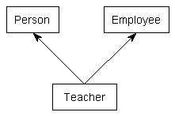

```cpp
#include <string>
#include <string_view>

class Person
{
private:
    std::string m_name{};
    int m_age{};

public:
    Person(std::string_view name, int age)
        : m_name{ name }, m_age{ age }
    {
    }

    const std::string& getName() const { return m_name; }
    int getAge() const { return m_age; }
};

class Employee
{
private:
    std::string m_employer{};
    double m_wage{};

public:
    Employee(std::string_view employer, double wage)
        : m_employer{ employer }, m_wage{ wage }
    {
    }

    const std::string& getEmployer() const { return m_employer; }
    double getWage() const { return m_wage; }
};

// Teacher publicly inherits Person and Employee
class Teacher : public Person, public Employee
{
private:
    int m_teachesGrade{};

public:
    Teacher(std::string_view name, int age, std::string_view employer, double wage, int teachesGrade)
        : Person{ name, age }, Employee{ employer, wage }, m_teachesGrade{ teachesGrade }
    {
    }
};

int main()
{
    Teacher t{ "Mary", 45, "Boo", 14.3, 8 };

    return 0;
}
```

* Problems with multiple inheritance

While multiple inheritance seems like a simple extension of single inheritance, multiple inheritance introduces a lot of issues that can markedly increase the complexity of programs and make them a maintenance nightmare. Let’s take a look at some of these situations.

```cpp
#include <iostream>

class USBDevice
{
private:
    long m_id {};

public:
    USBDevice(long id)
        : m_id { id }
    {
    }

    long getID() const { return m_id; }
};

class NetworkDevice
{
private:
    long m_id {};

public:
    NetworkDevice(long id)
        : m_id { id }
    {
    }

    long getID() const { return m_id; }
};

class WirelessAdapter: public USBDevice, public NetworkDevice
{
public:
    WirelessAdapter(long usbId, long networkId)
        : USBDevice { usbId }, NetworkDevice { networkId }
    {
    }
};

int main()
{
    WirelessAdapter c54G { 5442, 181742 };
    std::cout << c54G.getID(); // Which getID() do we call?

    return 0;
}
```

When c54G.getID() is compiled, the compiler looks to see if WirelessAdapter contains a function named getID(). It doesn’t. The compiler then looks to see if any of the parent classes have a function named getID(). See the problem here? The problem is that c54G actually contains TWO getID() functions: one inherited from USBDevice, and one inherited from NetworkDevice. Consequently, this function call is ambiguous, and you will receive a compiler error if you try to compile it.

However, there is a way to work around this problem: you can explicitly specify which version you meant to call:

```cpp
std::cout << c54G.USBDevice::getID(); // calls getID() from USBDevice
std::cout << c54G.NetworkDevice::getID(); // calls getID() from NetworkDevice
```

Another problem with multiple inheritance which is more serious:- the diamond problem, which your author likes to call the “diamond of doom”. This occurs when a class multiply inherits from two classes which each inherit from a single base class. This leads to a diamond shaped inheritance pattern.

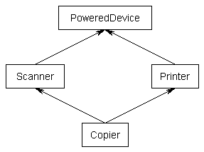

In detail we will study it in future chapters.


