Source : learncpp.com

# Chapter 7 

## Local variables 
scope determines where an identifier can be accessed within the source code. When an identifier can not be accessed, we say it is out of scope. Scope is a compile-time property, and trying to use an identifier when it is out of scope will result in a compile error.

* Linkage 
An identifier’s linkage determines whether a declaration of that same identifier in a different scope refers to the same object (or function). Local variables have no linkage. Each declaration of an identifier with no linkage refers to a unique object or function.

```cpp
    int main()
    {
        int x { 2 }; // local variable, no linkage

        {
            int x { 3 }; // this declaration of x refers to a different object than the previous x
        }

        return 0;
    }
```

* Global variables have static duration : Global variables are created when the program starts (before main() begins execution), and destroyed when it ends. This is called static duration. Variables with static duration are sometimes called static variables.

* Global variables have external linkage by default. This means that a declaration of the same identifier in a different scope refers to the same object.

## Internal linkage :
An identifier with internal linkage can be seen and used within a single translation unit, but it is not accessible from other translation units. This means that if two source files have identically named identifiers with internal linkage, those identifiers will be treated as independent (and do not result in an ODR violation for having duplicate definitions).

* Gloabal variables can be given internal linkage by using the static keyword : Global variables with internal linkage are sometimes called internal variables.

    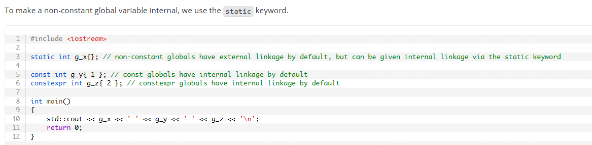

* Functions can also have internal linkage by using the static keyword : Functions with internal linkage are sometimes called internal functions.

    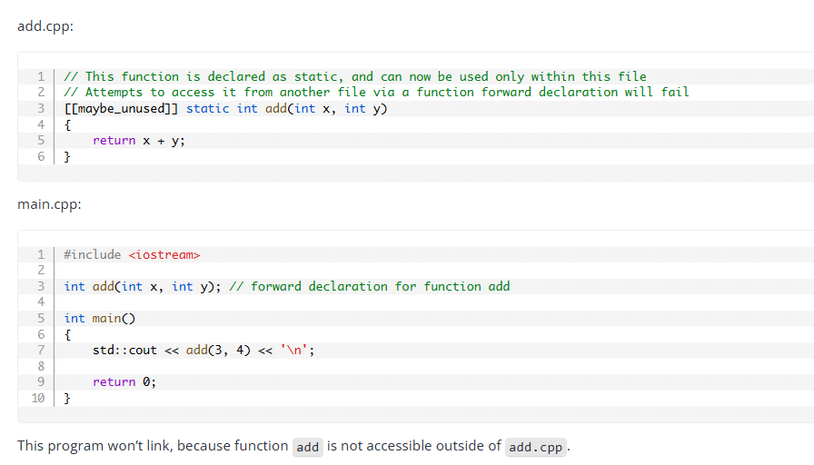

## External linkage and variable forward declarations

An identifier with external linkage can be seen and used both from the file in which it is defined, and from other code files (via a forward declaration).

* Global variables with external linkage are sometimes called external variables.
```cpp
    int g_x { 2 }; // non-constant globals are external by default (no need to use extern)

    extern const int g_y { 3 }; // const globals can be defined as extern, making them external
    extern constexpr int g_z { 3 }; // constexpr globals can be defined as extern, making them external (but this is pretty useless, see the warning in the next section)

    int main()
    {
        return 0;
    }
```
Note : const global variables have internal linkage by default. Therefore, to make a const global variable accessible from other translation units, you must explicitly declare it as extern.

Note: Variable forward declarations via the extern keyword, To use a global variable defined in another translation unit, you must provide a forward declaration for it using the extern keyword. A variable forward declaration tells the compiler about the variable's type and name, but does not create a new instance of the variable.

example :
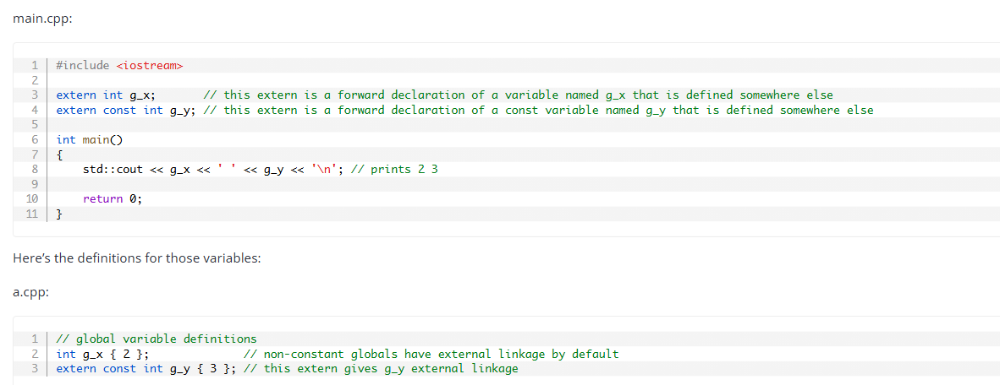

## Inline functions and variables:

 Inline expansion is a process where a function call is replaced by the code from the called function’s definition. This can improve performance by eliminating the overhead of a function call, especially for small functions that are called frequently.

 Note: inline expansion has its own potential cost: if the body of the function being expanded takes more instructions than the function call being replaced, then each inline expansion will cause the executable to grow larger. Larger executables tend to be slower (due to not fitting as well in memory caches).

### Modern inline functions and variables :

 In modern C++, the term inline has evolved to mean “multiple definitions are allowed”. Thus, an inline function is one that is allowed to be defined in multiple translation units (without violating the ODR). This is particularly useful for functions defined in header files, which are typically included in multiple source files.

 Inline functions have two primary requirements:
 - The compiler needs to be able to see the full definition of an inline function in each translation unit where the function is used.

### inline variables : 
Similar to inline functions, inline variables are allowed to be defined in multiple translation units without violating the ODR. This is useful for defining global variables in header files.


## Qualified and unqualified names :

A qualified name is a name that includes an associated scope. Most often, names are qualified with a namespace using the scope resolution operator (::). For example:
    std::cout // identifier cout is qualified by namespace std
    ::foo // identifier foo is qualified by the global namespace

### Using-directives 
A using-directive brings all the names from a namespace into the current scope. For example:
    using namespace MyNamespace;

    Problems with using-directives : Using-directives can lead to name conflicts if two namespaces contain identically named identifiers. For example:
    ex:
```cpp
    #include <iostream>

    namespace A
    {
        int x { 10 };
    }

    namespace B
    {
        int x{ 20 };
    }

    int main()
    {
        using namespace A;
        using namespace B;

        std::cout << x << '\n';

        return 0;
    }
```


## Unnamed namespaces : 
An unnamed namespace is a namespace that does not have a name. Identifiers declared in an unnamed namespace have internal linkage by default. This means that they can only be accessed within the same translation unit. 

Difference between unnamed namespaces and static variables/functions : Both unnamed namespaces and static variables/functions provide internal linkage, but they do so in different ways. Unnamed namespaces group related identifiers together, while static variables/functions are declared individually.


# Chapter 10 : Type Conversion, Type Aliases, and Type Deduction :

## What is type conversion?
Type conversion is the process of converting a value from one data type to another. This can happen either implicitly (automatically by the compiler) or explicitly (manually by the programmer).

### Why conversions are needed?

The value of an object is stored as a sequence of bits, and the data type of the object tells the compiler how to interpret those bits into meaningful values.

## Narrowing conversions :

In C++, a narrowing conversion is a potentially unsafe numeric conversion where the destination type may not be able to hold all the values of the source type.
For example, converting a floating-point number to an integer can result in loss of the fractional part, and converting a larger integer type to a smaller integer type can result in overflow.

## Explicit type conversion (casting) and static_cast

Type Casting operators in C++:
1. static_cast
2. dynamic_cast
3. const_cast
4. reinterpret_cast
5. C-style cast

First four are known as named casts or C++ style casts, while the last one is known as C-style cast.

Note: Avoid const_cast and reinterpret_cast unless you have a very good reason to use them.

* C-style caste : The syntax for a C-style cast is as follows:
    (NewType)expression

    ex: int x { 5 };
         double y = (double)x; // C-style cast from int to double

    Note: C++ also provied an alternative form of c style cast:
        NewType(expression)

        ex: double y = double(x); // C-style cast from int to double

Note: C-style casts are generally considered less safe than C++ style casts because they can perform multiple types of conversions (static, dynamic, const, and reinterpret) without any explicit indication of which type of conversion is being performed. This can lead to unintended consequences and make the code harder to read and maintain.

* static_cast : The syntax for a static_cast is as follows:
    static_cast<NewType>(expression)

    ex: int x { 5 };
         double y = static_cast<double>(x); // static_cast from int to double
    
    Important properties of static_cast:
    1. static_cast provides compile-time type checking. If we try to convert a value to a type and the compiler doesn’t know how to perform that conversion, we will get a compilation error.
    2. static_cast is (intentionally) less powerful than a C-style cast, as it will prevent certain kinds of dangerous conversions (such as those that require reinterpretation or discarding const).

    Note : static_cast used direct intilization.

    Use : to make narrowing conversions explicit :-

    If we used list initialization, the compiler would yield an error. Workarround :- 
    int i { 48 };
    // explicit conversion from int to char, so that a char is assigned to variable ch
    char ch { static_cast<char>(i) };

## Type deduction for objects using the auto keyword

Type deduction is the process by which the compiler automatically deduces the type of a variable from its initializer. The auto keyword is used to declare a variable with an automatically deduced type.

auto d { 5.0 }; // 5.0 is a double literal, so d will be deduced as a double

Note : Prior to C++17, auto d{ 5.0 }; would deduce d to be of type std::initializer_list<double> rather than double
    For C++ 14 or before use copy initialization to avoid this issue:
    auto d = 5.0; // d will be deduced as a double
Note:  
    auto b {5u}; // u suffix causes b to be deduced to unsigned int 

Note: Type deduction drops const from the deduced type

    const int a { 5 }; // a has type const int
    auto b { a };      // b has type int (const dropped)

## Type deduction for functions 

For C++ 14 : 
```cpp
    auto add(int a, int b)
    {
        return a + b;
    }
```
Note: for Type deduction to work with function parameters types , we required c++ 20.
    
## Downsides of using auto for function return types :

   1. Functions that use an auto return type must be fully defined before they can be used (a forward declaration is not sufficient).

* Trailing return type syntax : 

    The auto keyword can also be used to declare functions using a trailing return syntax, where the return type is specified after the rest of the function prototype.

1. For functions with complex return types, a trailing return type can make the function easier to read: 
    #include <type_traits> // for std::common_type

    std::common_type_t<int, double> compare(int, double);         // harder to read (where is the name of the function in this mess?)
    auto compare(int, double) -> std::common_type_t<int, double>; // easier to read (we don't have to read the return type unless we care)


# Chapter 11 : Introduction to function overloading:
 
## How overloaded functions are differentiated :

Functions property : 1. No of parameters 2. Types of parameters 3. Functional-level qualifiers (const, volatile)

Note: 
    void print(int);
    void print(const int); // not differentiated from print(int)

For parameters passed by value, the const qualifier is also not considered. 

## Function overload resolution and ambiguous calls :

*No matching functions were found. The compiler moves to the next step in the sequence.
*A single matching function was found. This function is considered to be the best match. The matching process is now complete, and subsequent steps are not executed.
*More than one matching function was found. The compiler will issue an ambiguous match compile error.

## Deleting functions

A function can be deleted by using the delete specifier in its declaration. This prevents the function from being called, and any attempt to call a deleted function will result in a compile error.
```cpp
    void doSomething() = delete; // delete the function doSomething

    We can also delete not required overloads of a function using function templates. For example, if we want to delete the overload of a function that takes a double parameter, we can do the following:

    #include <iostream>

    // This function will take precedence for arguments of type int
    void printInt(int x)
    {
        std::cout << x << '\n';
    }

    // This function template will take precedence for arguments of other types
    // Since this function template is deleted, calls to it will halt compilation
    template <typename T>
    void printInt(T x) = delete;

    int main()
    {
        printInt(97);   // okay
        printInt('a');  // compile error
        printInt(true); // compile error

        return 0;
    }
```
## Default arguments

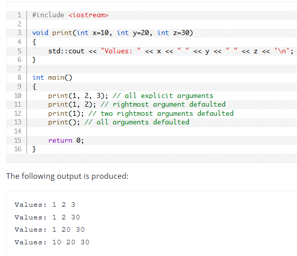

note: Default arguments can not be redeclared, and must be declared before use
```cpp
   #include <iostream>

    void print(int x, int y=4); // forward declaration

    void print(int x, int y=4) // compile error: redefinition of default argument
    {
        std::cout << "x: " << x << '\n';
        std::cout << "y: " << y << '\n';
    }
```

Note : The default argument must also be declared in the translation unit before it can be used:

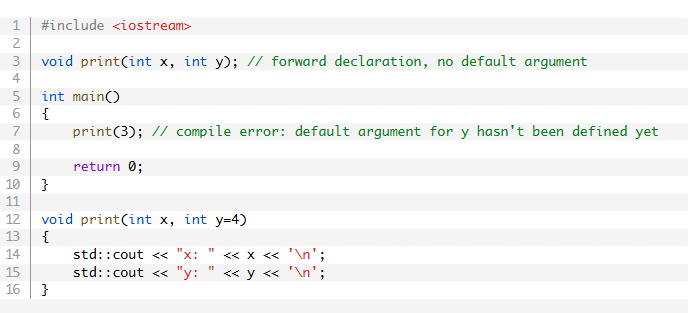

Note: Best practice is to place default arguments in function declarations (e.g., in header files), rather than in function definitions (e.g., in source files). This helps ensure that the default arguments are visible to all translation units that include the header file.

## Function templates

A function template is a function-like definition that is used to generate one or more overloaded functions, each with a different set of actual types. This is what will allow us to create functions that can work with many different types. 

C++ supports three types of templates parameters:

* Type template parameters (where the template parameter represents a type).
* Non-type template parameters (where the template parameter represents a constexpr value).
* Template template parameters (where the template parameter represents a template).

```cpp
ex. 

#include <iostream>

    template <typename T>
    T max(T x, T y)
    {
        return (x < y) ? y : x;
    }

    int main()
    {
        std::cout << max<int>(1, 2) << '\n'; // instantiates and calls function max<int>(int, int)

        return 0;
    }

    Case : 

    #include <iostream>
    template <typename T>
    T max(T x, T y)
    {
        std::cout << "called max<int>(int, int)\n";
        return (x < y) ? y : x;
    }

    int max(int x, int y)
    {
        std::cout << "called max(int, int)\n";
        return (x < y) ? y : x;
    }

    int main()
    {
        std::cout << max<int>(1, 2) << '\n'; // calls max<int>(int, int)
        std::cout << max<>(1, 2) << '\n';    // deduces max<int>(int, int) (non-template functions not considered) (Important note: the empty angle brackets are required to indicate that we want to use template argument deduction for this call)
        std::cout << max(1, 2) << '\n';      // calls max(int, int)

        return 0;
    }
```
    
* Functions templates with non-type template parameters : Functions containing template parameters and non template parameters.
* Note : Beaware function templates with modifiable static local variables can lead to unexpected behavior, as all instantiations of the function template will share the same static variable. This can cause unintended side effects if the function is called with different template arguments.

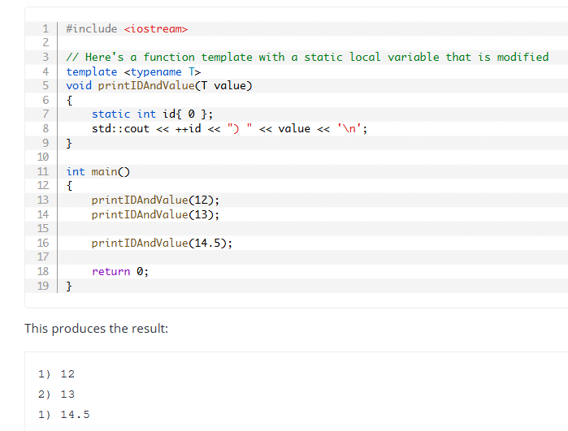

## Function templates with multiple template types

ex: 
```cpp
#include <iostream>

template <typename T>
T max(T x, T y)
{
    return (x < y) ? y : x;
}

int main()
{
    std::cout << max(2, 3.5) << '\n';  // compile error

    return 0;
}
```
To handle such cases, we can define a function template with multiple template parameters:
#include <iostream>

template <typename T1, typename T2>


## Abbreviated function templates (C++20): 
C++20 introduces a new use of the auto keyword: When the auto keyword is used as a parameter type in a normal function, the compiler will automatically convert the function into a function template with each auto parameter becoming an independent template type parameter. This method for creating a function template is called an abbreviated function template.
```cpp
    auto max(auto x, auto y)
    {
        return (x < y) ? y : x;
    }

    is shorthand for :

    template <typename T, typename U>
    auto max(T x, U y)
    {
        return (x < y) ? y : x;
    }
```
## Non-type template parameters
A non-type template parameter is a template parameter with a fixed type that serves as a placeholder for a constexpr value passed in as a template argument.

A non-type template parameter can be any of the following types:

* An integral type
* An enumeration type
* std::nullptr_t
* A floating point type (since C++20)
* A pointer or reference to an object
* A pointer or reference to a function
* A pointer or reference to a member function
* A literal class type (since C++20)

ex. 
```cpp
#include <bitset>

int main()
{
    std::bitset<8> bits{ 0b0000'0101 }; // The <8> is a non-type template parameter

    return 0;
}
```
Defining our own non-type template parameters :-
```cpp
#include <iostream>

template <int N> // declare a non-type template parameter of type int named N
void print()
{
    std::cout << N << '\n'; // use value of N here
}

int main()
{
    print<5>(); // 5 is our non-type template argument

    return 0;
}
```
11.10 — Using function templates in multiple files
```cpp
main.cpp:

    #include <iostream>

    template <typename T>
    T addOne(T x); // function template forward declaration

    int main()
    {
        std::cout << addOne(1) << '\n';
        std::cout << addOne(2.3) << '\n';

        return 0;
    }

add.cpp:

    template <typename T>
    T addOne(T x) // function template definition
    {
        return x + 1;
    }
```
    Note : If addOne were a non-template function, this program would work fine: In main.cpp, the compiler would be satisfied with the forward declaration of addOne, and the linker would connect the call to addOne() in main.cpp to the function definition in add.cpp.

    We can fix it by adding function definition in the header file and including it in both source files. 

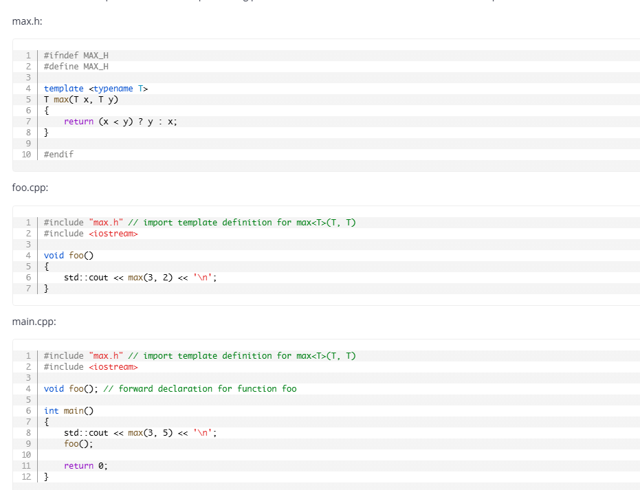


# Chapter 12 : Compound Types : References and pointers:
    
## Lvalue and rvalue expressions
 An lvalue is an expression that refers to a memory location and allows us to take the address of that location using the address-of operator (&). An rvalue is an expression that does not refer to a memory location and cannot have its address taken.Commonly seen rvalues include literals (except C-style string literals, which are lvalues) and the return value of functions and operators that return by value. Rvalues aren’t identifiable (meaning they have to be used immediately), and only exist within the scope of the expression in which they are used.

ex: 
```cpp
int return5()
{
    return 5;
}

int main()
{
    int x{ 5 }; // 5 is an rvalue expression
    const double d{ 1.2 }; // 1.2 is an rvalue expression

    int y { x }; // x is a modifiable lvalue expression
    const double e { d }; // d is a non-modifiable lvalue expression
    int z { return5() }; // return5() is an rvalue expression (since the result is returned by value)

    int w { x + 1 }; // x + 1 is an rvalue expression
    int q { static_cast<int>(d) }; // the result of static casting d to an int is an rvalue expression

    return 0;
}
```

### Lvalue references 
 
An lvalue reference is a reference that can only bind to lvalues. It is declared using the & symbol. For example:
```cpp
int x { 5 }; // x is an lvalue
int& ref { x }; // ref is an lvalue reference to x
```
Note : Any change made to ref will also change x, since ref is just another name for x.

Note : Once initialized, a reference in C++ cannot be reseated, meaning it cannot be changed to reference another object. If we try to assign a new value to a reference, we are actually assigning a new value to the object that the reference is bound to, not changing the reference itself.

ex:
```cpp
int x { 5 };
int& ref { x }; // ref is an lvalue reference to x
ref = 10; // this changes the value of x to 10, but ref still references x
cout << x << '\n'; // outputs 10
```

Note: references aren't objects themselves, but rather aliases for other objects. They don't have their own memory address, and they can't be null. This is why references must be initialized when they are declared, and why they can't be reseated to refer to a different object later on.

##  Lvalue references to const:

```cpp
const int x { 5 }; // x is a non-modifiable (const) lvalue
int& ref { x }; // error: ref can not bind to non-modifiable lvalue
// This is not allowed because ref is a modifiable lvalue reference, and it cannot bind to a non-modifiable (const) lvalue like x. To fix this, we can declare ref as a reference to const:
const int& ref { x }; // ref is a reference to const, and can bind to x
```

Also,

```cpp
int x { 5 }; // x is a modifiable lvalue
const int& ref { x }; // ref is a reference to const, and can bind to

// This is allowed because ref is a reference to const, which can bind to a modifiable lvalue like x. However, since ref is a reference to const, we cannot use it to modify the value of x through ref. Any attempt to do so will result in a compile error.
 ```

Note: Unlike a reference to non-const (which can only bind to modifiable lvalues), a reference to const can bind to modifiable lvalues, non-modifiable lvalues, and rvalues. Therefore, if we make a reference parameter const, then it will be able to bind to any type of argument passed to the function, which can be useful for writing more flexible and reusable code.


## Pointers

A pointer is an object that holds a memory address (typically of another variable) as its value. This allows us to store the address of some other object to use later.

Note : The address-of operator returns a pointer

```cpp
#include <iostream>
#include <typeinfo>

int main()
{
	int x{ 4 };
	std::cout << typeid(x).name() << '\n';  // print the type of x
	std::cout << typeid(&x).name() << '\n'; // print the type of &x

	return 0;
}
```

output:
```
int
int *
```

### Dangling pointers

a dangling pointer is a pointer that is holding the address of an object that is no longer valid (e.g. because it has been destroyed).

### Pointers and const

```cpp
int main()
{
    const int x { 5 }; // x is now const
    int* ptr { &x };   // compile error: cannot convert from const int* to int* or error: cannot initialize a variable of type 'int *' with an rvalue of type 'const int *'

    return 0;
}
```
* Pointer to const : A pointer to const is a pointer that points to a const object. This means that we cannot use the pointer to modify the value of the object it points to, but we can change the pointer itself to point to a different object.

```cpp
int main()
{
    const int x { 5 }; // x is a const int
    const int* ptr { &x }; // ptr is a pointer to const int, and can point to x
    *ptr = 10; // compile error: cannot modify the value of x through ptr
    return 0;
}
```

Note: ptr points to a const int. Because the data type being pointed to is const, the value being pointed to can’t be changed. However, because a pointer to const is not const itself (it just points to a const value), we can change what the pointer is pointing at by assigning the pointer a new address:

```cpp
int main()
{
    const int x{ 5 };
    const int* ptr { &x }; // ptr points to const int x

    const int y{ 6 };
    ptr = &y; // okay: ptr now points at const int y

    return 0;
}
```
Note: Just like with references, we can also have pointers to const that point to modifiable objects. This is allowed because the pointer itself is not const, but rather it points to a const value. However, since the pointer points to a const value, we cannot use it to modify the value of the object through the pointer.

```cpp
int main()
{
    int x{ 5 }; // x is a modifiable int
    const int* ptr { &x }; // ptr is a pointer to const int, and can point to x
    *ptr = 10; // compile error: cannot modify the value of x through ptr  
    return 0;
}
```

* Const pointer :  A const pointer is a pointer that is itself const, meaning that we cannot change the pointer to point to a different object after it has been initialized. However, we can still modify the value of the object that the const pointer points to (unless the object itself is also const).

```cpp
int main()
{
    int x{ 5 }; // x is a modifiable int
    int* const ptr { &x }; // ptr is a const pointer to int, and can point to x
    *ptr = 10; // okay: we can modify the value of x through ptr
    int y{ 6 };
    ptr = &y; // compile error: cannot change where ptr points (ptr is const)

    return 0;
}
```

## Pass by address

Why we required pass by address? : Pass by value and pass by reference are the two most common ways to pass arguments to functions in C++. However, there are some cases where neither of these methods is suitable. For example, if we want to pass a large object to a function, passing by value can be inefficient because it involves making a copy of the object. On the other hand, if we want to allow the function to modify the argument, passing by reference may not be appropriate because it can lead to unintended side effects. In such cases, pass by address can be a useful alternative.

c++ provides a way to pass values to functions by address using pointers. With pass by address, instead of providing an object as an argument, the caller provides an object’s address (via a pointer). 

```cpp
void printByValue(std::string val) // The function parameter is a copy of str
{
    std::cout << val << '\n'; // print the value via the copy
}

void printByReference(const std::string& ref) // The function parameter is a reference that binds to str
{
    std::cout << ref << '\n'; // print the value via the reference
}

void printByAddress(const std::string* ptr) // The function parameter is a pointer that holds the address of str
{
    std::cout << *ptr << '\n'; // print the value via the dereferenced pointer
}

int main()
{
    std::string str { "Hello, world!" };

    printByValue(str); // pass by value
    printByReference(str); // pass by reference
    printByAddress(&str); // pass by address (pass the address of str)

    return 0;
}
```

* Pass by address… by reference?

we can also pass pointers by reference, which allows us to modify the pointer itself (i.e., change where it points) within the function. This can be useful when we want to allow a function to modify the pointer argument to point to a different object.

```cpp
void modifyPointer(int*& ptr) // ptr is a reference to a pointer to int
{
    static int y { 10 }; // create a static int to point to (static so that it remains valid after the function returns)
    ptr = &y; // modify the pointer to point to y
}

int main()
{
    int x { 5 };
    int* ptr { &x }; // ptr initially points to x

    modifyPointer(ptr); // pass the pointer by reference to the function
    std::cout << *ptr << '\n'; // outputs 10, since ptr now points to y
}
```

## Return by reference and return by address

* Return by reference : A function can return a reference to an object, which allows the caller to access and modify the object directly through the reference. This can be useful for returning large objects without incurring the overhead of copying, or for allowing the caller to modify an object that is owned by the function.

```cpp
#include <iostream>
#include <string>

const std::string& getProgramName() // returns a const reference
{
    static const std::string s_programName { "Calculator" }; // has static duration, destroyed at end of program

    return s_programName;
}

int main()
{
    std::cout << "This program is named " << getProgramName();

    return 0;
}
```

Note: The object being returned by reference must exist after the function returns, otherwise we would be returning a reference to an object that has been destroyed, which would lead to undefined behavior if we try to access it.

Note: Don’t return non-const static local variables by reference
```cpp

#include <iostream>
#include <string>

const int& getNextId()
{
    static int s_x{ 0 }; // note: variable is non-const
    ++s_x; // generate the next id
    return s_x; // and return a reference to it
}

int main()
{
    const int& id1 { getNextId() }; // id1 is a reference
    const int& id2 { getNextId() }; // id2 is a reference

    std::cout << id1 << id2 << '\n';

    return 0;
}
```

Note: It’s okay to return reference parameters by reference
```cpp
#include <iostream>
#include <string>

// Takes two std::string objects, returns the one that comes first alphabetically
const std::string& firstAlphabetical(const std::string& a, const std::string& b)
{
	return (a < b) ? a : b; // We can use operator< on std::string to determine which comes first alphabetically
}

int main()
{
	std::string hello { "Hello" };
	std::string world { "World" };

	std::cout << firstAlphabetical(hello, world) << '\n';

	return 0;
}
```

## In and Out parameters

* In parameters

In most cases, a function parameter is used only to receive an input from the caller. Parameters that are used only for receiving input from the caller are sometimes called in parameters.

* Out parameters

In some cases, a function parameter is used only to send an output back to the caller. Parameters that are used only for sending output back to the caller are sometimes called out parameters.

# Chapter 14: Classes and Objects

## What is object-oriented programming?

In object-oriented programming (often abbreviated as OOP), the focus is on creating program-defined data types that contain both properties and a set of well-defined behaviors

## objects 

An object is an instance of a class. It is a concrete entity that has a state (represented by its properties) and behavior (represented by its member functions). Objects are created from classes, which serve as blueprints for defining the structure and behavior of the objects.

## Member functions

Member functions are functions that are defined within a class and operate on the data members of that class. They can access and modify the properties of the class, and they define the behavior of the objects created from that class. Member functions can be called on objects of the class to perform specific actions or to retrieve information about the object's state.

ex:  

```cpp
// Member function version
#include <iostream>

struct Date
{
    int year {};
    int month {};
    int day {};

    void print() // defines a member function named print
    {
        std::cout << year << '/' << month << '/' << day;
    }
};

int main()
{
    Date today { 2020, 10, 14 }; // aggregate initialize our struct

    today.day = 16; // member variables accessed using member selection operator (.)
    today.print();  // member functions also accessed using member selection operator (.)

    return 0;
}
```
Note: Member functions defined inside the class type definition are implicitly inline, so they will not cause violations of the one-definition rule if the class type definition is included into multiple code files.

Note: Non-static data members are always initialized in declaration order (top-to-bottom in the class/struct). Initializers can reference later-declared members/functions (name lookup allows it), but accessing their uninitialized values causes undefined behavior (UB).

ex: 

```cpp
struct Foo {
    int z() { return m_data; }  // Function body runs later, not during init
    int x() { return y(); }     // Calls later function
    int m_data { y() };         // Uses y(), which returns constant (no UB)
    int y() { return 5; }       // Safe, no data access during init
};
```

Bad Case:

```cpp
struct Bad {
    int m_bad1 { m_data };      // UB: m_data not initialized yet
    int m_bad2 { fcn() };       // UB: fcn() reads uninitialized m_data
    int m_data { 5 };           // Declared last, initializes last
    int fcn() { return m_data; }// Function reads uninit data during init
};
```

## Const class objects and const member functions

Const class objects are objects that are declared with the const qualifier. This means that the state of a const object cannot be modified after it has been initialized. Modifying a const object will result in a compile-time error.

ex:

```cpp
struct Date
{
    int year {};
    int month {};
    int day {};

    void incrementDay()
    {
        ++day;
    }
};

int main()
{
    const Date today { 2020, 10, 14 }; // const

    today.day += 1;        // compile error: can't modify member of const object
    today.incrementDay();  // compile error: can't call member function that modifies member of const object

    return 0;
}
```
Note: const class object cannot call any member function member function is not modifying state of the object or not. To allow const objects to call member functions, we can declare those member functions as const member functions but still they can not modify the state of the object.

To address above notes use :-  A const member function is a member function that guarantees it will not modify the object or call any non-const member functions (as they may modify the object). A const member function is declared by adding the const qualifier after the parameter list in the function declaration and definition.

```cpp

#include <iostream>

struct Date
{
    int year {};
    int month {};
    int day {};

    void print() const // now a const member function
    {
        std::cout << year << '/' << month << '/' << day;
    }
};

int main()
{
    const Date today { 2020, 10, 14 }; // const

    today.print();  // ok: const object can call const member function

    return 0;
}
```
Note: Const member functions may be called on non-const objects, Because const member functions can be called on both const and non-const objects, if a member function does not modify the state of the object, it should be made const.

## Public and private members and access specifiers

Public members of a class are accessible from outside the class, while private members are only accessible from within the class. Access specifiers are used to specify the access level of class members. The three access specifiers in C++ are public, private, and protected.

## Access functions

An access function is a trivial public member function whose job is to retrieve or change the value of a private member variable.

## Getter and setter functions
Getters (also sometimes called accessors) are public member functions that return the value of a private member variable. Setters (also sometimes called mutators) are public member functions that set the value of a private member variable.

Note: Getters are usually made const, so they can be called on both const and non-const objects. Setters should be non-const, so they can modify the data members.  

## Returning data members by lvalue reference

Member functions can also return data members by (const) lvalue reference. Data members have the same lifetime as the object containing them. Since member functions are always called on an object, and that object must exist in the scope of the caller, it is generally safe for a member function to return a data member by (const) lvalue reference (as the member being returned by reference will still exist in the scope of the caller when the function returns).

```cpp
#include <iostream>
#include <string>

class Employee
{
	std::string m_name{};

public:
	void setName(std::string_view name) { m_name = name; }
	const std::string& getName() const { return m_name; } //  getter returns by const reference
};

int main()
{
	Employee joe{}; // joe exists until end of function
	joe.setName("Joe");

	std::cout << joe.getName(); // returns joe.m_name by reference

	return 0;
}
```

Note: A member function returning a reference should return a reference of the same type as the data member being returned, to avoid unnecessary conversions. Best practice use auto deduction.

ex:

```cpp

#include <iostream>
#include <string>

class Employee
{
	std::string m_name{};

public:
	void setName(std::string_view name) { m_name = name; }
	const auto& getName() const { return m_name; } // uses `auto` to deduce return type from m_name
};

int main()
{
	Employee joe{}; // joe exists until end of function
	joe.setName("Joe");

	std::cout << joe.getName(); // returns joe.m_name by reference

	return 0;
}
```

## Rvalue implicit objects and return by reference

An rvalue object is destroyed at the end of the full expression in which it is created. Any references to members of the rvalue object are left dangling at that point.

A reference to a member of an rvalue object can only be safely used within the full expression where the rvalue object is created.

ex :

```cpp
#include <iostream>
#include <string>
#include <string_view>

class Employee
{
	std::string m_name{};

public:
	void setName(std::string_view name) { m_name = name; }
	const std::string& getName() const { return m_name; } //  getter returns by const reference
};

// createEmployee() returns an Employee by value (which means the returned value is an rvalue)
Employee createEmployee(std::string_view name)
{
	Employee e;
	e.setName(name);
	return e;
}

int main()
{
	// Case 1: okay: use returned reference to member of rvalue class object in same expression
	std::cout << createEmployee("Frank").getName();

	// Case 2: bad: save returned reference to member of rvalue class object for use later
	const std::string& ref { createEmployee("Garbo").getName() }; // reference becomes dangling when return value of createEmployee() is destroyed
	std::cout << ref; // undefined behavior

	// Case 3: okay: copy referenced value to local variable for use later
	std::string val { createEmployee("Hans").getName() }; // makes copy of referenced member
	std::cout << val; // okay: val is independent of referenced member

	return 0;
}
```
When createEmployee() is called, it will return an Employee object by value. This returned Employee object is an rvalue that will exist until the end of the full expression containing the call to createEmployee(). When that rvalue object is destroyed, any references to members of that object will become dangling.

Note: Do not return non-const references to private data members , Because a reference acts just like the object being referenced, a member function that returns a non-const reference provides direct access to that member (even if the member is private).

ex: 
```cpp
#include <iostream>

class Foo
{
private:
    int m_value{ 4 }; // private member

public:
    int& value() { return m_value; } // returns a non-const reference (don't do this)
};

int main()
{
    Foo f{};                // f.m_value is initialized to default value 4
    f.value() = 5;          // The equivalent of m_value = 5
    std::cout << f.value(); // prints 5

    return 0;
}
```

Note : Const member functions can’t return non-const references to data members, Because a const member function can be called on a const object, if a const member function were allowed to return a non-const reference to a data member, then it would be possible to modify the state of a const object through that reference, which would violate the constness of the object.

## The benefits of data hiding (encapsulation)

Interface : The interface of a class type (also called a class interface) defines how a user of the class type will interact with objects of the class type. The interface of a class type is defined by the public members of the class type. By making data members private and providing public member functions to access and modify those data members, we can control how users interact with the data and ensure that it is used in a way that is consistent with the intended design of the class. This can help prevent misuse of the class and make it easier to maintain and update the class in the future.

An interface that is well-designed and easy to use can make it easier for users to understand how to use the class and can help prevent errors and bugs in their code. By hiding the implementation details of the class and providing a clear and concise interface, we can make it easier for users to work with the class and can help ensure that they use it correctly.

Implementation : The implementation of a class type consists of the code that actually makes the class behave as intended. This includes both the member variables that store data, and the bodies of the member functions that contain the program logic and manipulate the member variables.

Data hiding: In programming, data hiding (also called information hiding or data abstraction) is a technique used to enforce the separation of interface and implementation by hiding (making inaccessible) the implementation of a program-defined data type from users.

Implementing data hiding in a C++ class type is simple. First, we ensure the data members of the class type are private (so that the user can not directly access them). Next, we ensure the member functions are public, so that the user can call them.

Advantages of data hiding:
1. Data hiding allows us to maintain invariants.

```cpp
#include <iostream>
#include <string>

struct Employee // members are public by default
{
    std::string name{ "John" };
    char firstInitial{ 'J' }; // should match first initial of name

    void print() const
    {
        std::cout << "Employee " << name << " has first initial " << firstInitial << '\n';
    }
};

int main()
{
    Employee e{}; // defaults to "John" and 'J'
    e.print();

    e.name = "Mark"; // change employee's name to "Mark"
    e.print(); // prints wrong initial

    return 0;
}
```
```cpp
#include <iostream>
#include <string>
#include <string_view>

class Employee // members are private by default
{
    std::string m_name{};
    char m_firstInitial{};

public:
    void setName(std::string_view name)
    {
        m_name = name;
        m_firstInitial = name.front(); // use std::string::front() to get first letter of `name`
    }

    void print() const
    {
        std::cout << "Employee " << m_name << " has first initial " << m_firstInitial << '\n';
    }
};

int main()
{
    Employee e{};
    e.setName("John");
    e.print();

    e.setName("Mark");
    e.print();

    return 0;
}
```

Because the name member is public, the code in main() is able to set e.name to "Mark", and the firstInitial member is not updated. Our invariant is broken, and our second call to print() doesn’t work as expected.


2. Data hiding makes it possible to change implementation details without breaking existing programs

```cpp
#include <iostream>

struct Something
{
    int value1 {};
    int value2 {};
    int value3 {};
};

int main()
{
    Something something;
    something.value1 = 5;
    std::cout << something.value1 << '\n';
}
```

While this program works fine, what would happen if we decided to change the implementation details of the class, like this?

```cpp
#include <iostream>

struct Something
{
    int value[3] {}; // uses an array of 3 values
};

int main()
{
    Something something;
    something.value1 = 5;
    std::cout << something.value1 << '\n';
}
```

Now, it will no longer compile, because the implementation details of the class have changed, and the code in main() is directly accessing the data members of the class. If we had used data hiding and provided public member functions to access and modify the data, we could have changed the implementation details without breaking existing programs that use the class.

best solution :


3. Data hiding allows us to do better error detection (and handling)

```cpp

#include <iostream>
#include <string>

class Employee
{
    std::string m_name{ "John" };

public:
    void setName(std::string_view name)
    {
        m_name = name;
    }

    // use std::string::front() to get first letter of `m_name`
    char firstInitial() const { return m_name.front(); }

    void print() const
    {
        std::cout << "Employee " << m_name << " has first initial " << firstInitial() << '\n';
    }
};

int main()
{
    Employee e{}; // defaults to "John"
    e.setName("Mark");
    e.print();

    return 0;
}
```

## Constructor

A constructor is a special member function of a class that is automatically called when an object of the class is created. The purpose of a constructor is to initialize the data members of the class and to set up any necessary resources for the object. A constructor has the same name as the class and does not have a return type (not even void).

### Working of constructor:

* They typically perform initialization of any member variables (via a member initialization list)
* They may perform other setup functions (via statements in the body of the constructor). This might include things such as error checking the initialization values, opening a file or database, etc…

Note: A constructor needs to be able to initialize the object being constructed -- therefore, a constructor must not be const.

### Difference between constructor and setter function:

Constructors are designed to initialize an entire object at the point of instantiation. Setters are designed to assign a value to a single member of an existing object.

### Constructor member initializer lists

Use Member initialization via a member initialization list

```cpp
#include <iostream>

class Foo
{
private:
    int m_x {};
    int m_y {};

public:
    Foo(int x, int y)
        : m_x { x }, m_y { y } // here's our member initialization list
    {
        std::cout << "Foo(" << x << ", " << y << ") constructed\n";
    }

    void print() const
    {
        std::cout << "Foo(" << m_x << ", " << m_y << ")\n";
    }
};

int main()
{
    Foo foo{ 6, 7 };
    foo.print();

    return 0;
}
```
Note: The member initializer list is defined after the constructor parameters. It begins with a colon (:), and then lists each member to initialize along with the initialization value for that variable, separated by a comma. You must use a direct form of initialization here (preferably using braces, but parentheses works as well) -- using copy initialization (with an equals) does not work here.

### Member initializer list formatting


### Member initialization order

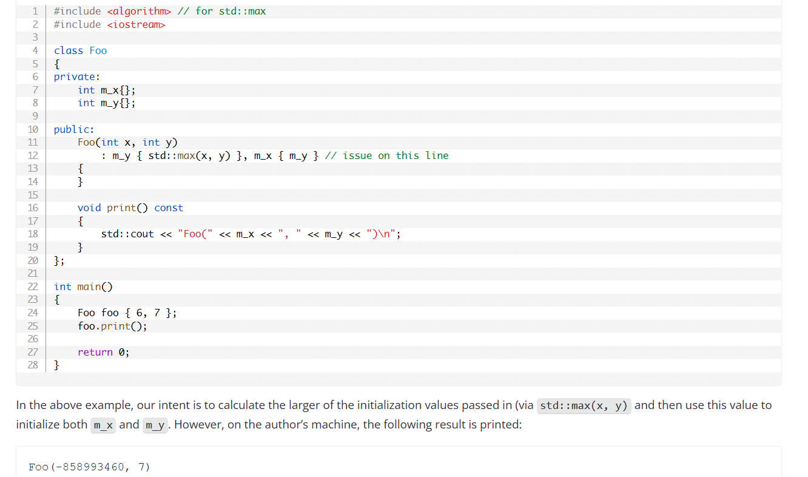

Note: To help prevent such errors, members in the member initializer list should be listed in the order in which they are defined in the class. Some compilers will issue a warning if members are initialized out of order

Note: constant or reference data members can only be initialsed using list initlization else if we use assignment for intilizing members variable result into compile time error

ex: 

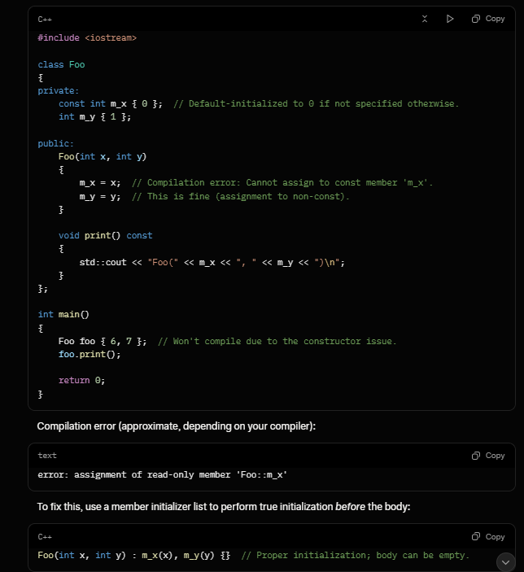

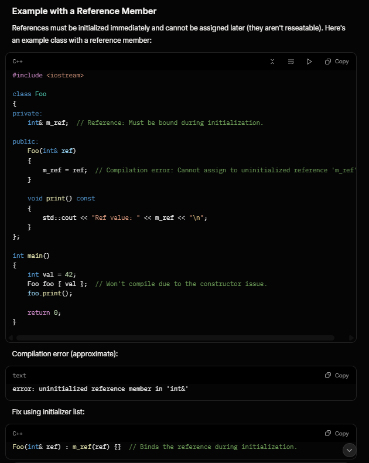

### Default Constuctor and default arguments

A default constructor in C++ is a constructor that can be called with no arguments. Typically, this is a constructor that has been defined with no parameters.

ex.
```cpp
Foo()                          // explicitly no parameters
Foo(int x=1, int y=2)          // has defaults → can be called as Foo() for this foo f{} object should be like this
```

### Value initialization vs default initialization for class types

If a class type has a default constructor, both value initialization and default initialization will call the default constructor. 

ex. 

```cpp
Foo foo{}; // value initialization, calls Foo() default constructor
Foo foo2;  // default initialization, calls Foo() default constructor
```

### Overloaded constructors

```cpp

#include <iostream>

class Foo
{
private:
    int m_x { };
    int m_y { };

public:
    Foo(int x=0, int y=0) // has default arguments
        : m_x { x }
        , m_y { y }
    {
        std::cout << "Foo(" << m_x << ", " << m_y << ") constructed\n";
    }
};

int main()
{
    Foo foo1{};     // calls Foo(int, int) constructor using default arguments
    Foo foo2{6, 7}; // calls Foo(int, int) constructor

    return 0;
}
```

### Using = default to generate an explicitly defaulted default constructor

the = default syntax allows you to explicitly request that the compiler generate a special member function (like the default constructor) with its default implementation.

Under certain circumstances, the compiler will not generate a default constructor for a class type :

* If no constructors are user-declared in the class.
* The class isn't a union or doesn't have certain features that prevent implicit generation (e.g., virtual bases, but that's rare for simple cases).

ex:

```cpp
class Foo {
public:
    int m_x;

    Foo(int x) : m_x(x) {}  // Parameterized constructor declared → no implicit default ctor.

    // Foo() {}  // This would be user-provided (non-trivial).
    Foo() = default;  // Explicitly defaulted: Compiler generates it (trivial if possible).

    void print() const {
        std::cout << "Foo(" << m_x << ")\n";
    }
};

int main() {
    Foo f1;      // OK: Calls the defaulted default ctor (m_x default-initialized to indeterminate value).
    Foo f2(42);  // OK: Calls the parameterized ctor.
    return 0;
}
```

Note: Trival default constructor is a default constructor that performs no action and can be generated by the compiler. 

### Explicitly defaulted default constructor vs empty user-defined constructor

There are at least two cases where the explicitly defaulted default constructor behaves differently than an empty user-defined constructor.

ex1:

```cpp
#include <iostream>

class User
{
private:
    int m_a; // note: no default initialization value
    int m_b {};

public:
    User() {} // user-defined empty constructor

    int a() const { return m_a; }
    int b() const { return m_b; }
};

class Default
{
private:
    int m_a; // note: no default initialization value
    int m_b {};

public:
    Default() = default; // explicitly defaulted default constructor

    int a() const { return m_a; }
    int b() const { return m_b; }
};

class Implicit
{
private:
    int m_a; // note: no default initialization value
    int m_b {};

public:
    // implicit default constructor

    int a() const { return m_a; }
    int b() const { return m_b; }
};

int main()
{
    User user{}; // default initialized
    std::cout << user.a() << ' ' << user.b() << '\n';

    Default def{}; // zero initialized, then default initialized
    std::cout << def.a() << ' ' << def.b() << '\n';

    Implicit imp{}; // zero initialized, then default initialized
    std::cout << imp.a() << ' ' << imp.b() << '\n';

    return 0;
}

```
Here, we have three classes: User, Default, and Implicit. 

User Class: Has a user-provided default constructor (User() {} — even empty, it's user-provided). Value-initialization simply calls this constructor. The constructor body is empty with no member initializer list, so:
m_a undergoes default-initialization (uninitialized for built-ins like int, leaving it indeterminate/undefined — reading it is UB, but might print garbage or 0 in practice).
m_b uses its in-class initializer ({} → 0).

Default and Implicit Classes: Neither has a user-provided constructor (= default and implicit are compiler-generated, not user-provided). Value-initialization first zero-initializes the entire object (sets all bits to 0, so m_a and m_b start at 0), then calls the default constructor if non-trivial (here, they are trivial, so effectively a no-op). In-class initializers (like for m_b) are applied during the constructor call, but since zero-init already set everything to 0, the result is the same.

## Aggregate vs Non-aggregate Issues and learning to use constructors:-

Prior to C++20, the definition of an aggregate class allowed user-declared constructors as long as they were not "user-provided" (i.e., explicitly defined with a body, even if empty). An explicitly defaulted constructor (= default) was allowed and did not disqualify the class from being an aggregate. However, a user-provided default constructor (e.g., Foo() {}) made the class a non-aggregate.

Aggregate Class: Supports aggregate initialization, where braced-init {} directly initializes members in declaration order, applying default or zero-initialization as needed (no constructor is called).
Non-Aggregate Class: Uses list initialization for {}, which attempts to call a matching constructor (e.g., the default constructor for {}) or an std::initializer_list constructor if available. If no suitable constructor exists for the provided arguments, it's a compile error.

This led to inconsistencies: Adding an empty-bodied default constructor could break aggregate status, changing initialization semantics unexpectedly.

Example: Aggregate with = default (Compiles in C++17)


Example: Non-Aggregate with User-Provided Default Constructor (Compiles in C++17)

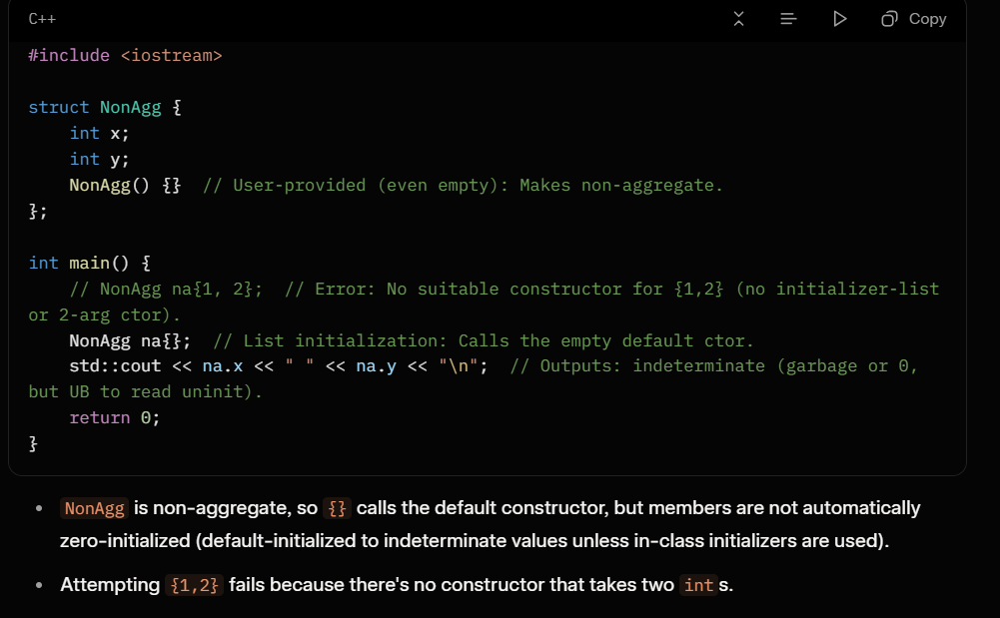

C++20 and Later Behavior
C++20 adopted P1008R1 ("Prohibiting aggregates with user-declared constructors") to address the inconsistency. Now, any user-declared constructor (including explicitly defaulted ones like = default) disqualifies the class from being an aggregate. This simplifies the rules and prevents surprises (e.g., moving a = default definition out-of-line no longer risks changing aggregate status).

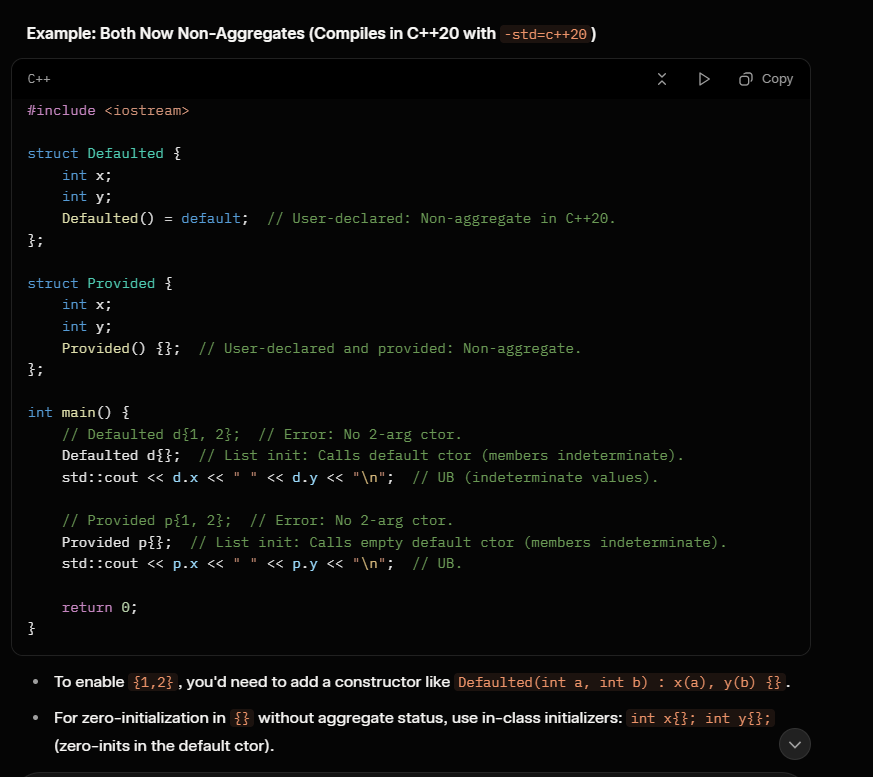

## Delegating constructors

Constructors are allowed to delegate (transfer responsibility for) initialization to another constructor from the same class type. This process is sometimes called constructor chaining and such constructors are called delegating constructors.

Why it required? If we try to call another constructor inside body of another constructor it will not work because the object is already being initialized by the first constructor as members initializer list are initialized before the body of the constructor is executed. So, if we try to call another constructor inside the body of a constructor, it will not work because the object is already being initialized by the first constructor.

Delgation process ex:

```cpp
#include <iostream>
#include <string>
#include <string_view>

using namespace std;
class Employee
{
private:
    std::string m_name { "???" };
    int m_id { 0 };

public:
    Employee(std::string_view name)
        : Employee{ name, 0 } // delegate initialization to Employee(std::string_view, int) constructor
    {
        cout<<"------2---------"<<endl;
       
        
    }

    Employee(std::string_view name, int id)
        : m_name{ name }, m_id { id } // actually initializes the members
    {
        cout<<"------1---------"<<endl;
        std::cout << "Employee " << m_name << " created\n";
    }

};

int main()
{
    Employee e1{ "James" };
}
```

Here, When e1 { "James" } is initialized, matching constructor Employee(std::string_view) is called with parameter name set to "James". The member initializer list of this constructor delegates initialization to other constructor, so Employee(std::string_view, int) is then called. The value of name ("James") is passed as the first argument, and literal 0 is passed as the second argument. The member initializer list of the delegated constructor then initializes the members. The body of the delegated constructor then runs. Then control returns to the initial constructor, whose (empty) body runs. Finally, control returns to the caller.


## Temporary class objects

* This will throw compile error : -

```cpp
#include <iostream>

void addOne(int& value) // pass by non-const references requires lvalue
{
    ++value;
}

int main()
{
    int sum { 5 + 3 };
    addOne(sum);   // okay, sum is an lvalue

    addOne(5 + 3); // compile error: not an lvalue

    return 0;
}
```
Reason: The expression 5 + 3 creates a temporary object that holds the result of the addition. This temporary object is an rvalue, which means it does not have a persistent memory address and cannot be modified. When we try to pass this temporary object to the addOne function, which expects a non-const reference (int&), it results in a compile error because non-const references cannot bind to rvalues (temporary objects).

* Temporary class objects example:

```cpp

#include <iostream>

class IntPair
{
private:
    int m_x{};
    int m_y{};

public:
    IntPair(int x, int y)
        : m_x { x }, m_y { y }
    {}

    int x() const { return m_x; }
    int y() const { return m_y; }
};

void print(IntPair p)
{
    std::cout << "(" << p.x() << ", " << p.y() << ")\n";
}

int main()
{
    // Case 1: Pass variable
    IntPair p { 3, 4 };
    print(p); // prints (3, 4)

    return 0;
}
```

##  copy constructor

A copy constructor is a constructor that is used to initialize an object with an existing object of the same type.

By default, the implicit copy constructor will do memberwise initialization. This means each member will be initialized using the corresponding member of the class passed in as the initializer.

ex:

```cpp
#include <iostream>

class Fraction
{
private:
    int m_numerator{ 0 };
    int m_denominator{ 1 };

public:
    // Default constructor
    Fraction(int numerator=0, int denominator=1)
        : m_numerator{numerator}, m_denominator{denominator}
    {
    }

    // Copy constructor
    Fraction(const Fraction& fraction)
        // Initialize our members using the corresponding member of the parameter
        : m_numerator{ fraction.m_numerator }
        , m_denominator{ fraction.m_denominator }
    {
        std::cout << "Copy constructor called\n"; // just to prove it works
    }

    void print() const
    {
        std::cout << "Fraction(" << m_numerator << ", " << m_denominator << ")\n";
    }
};

int main()
{
    Fraction f { 5, 3 };  // Calls Fraction(int, int) constructor
    Fraction fCopy { f }; // Calls Fraction(const Fraction&) copy constructor

    f.print();
    fCopy.print();

    return 0;
}
```

Why do we require const Fraction& as parameter for copy constructor?
Ans: The copy constructor takes its parameter as a const reference (const Fraction&) to allow it to accept both const and non-const objects. If the parameter were a non-const reference (Fraction&), it would not be able to accept const objects, which would limit the usability of the copy constructor. By using a const reference, we can ensure that the copy constructor can be called with any object of the class type, regardless of whether it is const or not. Additionally, why reference is used instead of passing by value is because passing by value would require the copy constructor to be called to create a copy of the object being passed in, which would lead to infinite recursion. By using a reference, we can avoid this issue and allow the copy constructor to function properly.

* Cases when copy constructor is called:
1. When an object is initialized from another object of the same type (e.g., Fraction fCopy { f };).
2. Pass by value and the copy constructor:
```cpp
#include <iostream>

class Fraction
{
private:
    int m_numerator{ 0 };
    int m_denominator{ 1 };

public:
    // Default constructor
    Fraction(int numerator = 0, int denominator = 1)
        : m_numerator{ numerator }, m_denominator{ denominator }
    {
    }

    // Copy constructor
    Fraction(const Fraction& fraction)
        : m_numerator{ fraction.m_numerator }
        , m_denominator{ fraction.m_denominator }
    {
        std::cout << "Copy constructor called\n";
    }

    void print() const
    {
        std::cout << "Fraction(" << m_numerator << ", " << m_denominator << ")\n";
    }
};

void printFraction(Fraction f) // f is pass by value
{
    f.print();
}

int main()
{
    Fraction f{ 5, 3 };

    printFraction(f); // f is copied into the function parameter using copy constructor

    return 0;
}
```

3. Return by value and the copy constructor

return by value creates a temporary object (holding a copy of the return value) that is passed back to the caller. When the return type and the return value are the same class type, the temporary object is initialized by implicitly invoking the copy constructor.

```cpp
#include <iostream>

class Fraction
{
private:
    int m_numerator{ 0 };
    int m_denominator{ 1 };

public:
    // Default constructor
    Fraction(int numerator = 0, int denominator = 1)
        : m_numerator{ numerator }, m_denominator{ denominator }
    {
    }

    // Copy constructor
    Fraction(const Fraction& fraction)
        : m_numerator{ fraction.m_numerator }
        , m_denominator{ fraction.m_denominator }
    {
        std::cout << "Copy constructor called\n";
    }

    void print() const
    {
        std::cout << "Fraction(" << m_numerator << ", " << m_denominator << ")\n";
    }
};

void printFraction(Fraction f) // f is pass by value
{
    f.print();
}

Fraction generateFraction(int n, int d)
{
    Fraction f{ n, d };
    return f;
}

int main()
{
    Fraction f2 { generateFraction(1, 2) }; // Fraction is returned using copy constructor

    printFraction(f2); // f2 is copied into the function parameter using copy constructor

    return 0;
}
```

When generateFraction returns a Fraction back to main, a temporary Fraction object is created and initialized using the copy constructor.

Because this temporary is used to initialize Fraction f2, this invokes the copy constructor again to copy the temporary into f2.

And when f2 is passed to printFraction(), the copy constructor is called a third time.

Thus, on the author’s machine, this example prints:

Copy constructor called
Copy constructor called
Copy constructor called
Fraction(1, 2)

### Using = delete to prevent copies

Occasionally we run into cases where we do not want objects of a certain class to be copyable. We can prevent this by marking the copy constructor function as deleted, using the = delete syntax:

```cpp
#include <iostream>

class Fraction
{
private:
    int m_numerator{ 0 };
    int m_denominator{ 1 };

public:
    // Default constructor
    Fraction(int numerator=0, int denominator=1)
        : m_numerator{numerator}, m_denominator{denominator}
    {
    }

    // Delete the copy constructor so no copies can be made
    Fraction(const Fraction& fraction) = delete;

    void print() const
    {
        std::cout << "Fraction(" << m_numerator << ", " << m_denominator << ")\n";
    }
};

int main()
{
    Fraction f { 5, 3 };
    Fraction fCopy { f }; // compile error: copy constructor has been deleted

    return 0;
}
```

##  Class initialization and copy elision

```cpp
#include <iostream>

class Foo
{
public:

    // Default constructor
    Foo()
    {
        std::cout << "Foo()\n";
    }

    // Normal constructor
    Foo(int x)
    {
        std::cout << "Foo(int) " << x << '\n';
    }

    // Copy constructor
    Foo(const Foo&)
    {
        std::cout << "Foo(const Foo&)\n";
    }
};

int main()
{
    // Calls Foo() default constructor
    Foo f1;           // default initialization
    Foo f2{};         // value initialization (preferred)

    // Calls foo(int) normal constructor
    Foo f3 = 3;       // copy initialization (non-explicit constructors only)
    Foo f4(4);        // direct initialization
    Foo f5{ 5 };      // direct list initialization (preferred)
    Foo f6 = { 6 };   // copy list initialization (non-explicit constructors only)

    // Calls foo(const Foo&) copy constructor
    Foo f7 = f3;      // copy initialization
    Foo f8(f3);       // direct initialization
    Foo f9{ f3 };     // direct list initialization (preferred)
    Foo f10 = { f3 }; // copy list initialization

    return 0;
}
```

## Copy elision

Copy elision is a compiler optimization technique that allows the compiler to remove unnecessary copying of objects. In other words, in cases where the compiler would normally call a copy constructor, the compiler is free to rewrite the code to avoid the call to the copy constructor altogether. When the compiler optimizes away a call to the copy constructor, we say the constructor has been elided. 

Note: Mandatory copy elision in C++17 .

## Converting constructors and the explicit keyword

### User Defined Conversion

ex. 

```cpp

#include <iostream>

class Foo
{
private:
    int m_x{};
public:
    Foo(int x)
        : m_x{ x }
    {
    }

    int getX() const { return m_x; }
};

void printFoo(Foo f) // has a Foo parameter
{
    std::cout << f.getX();
}

int main()
{
    printFoo(5); // we're supplying an int argument

    return 0;
}
```

Here, we are able to pass an int (5) to printFoo(), which expects a Foo object. This is because the compiler implicitly converts the int argument (5) to a Foo object by calling the Foo(int) constructor. This process is known as user-defined conversion, and the constructor that allows this conversion is called a converting constructor.

Note: Only one user-defined conversion may be applied

```cpp
#include <iostream>
#include <string>
#include <string_view>

class Employee
{
private:
    std::string m_name{};

public:
    Employee(std::string_view name)
        : m_name{ name }
    {
    }

    const std::string& getName() const { return m_name; }
};

void printEmployee(Employee e) // has an Employee parameter
{
    std::cout << e.getName();
}

int main()
{
    printEmployee("Joe"); // we're supplying an string literal argument

    return 0;
}
```

Above, won't be compiling because only one user-defined conversion may be applied to perform an implicit conversion, and this example requires two. First, our C-style string literal has to be converted to a std::string_view (using a std::string_view converting constructor), and then our std::string_view has to be converted into an Employee (using the Employee(std::string_view) converting constructor).

### The explicit keyword

explicit keyword to tell the compiler that a constructor should not be used as a converting constructor.

Making a constructor explicit has two notable consequences:

* An explicit constructor cannot be used to do copy initialization or copy list initialization.
* An explicit constructor cannot be used to do implicit conversions (since this uses copy initialization or copy list initialization).

ex.

```cpp

#include <iostream>

class Dollars
{
private:
    int m_dollars{};

public:
    explicit Dollars(int d) // now explicit
        : m_dollars{ d }
    {
    }

    int getDollars() const { return m_dollars; }
};

void print(Dollars d)
{
    std::cout << "$" << d.getDollars();
}

int main()
{
    print(5); // compilation error because Dollars(int) is explicit

    return 0;
}
```

Note: If we want to use an explicit constructor to perform a conversion, we use direct and direct list initialization:

```cpp

// Assume Dollars(int) is explicit
int main()
{
    Dollars d1(5); // ok
    Dollars d2{5}; // ok
}

i.e for above code :

print(Dollars{5}); // ok: direct list initialization of a temporary Dollars object, which is then passed to print()

Also, using static_cast can also be used to perform an explicit conversion:

print(static_cast<Dollars>(5)); // ok: static_cast performs an explicit conversion to Dollars, which is then passed to print()

```

# Chapter 15: More on Classes

## The hidden “this” pointer and member function chaining

this is a const pointer that holds the address of the current implicit object.

### How is this set?

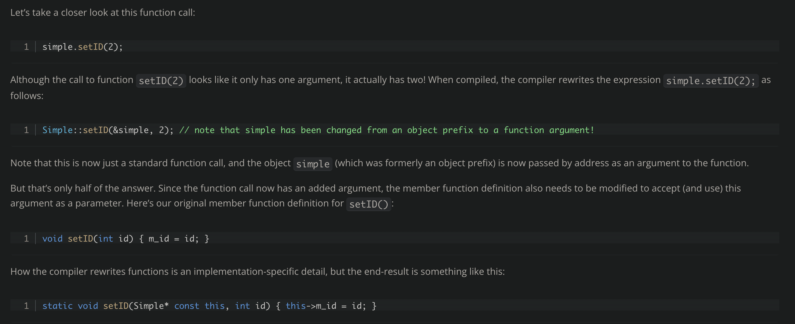

When we call simple.setID(2), the compiler actually calls Simple::setID(&simple, 2), and simple is passed by address to the function.
The function has a hidden parameter named this which receives the address of simple.
Member variables inside setID() are prefixed with this->, which points to simple. So when the compiler evaluates this->m_id, it’s actually resolving to simple.m_id.

### Returning *this

Second, it can sometimes be useful to have a member function return the implicit object as a return value. The primary reason to do this is to allow member functions to be “chained” together, so several member functions can be called on the same object in a single expression! This is called function chaining (or method chaining).

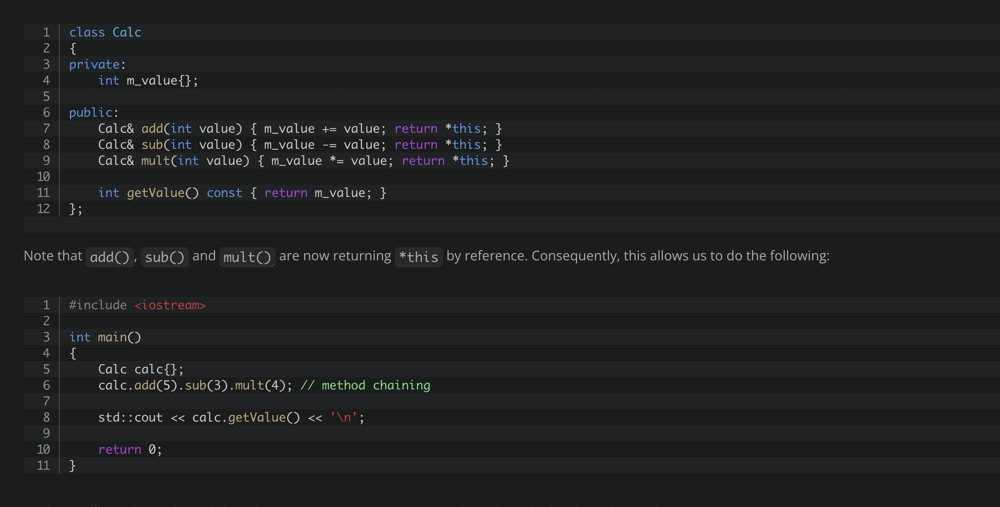

## Resetting a class back to default state

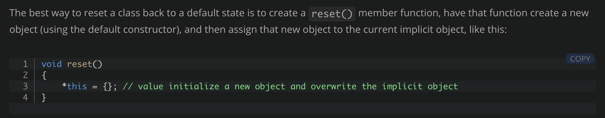

## Separating class declarations and definitions into header and source files

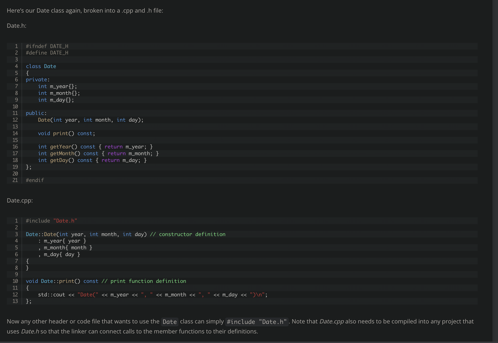

Note: Member function defined inside the class definition are implicitly inline, so they can be defined in a header file without violating the One Definition Rule (ODR). However, if we define member functions outside the class definition, we should put their definitions in a source file (.cpp) to avoid multiple definitions when including the header in multiple translation units. Also, if we are defining a member function in a header file, we should mark it as inline to avoid multiple definition errors.

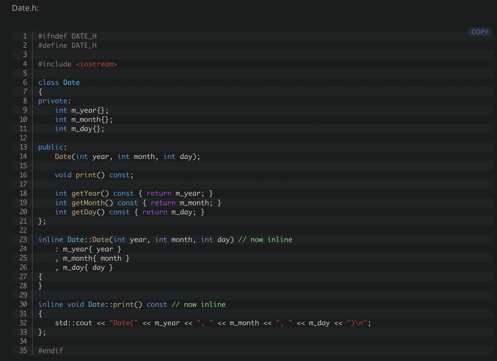

### why not put everything in a header file?

First, as mentioned above, defining members inside the class definition clutters up your class definition.

Second, if you change any of the code in the header, then you’ll need to recompile every file that includes that header. This can have a ripple effect, where one minor change causes the entire program to need to recompile. The cost of recompilation can vary significantly: a small project may only take a minute or less to build, whereas a large commercial project can take hours.

Conversely, if you change the code in a .cpp file, only that .cpp file needs to be recompiled. Therefore, given the choice, it’s generally better to put non-trivial code in a .cpp file when you can.

## Nested types (member types)

we’ve seen class types with two different kinds of members: data members and member functions. Class types support another kind of member: nested types (also called member types). To create a nested type, you simply define the type inside the class, under the appropriate access specifier.

```cpp
#include <iostream>

class Fruit{
public: 
    enum class Type{
        apple,
        banana,
        cherry,
    };

private:
    Type m_type{};
    int percentageEaten{};
public:
    explicit Fruit(Type type) : m_type{type} 
    {
    }

    Type getType() {return m_type; }
    int getPercentageEaten() { return percentageEaten; }

    bool isCherry() { return m_type == Type::cherry; }
};

int main(){
    Fruit apple {Fruit::Type::apple};
    if(apple.getType() == Fruit::Type::apple){
        std::cout<<"I am apple"<<std::endl;   
        } else{
            std::cout<<"I am not apple"<<std::endl;   
            
        }
    return 0;
}
```
Note: To access a nested type from outside the class, you need to use the scope resolution operator (::) to specify the class name followed by the nested type name. For example, if you have a nested enum called Type inside a class called Fruit, you would access it as Fruit::Type.

## Nested classes and access to outer class members

In C++, a nested class does not have access to the this pointer of the outer (containing) class, so nested classes can not directly access the members of the outer class. This is because a nested class can be instantiated independently of the outer class (and in such a case, there would be no outer class members to access!)

However, because nested classes are members of the outer class, they can access any private members of the outer class that are in scope.

ex:

```cpp
#include <iostream>
#include <string>
#include <string_view>

class Employee
{
public:
    using ID = int; // type alias for employee ID

    class Printer
    {
    public:
        void printEmployee(const Employee& e) const
        {
            // Printer can't access Employee's `this` pointer
            // so we can't print m_name and m_id directly
            // Instead, we have to pass in an Employee object to use
            // Because Printer is a member of Employee,
            // we can access private members e.m_name and e.m_id directly
            std::cout << "Employee " << e.m_name << " has ID " << e.m_id << '\n';
        }
    };
private:
    std::string m_name{};
    ID m_id{};
public:
    Employee(std::string_view name, ID id)
        : m_name{ name }
        , m_id{ id }
    {
    }
};

int main()
{
    Employee e{ "John", 123 };
    Employee::Printer printer;
    printer.printEmployee(e);

    return 0;
}
```

Note: Nested types and forward declarations 

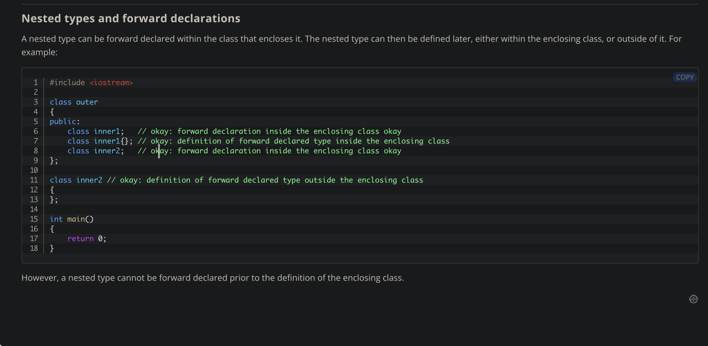

However, a nested type cannot be forward declared prior to the definition of the enclosing class. This is because the nested type is not in scope until the definition of the enclosing class is complete. Therefore, if you try to forward declare a nested type before the enclosing class is defined, you will get a compile error.

## Introduction to Destructors

Classes have another type of special member function that is called automatically when an object of a non-aggregate class type is destroyed. Destructors are designed to allow a class to do any necessary clean up before an object of the class is destroyed.

## Class templates with member functions

Type template parameters defined as part of a class template parameter declaration can be used both as the type of data members and as the type of member function parameters.

```cpp

#include <ios>       // for std::boolalpha
#include <iostream>

template <typename T>
class Pair
{
private:
    T m_first{};
    T m_second{};
public:
    Pair(const T& first, const T& second)
     : m_first{first}
     , m_second{second}
     {
     }

    bool isEqual(const Pair<T>& pair);
};

// When we define a member function outside the class definition,
// we need to resupply a template parameter declaration
template <typename T>
bool Pair<T>::isEqual(const Pair<T>& pair)
{
    return (m_first == pair.m_first) && (m_second == pair.m_second);
}

int main()
{
    Pair p1{ 5, 6 }; // uses CTAD to infer type Pair<int>
    std::cout << std::boolalpha << "isEqual(5, 6): " << p1.isEqual( Pair{5, 6} ) << '\n';
    std::cout << std::boolalpha << "isEqual(5, 7): " << p1.isEqual( Pair{5, 7} ) << '\n';

    return 0;
}
```

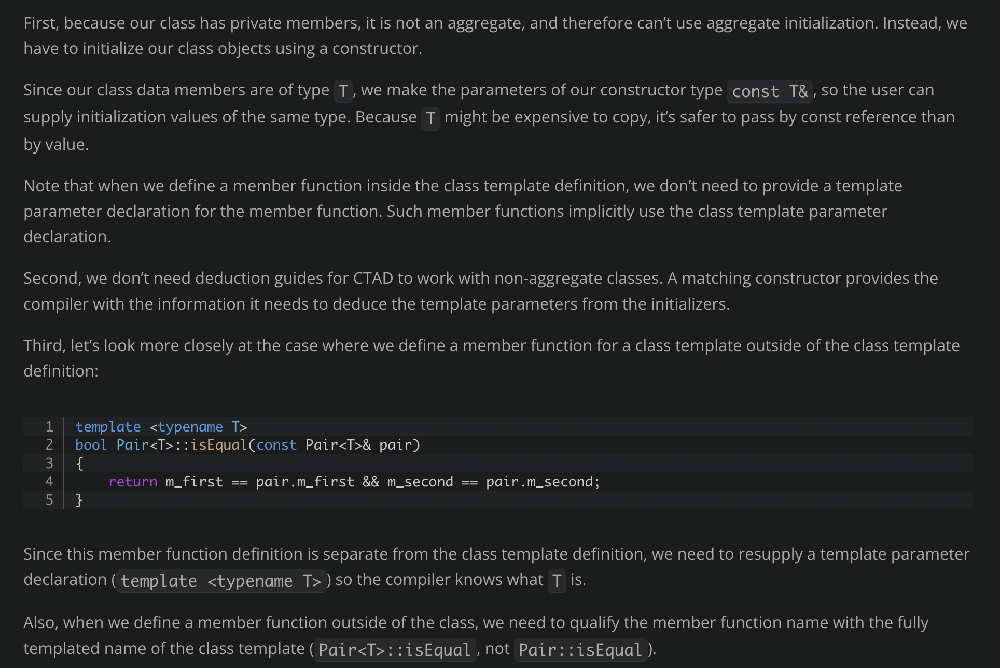

Note: 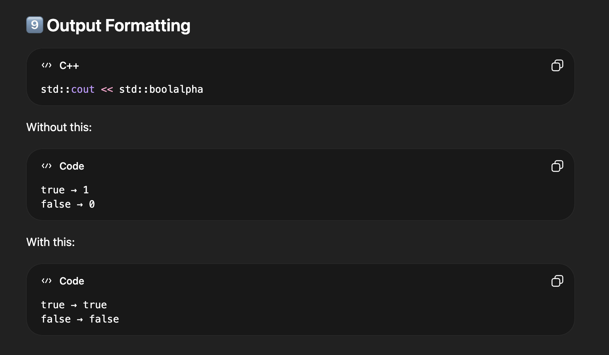

## Static member variables

Static member variables are shared by all objects of the class. This means that there is only one instance of the static member variable, and all objects of the class share that instance. Static member variables are useful for storing data that is common to all objects of the class, such as a count of how many objects have been created.
ex.

```cpp
#include <iostream>

struct Something
{
    static int s_value; // declare s_value as static (initializer moved below)
};

int Something::s_value{ 1 }; // define and initialize s_value to 1 (we'll discuss this section below)

int main()
{
    Something first{};
    Something second{};

    std::cout << first.s_value << '\n'; // prints 1
    std::cout << second.s_value << '\n'; // also prints 1, because s_value is shared by all objects of the class
    std::cout << Something::s_value << '\n'; // also prints 1, without needing an object of the class
    return 0;
}
```

Note: Static members variables are global variables that live inside the scope region of the class.

Note: For non-template classes, if the class is defined in a header (.h) file, the static member definition is usually placed in the associated code file for the class (e.g. Something.cpp). Alternatively, the member can also be defined as inline and placed below the class definition in the header (this is useful for header-only libraries). If the class is defined in a source (.cpp) file, the static member definition is usually placed directly underneath the class. Do not put the static member definition in a header file (much like a global variable, if that header file gets included more than once, you’ll end up with multiple definitions, which will cause a linker error).


### Initialization of static member variables inside the class definition

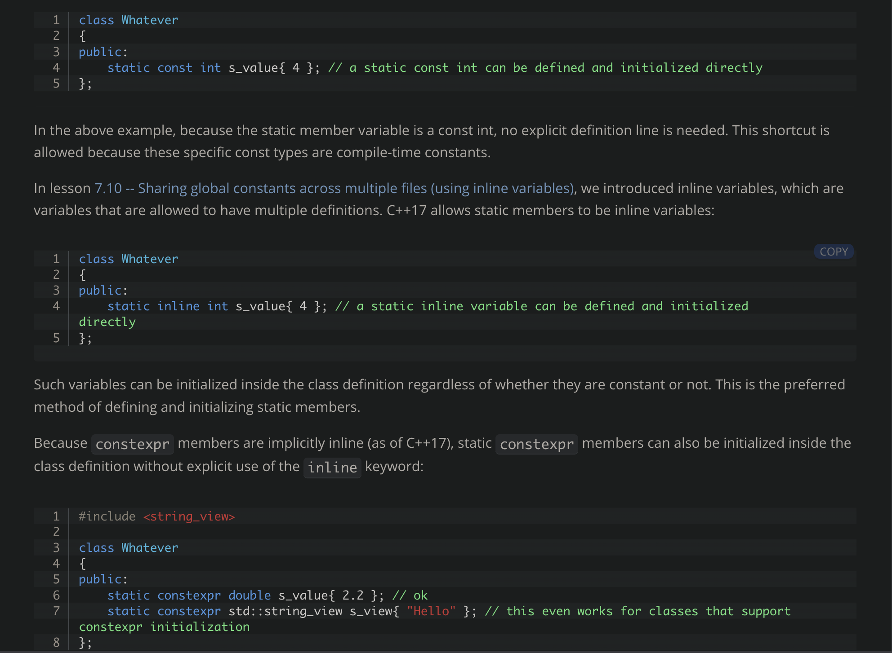

* Why Can't Non-Const Static Be Initialized Inside?
Because before C++17:
    * Only const static integral members were allowed inline initialization.
    * Non-const static members must be defined outside to avoid multiple definitions.

* C++ 17 features: inline static data members

* why we need to define static members inside the class definition?
    * To allow inline initialization of static members, which can simplify code and avoid linker errors from multiple definitions.
    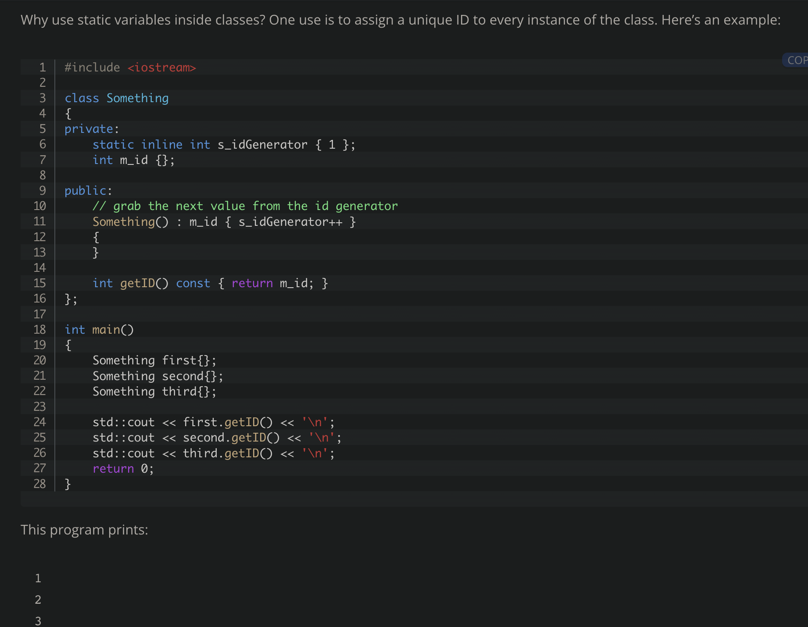

Note: Why non static members cannot be initialized inside the class definition?
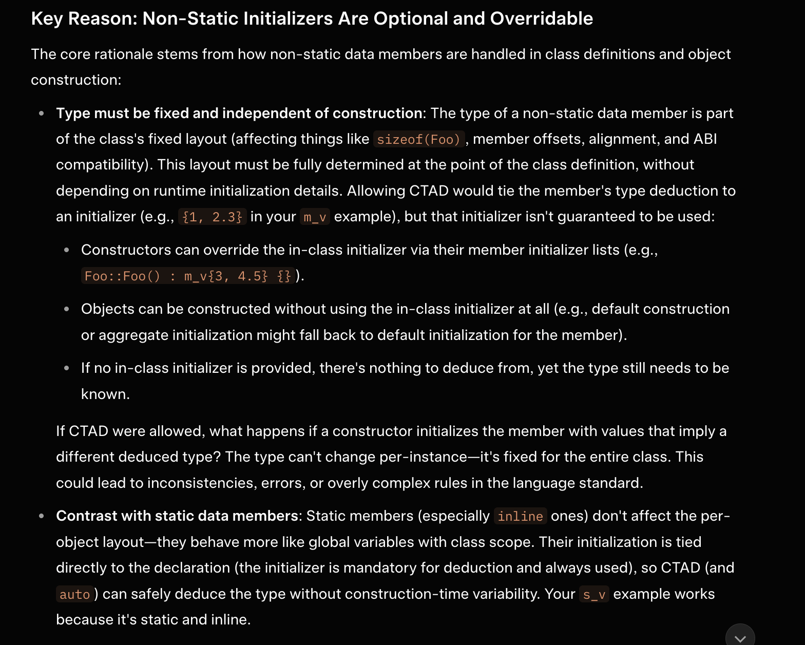

## Static member functions

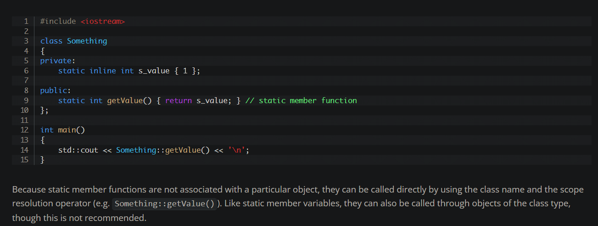

Note: Static member functions can only access static member variables and other static member functions. They cannot access non-static members because they do not have a this pointer to refer to a specific instance of the class. 

Note: As of now on cpp, there is no static constructors , so  in order to initialize static member variables, One way that works with all variables, static or not, is to use a function to create an object, fill it with data, and return it to the caller. This returned value can be copied into the object being initialized.

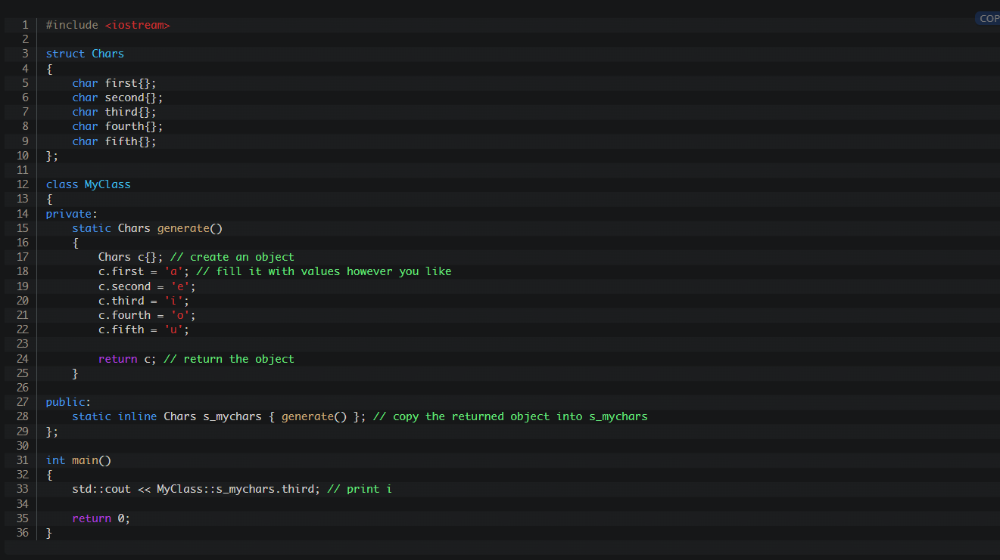

## Friend non-member functions

Inside the body of a class, a friend declaration (using the friend keyword) can be used to tell the compiler that some other class or function is now a friend. In C++, a friend is a class or function (member or non-member) that has been granted full access to the private and protected members of another class. In this way, a class can selectively give other classes or functions full access to their members without impacting anything else.

Note: The friend declaration is not affected by access controls, so it does not matter where within the class body it is placed.

### Friend non-member functions

A friend function is a function (member or non-member) that can access the private and protected members of a class as though it were a member of that class. In all other regards, the friend function is a normal function.

ex. 

```cpp
#include <iostream>

class Accumulator
{
private:
    int m_value { 0 };

public:
    void add(int value) { m_value += value; }

    // Here is the friend declaration that makes non-member function void print(const Accumulator& accumulator) a friend of Accumulator
    friend void print(const Accumulator& accumulator);
};

void print(const Accumulator& accumulator)
{
    // Because print() is a friend of Accumulator
    // it can access the private members of Accumulator
    std::cout << accumulator.m_value;
}

int main()
{
    Accumulator acc{};
    acc.add(5); // add 5 to the accumulator

    print(acc); // call the print() non-member function

    return 0;
}
```

Here, In this example, we’ve declared a non-member function named print() that takes an object of class Accumulator. Because print() is not a member of the Accumulator class, it would normally not be able to access private member m_value. However, the Accumulator class has a friend declaration making print(const Accumulator& accumulator) a friend, this is now allowed.

Note: print() is a non-member function (and thus does not have an implicit object), we must explicitly pass an Accumulator object to print() to work with.

Note: 
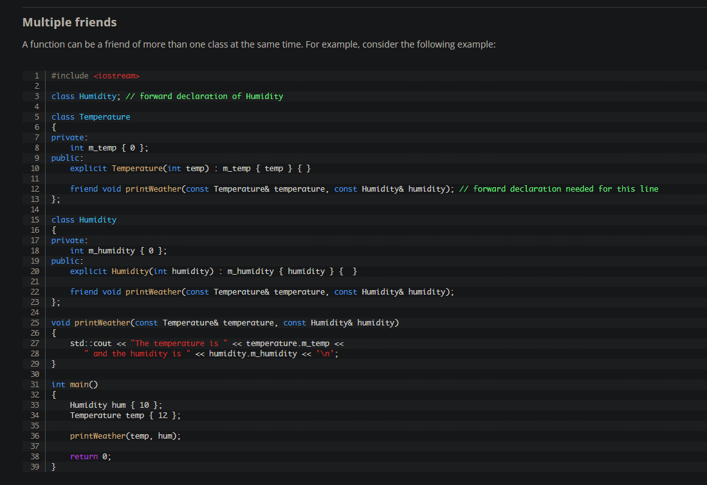

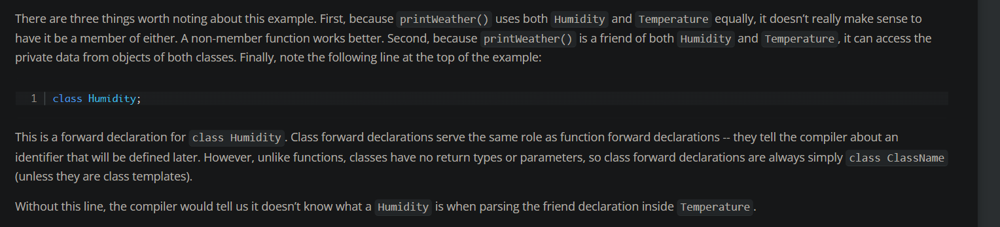
Above, is one of reason to use friend functions, another we will cover while studing operator overloading here we will get to know passing objects expclitely to a non-member function can be more intuitive than using member functions for certain operations, especially when the operation involves multiple objects of the same class. For example, when we want to compare two objects for equality, it can be more natural to write a non-member function that takes two objects as parameters rather than a member function that compares the current object with another object passed as an argument. This can lead to clearer and more readable code.

## Friend classes and friend member functions

A friend class is a class that can access the private and protected members of another class.

ex.

```cpp
#include <iostream>

class Storage
{
private:
    int m_nValue {};
    double m_dValue {};
public:
    Storage(int nValue, double dValue)
       : m_nValue { nValue }, m_dValue { dValue }
    { }

    // Make the Display class a friend of Storage
    friend class Display;
};

class Display
{
private:
    bool m_displayIntFirst {};

public:
    Display(bool displayIntFirst)
         : m_displayIntFirst { displayIntFirst }
    {
    }

    // Because Display is a friend of Storage, Display members can access the private members of Storage
    void displayStorage(const Storage& storage)
    {
        if (m_displayIntFirst)
            std::cout << storage.m_nValue << ' ' << storage.m_dValue << '\n';
        else // display double first
            std::cout << storage.m_dValue << ' ' << storage.m_nValue << '\n';
    }

    void setDisplayIntFirst(bool b)
    {
         m_displayIntFirst = b;
    }
};

int main()
{
    Storage storage { 5, 6.7 };
    Display display { false };

    display.displayStorage(storage);

    display.setDisplayIntFirst(true);
    display.displayStorage(storage);

    return 0;
}
```

Note:

1. First, even though Display is a friend of Storage, Display has no access to the *this pointer of Storage objects (because *this is actually a function parameter).

2. Second, friendship is not reciprocal. Just because Display is a friend of Storage does not mean Storage is also a friend of Display. If you want two classes to be friends of each other, both must declare the other as a friend.

## Friend member functions

This is done similarly to making a non-member function a friend, except the name of the member function is used instead.

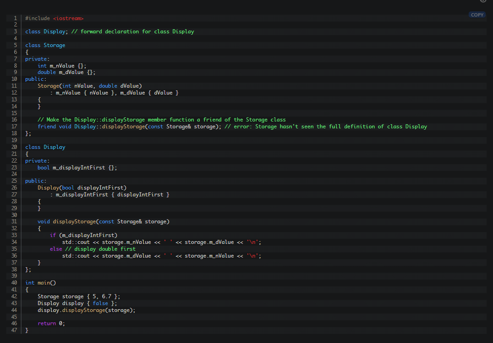

However, it turns out this won’t work. In order to make a single member function a friend, the compiler has to have seen the full definition for the class of the friend member function (not just a forward declaration). Since class Storage hasn’t seen the full definition for class Display yet, the compiler will error at the point where we try to make the member function a friend.

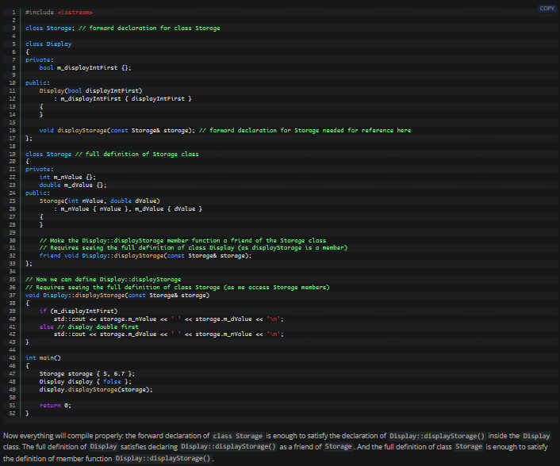

## Ref-qualifiers (C++11 and later)

 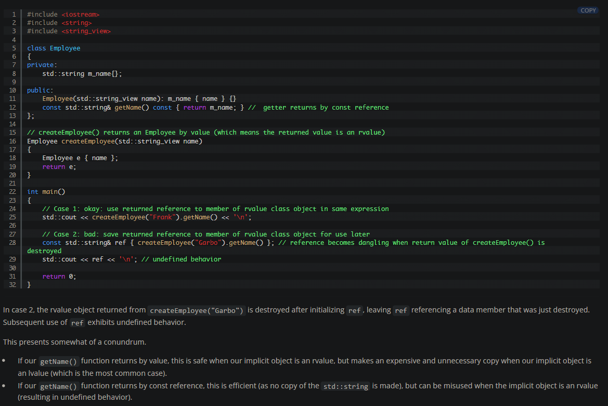

 To help address such issues, C++11 introduced a little known feature called a ref-qualifier that allows us to overload a member function based on whether it is being called on an lvalue or an rvalue implicit object. Using this feature, we can create two versions of getName() -- one for the case where our implicit object is an lvalue, and one for the case where our implicit object is an rvalue.

 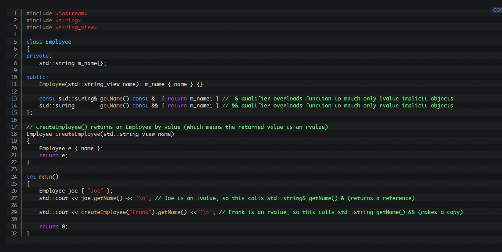

1. Recap: What is the "implicit object" (*this)?
    Every member function has a hidden parameter: *this.

    When you write joe.getName(), *this is lvalue (named object joe).
    When you write createEmployee("Frank").getName(), the temporary Employee returned by createEmployee is an rvalue (unnamed temporary that will die at the end of the full expression).

    Ref-qualifiers (& vs &&) let us write different versions of the same function depending on whether *this is an lvalue or rvalue.

2. Why lvalue version is const std::string& getName() const &

We return a reference (const std::string&) → zero copy, very fast.
The function is const-qualified → *this is treated as const Employee inside the function. This is safe and necessary because:
We want to be able to call getName() on const Employee objects.
We do not want the getter to allow modification of the object (joe.getName() = "bad"; should not compile).

3. Why rvalue version must return by value (never a reference)
The rvalue version must return by value (std::string getName() &&) because the implicit object is a temporary that will be destroyed at the end of the full expression. If we were to return a reference to a member of that temporary, we would be returning a reference to an object that no longer exists after the function returns, which would lead to undefined behavior if the caller tries to use that reference.

# Chapter 16: Dynamic arrays: std::vector

## Container

A Container is an object used to store other objects and taking care of the management of the memory used by the objects it contains.

Note: The elements of a container are unnamed.

## Introduction to arrays

An array is a collection of objects of the same type that are stored in contiguous memory locations. 

C++ contains three primary array types: (C-style) arrays, the std::vector container class, and the std::array container class.

the std::array container class was introduced in C++11 as a direct replacement for C-style arrays. It is more limited than std::vector, but can also be more efficient, especially for smaller arrays.

## Introduction to std::vector and list constructors

std::vector is one of the container classes in the C++ standard containers library that implements an array. std::vector is defined in the <vector> header as a class template, with a template type parameter that defines the type of the elements. Thus, std::vector<int> declares a std::vector whose elements are of type int.

* Initializing a std::vector with a list of values

```cpp
#include <vector>

int main()
{
	// List construction (uses list constructor)
	std::vector<int> primes{ 2, 3, 5, 7 };          // vector containing 4 int elements with values 2, 3, 5, and 7
	std::vector vowels { 'a', 'e', 'i', 'o', 'u' }; // vector containing 5 char elements with values 'a', 'e', 'i', 'o', and 'u'.  Uses CTAD (C++17) to deduce element type char (preferred).

	return 0;
}
```

### Subscript out of bounds

When indexing an array, the index provided must select a valid element of the array. That is, for an array of length N, the subscript must be a value between 0 and N-1 (inclusive).

operator[] does not do any kind of bounds checking, meaning it does not check to see whether the index is within the bounds of 0 to N-1 (inclusive). Passing an invalid index to operator[] will return in undefined behavior.

### Constructing a std::vector of a specific length

std::vector has a constructor explicit std::vector<T>(std::size_t) that constructs a std::vector of a specific length. It initializes the elements of the vector using value initialization, which means that for built-in types, the elements will be initialized to zero.

```cpp
std::vector<int> data( 10 ); // vector containing 10 int elements, value-initialized to 0
```

## Passing std::vector

std::vector by value, an expensive copy will be made. Therefore, we typically pass std::vector by (const) reference to avoid such copies.

```cpp
#include <iostream>
#include <vector>

void passByRef(const std::vector<int>& arr) // we must explicitly specify <int> here
{
    std::cout << arr[0] << '\n';
}

int main()
{
    std::vector primes{ 2, 3, 5, 7, 11 };
    passByRef(primes);

    return 0;
}
```

Passing a std::vector using a generic template or abbreviated function template

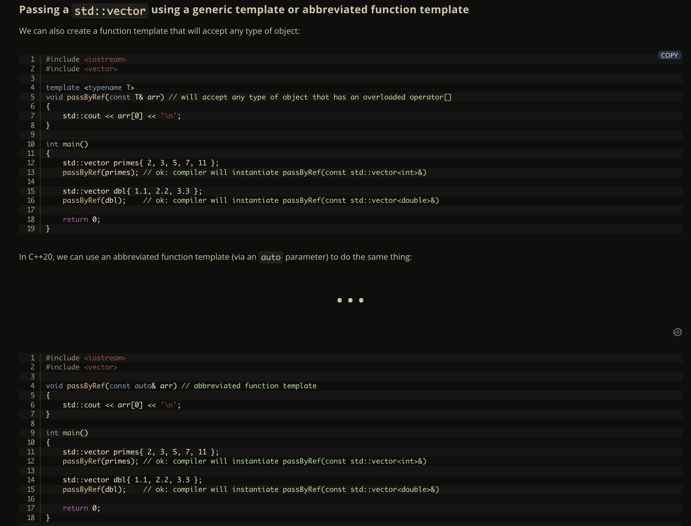

## Introduction to move semantics

Move semantics is a feature introduced in C++11 that allows the resources owned by an rvalue (a temporary object) to be moved rather than copied. This can lead to significant performance improvements, especially when working with large objects or containers like std::vector.

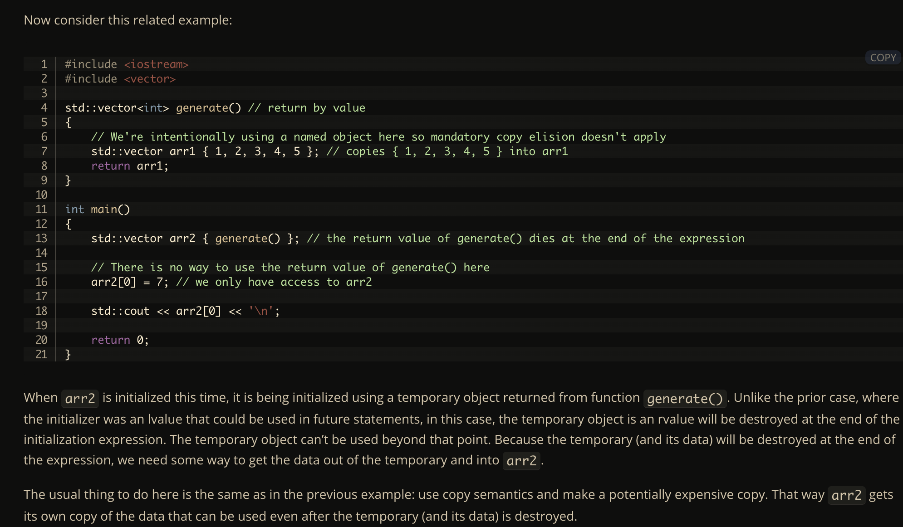

std::string and std::vector are examples of classes that have move constructors and move assignment operators, which allow them to take advantage of move semantics. 

ex.

```cpp
#include <iostream>
#include <vector>

std::vector<int> createVector()
{
    std::vector<int> vec{ 1, 2, 3, 4, 5 };
    return vec; // move semantics will be used to avoid copying the vector
}

int main()
{
    std::vector<int> myVector = createVector(); // move semantics will be used to avoid copying the vector
    for (int num : myVector)
        std::cout << num << ' ';
    std::cout << '\n';

    return 0;
}
```

## Range-based for loops (for-each)

The range-based for statement has a syntax that looks like this:

for (element_declaration : array_object)
   statement;

Note: 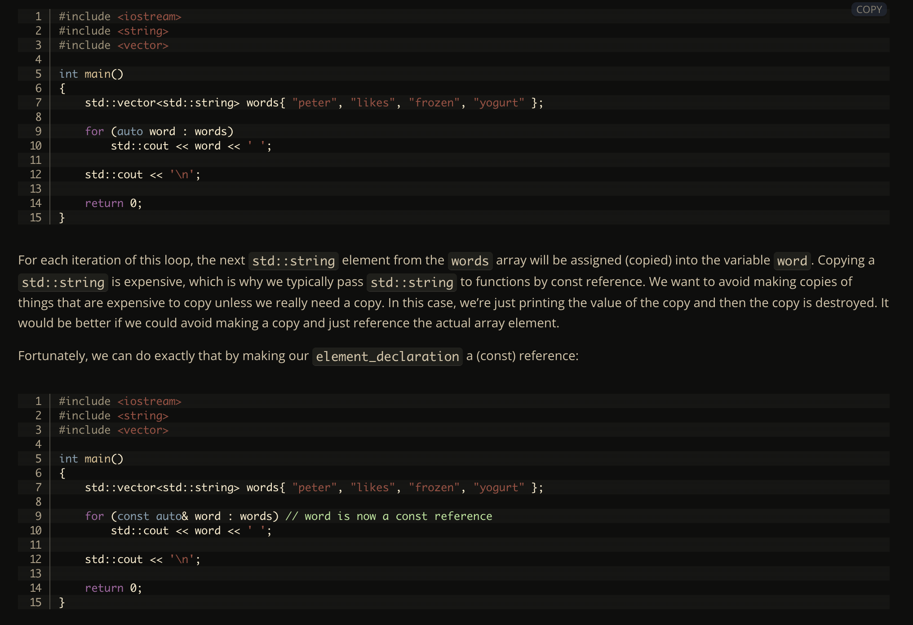

### Range-based for loops in reverse  (C++20 and later)

```cpp
#include <iostream>
#include <vector>
#include <ranges>
#include <string>

int main()
{
    std::vector<std::string> words{ "Hello", "World", "C++", "20" };

    // Iterate over the vector in reverse using std::ranges::reverse_view
    for (const auto& word : std::views::reverse(words))
    {
        std::cout << word << ' ';
    }
    std::cout << '\n';

    return 0;
}
```

Note: 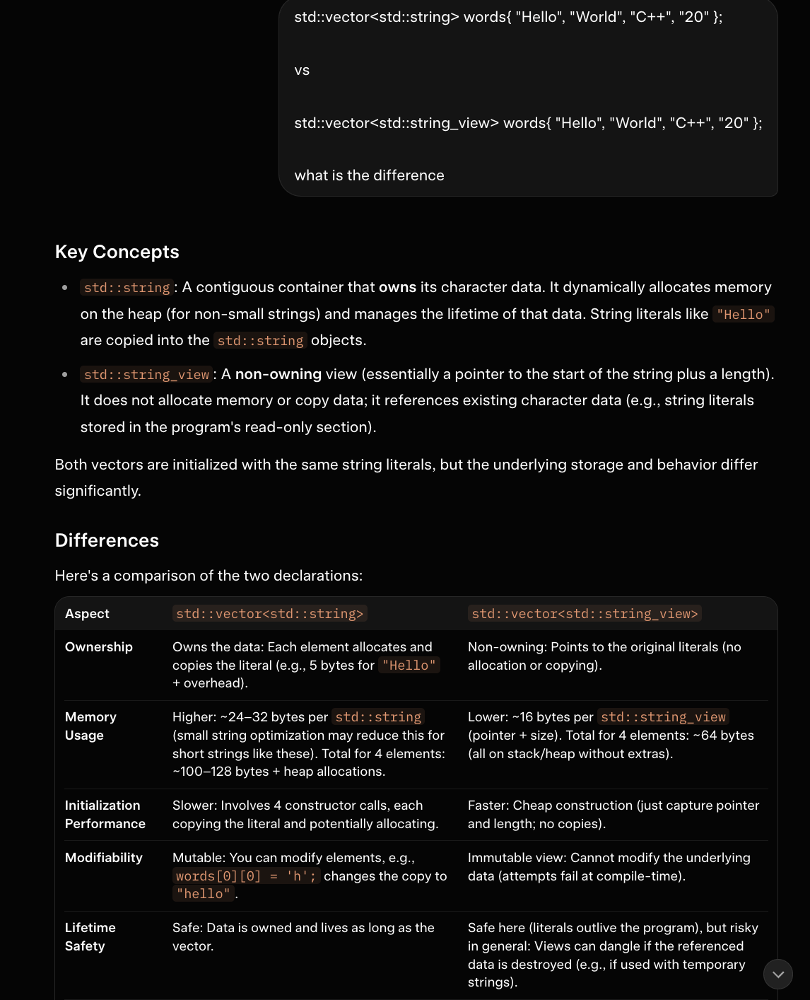

## Array indexing and length using enumerators

One of the bigger documentation problems with arrays is that integer indices do not provide any information to the programmer about the meaning of the index.

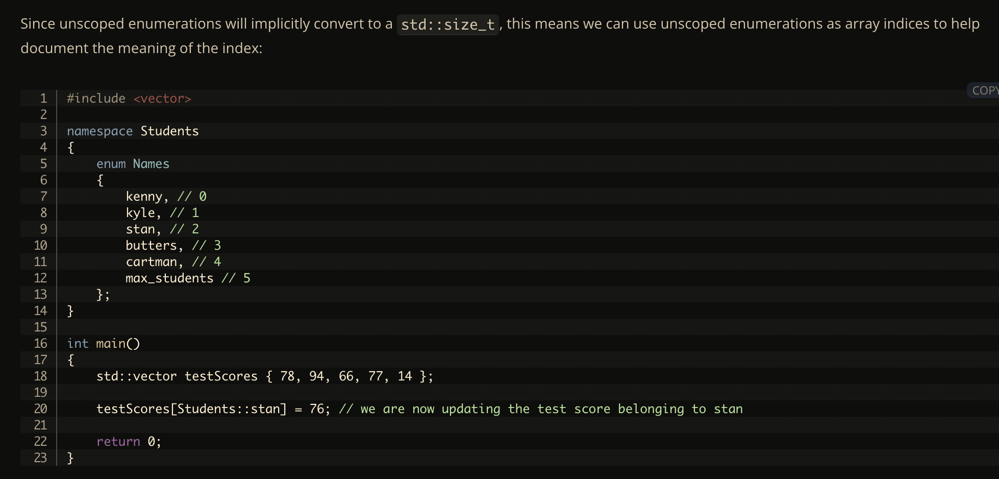

## std::vector resizing and capacity

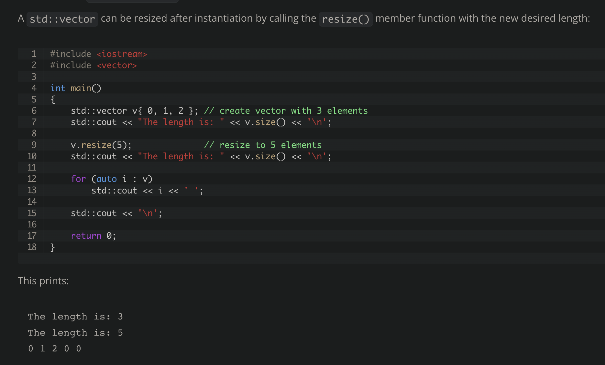

### The length vs capacity of a std::vector

capacity is how many elements the std::vector has allocated storage for, and length is how many elements are currently being used. A std::vector with a capacity of 5 has allocated space for 5 elements. If the vector contains 2 elements in active use, the length (size) of the vector is 2. The 3 remaining elements have memory allocated for them, but they are not considered to be in active use. They can be used later without overflowing the vector.

Note: After using resize if we are reducing number of elements. However, the capacity of the vector remains unchanged. This means that if we later add new elements to the vector, it can reuse the existing memory without needing to allocate new memory until we exceed the current capacity. It is used to avoid repeatedly allocating and deallocating memory as the vector grows and shrinks in size. 

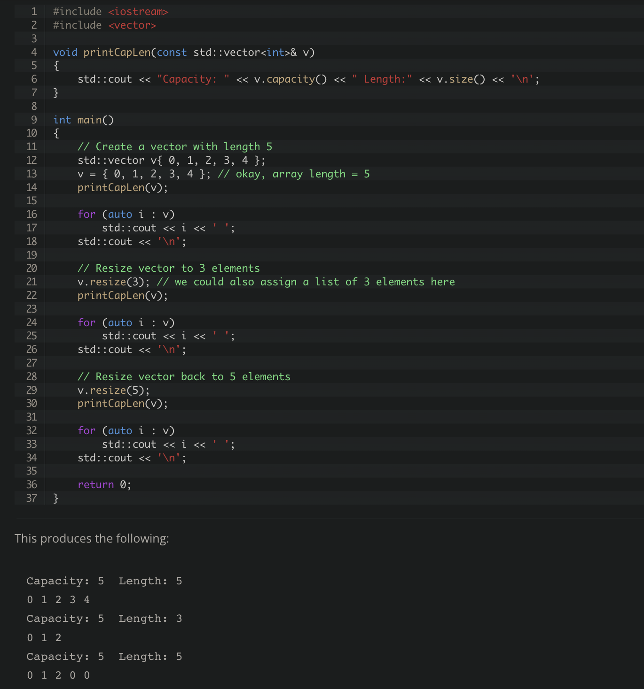

Note: if we want to reduce the capacity of the vector to match its new size after resizing, we can use the shrink_to_fit() member function. This function is a non-binding request to reduce the capacity of the vector to fit its size. However, it is important to note that shrink_to_fit() does not guarantee that the capacity will be reduced, and it may not have any effect on some implementations.

## Std::vector stack behavior

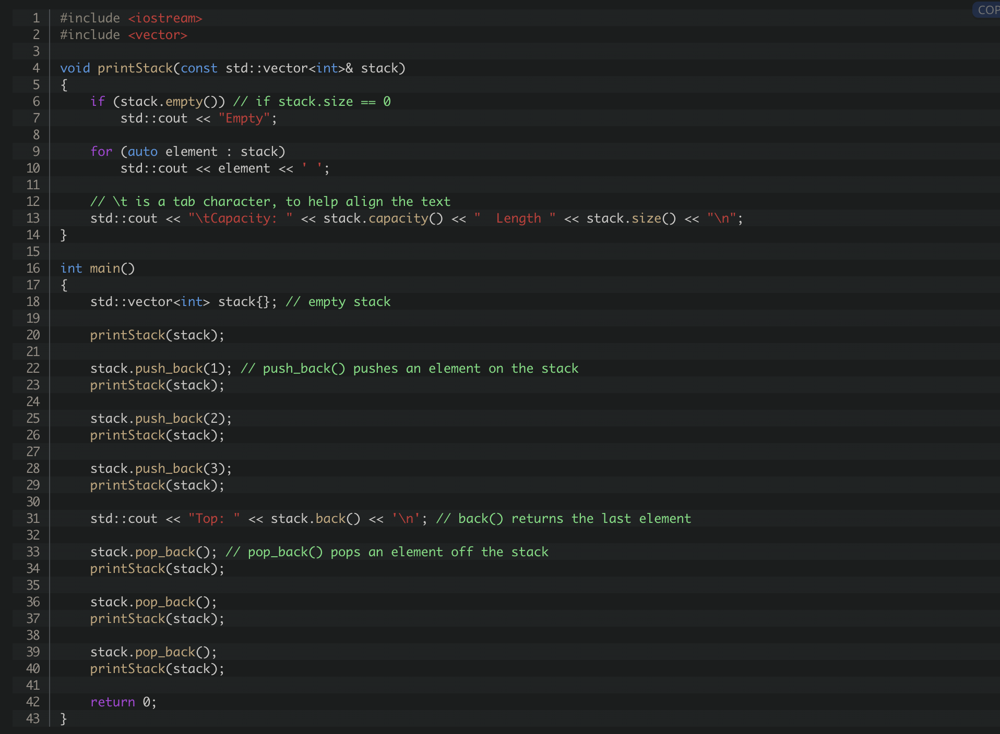

Note: 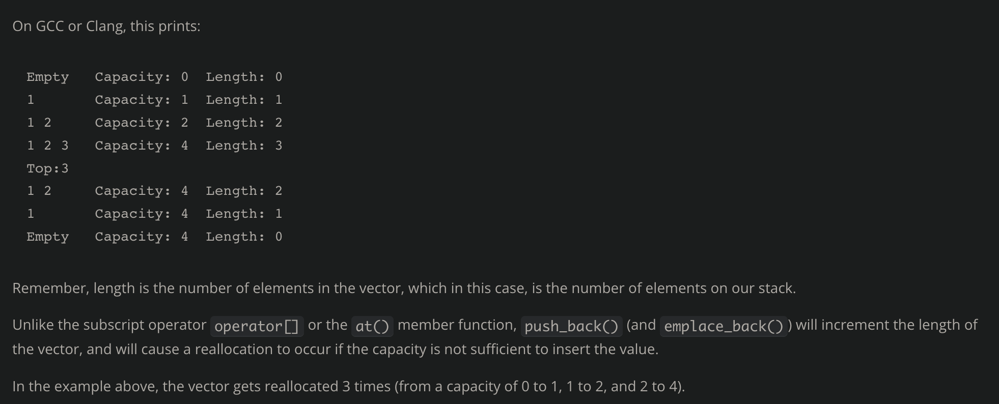 , observe capacity here.

## push_back() vs emplace_back() 

Both push_back() and emplace_back() push an element onto the stack. If the object to be pushed already exists, push_back() and emplace_back() are equivalent, and push_back() should be preferred.